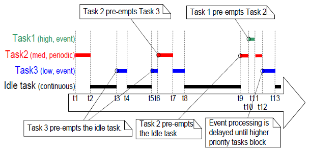

# 掌握FreeRTOS实时内核

[toc]

## FreeRTOS发行版

### 章节介绍与范围

FreeRTOS以一个包含所有官方FreeRTOS端口和大量预配置演示应用程序的单个zip文件存档形式进行分发。

#### 范围

本章旨在帮助用户通过以下方式熟悉FreeRTOS文件和目录：

- 提供FreeRTOS目录结构的顶层视图。
- 描述哪些文件实际上是特定的FreeRTOS项目所需的。
- 介绍演示应用程序。
- 提供有关如何创建新项目的信息。

这里的描述仅与官方FreeRTOS分发相关。本书附带的示例使用了稍微不同的组织结构。

### 理解FreeRTOS发行版

#### 定义：FreeRTOS端口

FreeRTOS可以使用大约20种不同的编译器构建，并且可以运行在30多种不同的处理器架构上。每个支持的编译器和处理器组合都被视为一个单独的FreeRTOS端口。

#### 构建FreeRTOS

FreeRTOS可以被视为一个库，为本来是裸机应用程序的功能提供多任务能力。

FreeRTOS提供了一组C源文件。其中一些源文件对所有端口都是通用的，而其他一些则特定于一个端口。将这些源文件作为项目的一部分构建，以使FreeRTOS API对您的应用程序可用。为了使这对您变得容易，每个官方的FreeRTOS端口都附带了一个演示应用程序。演示应用程序预配置为构建正确的源文件并且包含正确的头文件。

演示应用程序应该可以“开箱即用”，尽管某些演示应用程序比其他演示应用程序要旧，有时自演示发布以来构建工具的更改可能会引发问题。第1.3节描述了演示应用程序。

#### FreeRTOSConfig.h

FreeRTOS由一个名为FreeRTOSConfig.h的头文件配置。

FreeRTOSConfig.h用于为特定应用程序的使用定制FreeRTOS。例如，FreeRTOSConfig.h包含诸如configUSE_PREEMPTION之类的常量，其设置定义了是使用协作式调度算法还是抢占式调度算法[^1]。由于FreeRTOSConfig.h包含应用程序特定的定义，因此它应该位于构建应用程序的目录中，而不是包含FreeRTOS源代码的目录中。

每个FreeRTOS端口都提供了一个演示应用程序，每个演示应用程序都包含一个FreeRTOSConfig.h文件。因此，从头开始创建FreeRTOSConfig.h文件是不必要的。相反，建议从正在使用的FreeRTOS端口提供的演示应用程序所使用的FreeRTOSConfig.h文件开始，然后进行适应性修改。

[^1]:调度算法在第3.12节中描述。

#### 官方FreeRTOS发行版

FreeRTOS以一个单独的zip文件进行分发。这个zip文件包含了所有FreeRTOS端口的源代码以及所有FreeRTOS演示应用程序的项目文件。它还包含了一些FreeRTOS+生态系统组件和一些FreeRTOS+生态系统演示应用程序。

不要被FreeRTOS分发中的文件数量吓到！在任何一个应用程序中只需要非常少量的文件。

#### FreeRTOS发行版中的顶级目录

FreeRTOS发行版的第一级和第二级目录如图1所示，并进行了描述。

<center>        <br>    <div style="color:orange; border-bottom: 1px solid #d9d9d9;    display: inline-block;    color: #999;    padding: 2px;">图1. FreeRTOS发行版中的顶级目录。</div> </center>

这个zip文件只包含一份FreeRTOS源代码文件；所有的FreeRTOS演示项目和FreeRTOS+演示项目都期望在FreeRTOS/Source目录中找到FreeRTOS源代码文件，如果目录结构发生变化，可能导致这些项目无法构建。

#### 适用于所有端口的FreeRTOS源文件

核心的FreeRTOS源代码仅包含在两个C文件中，这两个文件对所有FreeRTOS端口都通用。这些文件分别为tasks.c和list.c，它们位于FreeRTOS/Source目录中，如图2所示。除了这两个文件外，还有以下源文件位于相同的目录下：

- queue.c

  queue.c提供队列和信号量服务，如本书后面所述。通常情况下需要queue.c。

- timers.c

  timers.c提供软件定时器功能，如本书后面所述。只有在实际使用软件定时器时才需要包含它在构建中。

- event_groups.c

  event_groups.c提供事件组功能，如本书后面所述。只有在实际使用事件组时才需要包含它在构建中。

- croutine.c

  croutine.c实现了FreeRTOS协同程序功能。只有在实际使用协同程序时才需要包含它在构建中。协同程序原本是为非常小型的微控制器设计的，现在很少使用，因此没有像其他FreeRTOS功能一样得到同样的维护水平。协同程序不在本书中描述。

<center>        <br>    <div style="color:orange; border-bottom: 1px solid #d9d9d9;    display: inline-block;    color: #999;    padding: 2px;">图2. 在FreeRTOS目录树中的核心FreeRTOS源文件。</div> </center>

显然文件名可能会导致名称空间冲突，因为许多项目可能已经包含了具有相同名称的文件。然而，考虑到现在更改文件的名称可能会导致问题，因为这样做会破坏与使用FreeRTOS的成千上万个项目以及自动化工具和IDE插件的兼容性。

#### 特定于端口的FreeRTOS源文件

特定于端口的FreeRTOS源文件位于FreeRTOS/Source/portable目录中。该portable目录按照编译器和处理器架构的层次结构进行排列，如图3所示。

如果您正在运行FreeRTOS，并且使用编译器在具有架构的处理器上运行，那么除了核心FreeRTOS源文件外，您还必须构建位于FreeRTOS/Source/portable/[compiler]/[architecture]目录中的文件。

正如将在第2章中描述的，FreeRTOS还将堆内存分配视为可移植层的一部分。使用早于V9.0.0版本的FreeRTOS的项目必须包含一个堆内存管理器。从FreeRTOS V9.0.0版本开始，只有当在FreeRTOSConfig.h中将configSUPPORT_DYNAMIC_ALLOCATION设置为1时，或者未定义configSUPPORT_DYNAMIC_ALLOCATION时，才需要堆内存管理器。

FreeRTOS提供了五种示例堆内存分配方案。这些方案分别命名为heap_1到heap_5，由源文件heap_1.c到heap_5.c分别实现。这些示例堆内存分配方案位于FreeRTOS/Source/portable/MemMang目录中。如果您已经配置FreeRTOS以使用动态内存分配，那么在您的项目中必须构建这五个源文件中的一个，除非您的应用程序提供了替代实现。

<center>        <br>    <div style="color:orange; border-bottom: 1px solid #d9d9d9;    display: inline-block;    color: #999;    padding: 2px;">图3. FreeRTOS目录树中特定于端口的源文件。</div> </center>

#### 包含路径

FreeRTOS需要将三个目录包含在编译器的包含路径中。这些目录是：

1. 核心FreeRTOS头文件的路径，通常为FreeRTOS/Source/include。

2. 用于特定于正在使用的FreeRTOS端口的源文件的路径。如上所述，这是FreeRTOS/Source/portable/[compiler]/[architecture]。

3. FreeRTOSConfig.h头文件的路径。

#### 头文件

使用FreeRTOS API的头文件必须包括‘FreeRTOS.h’，然后是包含正在使用的API函数原型的头文件之一，可以是‘task.h’、‘queue.h’、‘semphr.h’、‘timers.h’或‘event_groups.h’。

### 示例应用程序

每个FreeRTOS端口至少配备有一个演示应用程序，应该能够在构建过程中不生成任何错误或警告，尽管一些演示比其他的要旧，有时自演示发布以来构建工具的变化可能会引发问题。 对于Linux用户的注意事项：FreeRTOS是在Windows主机上开发和测试的。偶尔，当在Linux主机上构建演示项目时，可能会出现构建错误。构建错误几乎总是与引用文件名时使用的字母大小写或文件路径中使用的斜杠字符的方向有关。请使用FreeRTOS联系表单（[http://www.FreeRTOS.org/contact）](http://www.freertos.org/contact）)通知我们此类错误。

演示应用程序有几个目的：

- 提供一个示例，展示一个已配置好并包括正确文件的项目，以及正确的编译器选项设置。
- 允许“开箱即用”的实验，无需进行最小的设置或先前的知识。
- 作为演示FreeRTOS API如何使用的示例。
- 作为创建真实应用程序的基础。

每个演示项目都位于FreeRTOS/Demo目录下的唯一子目录中。子目录的名称指示演示项目所关联的端口。

每个演示应用程序都有一个FreeRTOS.org网站上的网页进行描述。该网页包括以下信息：

- 如何在FreeRTOS目录结构中找到演示项目文件。
- 该项目配置为使用哪些硬件。
- 如何设置硬件以运行演示。
- 如何构建演示。
- 预期演示的行为。

所有演示项目都创建了一组公共演示任务的子集，这些任务的实现包含在FreeRTOS/Demo/Common/Minimal目录中。这些公共演示任务纯粹用于演示FreeRTOS API的使用方式，它们不实现任何特定的有用功能。

较新的演示项目还可以构建一个初学者的“闪烁”项目。闪烁项目非常基础，通常只会创建两个任务和一个队列。

每个演示项目都包含一个名为main.c的文件。其中包含了main()函数，用于创建所有演示应用程序任务。有关特定演示的信息，请参阅各个main.c文件中的注释。

FreeRTOS/Demo目录层次结构如图4所示。

<center>        <br>    <div style="color:orange; border-bottom: 1px solid #d9d9d9;    display: inline-block;    color: #999;    padding: 2px;">图4. 示例目录层次结构。</div> </center>

### 创建一个FreeRTOS项目

#### 适配提供的演示项目之一

每个FreeRTOS端口都配备了至少一个预配置的演示应用程序，应该能够在构建过程中不生成任何错误或警告。建议通过适配其中一个现有项目来创建新项目；这将使项目包含正确的文件，正确的中断处理程序，以及正确的编译器选项。

要从现有演示项目开始创建新应用程序，请按照以下步骤进行：

1. 打开提供的演示项目，确保它能够按预期进行构建和执行。
2. 删除定义演示任务的源文件。Demo/Common目录中的任何文件都可以从项目中删除。
3. 删除main()中的所有函数调用，除了如清单1所示的prvSetupHardware()和vTaskStartScheduler()。
4. 检查项目是否仍然能够构建。

按照这些步骤将创建一个包含正确FreeRTOS源文件的项目，但不定义任何功能。

___
```c
int main( void )
{
    /* Perform any hardware setup necessary. */
    prvSetupHardware();
    /* --- APPLICATION TASKS CAN BE CREATED HERE --- */
    /* Start the created tasks running. */
    vTaskStartScheduler();
    /* Execution will only reach here if there was insufficient heap to
    start the scheduler. */
    for( ;; );
    return 0;
}
```
---
<center>   <div style="color:orange; border-bottom: 1px solid #d9d9d9;    display: inline-block;    color: #999;    padding: 2px;">清单1. 新main()函数的模板。</div> </center>

#### 从零开始创建一个新项目

正如前面提到的，建议从现有的演示项目创建新项目。如果这不可行，那么可以使用以下步骤创建新项目：

1. 使用您选择的工具链创建一个尚未包含任何FreeRTOS源文件的新项目。
2. 确保新项目可以构建、下载到目标硬件并执行。
3. 仅当您确信已经有一个可工作的项目时，再将表1中详细列出的FreeRTOS源文件添加到项目中。
4. 将用于所使用端口的演示项目中的FreeRTOSConfig.h头文件复制到项目目录中。
5. 将以下目录添加到项目搜索头文件的路径中：
   - FreeRTOS/Source/include
   - FreeRTOS/Source/portable/[compiler]/[architecture]（其中[compiler]\(编译器)和[architecture]\(架构)是与您选择的端口相对应的正确值）
   - 包含FreeRTOSConfig.h头文件的目录
6. 复制相关演示项目的编译器设置。
7. 安装可能需要的任何FreeRTOS中断处理程序。可以参考描述所使用端口的网页以及所使用端口的演示项目。

| 文件                      | 位置路径                                                     |
| ------------------------- | ------------------------------------------------------------ |
| tasks.c                   | FreeRTOS/Source                                              |
| queue.c                   | FreeRTOS/Source                                              |
| list.c                    | FreeRTOS/Source                                              |
| timers.c                  | FreeRTOS/Source                                              |
| event_groups.c            | FreeRTOS/Source                                              |
| All C and assembler files | FreeRTOS/Source/portable/[compiler]/[architecture]           |
| heap_n.c                  | FreeRTOS/Source/portable/MemMang，其中n可以是1、2、3、4或5。从FreeRTOS V9.0.0开始，此文件变为可选项 |

<center>   <div style="color:orange; border-bottom: 1px solid #d9d9d9;    display: inline-block;    color: #999;    padding: 2px;">表格 1. 需要包含在项目中的FreeRTOS源文件 。</div> </center>

使用早于FreeRTOS V9.0.0版本的项目必须构建heap_n.c文件之一。从FreeRTOS V9.0.0开始，只有在FreeRTOSConfig.h中设置configSUPPORT_DYNAMIC_ALLOCATION为1或者未定义configSUPPORT_DYNAMIC_ALLOCATION时，才需要heap_n.c文件。有关更多信息，请参阅第2章《堆内存管理》。

### 数据类型和编码风格指南

#### 数据类型

每个FreeRTOS的端口都有一个独特的portmacro.h头文件，其中包含（除其他外）两个特定于端口的数据类型的定义：TickType_t 和 BaseType_t。这些数据类型在表2中有描述。

| 使用的宏或类型定义 | 实际类型                                                     |
| ------------------ | ------------------------------------------------------------ |
| TickType_t         | FreeRTOS配置了一个称为tick中断的周期性中断。                 |
|                    | 自FreeRTOS应用程序启动以来发生的tick中断数量被称为tick计数。tick计数用作时间度量标准。 |
|                    | 两个tick中断之间的时间称为tick周期。时间以tick周期的倍数来指定。 |
|                    | TickType_t是用于保存tick计数值和指定时间的数据类型。         |
|                    | TickType_t可以是无符号16位类型或无符号32位类型，具体取决于FreeRTOSConfig.h中configUSE_16_BIT_TICKS的设置。如果configUSE_16_BIT_TICKS设置为1，则TickType_t被定义为uint16_t。如果configUSE_16_BIT_TICKS设置为0，则TickType_t被定义为uint32_t。 |
|                    | 在8位和16位体系结构上，使用16位类型可以极大地提高效率，但严重限制了可指定的最大块周期。而在32位体系结构上，没有理由使用16位类型。 |
| BaseType_t         | 这通常被定义为体系结构上最有效的数据类型。通常，在32位体系结构上是32位类型，在16位体系结构上是16位类型，在8位体系结构上是8位类型。 |
|          | BaseType_t通常用于仅能取有限值范围的返回类型，以及pdTRUE/pdFALSE类型的布尔值。 |

<center>   <div style="color:orange; border-bottom: 1px solid #d9d9d9;    display: inline-block;    color: #999;    padding: 2px;">表格 2. FreeRTOS使用的特定于端口的数据类型。</div> </center>

一些编译器将所有未经限定的char变量声明为无符号的，而其他一些编译器将它们声明为有符号的。因此，FreeRTOS源代码在每次使用char时都会明确加上'signed'或'unsigned'的限定词，除非char用于保存ASCII字符，或者指向字符串的char指针。

普通的int类型不会被使用。

#### 变量名称

变量的前缀是它们的类型：'c'表示char，'s'表示int16_t（short），'l'表示int32_t（long），'x'表示BaseType_t和任何其他非标准类型（结构、任务句柄、队列句柄等）。 如果一个变量是无符号的，它还会加上'u'前缀。如果一个变量是指针，它还会加上'p'前缀。例如，uint8_t类型的变量前缀为'uc'，指向char的指针类型的变量前缀为'pc'。

#### 函数名称

函数的前缀包括它们返回的类型以及它们定义在的文件。例如：

- vTaskPrioritySet() 返回void类型，并定义在task.c中。
- xQueueReceive() 返回BaseType_t类型的变量，并定义在queue.c中。
- pvTimerGetTimerID() 返回指向void的指针，并定义在timers.c中。

文件范围（私有）函数的前缀是'prv'。

#### 格式

一个制表符总是等于四个空格。

#### 宏名称

大多数宏都使用大写字母编写，并以小写字母前缀表示宏的定义位置。表3提供了前缀列表。

| 前缀                                | 宏定义位置                |
| ----------------------------------- | ------------------------- |
| port (例如, portMAX_DELAY)          | portable.h 或 portmacro.h |
| task (例如, taskENTER_CRITICAL())   | task.h                    |
| pd (例如, pdTRUE)                   | projdefs.h                |
| config (例如, configUSE_PREEMPTION) | FreeRTOSConfig.h          |
| err (例如, errQUEUE_FULL)           | projdefs.h                |

<center>   <div style="color:orange; border-bottom: 1px solid #d9d9d9;    display: inline-block;    color: #999;    padding: 2px;">表格 3. 宏的前缀。</div> </center>

请注意，信号量API几乎完全以一组宏的形式编写，但遵循函数命名约定，而不是宏命名约定。

表4中定义的宏在整个FreeRTOS源代码中都有使用。

| 宏      | 实际值 |
| ------- | ------ |
| pdTRUE  | 1      |
| pdFALSE | 0      |
| pdPASS  | 1      |
| pdFAIL  | 0      |

<center>   <div style="color:orange; border-bottom: 1px solid #d9d9d9;    display: inline-block;    color: #999;    padding: 2px;">表格 4. 通用宏定义。</div> </center>

#### 过多类型转换的理由

FreeRTOS源代码可以使用许多不同的编译器进行编译，这些编译器在何时以及如何生成警告方面都有所不同。特别是，不同的编译器要求使用不同的方式进行类型转换。因此，FreeRTOS源代码包含比通常情况下所需的更多类型转换。

## 堆内存管理

### 章节简介和范围

#### 先决条件

FreeRTOS 作为一组 C 源文件提供，成为一名合格的 C 程序员使用 FreeRTOS 的先决条件，本章假设读者熟悉以下概念：

* C 项目是如何构建的，包括不同的编译和链接阶段。
* 栈和堆是什么。
* 标准 C 库 `malloc()` 和 `free()` 函数。

#### 动态内存分配及其与 FreeRTOS 的相关性

本书接下来的章节将介绍内核对象，例如任务、队列、信号量和事件组。 为了使 FreeRTOS 尽可能易于使用，这些内核对象不是在编译时静态分配的，而是在运行时动态分配的；FreeRTOS 在每次创建内核对象时分配 RAM，并在每次删除内核对象时释放 RAM。 该策略减少了设计和规划工作，简化了 API，并且最大限度地减少 RAM 占用空间。

本章讨论动态内存分配。 动态内存分配是C编程概念，而不是特定于 FreeRTOS 或多任务处理的概念。 它与FreeRTOS 相关，因为内核对象是动态分配的，并且通用编译器提供的动态内存分配方案并不总是适用于实时应用程序。

可以使用标准 C 库 `malloc()` 和 `free()` 函数分配内存，但它们由于以下一个或多个原因，可能不适合或不适当：

* 它们并不总是在小型嵌入式系统上可用。
* 它们的实现可能相对较大，占用宝贵的代码空间。
* 它们很少是线程安全的。
* 它们不是确定性的； 执行这些函数所需的时间会因每次调用而异。
* 它们可能受到分片[^2]的影响。
* 它们会使链接器配置复杂化。
* 如果堆空间允许增长到与其他变量使用的内存重叠的区域，它们可能会成为难以调试的错误的根源。

[^2]:分配给程序的内存可能会出现碎片化，即分散在内存中的小块空间，而不是连续的大块空间。这种碎片化可能导致可能会导致无法分配所需大小的内存块，即使总可用空间足够,从而造成内存资源的浪费和性能下降

#### 动态内存分配选项

早期版本的FreeRTOS使用了一种内存池分配方案，其中不同大小的内存块池在编译时预先分配，然后由内存分配函数返回。尽管这在实时系统中是常见的方案，但它被证明是许多技术支持请求的源头，主要因为它不能足够高效地使用RAM，以使其在真正小型嵌入式系统中可行。因此，这个方案被取消了。

FreeRTOS现在将内存分配视为可移植层的一部分（与核心代码基础的一部分相对立）。这是因为不同的嵌入式系统具有不同的动态内存分配和时间要求，因此单一的动态内存分配算法只适用于某些应用程序子集。此外，将动态内存分配从核心代码基础中删除使应用程序编写者可以在适当时提供自己的特定实现。

当FreeRTOS需要RAM时，不使用`malloc()`函数，而是调用`pvPortMalloc()`。当释放RAM时，不使用`free()`函数，内核调用`vPortFree()`。`pvPortMalloc()`具有与标准C库的`malloc()`函数相同的原型，`vPortFree()`具有与标准C库的`free()`函数相同的原型。

`pvPortMalloc()`和`vPortFree()`是公共函数，因此还可以从应用程序代码中调用。

FreeRTOS附带了五个示例实现`pvPortMalloc()`和`vPortFree()`两个函数的方式，所有这些示例都在本章中有详细说明。FreeRTOS应用程序可以使用这些示例中的一个，或者自行实现。

这五个示例分别定义在 heap_1.c、heap_2.c、heap_3.c、heap_4.c 和 heap_5.c 源文件中，这些源文件都位于 FreeRTOS/Source/portable/MemMang 目录下。

#### 范围

本章旨在让读者充分了解以下内容：

- FreeRTOS何时分配RAM。
- FreeRTOS提供的五个示例内存分配方案。
- 选择哪种内存分配方案。

### 内存分配方案示例

#### Heap_1 


对于小型专用嵌入式系统，通常只在调度器启动之前创建任务和其他内核对象。在这种情况下，只有在应用程序开始执行任何实时功能之前，内核才会动态分配内存，并且内存将在应用程序的生命周期内保持分配。这意味着所选择的分配方案不必考虑更复杂的内存分配问题，如确定性和碎片化，而只需考虑代码大小和简单性等属性。

Heap_1.c 实现了一个非常基本的 `pvPortMalloc()` 版本，并没有实现 `vPortFree()`。从不删除任务或其他内核对象的应用程序有可能使用 heap_1。一些商业关键性和安全关键性的系统可能禁止使用动态内存分配，也有可能使用 heap_1。关键性系统通常禁止动态内存分配是因为与不确定性、内存碎片化和分配失败相关的不确定性，但 Heap_1 总是确定性的，不会产生内存碎片。

heap_1 分配方案将一个简单的数组细分为较小的块，当调用 `pvPortMalloc()` 时。这个数组称为FreeRTOS堆。数组的总大小（以字节为单位）由FreeRTOSConfig.h中的`configTOTAL_HEAP_SIZE`定义设置。以这种方式定义一个大数组可以使应用程序在从数组分配任何内存之前就消耗大量RAM。

每个创建的任务都需要从堆中分配任务控制块（TCB）和堆栈。图 5展示了当任务被创建时heap_1如何将简单数组细分。

参考图 5：

1. A显示了在创建任何任务之前的数组状态——整个数组都是空闲的。
2. B显示了在创建一个任务后的数组状态。
3. C显示了在创建三个任务后的数组状态。

<center>        <br>    <div style="color:orange; border-bottom: 1px solid #d9d9d9;    display: inline-block;    color: #999;    padding: 2px;">图5. 每次创建任务时从heap_1数组中分配RAM。</div> </center>

#### Heap_2

Heap_2保留在FreeRTOS发行版中以支持向后兼容性，但不建议在新设计中使用它。考虑使用heap_4代替heap_2，因为heap_4提供了增强的功能。

Heap_2.c 也是通过细分一个由`configTOTAL_HEAP_SIZE`确定大小的数组来工作。它使用最佳适配算法来分配内存，并且与heap_1不同，它允许内存被释放。同样，这个数组是静态声明的，因此即使在从数组分配任何内存之前，应用程序看起来也会消耗大量RAM。

最佳适配算法[^3]确保`pvPortMalloc()`使用与请求的字节数最接近的空闲内存块。例如，考虑以下情景：

* 堆中包含三个空闲内存块，分别为5字节、25字节和100字节。
* 调用`pvPortMalloc()`请求20字节的RAM。

可用内存中最小的块并且可以容纳请求的字节数，是25字节的块，因此`pvPortMalloc()`将25字节的块分割为一个20字节的块和一个5字节的块，在返回指向20字节块的指针之前。新的5字节块仍然可供未来的`pvPortMalloc()`调用使用。

[^3]:最佳适配算法（Best Fit Algorithm）是一种用于内存分配的算法，通常在操作系统或内存管理中使用。这个算法的目标是在可用内存块中选择最小的合适块来满足分配请求，以最小化内存浪费。

与heap_4不同，Heap_2不会将相邻的空闲块合并为一个较大的块，因此更容易发生碎片化。然而，如果被分配和随后被释放的块始终是相同大小的，则碎片化不是一个问题。对于一个不断创建和删除任务的应用程序，只要分配给创建的任务的堆栈大小不变，Heap_2是合适的。


<center>        <br>    <div style="color:orange; border-bottom: 1px solid #d9d9d9;    display: inline-block;    color: #999;    padding: 2px;">图6. 随着任务的创建和删除，RAM从heap_2数组中被分配和释放。</div> </center>

图 6演示了在创建、删除和再次创建任务时最佳适配算法的工作方式。

参考图 6：

1. A显示了在创建三个任务后的数组状态。在数组的顶部仍然有一个大的空闲块。
2. B显示了在其中一个任务被删除后的数组状态。数组顶部的大空闲块仍然存在。现在还有两个较小的空闲块，即之前分配给已删除任务的TCB和堆栈。
3. C 显示了在另一个任务被创建后的情况。创建任务导致了对`pvPortMalloc()`的两次调用，一次用于分配新的TCB，另一次用于分配任务堆栈。任务是使用`xTaskCreate() `API函数创建的，该函数在第3.4节中有描述。对`pvPortMalloc()`的调用在`xTaskCreate()`内部进行。

每个TCB的大小都完全相同，因此最佳适配算法确保以前分配给已删除任务的TCB的内存块被重用以分配新任务的TCB。

分配给新创建任务的堆栈大小与先前删除任务的堆栈大小相同，因此最佳适配算法确保以前分配给已删除任务的堆栈的内存块被重用以分配新任务的堆栈。

数组顶部的较大未分配块保持不变。

Heap_2不是确定性的，但比大多数标准库中的malloc()和free()实现更快。

#### Heap_3

Heap_3.c 使用标准库的 malloc() 和 free() 函数，因此堆的大小由链接器配置定义，configTOTAL_HEAP_SIZE 设置不起作用。

Heap_3通过暂时挂起FreeRTOS调度器来使 malloc() 和 free() 线程安全。线程安全和调度器挂起是在第7章"资源管理"中讨论的主题。

#### Heap_4

与heap_1和heap_2一样，heap_4通过将一个数组细分为较小的块来工作。与以前一样，该数组是静态声明的，由`configTOTAL_HEAP_SIZE`确定尺寸，因此即使在从数组分配任何内存之前，应用程序看起来也会消耗大量RAM。

Heap_4使用首次适应算法[^4]来分配内存。与heap_2不同，heap_4将相邻的空闲内存块合并为一个较大的块（合并），从而最小化内存碎片化的风险。

首次适应算法确保`pvPortMalloc()`使用第一个足够容纳请求的字节数的空闲内存块。例如，考虑以下情景：

- 堆包含三个空闲内存块，按照它们在数组中出现的顺序分别为5字节、200字节和100字节。
- 调用`pvPortMalloc()`请求20字节的RAM。

可以容纳请求的字节数的第一个空闲内存块是200字节的块，因此`pvPortMalloc()`将200字节的块分割为一个20字节的块和一个180字节的块，然后返回指向20字节块的指针。新的180字节块仍然可供未来的`pvPortMalloc()`调用使用。

[^4]:首次适应算法（First Fit Algorithm）是一种用于内存分配的算法，通常用于操作系统或内存管理中。这个算法的原理很简单：当需要分配一块内存时，它会从可用内存块清单中选择第一个足够大的内存块，以满足分配请求的大小。

Heap_4将相邻的空闲块合并为一个较大的块，最小化了碎片化的风险，使其适用于反复分配和释放不同大小的RAM块的应用程序。

<center>        <br>    <div style="color:orange; border-bottom: 1px solid #d9d9d9;    display: inline-block;    color: #999;    padding: 2px;">图7. RAM从heap_4数组中被分配和释放的过程。</div> </center>

图 7演示了heap_4的首次适应算法和内存合并在分配和释放内存时的工作方式。

参考图 7：

1. A 显示了在创建三个任务后的数组状态。在数组的顶部仍然有一个大的空闲块。
2. B 显示了在其中一个任务被删除后的数组状态。数组顶部的大空闲块仍然存在。还有一个空闲块，即之前分配给已删除任务的TCB和堆栈。需要注意的是，与heap_2演示时不同，当TCB被删除时释放的内存和堆栈被删除时释放的内存不再保持为两个单独的空闲块，而是合并为一个更大的单一空闲块。
3. C 显示了在创建FreeRTOS队列后的情况。队列是使用`xQueueCreate() `API函数创建的，该函数在第4.3节中有描述。`xQueueCreate()`调用`pvPortMalloc()`来分配队列使用的RAM。由于heap_4使用首次适应算法，`pvPortMalloc()`将从第一个足够容纳队列的空闲RAM块中分配RAM，而在图 7中，这是在任务被删除时释放的RAM。然而，队列并未消耗所有空闲块中的RAM，因此块被分成两部分，未使用的部分仍然可供未来的`pvPortMalloc()`调用使用。
4. D 显示了在直接从应用程序代码中调用`pvPortMalloc()`而不是间接调用FreeRTOS API函数后的情况。用户分配的块足够小，可以适应第一个空闲块，这个空闲块位于队列分配的内存和随后的TCB分配的内存之间。当任务被删除时释放的内存现在已被分为三个单独的块；第一个块包含队列，第二个块包含用户分配的内存，第三个块保持空闲。
5. E 显示了在队列被删除后的情况，这会自动释放已分配给已删除队列的内存。现在在用户分配的块两侧有空闲内存。
6. F 显示了在用户分配的内存也被释放后的情况。之前被用户分配的内存已与两侧的空闲内存合并为一个更大的单一空闲块。

Heap_4不是确定性的，但比大多数标准库中的`malloc()`和`free()`实现更快。

#### 设置Heap_4使用的数组的起始地址

这个部分包含高级信息。仅仅要使用Heap_4，不必阅读或理解这个部分。

有时候，应用程序编写者需要将heap_4使用的数组放置在特定的内存地址。例如，FreeRTOS任务使用的堆栈是从堆中分配的，因此可能需要确保堆位于快速的内部内存中，而不是慢速的外部内存。

默认情况下，heap_4使用的数组在heap_4.c源文件内声明，其起始地址由链接器自动设置。但是，如果在FreeRTOSConfig.h中将`configAPPLICATION_ALLOCATED_HEAP`编译时配置常量设置为1，则该数组必须由使用FreeRTOS的应用程序声明。如果数组作为应用程序的一部分声明，那么应用程序的编写者可以设置其起始地址。

如果在FreeRTOSConfig.h中将`configAPPLICATION_ALLOCATED_HEAP`设置为1，则必须在应用程序的一个源文件中声明一个名为ucHeap的uint8_t数组，其尺寸由`configTOTAL_HEAP_SIZE`设置确定。

将变量放置在特定内存地址的语法取决于使用的编译器，因此请参考您的编译器文档。以下是两个编译器的示例：

- 清单 2显示了GCC编译器要求的语法，用于声明数组，并将数组放置在名为.my_heap的内存段中。
- 清单 3显示了IAR编译器要求的语法，用于声明数组，并将数组放置在绝对内存地址0x20000000处。

___
```c
uint8_t ucHeap[ configTOTAL_HEAP_SIZE ] __attribute__ ( ( section( ".my_heap" ) ) );
```
---
<center>   <div style="color:orange; border-bottom: 1px solid #d9d9d9;    display: inline-block;    color: #999;    padding: 2px;">清单2. 使用GCC语法来声明将由heap_4使用的数组，并将数组放置在名为.my_heap的内存段中。</div> </center>

___
```c
uint8_t ucHeap[ configTOTAL_HEAP_SIZE ] @ 0x20000000;
```
---
<center>   <div style="color:orange; border-bottom: 1px solid #d9d9d9;    display: inline-block;    color: #999;    padding: 2px;">清单3. 使用IAR语法声明将由heap_4使用的数组，并将数组放置在绝对地址0x20000000处。</div> </center>

#### Heap_5

heap_5用于分配和释放内存的算法与heap_4相同。与heap_4不同的是，heap_5不受限于从单个静态声明的数组分配内存；heap_5可以从多个不同且分隔的内存空间中分配内存。当FreeRTOS运行的系统提供的RAM在系统内存映射中不呈现为单一的连续（无间隔）块时，heap_5非常有用。

这意味着heap_5可以从多个不同的内存区域分配内存，这些内存区域可以在物理地址上分散，而不是形成一个连续的内存块。通过使用heap_5，FreeRTOS能够有效地管理来自这些分散的内存区域的内存，从而提供了更大的灵活性和可用性。这对于在资源有限的嵌入式系统上运行FreeRTOS的应用程序非常有帮助。

截止到目前为止，heap_5是唯一一个需要在调用`pvPortMalloc()`之前明确初始化的提供的内存分配方案。要初始化heap_5，需要使用`vPortDefineHeapRegions()` API函数。当使用heap_5时，必须在创建任何内核对象（任务、队列、信号量等）之前调用`vPortDefineHeapRegions()`。这确保了heap_5能够知道可用的内存区域，并能够在这些区域中分配内存。

初始化heap_5通常包括指定一组内存区域，从这些区域中可以分配内存。这些内存区域可以来自不同的物理地址或内存设备，以便提供更大的灵活性。然后，一旦heap_5被初始化，您可以开始创建任务、队列和其他内核对象，并使用`pvPortMalloc()`来分配内存。

这种初始化过程确保了内存管理器知道可用的内存资源以及如何使用它们。这对于在FreeRTOS中使用heap_5非常重要。

#### `vPortDefineHeapRegions()` API函数

`vPortDefineHeapRegions()` 用于指定构成 heap_5使用的总内存的每个独立内存区域的起始地址和大小。

---

```C
void vPortDefineHeapRegions( const HeapRegion_t * const pxHeapRegions );
```

---

<center>   <div style="color:orange; border-bottom: 1px solid #d9d9d9;    display: inline-block;    color: #999;    padding: 2px;">清单4.vPortDefineHeapRegions() API函数原型 。</div> </center>

每个独立的内存区域都由类型为 HeapRegion_t 的结构体描述。所有可用内存区域的描述被传递到`vPortDefineHeapRegions()` 中，作为 HeapRegion_t结构体的数组。

---

```C
typedef struct HeapRegion
{
 /* The start address of a block of memory that will be part of the heap.*/
 uint8_t *pucStartAddress;
 /* The size of the block of memory in bytes. */
 size_t xSizeInBytes;
} HeapRegion_t;
```

---

<center>   <div style="color:orange; border-bottom: 1px solid #d9d9d9;    display: inline-block;    color: #999;    padding: 2px;">清单5.HeapRegion_t 结构体 。</div> </center>

|参数名/ 返回值|描述|
|--|--|
|pxHeapRegions|一个指向 HeapRegion_t 结构体数组的起始地址的指针。数组中的每个结构体描述了在使用 heap_5 时将成为堆的一部分的内存区域的起始地址和长度。|
||数组中的 HeapRegion_t 结构体必须按照起始地址排序；描述具有最低起始地址的内存区域的 HeapRegion_t 结构体必须是数组中的第一个结构体，而描述具有最高起始地址的内存区域的 HeapRegion_t 结构体必须是数组中的最后一个结构体。|
||数组的结尾由一个 HeapRegion_t 结构体标记，该结构体的 pucStartAddress 成员设置为 NULL。|

<center>   <div style="color:orange; border-bottom: 1px solid #d9d9d9;    display: inline-block;    color: #999;    padding: 2px;">表格 5. vPortDefineHeapRegions()参数 。</div> </center>

举个例子，考虑图 8 A 中显示的假想内存映射，其中包含三个独立的RAM块：RAM1、RAM2 和 RAM3。假设可执行代码被放置在只读内存中，这里没有显示。

<center>        <br>    <div style="color:orange; border-bottom: 1px solid #d9d9d9;    display: inline-block;    color: #999;    padding: 2px;">图8. 内存映射。</div> </center>

清单 6 显示了一个 HeapRegion_t结构体数组，这些结构体共同完整描述了三个 RAM 块。

---

```c
/* Define the start address and size of the three RAM regions. */
#define RAM1_START_ADDRESS ( ( uint8_t * ) 0x00010000 )
#define RAM1_SIZE ( 65 * 1024 )
#define RAM2_START_ADDRESS ( ( uint8_t * ) 0x00020000 )
#define RAM2_SIZE ( 32 * 1024 )
#define RAM3_START_ADDRESS ( ( uint8_t * ) 0x00030000 )
#define RAM3_SIZE ( 32 * 1024 )
/* Create an array of HeapRegion_t definitions, with an index for each of the three
RAM regions, and terminating the array with a NULL address. The HeapRegion_t
structures must appear in start address order, with the structure that contains the
lowest start address appearing first. */
const HeapRegion_t xHeapRegions[] =
{
 { RAM1_START_ADDRESS, RAM1_SIZE },
 { RAM2_START_ADDRESS, RAM2_SIZE },
 { RAM3_START_ADDRESS, RAM3_SIZE },
 { NULL, 0 } /* Marks the end of the array. */
};
int main( void )
{
    /* Initialize heap_5. */
    vPortDefineHeapRegions( xHeapRegions );
    /* Add application code here. */
}
```

---

<center>   <div style="color:orange; border-bottom: 1px solid #d9d9d9;    display: inline-block;    color: #999;    padding: 2px;">清单6. HeapRegion_t结构体数组，共同完整描述 RAM 的 3 个区域 。</div> </center>

虽然清单 6正确描述了RAM，但它没有演示一个可用的示例，因为它将所有的RAM分配给了堆，没有留下RAM供其他变量使用。 当项目被构建时，构建过程的链接阶段会为每个变量分配一个RAM地址。链接器可用于链接的RAM通常由链接器配置文件来描述，例如链接脚本。在图 8 B中，假设链接脚本包含了关于RAM1的信息，但没有包含关于RAM2或RAM3的信息。因此，链接器已经将变量放置在RAM1中，只留下RAM1地址0x0001nnnn之上的部分可供heap_5使用。实际的0x0001nnnn的值将取决于被链接应用程序中所有变量的组合大小。链接器将RAM2和RAM3的整个部分都留下未使用，使RAM2和RAM3的整个部分都可供heap_5使用。

如果使用清单 6中显示的代码，分配给heap_5的RAM将在地址0x0001nnnn以下，与保存变量的RAM重叠。为了避免这种情况，xHeapRegions[]数组中的第一个HeapRegion_t结构体可以使用0x0001nnnn作为起始地址，而不是0x00010000作为起始地址。然而，这不是一个推荐的解决方案，因为：

1. 起始地址可能不容易确定。
2. 链接器使用的RAM量在将来的构建中可能会发生变化，需要更新HeapRegion_t结构体中使用的起始地址。
3. 如果链接器使用的RAM和heap_5使用的RAM重叠，构建工具无法进行区分，因此无法警告应用程序编写者。

清单 7演示了一个更方便和易于维护的示例。它声明了一个名为ucHeap的数组。ucHeap是一个普通变量，因此它成为了链接器分配给RAM1的数据的一部分。xHeapRegions数组中的第一个HeapRegion_t结构体描述了ucHeap的起始地址和大小，因此ucHeap成为了由heap_5管理的内存的一部分。ucHeap的大小可以增加，直到链接器使用的RAM占用RAM1的全部内容，如图 8 C所示。

---

```c
/* Define the start address and size of the two RAM regions not used by the
linker. */
#define RAM2_START_ADDRESS ( ( uint8_t * ) 0x00020000 )
#define RAM2_SIZE ( 32 * 1024 )
#define RAM3_START_ADDRESS ( ( uint8_t * ) 0x00030000 )
#define RAM3_SIZE ( 32 * 1024 )
/* Declare an array that will be part of the heap used by heap_5. The array will be
placed in RAM1 by the linker. */
#define RAM1_HEAP_SIZE ( 30 * 1024 )
static uint8_t ucHeap[ RAM1_HEAP_SIZE ];
/* Create an array of HeapRegion_t definitions. Whereas in Listing 6 the first entry
described all of RAM1, so heap_5 will have used all of RAM1, this time the first
entry only describes the ucHeap array, so heap_5 will only use the part of RAM1 that
contains the ucHeap array. The HeapRegion_t structures must still appear in start
address order, with the structure that contains the lowest start address appearing
first. */
const HeapRegion_t xHeapRegions[] =
{
 { ucHeap, RAM1_HEAP_SIZE },
 { RAM2_START_ADDRESS, RAM2_SIZE },
 { RAM3_START_ADDRESS, RAM3_SIZE },
 { NULL, 0 } /* Marks the end of the array. */
};
```

---

<center>   <div style="color:orange; border-bottom: 1px solid #d9d9d9;    display: inline-block;    color: #999;    padding: 2px;">清单7. 一个HeapRegion_t结构数组，描述了RAM2的全部内容，RAM3的全部内容，但只描述了RAM1的一部分。</div> </center>

清单 7中演示的技巧的优点包括：

1. 不需要使用硬编码的起始地址。
2. HeapRegion_t结构体中使用的地址将由链接器自动设置，因此即使在将来的构建中链接器使用的RAM数量发生变化，地址仍将始终正确。
3. 不可能使分配给heap_5的RAM与链接器放入RAM1的数据重叠。
4. 如果ucHeap太大，应用程序将无法链接。

### 与堆相关的实用函数

#### `xPortGetFreeHeapSize()` API 函数

`xPortGetFreeHeapSize()` API函数在调用时返回堆中的空闲字节数。它可以用于优化堆的大小。例如，如果在创建所有内核对象后`xPortGetFreeHeapSize()`返回2000，那么`configTOTAL_HEAP_SIZE`的值可以减少2000。 

在使用heap_3时，不可用`xPortGetFreeHeapSize()`函数。

---

```c
size_t xPortGetFreeHeapSize( void );
```

---

<center>   <div style="color:orange; border-bottom: 1px solid #d9d9d9;    display: inline-block;    color: #999;    padding: 2px;">清单8. xPortGetFreeHeapSize() API函数原型。</div> </center>

| 参数名/ 返回值 | 描述                                                         |
| -------------- | ------------------------------------------------------------ |
| 返回值  | 在调用xPortGetFreeHeapSize()函数时，堆中剩余未分配的字节数。 |

<center>   <div style="color:orange; border-bottom: 1px solid #d9d9d9;    display: inline-block;    color: #999;    padding: 2px;">表格 6. xPortGetFreeHeapSize()参数 。</div> </center>

#### `xPortGetMinimumEverFreeHeapSize() `API 函数

`xPortGetMinimumEverFreeHeapSize()` API函数返回自FreeRTOS应用程序开始执行以来，堆中曾经存在的未分配字节数的最小值。 `xPortGetMinimumEverFreeHeapSize()`返回的值表示应用程序在何时曾经接近耗尽堆空间。例如，如果`xPortGetMinimumEverFreeHeapSize()`返回200，那么在应用程序开始执行后的某个时刻，它曾经在距离堆空间耗尽还有200字节的情况下运行。

`xPortGetMinimumEverFreeHeapSize()`仅在使用heap_4或heap_5时可用。

---

```c
size_t xPortGetMinimumEverFreeHeapSize( void );
```

---

<center>   <div style="color:orange; border-bottom: 1px solid #d9d9d9;    display: inline-block;    color: #999;    padding: 2px;">清单9. xPortGetMinimumEverFreeHeapSize() API函数原型。</div> </center>

| 参数名/ 返回值 | 描述                                                         |
| -------------- | ------------------------------------------------------------ |
| 返回值  | 自FreeRTOS应用程序开始执行以来，在堆中曾经存在的未分配字节数的最小值。 |

<center>   <div style="color:orange; border-bottom: 1px solid #d9d9d9;    display: inline-block;    color: #999;    padding: 2px;">表格 7. xPortGetMinimumEverFreeHeapSize()参数 。</div> </center>

#### 分配内存失败钩子函数

`pvPortMalloc() `可以直接从应用程序代码中调用。它也在FreeRTOS源文件中的每次创建内核对象时调用。内核对象的示例包括任务、队列、信号量和事件组，这些都在本书的后续章节中描述。

就像标准库的`malloc()`函数一样，如果`pvPortMalloc()`无法返回所请求大小的内存块，因为所请求大小的内存块不存在，它将返回NULL。如果应用程序编写者正在创建一个内核对象导致`pvPortMalloc()`被执行，并且`pvPortMalloc()`的调用返回NULL，那么内核对象将不会被创建。

所有示例堆分配方案都可以配置为在`pvPortMalloc()`返回NULL时调用一个钩子（或回调）函数。

如果在FreeRTOSConfig.h中将`configUSE_MALLOC_FAILED_HOOK`设置为1，那么应用程序必须提供一个malloc分配失败的钩子函数，其名称和原型如清单 10所示。该函数可以根据应用程序的需要以任何适当的方式实现。

---

```c
void vApplicationMallocFailedHook( void );
```

---

<center>   <div style="color:orange; border-bottom: 1px solid #d9d9d9;    display: inline-block;    color: #999;    padding: 2px;">清单10. 分配内存失败钩子函数名称和原型。</div> </center>

## 任务管理

### 章节介绍与范围

#### 范围

本章旨在让读者充分了解以下内容：

- FreeRTOS如何分配处理时间给应用程序中的每个任务。

- FreeRTOS如何在任何给定时间选择要执行的任务。

- 每个任务的相对优先级如何影响系统行为。

- 任务可以存在的状态。

读者还应该充分了解以下内容：

- 如何实现任务。

- 如何创建一个或多个任务实例。

- 如何使用任务参数。

- 如何更改已经创建的任务的优先级。

- 如何删除一个任务。

- 如何使用任务实现周期性处理（软件定时器将在后面的章节讨论）。

- 空闲任务将何时执行以及如何使用它。 

本章中提出的概念对于理解如何使用FreeRTOS以及FreeRTOS应用程序的行为非常重要。因此，这是本书中最详细的章节。

### 任务函数

任务以C函数的形式实现。它们唯一特殊的地方在于它们的原型，必须返回void并接受一个void指针参数。原型如清单 11所示。

---

```c
void ATaskFunction( void *pvParameters );
```

---

<center>   <div style="color:orange; border-bottom: 1px solid #d9d9d9;    display: inline-block;    color: #999;    padding: 2px;">清单11.  任务函数原型。</div> </center>

每个任务本质上都是一个小型程序。它具有一个入口，通常在一个无限循环内永远运行，并且不会退出。典型任务的结构如清单 12所示。FreeRTOS任务绝不允许以任何形式从它们的实现函数中返回——它们不能包含“return”语句，并且不允许执行超出函数的末尾。如果不再需要一个任务，应该显式删除它。这也在清单 12中演示了出来。 单个任务函数定义可以用于创建任意数量的任务——每个创建的任务都是一个独立的执行实例，具有自己的堆栈以及在任务内部定义的任何自动（堆栈）变量的副本。

---

```c
void ATaskFunction( void *pvParameters )
{
    /* Variables can be declared just as per a normal function. Each instance of a task
    created using this example function will have its own copy of the lVariableExample
    variable. This would not be true if the variable was declared static – in which case
    only one copy of the variable would exist, and this copy would be shared by each
    created instance of the task. (The prefixes added to variable names are described in
    section 1.5, Data Types and Coding Style Guide.) */
    int32_t lVariableExample = 0;
    /* A task will normally be implemented as an infinite loop. */
    for( ;; )
    {
    /* The code to implement the task functionality will go here. */
    }
    /* Should the task implementation ever break out of the above loop, then the task
    must be deleted before reaching the end of its implementing function. The NULL
    parameter passed to the vTaskDelete() API function indicates that the task to be
    deleted is the calling (this) task. The convention used to name API functions is
    described in section 0, Projects that use a FreeRTOS version older than V9.0.0
    must build one of the heap_n.c files. From FreeRTOS V9.0.0 a heap_n.c file is only
    required if configSUPPORT_DYNAMIC_ALLOCATION is set to 1 in FreeRTOSConfig.h or if
    configSUPPORT_DYNAMIC_ALLOCATION is left undefined. Refer to Chapter 2, Heap Memory
    Management, for more information.
    Data Types and Coding Style Guide. */
    vTaskDelete( NULL );
}
```

---

<center>   <div style="color:orange; border-bottom: 1px solid #d9d9d9;    display: inline-block;    color: #999;    padding: 2px;">清单12.  典型任务函数的结构。</div> </center>

### 顶层任务状态

一个应用程序可以包含多个任务。如果运行应用程序的处理器只有一个核心，那么在任何给定的时间只能执行一个任务。这意味着一个任务可以处于两种状态之一，即运行状态和非运行状态。这个简化模型首先被考虑，但请记住这是一个过度简化的模型。在本章后面将展示，非运行状态实际上包含了许多子状态。 

当一个任务处于运行状态时，处理器正在执行该任务的代码。当一个任务处于非运行状态时，任务处于休眠状态，其状态已被保存，以便在调度程序决定它应该进入运行状态时，可以恢复执行。 当一个任务恢复执行时，它将从上次离开运行状态之前即将执行的指令开始执行。

<center>        <br>    <div style="color:orange; border-bottom: 1px solid #d9d9d9;    display: inline-block;    color: #999;    padding: 2px;">图9. 顶层任务状态和状态转换。</div> </center>

从非运行状态到运行状态的任务转换被称为“切入”或“交换入”。相反，从运行状态到非运行状态的任务转换被称为“切出”或“交换出”。FreeRTOS调度程序是唯一可以切入和切出任务的实体。

### 创建任务

#### `xTaskCreate()`API 函数

任务是使用FreeRTOS的`xTaskCreate() `API函数创建的。 这可能是所有API函数中最复杂的一个，所以不幸的是它是第一个遇到的，但是任务必须首先掌握，因为它们是多任务系统中最基本的组件。随本书附带的所有示例都使用了`xTaskCreate()`函数，因此有很多示例可供参考。 

第1.5节《数据类型和编码风格指南》描述了使用的数据类型和命名约定。

---

```c
BaseType_t xTaskCreate( TaskFunction_t pvTaskCode,
                        const char * const pcName,
                        uint16_t usStackDepth,
                        void *pvParameters,
                        UBaseType_t uxPriority,
                        TaskHandle_t *pxCreatedTask );
```

---

<center>   <div style="color:orange; border-bottom: 1px solid #d9d9d9;    display: inline-block;    color: #999;    padding: 2px;">清单13.  xTaskCreate()API 函数原型。</div> </center>

| 参数名/ 返回值 | 描述                                                         |
| -------------- | ------------------------------------------------------------ |
| pvTaskCode     | 任务只是不会退出的C函数，因此通常实现为一个无限循环。pvTaskCode参数只是指向实现任务的函数的指针（实际上就是函数的名称）。 |
| pcName         | 任务的描述性名称。FreeRTOS不会以任何方式使用它。它仅作为调试辅助工具包含在内。通过人类可读的名称来识别任务要比尝试通过其句柄来识别任务简单得多。 应用程序定义的常量configMAX_TASK_NAME_LEN定义了任务名称可以达到的最大长度，包括NULL终止符。提供比这个最大长度更长的字符串将导致字符串被静默截断。 |
| usStackDepth   | 每个任务都有自己独特的堆栈，在任务创建时由内核分配给任务。usStackDepth值告诉内核要创建多大的堆栈。 这个值指定了堆栈可以容纳的字数，而不是字节数。例如，如果堆栈宽度为32位，usStackDepth传入为100，那么将分配400字节的堆栈空间（100 * 4字节）。堆栈深度乘以堆栈宽度不能超过一个uint16_t类型的变量可以包含的最大值。 Idle任务使用的堆栈大小由应用程序定义的常量configMINIMAL_STACK_SIZE1定义。在所使用的处理器架构的FreeRTOS演示应用程序中，分配给这个常量的值是对任何任务的最低建议值。如果您的任务使用了大量堆栈空间，那么您必须分配一个更大的值。 没有一种简单的方法可以确定一个任务所需的堆栈空间。虽然可以进行计算，但大多数用户将简单地分配他们认为合理的值，然后使用FreeRTOS提供的功能来确保分配的空间确实足够，不会不必要地浪费RAM。第12.3节“堆栈溢出”中包含了如何查询任务实际使用的最大堆栈空间的信息。 |
| pvParameters   | 任务函数接受一个类型为`void`指针（`void*`）的参数。分配给`pvParameters`的值是传递给任务的值。本书中的一些示例演示了如何使用参数。 |
| uxPriority     | 定义任务将执行的优先级。优先级可以从0分配，这是最低优先级，到(configMAX_PRIORITIES - 1)，这是最高优先级。configMAX_PRIORITIES是一个用户定义的常量，在第3.5节中描述。 传递一个超过(configMAX_PRIORITIES - 1)的uxPriority值将导致任务分配的优先级被静默地限制为最大的合法值。 |
| pxCreatedTask  | pxCreatedTask作为传递给正在创建的任务的句柄。可以使用此句柄在API调用中引用任务，例如更改任务的优先级或删除任务。 如果您的应用程序不需要任务句柄，那么pxCreatedTask可以设置为NULL。 |
| 返回值  | 有两种可能的返回值：1. pdPASS 这表示任务已成功创建。2. pdFAIL 这表示任务未被创建，因为没有足够的堆内存可供FreeRTOS分配足够的RAM来存储任务数据结构和堆栈。第2章提供了关于堆内存管理的更多信息。 |

<center>   <div style="color:orange; border-bottom: 1px solid #d9d9d9;    display: inline-block;    color: #999;    padding: 2px;">表格 8. xTaskCreate()参数和返回值 。</div> </center>

#### 示例1. 创建任务

这个示例演示了创建两个简单任务并启动这些任务执行所需的步骤。这些任务仅仅是周期性地打印一个字符串，使用一个简单的空循环来创建时间延迟。这两个任务以相同的优先级创建，除了它们要打印的字符串不同外，它们是相同的。请参考清单 14和清单 15，了解它们各自的实现。

---

```c
void vTask1( void *pvParameters )
{
    const char *pcTaskName = "Task 1 is running\r\n";
    volatile uint32_t ul; /* volatile to ensure ul is not optimized away. */
     /* As per most tasks, this task is implemented in an infinite loop. */
     for( ;; )
     {
         /* Print out the name of this task. */
         vPrintString( pcTaskName );
         /* Delay for a period. */
         for( ul = 0; ul < mainDELAY_LOOP_COUNT; ul++ )
         {
         /* This loop is just a very crude delay implementation. There is
         nothing to do in here. Later examples will replace this crude
         loop with a proper delay/sleep function. */
         }
     }
}
```

---

<center>   <div style="color:orange; border-bottom: 1px solid #d9d9d9;    display: inline-block;    color: #999;    padding: 2px;">清单14.  示例 1 中使用的第一个任务实现。</div> </center>

---

```c
void vTask2( void *pvParameters )
{
    const char *pcTaskName = "Task 2 is running\r\n";
    volatile uint32_t ul; /* volatile to ensure ul is not optimized away. */
    /* As per most tasks, this task is implemented in an infinite loop. */
    for( ;; )
    {
        /* Print out the name of this task. */
        vPrintString( pcTaskName );
        /* Delay for a period. */
        for( ul = 0; ul < mainDELAY_LOOP_COUNT; ul++ )
        {
        /* This loop is just a very crude delay implementation. There is
        nothing to do in here. Later examples will replace this crude
        loop with a proper delay/sleep function. */
        }
    }
}
```

---

<center>   <div style="color:orange; border-bottom: 1px solid #d9d9d9;    display: inline-block;    color: #999;    padding: 2px;">清单15.  示例 1 中使用的第二个任务实现。</div> </center>

main() 函数在启动调度程序之前创建任务 — 请参阅清单 16 了解其内容执行。

---

```c
int main( void )
{
    /* Create one of the two tasks. Note that a real application should check
    the return value of the xTaskCreate() call to ensure the task was created
    successfully. */
    xTaskCreate( vTask1, /* Pointer to the function that implements the task. */
                "Task 1",/* Text name for the task. This is to facilitate
                debugging only. */
                1000, /* Stack depth - small microcontrollers will use much
                less stack than this. */
                NULL, /* This example does not use the task parameter. */
                1, /* This task will run at priority 1. */
                NULL ); /* This example does not use the task handle. */
    
    /* Create the other task in exactly the same way and at the same priority. */
    xTaskCreate( vTask2, "Task 2", 1000, NULL, 1, NULL );
    
    /* Start the scheduler so the tasks start executing. */
    vTaskStartScheduler();

    /* If all is well then main() will never reach here as the scheduler will
    now be running the tasks. If main() does reach here then it is likely that
    there was insufficient heap memory available for the idle task to be created.
    Chapter 2 provides more information on heap memory management. */
    for( ;; );
}
```

---

<center>   <div style="color:orange; border-bottom: 1px solid #d9d9d9;    display: inline-block;    color: #999;    padding: 2px;">清单16.  启动示例1中的任务。</div> </center>

执行示例会产生如图 10所示的输出[^5]。

<center>        <br>    <div style="color:orange; border-bottom: 1px solid #d9d9d9;    display: inline-block;    color: #999;    padding: 2px;">图10. 执行示例1时产生的输出。</div> </center> 

[^5]:这个屏幕截图显示了每个任务在下一个任务执行之前精确地打印一次它的消息。这是由于使用了FreeRTOS Windows模拟器所产生的人为情景。Windows模拟器并不是真正的实时系统。另外，向Windows控制台写入数据需要相对长的时间，并导致一系列的Windows系统调用。在真正的嵌入式目标上执行相同的代码，使用快速且非阻塞的打印函数，可能会导致每个任务在切换出去以允许其他任务运行之前多次打印它的字符串。

图 10显示了两个任务看起来在同时执行；然而，由于这两个任务都在同一处理器核心上执行，这不可能是真的同时执行。实际上，这两个任务都在快速地进入和退出运行状态。这两个任务以相同的优先级运行，因此在同一处理器核心上共享时间。它们的实际执行模式如图 11所示。 

图 11底部的箭头显示了从时间t1开始经过的时间。着色的线条显示了每个时间点执行哪个任务，例如，在时间t1和时间t2之间，任务1正在执行。 在任何给定时间只能存在一个任务处于运行状态。因此，当一个任务进入运行状态时（任务被切入），另一个任务进入非运行状态（任务被切出）。

<center>        <br>    <div style="color:orange; border-bottom: 1px solid #d9d9d9;    display: inline-block;    color: #999;    padding: 2px;">图11. 示例1中两个任务的实际执行模式。</div> </center> 

示例1在启动调度程序之前从main()函数中创建了这两个任务。也可以在一个任务内部创建另一个任务。例如，任务2可以从任务1内部创建，如清单 17所示。

---

```c
void vTask1( void *pvParameters )
{
    const char *pcTaskName = "Task 1 is running\r\n";
    volatile uint32_t ul; /* volatile to ensure ul is not optimized away. */
    /* If this task code is executing then the scheduler must already have
    been started. Create the other task before entering the infinite loop. */
    xTaskCreate( vTask2, "Task 2", 1000, NULL, 1, NULL );
    for( ;; )
    {
        /* Print out the name of this task. */
        vPrintString( pcTaskName );
        /* Delay for a period. */
        for( ul = 0; ul < mainDELAY_LOOP_COUNT; ul++ )
        {
        /* This loop is just a very crude delay implementation. There is
        nothing to do in here. Later examples will replace this crude
        loop with a proper delay/sleep function. */
        }
    }
}
```

---

<center>   <div style="color:orange; border-bottom: 1px solid #d9d9d9;    display: inline-block;    color: #999;    padding: 2px;">清单17. 在调度程序启动后从一个任务内部创建另一个任务。</div> </center>

#### 示例2. 使用任务参数

在示例1中创建的两个任务几乎是相同的，它们之间唯一的区别是它们打印出的文本字符串。通过创建两个单一任务实例的方式，可以消除这种重复，然后可以使用任务参数将每个任务应该打印的字符串传递给它。

清单 18包含了示例2中使用的单一任务函数（vTaskFunction）的代码。这个单一函数替代了示例1中使用的两个任务函数（vTask1和vTask2）。请注意，任务参数被转换为char *以获取任务应该打印的字符串。

---

```c
void vTaskFunction( void *pvParameters )
{
    char *pcTaskName;
    volatile uint32_t ul; /* volatile to ensure ul is not optimized away. */
    /* The string to print out is passed in via the parameter. Cast this to a
    character pointer. */
    pcTaskName = ( char * ) pvParameters;
    /* As per most tasks, this task is implemented in an infinite loop. */
    for( ;; )
    {
        /* Print out the name of this task. */
        vPrintString( pcTaskName );
        /* Delay for a period. */
        for( ul = 0; ul < mainDELAY_LOOP_COUNT; ul++ )
        {
        /* This loop is just a very crude delay implementation. There is
        nothing to do in here. Later exercises will replace this crude
        loop with a proper delay/sleep function. */
        }
    }
}
```

---

<center>   <div style="color:orange; border-bottom: 1px solid #d9d9d9;    display: inline-block;    color: #999;    padding: 2px;">清单18. 在示例2中用于创建两个任务的单一任务函数。</div> </center>

尽管现在只有一个任务实现（vTaskFunction），仍然可以创建多个定义的任务实例。每个创建的实例将在FreeRTOS调度程序的控制下独立执行。 

清单 19显示了如何使用`xTaskCreate()`函数的`pvParameters`参数将文本字符串传递到任务中。

---

```c
/* Define the strings that will be passed in as the task parameters. These are
defined const and not on the stack to ensure they remain valid when the tasks are
executing. */
static const char *pcTextForTask1 = "Task 1 is running\r\n";
static const char *pcTextForTask2 = "Task 2 is running\r\n";
int main( void )
{
    /* Create one of the two tasks. */
    xTaskCreate( vTaskFunction, /* Pointer to the function that
                 implements the task. */
                 "Task 1", /* Text name for the task. This is to
                 facilitate debugging only. */
                 1000, /* Stack depth - small microcontrollers
                 will use much less stack than this. */
                 (void*)pcTextForTask1, /* Pass the text to be printed into the
                 task using the task parameter. */
                 1, /* This task will run at priority 1. */
                 NULL ); /* The task handle is not used in this
    example. */
    /* Create the other task in exactly the same way. Note this time that multiple
    tasks are being created from the SAME task implementation (vTaskFunction). Only
    the value passed in the parameter is different. Two instances of the same
    task are being created. */
    xTaskCreate( vTaskFunction, "Task 2", 1000, (void*)pcTextForTask2, 1, NULL );
    /* Start the scheduler so the tasks start executing. */
    vTaskStartScheduler();
    /* If all is well then main() will never reach here as the scheduler will
    now be running the tasks. If main() does reach here then it is likely that
    there was insufficient heap memory available for the idle task to be created.
    Chapter 2 provides more information on heap memory management. */
    for( ;; );
}
```

---

<center>   <div style="color:orange; border-bottom: 1px solid #d9d9d9;    display: inline-block;    color: #999;    padding: 2px;">清单19. 示例2中的main()函数。</div> </center>

示例2的输出与示例1中图 10所示的输出完全相同。

### 任务优先级

`xTaskCreate()` API函数的`uxPriority`参数分配了一个初始优先级给正在创建的任务。在调度程序启动后，可以使用`vTaskPrioritySet() `API函数来更改任务的优先级。 

可用的最大优先级数量由FreeRTOSConfig.h中的应用程序定义的`configMAX_PRIORITIES`编译时配置常量设置。低数值优先级表示低优先级任务，优先级0是可能的最低优先级。因此，可用优先级的范围是0到(configMAX_PRIORITIES - 1)。任何数量的任务都可以共享相同的优先级，确保最大的设计灵活性。 FreeRTOS调度程序可以使用两种方法来决定哪个任务将处于运行状态

`configMAX_PRIORITIES`可以设置的最大值取决于所使用的方法：

1. 通用方法 

   通用方法是用C语言实现的，可以与所有FreeRTOS架构端口一起使用。 

   使用通用方法时，FreeRTOS不会限制configMAX_PRIORITIES可以设置的最大值。然而，始终建议将configMAX_PRIORITIES值保持在最低必要值，因为它的值越高，将消耗的RAM越多，最坏情况下的执行时间将变长。

   如果在FreeRTOSConfig.h中将`configUSE_PORT_OPTIMISED_TASK_SELECTION`设置为0，或者如果未定义`configUSE_PORT_OPTIMISED_TASK_SELECTION`，或者如果通用方法是正在使用的FreeRTOS端口唯一提供的方法，那么将使用通用方法。

2. 架构优化方法 

   架构优化方法使用少量的汇编代码，比通用方法更快。`configMAX_PRIORITIES`的设置不会影响最坏情况下的执行时间。如果使用架构优化方法，那么`configMAX_PRIORITIES`不能大于32。与通用方法一样，建议将`configMAX_PRIORITIES`保持在最低必要值，因为它的值越高，将消耗的RAM越多。

   如果在FreeRTOSConfig.h中将`configUSE_PORT_OPTIMISED_TASK_SELECTION`设置为1，则将使用架构优化方法。

   并非所有FreeRTOS端口都提供架构优化方法。

FreeRTOS调度程序将始终确保能够运行的最高优先级任务是被选择进入Running状态的任务。如果有多个具有相同优先级的任务可以运行，调度程序将依次将每个任务切换到Running状态，然后再切出。

### 时间测量和滴答中断

第3.12节 调度算法，描述了一个可选的功能称为“时间片轮转”。迄今为止所呈现的示例中均使用了时间片轮转，这是从它们产生的输出中观察到的行为。在示例中，两个任务都以相同的优先级创建，两个任务始终可以运行。因此，每个任务都在一个“时间片”内执行，从一个时间片的开始进入Running状态，然后在时间片结束时退出Running状态。在图 11中，t1和t2之间的时间等于一个时间片。

为了能够选择下一个要运行的任务，调度程序本身必须在每个时间片的末尾执行[^6]。一个周期性的中断，称为“滴答中断”（tick interrupt），用于此目的。时间片的长度实际上由滴答中断频率来设置，该频率取决于FreeRTOSConfig.h中的用户定义的`configTICK_RATE_HZ`编译时配置常量。例如，如果`configTICK_RATE_HZ`设置为100（Hz），那么时间片将为10毫秒。两个滴答中断之间的时间称为“滴答周期”。一个时间片等于一个滴答周期。

图 11可以扩展以显示调度程序自身在执行序列中的执行情况。这在图 12中展现，顶部线显示了调度程序何时在执行，细箭头显示了从一个任务到滴答中断的执行顺序，然后从滴答中断返回到不同任务。

`configTICK_RATE_HZ`的最佳值取决于正在开发的应用程序，尽管典型值为100。

[^6]:需要注意的是，在时间片的结束并不是调度程序唯一选择新任务运行的时机；正如本书中将要演示的，调度程序还会在当前正在执行的任务进入阻塞状态后立即选择一个新任务运行，或者当中断将一个更高优先级的任务移到就绪状态时。

<center>        <br>    <div style="color:orange; border-bottom: 1px solid #d9d9d9;    display: inline-block;    color: #999;    padding: 2px;">图12. 扩展的执行序列以显示滴答中断的执行。</div> </center> 

FreeRTOS API调用总是以滴答周期的倍数来指定时间，通常简称为“滴答”。`pdMS_TO_TICKS()`宏将以毫秒为单位指定的时间转换为以滴答为单位的时间。可用的分辨率取决于定义的滴答频率，如果滴答频率高于1KHz（如果configTICK_RATE_HZ大于1000），则不能使用pdMS_TO_TICKS()。清单 20展示了如何使用`pdMS_TO_TICKS()`将以200毫秒指定的时间转换为以滴答为单位的等效时间。

---

```c
/* pdMS_TO_TICKS() takes a time in milliseconds as its only parameter, and evaluates
to the equivalent time in tick periods. This example shows xTimeInTicks being set to
the number of tick periods that are equivalent to 200 milliseconds. */
TickType_t xTimeInTicks = pdMS_TO_TICKS( 200 );
```

---

<center>   <div style="color:orange; border-bottom: 1px solid #d9d9d9;    display: inline-block;    color: #999;    padding: 2px;">清单20. 使用pdMS_TO_TICKS()宏将200毫秒转换为以滴答周期表示的等效时间。</div> </center>

注意：不建议在应用程序中直接以滴答为单位指定时间，而是应该使用pdMS_TO_TICKS()宏以毫秒为单位指定时间。这样做可以确保在应用程序中指定的时间不会因为更改滴答频率而改变。

'滴答计数'值是自从调度程序启动以来发生的滴答中断的总数，假设滴答计数没有溢出。用户应用程序在指定延迟周期时不必考虑溢出，因为时间一致性是由FreeRTOS内部进行管理的。

第3.12节 调度算法，描述了影响调度程序何时选择新任务运行以及何时执行滴答中断的配置常量。这些配置常量可以调整FreeRTOS的行为，以满足特定应用程序的需求。例如，您可以通过更改配置常量来调整任务的优先级、滴答中断的频率等，以适应不同的应用场景。配置常量允许您自定义FreeRTOS的行为，以满足特定的性能和实时要求。

#### 示例3. 优先级实验

调度程序将始终确保能够运行的最高优先级任务被选中进入Running状态。在我们迄今为止的示例中，两个任务以相同的优先级创建，因此它们轮流进入和退出Running状态。这个示例探讨了在改变示例 2中创建的两个任务之一的优先级时会发生什么情况。这次，第一个任务将以优先级1创建，第二个任务将以优先级2创建。创建任务的代码如清单 21所示。实现这两个任务的单个函数并未更改；它仍然只是定期打印一个字符串，使用空循环创建延迟。

---

```c
/* Define the strings that will be passed in as the task parameters. These are defined const and not on the stack to ensure they remain valid when the tasks are
executing. */
static const char *pcTextForTask1 = "Task 1 is running\r\n";
static const char *pcTextForTask2 = "Task 2 is running\r\n";
int main( void )
{
    /* Create the first task at priority 1. The priority is the second to last
    parameter. */
    xTaskCreate( vTaskFunction, "Task 1", 1000, (void*)pcTextForTask1, 1, NULL );
    /* Create the second task at priority 2, which is higher than a priority of 1.
    The priority is the second to last parameter. */
    xTaskCreate( vTaskFunction, "Task 2", 1000, (void*)pcTextForTask2, 2, NULL );
    /* Start the scheduler so the tasks start executing. */
    vTaskStartScheduler();
    /* Will not reach here. */
    return 0;
}
```

---

<center>   <div style="color:orange; border-bottom: 1px solid #d9d9d9;    display: inline-block;    color: #999;    padding: 2px;">清单21. 创建两个不同优先级的任务。</div> </center>

示例3产生的输出如图 13所示。

调度程序将始终选择能够运行的最高优先级任务。Task 2的优先级高于Task 1，并且始终能够运行；因此，只有Task 2会进入Running状态。由于Task 1从未进入Running状态，因此它从不打印出其字符串。Task 1称为被Task 2“挤占”了处理时间。

<center>        <br>    <div style="color:orange; border-bottom: 1px solid #d9d9d9;    display: inline-block;    color: #999;    padding: 2px;">图13. 在不同的优先级下运行两个任务。</div> </center> 

Task 2总是能够运行，因为它从不需要等待任何东西——它要么在一个空循环中循环，要么在终端上打印。 

图 14显示了示例3的执行顺序。

<center>        <br>    <div style="color:orange; border-bottom: 1px solid #d9d9d9;    display: inline-block;    color: #999;    padding: 2px;">图14. 当一个任务的优先级高于另一个任务时的执行模式。</div> </center> 

### 扩充"非运行"态

到目前为止，创建的任务一直有处理任务，从未等待任何东西——因为它们永远不需要等待，所以它们总是能够进入Running状态。这种“连续处理”的任务用处有限，因为它们只能以最低的优先级创建。如果它们以其他任何优先级运行，它们将抢占更低优先级的任务使其根本无法运行。

为了使任务有效，它们必须被重写为事件驱动。事件驱动任务仅在触发它的事件发生后才有工作（处理任务）要执行，并且在该事件发生之前不能进入Running状态。调度程序总是选择能够运行的最高优先级任务。高优先级任务无法运行意味着调度程序无法选择它们，而必须选择能够运行的较低优先级任务。因此，使用事件驱动任务意味着可以以不同的优先级创建任务，而不会让最高优先级的任务挤占所有较低优先级任务的处理时间。

#### 阻塞状态

等待事件的任务被称为处于“阻塞”状态，这是“未运行”状态的一个子状态。 任务可以进入阻塞状态等待两种不同类型的事件：

1. 时间相关的事件——事件可以是延迟时间到期或达到绝对时间。例如，任务可以进入阻塞状态等待10毫秒的时间过去。
2. 同步事件——事件源于另一个任务或中断。例如，任务可以进入阻塞状态等待队列中的数据到达。同步事件涵盖了广泛的事件类型。 

FreeRTOS队列、二值信号量、计数信号量、互斥量、递归互斥量、事件组和直接任务通知都可以用于创建同步事件。所有这些特性都将在本书的后续章节中介绍。

任务可以在带有超时的同步事件上阻塞，甚至同时阻塞在两种类型的事件上。例如，任务可以选择等待最多10毫秒直至队列数据到达。如果数据在10毫秒内到达，或者在10毫秒内没有数据到达，任务都将离开阻塞状态。

#### 挂起状态

挂起状态也是未运行状态的子状态。处于挂起状态的任务对调度程序不可用。进入挂起状态的唯一方式是通过调用`vTaskSuspend() `API函数，而唯一的退出方式是通过调用`vTaskResume()`或`xTaskResumeFromISR()` API函数。大多数应用程序不使用挂起状态。 

#### 就绪状态

处于“未运行”状态但不是阻塞或挂起状态的任务被称为处于就绪状态。它们能够运行，并且“准备好”运行，但目前不处于运行状态。 

#### 完成状态转换图

图 15扩展了以前过于简化的状态图，包括本节描述的所有“未运行”子状态。到目前为止，在示例中创建的任务没有使用阻塞或挂起状态；它们只在“就绪”状态和“运行”状态之间转换——在图 15中以粗线突出显示。

<center>        <br>    <div style="color:orange; border-bottom: 1px solid #d9d9d9;    display: inline-block;    color: #999;    padding: 2px;">图15. 完整的任务状态机。</div> </center> 

#### 示例4. 使用阻塞状态实现延迟

到目前为止，在所提供的示例中，所有创建的任务都是“周期性的”——它们延迟一段时间，然后打印出它们的字符串，然后再次延迟，如此反复。延迟是使用非常粗糙的空循环生成的——任务实际上是通过轮询递增的循环计数器，直到达到固定值。示例3清楚地展示了这种方法的劣势。较高优先级的任务在执行空循环时保持在运行状态，而较低优先级的任务没有任何处理时间。

任何形式的轮询都有几个缺点，其中最重要的是效率低下。在轮询期间，任务实际上没有任何工作要做，但它仍然使用了最大的处理时间，因此浪费了处理器周期。示例4通过将空循环替换为调用`vTaskDelay()` API函数来纠正了这种行为，其原型如清单 22所示。新的任务定义如清单 23所示。请注意，只有在FreeRTOSConfig.h中将`INCLUDE_vTaskDelay`设置为1时，才可以使用`vTaskDelay()` API函数。

`vTaskDelay()`将调用任务放入阻塞状态，以固定数量的时钟中断来计算。任务在阻塞状态时不使用任何处理时间，因此任务只在实际需要进行工作时使用处理时间。

---

```c
void vTaskDelay( TickType_t xTicksToDelay );
```

---

<center>   <div style="color:orange; border-bottom: 1px solid #d9d9d9;    display: inline-block;    color: #999;    padding: 2px;">清单22.  vTaskDelay()API 函数原型。</div> </center>

| 参数名/ 返回值 | 描述                                                         |
| -------------- | ------------------------------------------------------------ |
| xTicksToDelay | 调用任务在被转换回就绪状态之前将保持在阻塞状态的滴答中断数目。 |
|          | 例如，如果一个任务在滴答计数为10,000时调用vTaskDelay(100)，那么它将立即进入阻塞状态，并在滴答计数达到10,100时退出阻塞状态。 |
|    | 宏pdMS_TO_TICKS()可用于将以毫秒为单位指定的时间转换为以滴答为单位指定的时间。例如，调用vTaskDelay(pdMS_TO_TICKS(100))将导致调用任务在阻塞状态中保持100毫秒。 |

<center>   <div style="color:orange; border-bottom: 1px solid #d9d9d9;    display: inline-block;    color: #999;    padding: 2px;">表格 9. vTaskDelay()参数。</div> </center>

---

```c
void vTaskFunction( void *pvParameters )
{
    char *pcTaskName;
    const TickType_t xDelay250ms = pdMS_TO_TICKS( 250 );
    /* The string to print out is passed in via the parameter. Cast this to a
    character pointer. */
    pcTaskName = ( char * ) pvParameters;
    /* As per most tasks, this task is implemented in an infinite loop. */
    for( ;; )
    {
        /* Print out the name of this task. */
        vPrintString( pcTaskName );
        /* Delay for a period. This time a call to vTaskDelay() is used which places
        the task into the Blocked state until the delay period has expired. The
        parameter takes a time specified in ‘ticks’, and the pdMS_TO_TICKS() macro
        is used (where the xDelay250ms constant is declared) to convert 250
        milliseconds into an equivalent time in ticks. */
        vTaskDelay( xDelay250ms );
    }
}
```

---

<center>   <div style="color:orange; border-bottom: 1px solid #d9d9d9;    display: inline-block;    color: #999;    padding: 2px;">清单23. 将空循环延迟替换为调用vTaskDelay()后，示例任务的源代码。</div> </center>

尽管两个任务仍然以不同的优先级创建，但现在两者都将运行。示例4的输出如图 16所示，证实了预期的行为。

<center>        <br>    <div style="color:orange; border-bottom: 1px solid #d9d9d9;    display: inline-block;    color: #999;    padding: 2px;">图16. 执行示例4时产生的输出。</div> </center> 

图 17中显示的执行顺序解释了为什么尽管它们在不同的优先级下创建，但这两个任务都会运行。出于简化的原因，省略了调度程序本身的执行。

空闲任务在启动调度程序时会自动创建，以确保始终至少有一个能够运行的任务（至少一个就绪状态的任务）。第3.8节“空闲任务和空闲任务挂钩”详细描述了空闲任务。

<center>        <br>    <div style="color:orange; border-bottom: 1px solid #d9d9d9;    display: inline-block;    color: #999;    padding: 2px;">图17. 任务使用vTaskDelay()替代空循环时的执行顺序。</div> </center> 

两个任务的实现发生了变化，但它们的功能保持不变。将图 17与图 12进行比较清楚地表明，这种功能是以更加高效的方式实现的。 

图 12显示了任务使用空循环创建延迟时的执行模式，它们始终能够运行，结果占用了它们之间的所有的处理器时间。图 17显示了任务在其整个延迟周期内进入阻塞状态的执行模式，因此仅在实际需要执行工作（在本例中仅为打印消息）时才使用处理器时间，并因此仅使用了可用处理时间的一小部分。 

在图 17的情况下，每当任务离开阻塞状态时，它们在重新进入阻塞状态之前执行不到一个时钟周期的时间。大多数情况下，没有应用程序任务能够运行（就绪状态中没有应用程序任务），因此无法选择任何应用程序任务进入运行状态。在这种情况下，空闲任务将运行。分配给空闲任务的处理时间量是系统中的空余处理能力的度量。使用RTOS可以通过完全基于事件的应用程序显著增加系统中的空余处理能力。 

图 18中的粗线显示了示例4中任务执行的转换，每个任务现在都通过阻塞状态进行转换，然后返回到就绪状态。

<center>        <br>    <div style="color:orange; border-bottom: 1px solid #d9d9d9;    display: inline-block;    color: #999;    padding: 2px;">图18. 粗线表示示例4中任务执行的状态转换。</div> </center> 

#### `vTaskDelayUntil()` API 函数

与`vTaskDelay()`类似。正如刚才展示的，`vTaskDelay()`参数指定了任务在调用`vTaskDelay()`之后和再次从Blocked状态转换到Ready状态之间应发生的时钟中断次数。任务在Blocked状态中停留的时间由`vTaskDelay()`参数指定，但任务离开Blocked状态的时间相对于调用`vTaskDelay()`的时间。

与此不同的是，`vTaskDelayUntil()`的参数指定了调用任务应该从Blocked状态转换到Ready状态的确切时钟计数值。当需要固定的执行周期时（您希望任务以固定的频率定期执行），应使用`vTaskDelayUntil()` API函数，因为调用任务解除阻塞的时间是绝对的，而不是相对于函数调用的时间（与`vTaskDelay()`不同）。

---

```c
void vTaskDelayUntil( TickType_t * pxPreviousWakeTime, TickType_t xTimeIncrement );
```

---

<center>   <div style="color:orange; border-bottom: 1px solid #d9d9d9;    display: inline-block;    color: #999;    padding: 2px;">清单24.  vTaskDelayUntil()API 函数原型。</div> </center>

| 参数名/ 返回值     | 描述                                                         |
| ------------------ | ------------------------------------------------------------ |
| pxPreviousWakeTime | 此参数的名称是基于vTaskDelayUntil()被用于实现以固定频率定期执行的任务的假设。在这种情况下，pxPreviousWakeTime保存了任务上次离开Blocked状态（被“唤醒”）的时间。这个时间被用作计算任务下次离开Blocked状态的时间的参考点。 |
|      | 由pxPreviousWakeTime指向的变量在vTaskDelayUntil()函数内部会自动更新；通常情况下，它不会被应用程序代码修改，但在第一次使用之前必须初始化为当前的时钟计数。清单 25演示了初始化的方法。 |
| xTimeIncrement     | 这个参数的名称也是基于vTaskDelayUntil()被用于实现一个定期以固定频率执行的任务的假设，频率由xTimeIncrement值设置。 |
|      | xTimeIncrement以“滴答”为单位指定。可以使用宏pdMS_TO_TICKS()将以毫秒为单位指定的时间转换为以滴答为单位指定的时间。 |

<center>   <div style="color:orange; border-bottom: 1px solid #d9d9d9;    display: inline-block;    color: #999;    padding: 2px;">表格 10. vTaskDelayUntil()参数。</div> </center>

#### 示例 5. 将示例任务转换为使用 `vTaskDelayUntil()`

在示例 4 中创建的两个任务是周期性任务，但使用 vTaskDelay() 不能保证它们运行的频率是固定的，因为任务离开阻塞状态的时间是相对于它们调用 vTaskDelay() 的时间而言的。将这些任务转换为使用 vTaskDelayUntil() 而不是 vTaskDelay() 可以解决这个潜在问题。

---

```c
void vTaskFunction( void *pvParameters )
{
    char *pcTaskName;
    TickType_t xLastWakeTime;
    /* The string to print out is passed in via the parameter. Cast this to a
    character pointer. */
    pcTaskName = ( char * ) pvParameters;
    /* The xLastWakeTime variable needs to be initialized with the current tick
    count. Note that this is the only time the variable is written to explicitly.
    After this xLastWakeTime is automatically updated within vTaskDelayUntil(). */
    xLastWakeTime = xTaskGetTickCount();
    /* As per most tasks, this task is implemented in an infinite loop. */
    for( ;; )
    {
        /* Print out the name of this task. */
        vPrintString( pcTaskName );
        /* This task should execute every 250 milliseconds exactly. As per
        the vTaskDelay() function, time is measured in ticks, and the
        pdMS_TO_TICKS() macro is used to convert milliseconds into ticks.
        xLastWakeTime is automatically updated within vTaskDelayUntil(), so is not
        explicitly updated by the task. */
        vTaskDelayUntil( &xLastWakeTime, pdMS_TO_TICKS( 250 ) );
    }
}
```

---

<center>   <div style="color:orange; border-bottom: 1px solid #d9d9d9;    display: inline-block;    color: #999;    padding: 2px;">清单25.  使用 vTaskDelayUntil() 实现示例任务。</div> </center>

示例5的输出与图 16中显示的示例4的输出完全相同。

#### 示例6. 合并阻塞和非阻塞任务

以前的示例分别研究了轮询任务和阻塞任务的行为。这个示例通过演示两种方案的结合来加强所述的预期系统行为，具体如下：

1. 创建两个优先级为1的任务。这些任务除了不断打印一个字符串之外什么都不做。 这些任务从不调用可能导致它们进入阻塞状态的API函数，因此始终处于就绪状态或运行状态。这种性质的任务称为“连续处理”任务，因为它们始终有工作要做（尽管在这种情况下，工作相当微不足道）。连续处理任务的源代码示例如下所示（见清单 26）。
2. 然后创建第三个任务，其优先级为2，因此高于其他两个任务的优先级。第三个任务同样只是定期打印出一个字符串，但这次它会在每次打印迭代之间使用vTaskDelayUntil() API函数将自己置于阻塞状态。 周期性任务的源代码示例如下所示（见清单 27）。

---

```c
void vContinuousProcessingTask( void *pvParameters )
{
    char *pcTaskName;
    /* The string to print out is passed in via the parameter. Cast this to a
    character pointer. */
    pcTaskName = ( char * ) pvParameters;
    /* As per most tasks, this task is implemented in an infinite loop. */
    for( ;; )
    {
        /* Print out the name of this task. This task just does this repeatedly
        without ever blocking or delaying. */
        vPrintString( pcTaskName );
    }
}
```

---

<center>   <div style="color:orange; border-bottom: 1px solid #d9d9d9;    display: inline-block;    color: #999;    padding: 2px;">清单26.  在示例6中使用的连续处理任务。</div> </center>

---

```c
void vPeriodicTask( void *pvParameters )
{
    TickType_t xLastWakeTime;
    const TickType_t xDelay3ms = pdMS_TO_TICKS( 3 );
    /* The xLastWakeTime variable needs to be initialized with the current tick
    count. Note that this is the only time the variable is explicitly written to.
    After this xLastWakeTime is managed automatically by the vTaskDelayUntil()
    API function. */
    xLastWakeTime = xTaskGetTickCount();
    /* As per most tasks, this task is implemented in an infinite loop. */
    for( ;; )
    {
        /* Print out the name of this task. */
        vPrintString( "Periodic task is running\r\n" );
        /* The task should execute every 3 milliseconds exactly – see the
        declaration of xDelay3ms in this function. */
        vTaskDelayUntil( &xLastWakeTime, xDelay3ms );
    }
}
```

---

<center>   <div style="color:orange; border-bottom: 1px solid #d9d9d9;    display: inline-block;    color: #999;    padding: 2px;">清单27.  在示例6中使用的周期性任务。</div> </center>

图 19展示了示例6产生的输出，图 20显示了观察到的行为，并进行了解释。

<center>        <br>    <div style="color:orange; border-bottom: 1px solid #d9d9d9;    display: inline-block;    color: #999;    padding: 2px;">图19. 执行示例6时产生的输出。</div> </center>

<center>        <br>    <div style="color:orange; border-bottom: 1px solid #d9d9d9;    display: inline-block;    color: #999;    padding: 2px;">图20. 示例6的执行模式。</div> </center>

### 空闲任务和空闲任务钩子函数

在示例4中创建的任务大部分时间都处于阻塞状态。在这种状态下，它们无法运行，因此无法被调度器选择。

始终必须至少存在一个任务能够进入运行状态[^7]。为确保这一点，在调用`vTaskStartScheduler()`时，调度器会自动创建一个空闲任务。空闲任务几乎什么都不做，只是在一个循环中等待——因此，就像最初的示例中的任务一样，它始终可以运行。

空闲任务具有最低可能的优先级（优先级为零），以确保它不会阻止更高优先级的应用程序任务进入运行状态——尽管没有什么可以阻止应用程序设计者在空闲任务的优先级上创建任务，如果需要的话。在FreeRTOSConfig.h中的`configIDLE_SHOULD_YIELD`编译时配置常量可以用于防止空闲任务消耗本应分配给应用程序任务的处理时间。`configIDLE_SHOULD_YIELD`在第3.12节“调度算法”中有描述。

以最低优先级运行可以确保空闲任务在更高优先级任务进入准备状态时立即退出运行状态。这可以在图 17的时间tn中看到，在这个时刻，空闲任务立即被替换出去，以允许任务2在任务2离开阻塞状态的瞬间执行。任务2被称为抢占了空闲任务。抢占是自动发生的，而被抢占的任务并不知道这一情况。

注意：如果应用程序使用`vTaskDelete()` API函数，那么非常重要的是不要让空闲任务被处理时间所耗尽。这是因为空闲任务负责在任务被删除后清理内核资源。

[^7]:即使在使用FreeRTOS的特殊低功耗功能的情况下这仍然适用，此时FreeRTOS正在执行的微控制器将在应用程序创建的任何任务都无法执行时进入低功耗模式。

#### 空闲任务挂钩函数

可以通过使用空闲任务挂钩函数（或空闲回调函数）将特定于应用程序的功能直接添加到空闲任务中，该函数会在空闲任务循环的每次迭代中自动调用。空闲任务挂钩的常见用途包括：

- 执行低优先级、后台或连续处理功能。
- 测量空余的处理容量。 （空闲任务仅在所有更高优先级的应用程序任务没有工作可执行时才运行；因此，测量分配给空闲任务的处理时间量清晰地指示了有多少处理时间是空闲的。）
- 将处理器置于低功耗模式，提供一种在没有应用程序处理需求时轻松自动节省电力的方法（尽管使用本方法可实现的节电效果比第10章“低功耗支持”中描述的无节拍空闲模式所能实现的效果要少）。

#### 空闲任务挂钩函数的实现限制

空闲任务挂钩函数必须遵守以下规则。

1. 空闲任务挂钩函数绝不能尝试阻塞或挂起。 注意：以任何方式阻塞空闲任务可能导致没有任务可以进入运行状态的情况。

2. 如果应用程序使用vTaskDelete() API函数，则空闲任务挂钩必须始终在合理的时间内返回给其调用者。这是因为空闲任务负责在任务被删除后清理内核资源。如果空闲任务永久停留在空闲挂钩函数中，那么这个清理操作无法进行。 

空闲任务挂钩函数必须具有清单 28所示的名称和原型。

---

```c
void vApplicationIdleHook( void );
```

---

<center>   <div style="color:orange; border-bottom: 1px solid #d9d9d9;    display: inline-block;    color: #999;    padding: 2px;">清单28.  空闲任务挂钩函数名称和原型。</div> </center>

#### 示例7. 定义一个空闲任务挂钩函数

在示例4中使用阻塞的`vTaskDelay()` API调用创建了大量的空闲时间——即当Idle任务正在执行，因为两个应用任务都处于阻塞状态。例子7通过添加一个空闲挂钩函数来利用这个空闲时间，其源代码如清单 29所示。

---

```c
/* Declare a variable that will be incremented by the hook function. */
volatile uint32_t ulIdleCycleCount = 0UL;
/* Idle hook functions MUST be called vApplicationIdleHook(), take no parameters,
and return void. */
void vApplicationIdleHook( void )
{
    /* This hook function does nothing but increment a counter. */
    ulIdleCycleCount++;
}
```

---

<center>   <div style="color:orange; border-bottom: 1px solid #d9d9d9;    display: inline-block;    color: #999;    padding: 2px;">清单29.  一个非常简单的空闲挂钩函数。</div> </center>

要使空闲挂钩函数被调用，必须在FreeRTOSConfig.h中将`configUSE_IDLE_HOOK`设置为1。

实现创建任务的函数稍作修改，以打印出ulIdleCycleCount的值，如清单 30所示。

---

```c
void vTaskFunction( void *pvParameters )
{
    char *pcTaskName;
    const TickType_t xDelay250ms = pdMS_TO_TICKS( 250 );
    /* The string to print out is passed in via the parameter. Cast this to a
    character pointer. */
    pcTaskName = ( char * ) pvParameters;
    /* As per most tasks, this task is implemented in an infinite loop. */
    for( ;; )
    {
        /* Print out the name of this task AND the number of times ulIdleCycleCount
        has been incremented. */
        vPrintStringAndNumber( pcTaskName, ulIdleCycleCount );
        /* Delay for a period of 250 milliseconds. */
        vTaskDelay( xDelay250ms );
    }
}
```

---

<center>   <div style="color:orange; border-bottom: 1px solid #d9d9d9;    display: inline-block;    color: #999;    padding: 2px;">清单30.  现在，示例任务的源代码会打印出ulIdleCycleCount的值。</div> </center>

示例7产生的输出如图 21所示。它显示了在每次应用程序任务迭代之间，空闲任务挂钩函数被调用了大约400万次（迭代次数取决于执行演示的硬件速度）。

<center>        <br>    <div style="color:orange; border-bottom: 1px solid #d9d9d9;    display: inline-block;    color: #999;    padding: 2px;">图21. 执行示例7时产生的输出。</div> </center>

### 更改任务的优先级

#### `vTaskPrioritySet()` API 函数

vTaskPrioritySet()API函数可以在调度器启动后用于更改任何任务的优先级。请注意，只有在FreeRTOSConfig.h中将`INCLUDE_vTaskPrioritySet`设置为1时，vTaskPrioritySet() API函数才可用。

---

```c
void vTaskPrioritySet( TaskHandle_t pxTask, UBaseType_t uxNewPriority );
```

---

<center>   <div style="color:orange; border-bottom: 1px solid #d9d9d9;    display: inline-block;    color: #999;    padding: 2px;">清单31.  vTaskPrioritySet() API 函数原型。</div> </center>

| 参数名/ 返回值 | 描述                                                         |
| -------------- | ------------------------------------------------------------ |
| pxTask         | 要修改优先级的任务的句柄（被修改优先级的任务），可以查看xTaskCreate() API函数的pxCreatedTask参数以获取任务句柄的信息。 |
|                | 任务可以通过将有效的任务句柄位置替换为NULL来更改自己的优先级。 |
| uxNewPriority | 要将受影响的任务的优先级设置为的值。这个值会自动限制在(configMAX_PRIORITIES - 1)的最大可用优先级之内，其中configMAX_PRIORITIES是在FreeRTOSConfig.h头文件中设置的一个编译时常量。 |


<center>   <div style="color:orange; border-bottom: 1px solid #d9d9d9;    display: inline-block;    color: #999;    padding: 2px;">表格 11. vTaskPrioritySet()参数。</div> </center>

#### `uxTaskPriorityGet()` API 函数

uxTaskPriorityGet() API函数可用于查询任务的优先级。请注意，只有当FreeRTOSConfig.h中的`INCLUDE_uxTaskPriorityGet`设置为1时，uxTaskPriorityGet() API函数才可用。

---

```c
UBaseType_t uxTaskPriorityGet( TaskHandle_t pxTask );
```

---

<center>   <div style="color:orange; border-bottom: 1px solid #d9d9d9;    display: inline-block;    color: #999;    padding: 2px;">清单32.  uxTaskPriorityGet() API 函数原型。</div> </center>

| 参数名/ 返回值 | 描述                                                         |
| -------------- | ------------------------------------------------------------ |
| pxTask         | 要查询优先级的任务的句柄（受查询的任务），可以查看xTaskCreate() API函数的pxCreatedTask参数以获取任务句柄的信息。 |
|                | 任务可以通过将有效的任务句柄位置替换为NULL来查询自己的优先级。 |
| 返回值         | 当前分配给被查询任务的优先级。                               |

<center>   <div style="color:orange; border-bottom: 1px solid #d9d9d9;    display: inline-block;    color: #999;    padding: 2px;">表格 12. uxTaskPriorityGet()参数和返回值。</div> </center>

#### 示例8. 改变任务优先级

调度器总是会选择最高就绪状态的任务进入运行状态。示例8通过使用vTaskPrioritySet() API函数相对于彼此改变两个任务的优先级来演示这一点。

示例8创建了两个具有不同优先级的任务。这两个任务都不会调用任何可能导致它们进入阻塞状态的API函数，因此它们始终处于就绪状态或运行状态。因此，具有最高相对优先级的任务将始终被调度器选中以进入运行状态。

示例8的行为如下：

1. 任务1（清单 33）以最高优先级创建，因此保证首先运行。任务1在将任务2（清单 34）的优先级提升到自己的优先级之上之前打印出一些字符串。
2. 一旦任务2具有了最高相对优先级，它就开始运行（进入运行状态）。在任何时刻只能有一个任务处于运行状态，因此当任务2处于运行状态时，任务1处于就绪状态。
3. 任务2在将其自己的优先级设置回低于任务1的优先级之前打印出一条消息。
4. 任务2将其优先级设置回去意味着任务1再次成为最高优先级任务，因此任务1重新进入运行状态，迫使任务2回到就绪状态。

---

```c
void vTask1( void *pvParameters )
{
    UBaseType_t uxPriority;
    /* This task will always run before Task 2 as it is created with the higher
    priority. Neither Task 1 nor Task 2 ever block so both will always be in
    either the Running or the Ready state.
    Query the priority at which this task is running - passing in NULL means
    "return the calling task’s priority". */
    uxPriority = uxTaskPriorityGet( NULL );
    for( ;; )
    {
        /* Print out the name of this task. */
        vPrintString( "Task 1 is running\r\n" );
        /* Setting the Task 2 priority above the Task 1 priority will cause
        Task 2 to immediately start running (as then Task 2 will have the higher
        priority of the two created tasks). Note the use of the handle to task
        2 (xTask2Handle) in the call to vTaskPrioritySet(). Listing 35 shows how
        the handle was obtained. */
        vPrintString( "About to raise the Task 2 priority\r\n" );
        vTaskPrioritySet( xTask2Handle, ( uxPriority + 1 ) );
        /* Task 1 will only run when it has a priority higher than Task 2.
        Therefore, for this task to reach this point, Task 2 must already have
        executed and set its priority back down to below the priority of this
        task. */
    }
}
```

---

<center>   <div style="color:orange; border-bottom: 1px solid #d9d9d9;    display: inline-block;    color: #999;    padding: 2px;">清单33. 示例8中任务1的实现。</div> </center>

---

```c
void vTask2( void *pvParameters )
{
    UBaseType_t uxPriority;
    /* Task 1 will always run before this task as Task 1 is created with the
    higher priority. Neither Task 1 nor Task 2 ever block so will always be
    in either the Running or the Ready state.
    Query the priority at which this task is running - passing in NULL means
    "return the calling task’s priority". */
    uxPriority = uxTaskPriorityGet( NULL );
    for( ;; )
    {
        /* For this task to reach this point Task 1 must have already run and
        set the priority of this task higher than its own.
        Print out the name of this task. */
        vPrintString( "Task 2 is running\r\n" );
        /* Set the priority of this task back down to its original value.
        Passing in NULL as the task handle means "change the priority of the
        calling task". Setting the priority below that of Task 1 will cause
        Task 1 to immediately start running again – pre-empting this task. */
        vPrintString( "About to lower the Task 2 priority\r\n" );
        vTaskPrioritySet( NULL, ( uxPriority - 2 ) );
    }
}
```

---

<center>   <div style="color:orange; border-bottom: 1px solid #d9d9d9;    display: inline-block;    color: #999;    padding: 2px;">清单34. 示例8中任务2的实现。</div> </center>

每个任务都可以使用NULL来查询和设置自己的优先级，而无需使用有效的任务句柄。只有当一个任务希望引用除自身之外的其他任务时，才需要任务句柄，比如当任务1改变任务2的优先级时。为了允许任务1这样做，任务2的句柄在任务2创建时被获取并保存，就像在图示 35的注释中突出显示的那样。

---

```c
/* Declare a variable that is used to hold the handle of Task 2. */
TaskHandle_t xTask2Handle = NULL;
int main( void )
{
    /* Create the first task at priority 2. The task parameter is not used
    and set to NULL. The task handle is also not used so is also set to NULL. */
    xTaskCreate( vTask1, "Task 1", 1000, NULL, 2, NULL );
    /* The task is created at priority 2 ______^. */
    /* Create the second task at priority 1 - which is lower than the priority
    given to Task 1. Again the task parameter is not used so is set to NULL -
    BUT this time the task handle is required so the address of xTask2Handle
    is passed in the last parameter. */
    xTaskCreate( vTask2, "Task 2", 1000, NULL, 1, &xTask2Handle );
    /* The task handle is the last parameter _____^^^^^^^^^^^^^ */
    /* Start the scheduler so the tasks start executing. */
    vTaskStartScheduler();
    /* If all is well then main() will never reach here as the scheduler will
    now be running the tasks. If main() does reach here then it is likely there
    was insufficient heap memory available for the idle task to be created.
    Chapter 2 provides more information on heap memory management. */
    for( ;; );
}
```

---

<center>   <div style="color:orange; border-bottom: 1px solid #d9d9d9;    display: inline-block;    color: #999;    padding: 2px;">清单35. 示例8的main()函数的实现。</div> </center>

图 22展示了示例8任务执行的顺序，而图 23则显示了相应的输出。

<center>        <br>    <div style="color:orange; border-bottom: 1px solid #d9d9d9;    display: inline-block;    color: #999;    padding: 2px;">图22. 运行示例8时，任务的执行顺序。</div> </center> 

<center>        <br>    <div style="color:orange; border-bottom: 1px solid #d9d9d9;    display: inline-block;    color: #999;    padding: 2px;">图23. 执行示例8时产生的输出。</div> </center> 

### 删除任务

#### `vTaskDelete()` API 函数

任务可以使用vTaskDelete() API函数来删除自己或其他任务。请注意，只有当在FreeRTOSConfig.h中将`INCLUDE_vTaskDelete`设置为1时，vTaskDelete() API函数才可用。

已删除的任务不再存在，无法再次进入运行状态。

空闲任务负责释放已删除的任务分配的内存。因此，使用vTaskDelete() API函数的应用程序不应该完全将所有处理时间耗尽在空闲任务上。

注意：只有由内核自身分配给任务的内存在任务被删除时会自动释放。任务实现的分配的任何内存或其他资源必须显式释放。

---

```c
void vTaskDelete( TaskHandle_t pxTaskToDelete );
```

---

<center>   <div style="color:orange; border-bottom: 1px solid #d9d9d9;    display: inline-block;    color: #999;    padding: 2px;">清单36. vTaskDelete() API 函数原型。</div> </center>

| 参数名/ 返回值 | 描述                                                         |
| -------------- | ------------------------------------------------------------ |
| pxTaskToDelete | 要删除任务的句柄（被删除的任务）可以通过查看xTaskCreate() API函数的pxCreatedTask参数以获取有关获取任务句柄的信息。 |
|                | 任务可以通过将有效的任务句柄位置替换为NULL来删除自己。       |


<center>   <div style="color:orange; border-bottom: 1px solid #d9d9d9;    display: inline-block;    color: #999;    padding: 2px;">表格 13. vTaskDelete()参数。</div> </center>

#### 示例9. 删除任务

这是一个非常简单的示例，行为如下：

1. Task 1由main()以优先级1创建。当它运行时，它创建了优先级为2的Task 2。此时，Task 2是最高优先级任务，因此它立即开始执行。main()的源代码如清单 37所示，Task 1的源代码如清单 38所示。
2. Task 2除了删除自己什么也不做。它可以通过将NULL传递给vTaskDelete()来删除自己，但为了演示目的，它使用了自己的任务句柄。Task 2的源代码如清单 39所示。
3. 当Task 2被删除后，Task 1再次成为最高优先级任务，因此继续执行——此时它调用vTaskDelay()来阻塞一小段时间。
4. 当Task 1处于阻塞状态时，空闲任务执行并释放了分配给现在已删除的Task 2的内存。
5. 当Task 1离开阻塞状态时，它再次成为最高优先级的就绪状态任务，因此抢占了空闲任务。当它进入运行状态时，它再次创建Task 2，如此往复。

---

```c
int main( void )
{
    /* Create the first task at priority 1. The task parameter is not used
    so is set to NULL. The task handle is also not used so likewise is set
    to NULL. */
    xTaskCreate( vTask1, "Task 1", 1000, NULL, 1, NULL );
    /* The task is created at priority 1 ______^. */
    /* Start the scheduler so the task starts executing. */
    vTaskStartScheduler();
    /* main() should never reach here as the scheduler has been started. */
    for( ;; );
}
```

---

<center>   <div style="color:orange; border-bottom: 1px solid #d9d9d9;    display: inline-block;    color: #999;    padding: 2px;">清单37. 示例9中main()函数的实现。</div> </center>

---

```c
TaskHandle_t xTask2Handle = NULL;
void vTask1( void *pvParameters )
{
    const TickType_t xDelay100ms = pdMS_TO_TICKS( 100UL );
    for( ;; )
    {
        /* Print out the name of this task. */
        vPrintString( "Task 1 is running\r\n" );
        /* Create task 2 at a higher priority. Again the task parameter is not
        used so is set to NULL - BUT this time the task handle is required so
        the address of xTask2Handle is passed as the last parameter. */
        xTaskCreate( vTask2, "Task 2", 1000, NULL, 2, &xTask2Handle );
        /* The task handle is the last parameter _____^^^^^^^^^^^^^ */
        /* Task 2 has/had the higher priority, so for Task 1 to reach here Task 2
        must have already executed and deleted itself. Delay for 100
        milliseconds. */
        vTaskDelay( xDelay100ms );
    }
}
```

---

<center>   <div style="color:orange; border-bottom: 1px solid #d9d9d9;    display: inline-block;    color: #999;    padding: 2px;">清单38. 示例9中任务1的实现。</div> </center>

---

```c
void vTask2( void *pvParameters )
{
    /* Task 2 does nothing but delete itself. To do this it could call vTaskDelete()
    using NULL as the parameter, but instead, and purely for demonstration purposes,
    it calls vTaskDelete() passing its own task handle. */
    vPrintString( "Task 2 is running and about to delete itself\r\n" );
    vTaskDelete( xTask2Handle );
}
```

---

<center>   <div style="color:orange; border-bottom: 1px solid #d9d9d9;    display: inline-block;    color: #999;    padding: 2px;">清单39. 示例9中任务2的实现。</div> </center>

<center>        <br>    <div style="color:orange; border-bottom: 1px solid #d9d9d9;    display: inline-block;    color: #999;    padding: 2px;">图24. 执行示例9时产生的输出。</div> </center> 

<center>        <br>    <div style="color:orange; border-bottom: 1px solid #d9d9d9;    display: inline-block;    color: #999;    padding: 2px;">图25. 示例9的执行顺序。</div> </center>

### 线程本地存储

待定。此部分将在最终发布之前编写。

### 调度算法

#### 任务状态和事件回顾

实际运行（使用处理时间）的任务处于运行状态。在单核处理器上，任何时刻只能有一个任务处于运行状态。

不实际运行，但既不处于Blocked状态也不处于Suspended状态的任务处于就绪状态。就绪状态的任务可被调度器选择为要进入运行状态的任务。调度器将始终选择最高优先级的就绪状态任务以进入运行状态。

任务可以在Blocked状态等待事件，并在事件发生时自动返回到Ready状态。时间事件发生在特定时间，例如，当阻塞时间到期时，通常用于实现周期性或超时行为。同步事件发生在任务或中断服务例程使用任务通知、队列、事件组或众多类型的信号量发送信息时。通常用于信号异步活动，例如数据到达外设。

#### 配置调度算法

调度算法是决定将哪个就绪状态任务过渡到运行状态的软件例程。

到目前为止，所有示例都使用相同的调度算法，但可以使用`configUSE_PREEMPTION`和`configUSE_TIME_SLICING`配置常量来更改算法。这两个常量在FreeRTOSConfig.h中定义。

第三个配置常量`configUSE_TICKLESS_IDLE`也会影响调度算法，因为它的使用可能导致滴答中断在较长时间内完全关闭。configUSE_TICKLESS_IDLE是专门用于需要最小化功耗的应用程序的高级选项。configUSE_TICKLESS_IDLE在第10章“低功耗支持”中有描述。在本节提供的描述中，假设configUSE_TICKLESS_IDLE设置为0，如果未定义该常量，则为默认设置。

在所有可能的配置中，FreeRTOS调度器将确保共享优先级的任务按顺序选择进入运行状态。这种“轮流进行”的策略通常称为“轮流调度”（Round Robin Scheduling）。Round Robin调度算法不保证相同优先级的任务之间的时间均匀共享，只保证相同优先级的Ready状态任务将轮流进入Running状态。

#### 具有时间片的优先级抢占式调度

在表格 14中显示的配置将FreeRTOS调度器设置为使用称为“固定优先级的带时间片的抢占式调度”的调度算法，这是大多数小型RTOS应用程序使用的调度算法，也是迄今为止本书中所有示例使用的算法。表15提供了该算法名称中使用的术语的描述。

| 常量 | 数值                                                        |
| -------------- | ------------------------------------------------------------ |
| configUSE_PREEMPTION | 1 |
|         configUSE_TIME_SLICING       | 1       |

<center>   <div style="color:orange; border-bottom: 1px solid #d9d9d9;    display: inline-block;    color: #999;    padding: 2px;">表格 14. 内核使用带时间片的优先级抢占式调度的FreeRTOSConfig.h设置。</div> </center>

| 术语 | 定义                                                        |
| -------------- | ------------------------------------------------------------ |
| Fixed Priority | 被描述为“固定优先级”的调度算法不会改变被调度任务的分配优先级，但也不会阻止任务自身改变其自己的优先级或其他任务的优先级。 |
| Pre-emptive       | 抢占式调度算法会立即“抢占”运行状态的任务，如果一个具有比运行状态任务更高优先级的任务进入了就绪状态。被抢占意味着被无意识地（在没有明确让出或阻塞的情况下）从运行状态移出，并进入就绪状态，以允许其他任务进入运行状态。 |
|Time Slicing|时间片用于在具有相同优先级的任务之间共享处理时间，即使这些任务没有明确地让出或进入阻塞状态。被描述为使用“时间片”的调度算法将在每个时间片的结束处选择一个新的任务进入运行状态，如果有其他具有与运行任务相同优先级的就绪状态任务。一个时间片等于两次RTOS滴答中断之间的时间。|

<center>   <div style="color:orange; border-bottom: 1px solid #d9d9d9;    display: inline-block;    color: #999;    padding: 2px;">表格 15. 对于描述调度策略的术语的解释。</div> </center>

图 26和图 27演示了在使用固定优先级抢占式调度和时间片算法时，任务如何被调度。图 26显示了当应用程序中的所有任务具有唯一优先级时，任务被选择进入运行状态的顺序。图 27显示了当应用程序中的两个任务共享一个优先级时，任务被选择进入运行状态的顺序。

<center>        <br>    <div style="color:orange; border-bottom: 1px solid #d9d9d9;    display: inline-block;    color: #999;    padding: 2px;">图26. 在一个假设的应用程序中，每个任务都被分配了唯一优先级，执行模式突出显示了任务的优先级和抢占。</div> </center>

参考图 26：

1. 空闲任务

   空闲任务以最低优先级运行，所以每当一个更高优先级的任务进入就绪状态时，空闲任务都会被抢占，例如在t3、t5和t9时刻。

2. 任务3 

   任务3是一个事件驱动的任务，具有相对较低的优先级，但高于空闲任务的优先级。它大部分时间都处于Blocked状态，等待它感兴趣的事件，每当事件发生时，它就会从Blocked状态转换为Ready状态。所有FreeRTOS任务间通信机制（任务通知、队列、信号量、事件组等）都可以用来信号事件并以这种方式解除任务的阻塞状态。

   事件发生在t3和t5时刻，还有在t9到t12之间的某个时刻。在t3和t5时刻，事件会立即处理，因为此时任务3是能够运行的最高优先级任务。而在t9到t12之间的时刻，直到此时，更高优先级的任务任务1和任务2仍在执行，因此事件直到t12时才被处理，因为直到t12时，任务1和任务2都进入了Blocked状态，使得任务3成为最高优先级的就绪状态任务。

3. 任务2

   任务2是一个周期性任务，以高于任务3的优先级但低于任务1的优先级执行。该任务的周期性间隔意味着任务2希望在t1、t6和t9时刻执行。 在t6时刻，任务3处于运行状态，但任务2具有更高的相对优先级，因此抢占了任务3并立即开始执行。任务2在t7时刻完成其处理并重新进入Blocked状态，此时任务3可以重新进入Running状态以完成其处理。任务3自身在t8时刻阻塞。

4. 任务1

   任务1也是一个事件驱动的任务。它具有所有任务中最高的优先级，因此可以抢占系统中的任何其他任务。所示的唯一任务1事件发生在t10时刻，此时任务1抢占了任务2。只有任务1在t11时刻重新进入Blocked状态后，任务2才能完成其处理。

<center>        <br>    <div style="color:orange; border-bottom: 1px solid #d9d9d9;    display: inline-block;    color: #999;    padding: 2px;">图27. 在一个假设的应用程序中，有两个任务以相同优先级运行时，执行模式突出显示了任务的优先级和时间片调度。</div> </center>

关于图 27：

1. 空闲任务和任务2

   空闲任务和任务2都是连续处理任务，它们的优先级都为0（最低优先级）。调度器只在没有更高优先级的任务能够运行时，才分配处理时间给优先级0的任务，并通过时间分片共享分配给优先级0任务时间。在图 27中，每次滴答中断时都会开始一个新的时间片，分别在时刻t1、t2、t3、t4、t5、t8、t9、t10和t11

   空闲任务和任务2轮流进入运行状态，这可能导致它们在同一个时间片的一部分时间内都处于运行状态，就像在t5和t8之间发生的情况一样。

2. 任务1

   任务1的优先级高于空闲任务。任务1是一个事件驱动的任务，大部分时间都处于Blocked状态，等待其感兴趣的事件，每当事件发生时，它就从Blocked状态转换为Ready状态。 感兴趣的事件发生在t6时刻，因此在t6时刻，任务1成为能够运行的最高优先级任务，因此任务1会在时间片的一部分内抢占空闲任务。事件的处理在t7时刻完成，此时任务1重新进入Blocked状态。

图 27显示了空闲任务与应用程序编写者创建的任务共享处理时间。如果应用程序编写者创建的空闲优先级任务有工作要做，但空闲任务没有工作，那么分配这么多处理时间给空闲任务可能不是一个理想的选择。`configIDLE_SHOULD_YIELD`编译时配置常量可以用于更改空闲任务的调度方式：

- 如果configIDLE_SHOULD_YIELD设置为0，则空闲任务将在其整个时间片内保持在运行状态，除非被更高优先级的任务抢占。
- 如果configIDLE_SHOULD_YIELD设置为1，则空闲任务会在其循环的每次迭代中放弃（自愿放弃其分配的剩余时间片），如果有其他空闲优先级任务处于Ready状态。

图 27中显示的执行模式是在configIDLE_SHOULD_YIELD设置为0时观察到的。在相同情况下，当configIDLE_SHOULD_YIELD设置为1时，将观察到图 28中显示的执行模式。

<center>        <br>    <div style="color:orange; border-bottom: 1px solid #d9d9d9;    display: inline-block;    color: #999;    padding: 2px;">图28. 在与图27相同的情景下，但这次将configIDLE_SHOULD_YIELD设置为1时，执行模式如上所示。</div> </center>

图 28还显示了，当将configIDLE_SHOULD_YIELD设置为1时，选择进入Running状态的任务不会在整个时间片内执行，而是在Idle任务放弃的时间片内执行剩余部分。

#### 优先级抢占调度（不使用时间片）

优先级抢占调度（不使用时间片）保持了与前一节描述的相同的任务选择和抢占算法，但不使用时间片来在相同优先级的任务之间共享处理时间。

配置FreeRTOS调度器以使用不使用时间片的优先级抢占调度的FreeRTOSConfig.h设置如下表16所示。

| 常量                   | 数值 |
| ---------------------- | ---- |
| configUSE_PREEMPTION   | 1    |
| configUSE_TIME_SLICING | 0    |

<center>   <div style="color:orange; border-bottom: 1px solid #d9d9d9;    display: inline-block;    color: #999;    padding: 2px;">表格 16. FreeRTOS调度器以不使用时间片的优先级抢占调度的FreeRTOSConfig.h设置。</div> </center>

如图 27所示，如果使用时间片，并且有多个处于最高优先级且能够运行的Ready状态任务，那么调度器将在每个RTOS滴答中断（标志着时间片结束）期间选择一个新的任务进入Running状态。如果不使用时间片，则调度器仅在以下情况之一时选择新任务进入Running状态：

- 更高优先级的任务进入Ready状态。

- 处于Running状态的任务进入Blocked或Suspended状态。

当不使用时间片时，任务的上下文切换次数较少，比使用时间片时的开销要小。因此，关闭时间片会减少调度器的处理开销。然而，关闭时间片也可能导致相同优先级的任务获得极不相等的处理时间，这一情况由图 29所示。因此，运行不使用时间片的调度器被认为是一种高级技术，只应由有经验的用户使用。

<center>        <br>    <div style="color:orange; border-bottom: 1px solid #d9d9d9;    display: inline-block;    color: #999;    padding: 2px;">图29. 执行模式示例，展示了当不使用时间片时，具有相同优先级的任务可以获得极不相等的处理时间。</div> </center>

参考图 29，假设configIDLE_SHOULD_YIELD设置为0：

1. 滴答中断

   滴答中断发生在t1、t2、t3、t4、t5、t8、t11、t12和t13时刻。

2. 任务1

   任务1是一个高优先级的事件驱动任务，大部分时间都在Blocked状态等待其感兴趣的事件。每当事件发生时，任务1从Blocked状态转换到Ready状态（随后，作为最高优先级的Ready状态任务，进入Running状态）。图 29显示了任务1在t6到t7之间以及t9到t10之间处理一个事件。

3. 空闲任务和任务2

   空闲任务和任务2都是连续处理任务，并且都具有优先级0（空闲优先级）。连续处理任务不会进入Blocked状态。

   由于不使用时间片，因此处于Running状态的空闲优先级任务将保持在Running状态，直到被更高优先级的任务1抢占。

   在图 29中，空闲任务从t1开始运行，并保持在Running状态，直到在t6被任务1抢占——这是在进入Running状态后经过四个完整滴答周期以上的时间。

   任务2在t7时开始运行，这是任务1重新进入Blocked状态等待另一个事件的时间。任务2保持在Running状态，直到在t9被任务1抢占——这是任务2进入Running状态后不到一个滴答周期的时间。

   在t10时，空闲任务重新进入Running状态，尽管它已经获得了比任务2多四倍多的处理时间。

#### 协作式调度

本书侧重于抢占式调度，但FreeRTOS也可以使用协作式调度。配置FreeRTOS调度器以使用协作式调度的FreeRTOSConfig.h设置如下表17所示。

| 常量                   | 数值   |
| ---------------------- | ------ |
| configUSE_PREEMPTION   | 0      |
| configUSE_TIME_SLICING | 任意值 |

<center>   <div style="color:orange; border-bottom: 1px solid #d9d9d9;    display: inline-block;    color: #999;    padding: 2px;">表格 17. FreeRTOS调度器使用协作式调度的FreeRTOSConfig.h设置。</div> </center>

当使用协作式调度器时，只有在Running状态任务进入Blocked状态或Running状态任务明确地让出（通过调用taskYIELD()手动请求重新调度）时，才会发生上下文切换。任务不会被抢占，因此不能使用时间片。

图 30演示了协作式调度器的行为。图 30中的水平虚线显示了任务处于Ready状态的时间。

<center>        <br>    <div style="color:orange; border-bottom: 1px solid #d9d9d9;    display: inline-block;    color: #999;    padding: 2px;">图30. 执行模式演示协作式调度器的行为。</div> </center>

参考图 30：

1. 任务1

   任务1具有最高的优先级。它开始于Blocked状态，等待一个信号量。

   在t3时，一个中断提供了信号量，导致任务1离开Blocked状态并进入Ready状态（从中断中提供信号量在第6章中讨论过）。

   在t3时，任务1是最高优先级的Ready状态任务，如果使用抢占式调度器，任务1将成为Running状态任务。然而，由于使用的是协作式调度器，任务1保持在Ready状态直到t4时——这是Running状态任务调用taskYIELD()的时间。

2. 任务2

   任务2的优先级介于任务1和任务3之间。它开始于Blocked状态，等待任务3在t2时发送给它的消息。

   在t2时，任务2是最高优先级的Ready状态任务，如果使用抢占式调度器，任务2将成为Running状态任务。然而，由于使用的是协作式调度器，任务2保持在Ready状态，直到Running状态任务进入Blocked状态或调用taskYIELD()。

   Running状态任务在t4时调用taskYIELD()，但在那时，任务1是最高优先级的Ready状态任务，因此任务2直到任务1在t5时重新进入Blocked状态才实际成为Running状态任务。

   在t6时，任务2重新进入Blocked状态等待下一个消息，此时任务3再次成为最高优先级的Ready状态任务。

在多任务应用程序中，应用程序编写人员必须小心，确保一个资源不会同时被多个任务访问，因为同时访问可能会损坏资源。以一个串行通信端口（UART）作为被访问资源的示例。有两个任务，任务1和任务2，正在向UART写入字符串：

1. 任务1处于运行状态并开始写入其字符串。它向UART写入“abcdefg”，但在写入任何其他字符之前离开了运行状态。
2. 任务2进入运行状态并将“123456789”写入UART，然后离开运行状态。
3. 任务1重新进入运行状态并继续向UART写入其字符串的其余字符。

在这种情况下，实际发送到UART的内容是“abcdefg123456789hijklmnop”。任务1写入的字符串未按预期以连续的顺序发送到UART。相反，它已经被损坏，因为任务2写入的字符串插入其中。

通常，在使用协作调度器时，避免由同时访问引起的问题比在使用抢占调度器时更容易[^8]：

- 当使用抢占调度器时，运行状态任务可以在任何时候被抢占，包括当它与另一个任务共享的资源处于不一致状态时。就像UART示例刚刚演示的那样，将资源保留在不一致状态可能会导致数据损坏。
- 当使用协作调度器时，应用程序编写人员可以控制切换到另一个任务的发生时机。因此，应用程序编写人员可以确保在资源处于不一致状态时不会发生任务切换。
- 在上述UART示例中，应用程序编写人员可以确保任务1在将其整个字符串写入UART之前不会离开运行状态，从而消除了其字符串被其他任务的活动损坏的可能性。

正如图 30所示，在使用协作调度器时，系统的响应速度会比使用抢占调度器时慢：

- 当使用抢占调度器时，调度器将立即开始运行成为最高优先级Ready状态任务的任务。这在必须在定义的时间段内响应高优先级事件的实时系统中通常是必要的。
- 当使用协作调度器时，切换到已成为最高优先级Ready状态任务的任务将不会在运行状态任务进入Blocked状态或调用taskYIELD()之前执行。

[^8]:在本书的后面将介绍安全地在任务之间共享资源的方法。FreeRTOS本身提供的资源，如队列和信号量，始终可以在任务之间安全共享。

## 队列管理

### 章节介绍和范围

"Queues" 提供了任务间、任务与中断之间以及中断与任务之间的通信机制。 

#### 范围

本章旨在使读者充分理解以下内容：

- 如何创建队列。
- 队列如何管理其包含的数据。
- 如何将数据发送到队列。
- 如何从队列接收数据。
- 阻塞队列的含义。
- 如何在多个队列上阻塞。
- 如何覆盖队列中的数据。
- 如何清除队列。
- 在写入和读取队列时任务优先级的影响。

本章仅涵盖任务间的通信。任务到中断和中断到任务的通信在第6章中介绍。

### 队列的特性

#### 数据存储

队列可以容纳有限数量的固定大小数据项。队列可以容纳的最大项数称为其“长度”。队列的长度和每个数据项的大小都在创建队列时设置。

队列通常用作先进先出（FIFO）缓冲区，其中数据被写入队列的末尾（尾部）并从队列的前端（头部）移除。图 31演示了数据被写入和从队列中读取，该队列被用作FIFO。还可以写入队列的前端，并覆盖已在队列前端的数据。

<center>        <br>    <div style="color:orange; border-bottom: 1px solid #d9d9d9;    display: inline-block;    color: #999;    padding: 2px;">图31. 队列的写入和读取示例序列。</div> </center>

有两种方式可以实现队列行为：

1. 拷贝队列

   拷贝队列意味着发送到队列的数据会逐字节地被复制到队列中。

2. 引用队列

   引用队列意味着队列仅保存对发送到队列的数据的指针，而不保存数据本身。

FreeRTOS使用了拷贝队列的方法。拷贝队列被认为比引用队列更强大且更简单，因为：

- 栈变量可以直接发送到队列，即使在声明它的函数退出后，该变量将不再存在。
- 可以将数据发送到队列，而无需首先分配一个缓冲区来保存数据，然后将数据复制到已分配的缓冲区中。
- 发送任务可以立即重新使用发送到队列的变量或缓冲区。
- 发送任务和接收任务完全解耦 - 应用程序设计者无需担心哪个任务“拥有”数据，或哪个任务负责释放数据。
- 拷贝队列不会阻止队列同时用于引用队列。例如，当要排队的数据的大小使得将数据复制到队列中变得不切实际时，可以将数据的指针复制到队列中。
- RTOS完全负责分配用于存储数据的内存。
- 在受内存保护的系统中，任务可以访问的RAM将受到限制。在这种情况下，只有在发送任务和接收任务都可以访问存储数据的RAM时，才能使用引用队列。而拷贝队列不会强加这种限制；内核始终以完全特权运行，允许使用在内存保护边界上跨越传递数据的队列。

#### 多任务访问

队列是独立的对象，任何知道它们存在的任务或ISR都可以访问它们。任意数量的任务可以写入同一个队列，也可以从同一个队列中读取数据。在实际应用中，一个队列通常有多个写入者，但很少有多个读取者。

#### 队列读取时的阻塞

当任务尝试从队列中读取数据时，它可以选择指定一个“阻塞”时间。这是任务将被保持在阻塞状态以等待从队列中可用的数据的时间，如果队列已经为空的话。当另一个任务或中断将数据放入队列时，处于阻塞状态的任务会自动从阻塞状态移动到就绪状态。如果指定的阻塞时间在数据可用之前到期，任务也会自动从阻塞状态移动到就绪状态。

队列可以有多个读取者，因此一个单一的队列可能会有多个任务在等待数据时被阻塞。在这种情况下，当数据变为可用时，只会解除一个任务的阻塞。被解除阻塞的任务将始终是等待数据的最高优先级任务。如果被阻塞的任务具有相同的优先级，那么等待数据时间最长的任务将被解除阻塞。

#### 队列写入时的阻塞

与从队列中读取数据时一样，任务在向队列写入数据时也可以选择指定一个阻塞时间。在这种情况下，阻塞时间是任务应该在阻塞状态中等待队列中出现可用空间的最长时间，如果队列已经满了的话。

队列可以有多个写入者，因此一个已满的队列可能会有多个任务在等待完成发送操作时被阻塞。在这种情况下，当队列上的空间可用时，只会解除一个任务的阻塞。被解除阻塞的任务将始终是等待空间的最高优先级任务。如果被阻塞的任务具有相同的优先级，那么等待空间时间最长的任务将被解除阻塞。

#### 在多个队列上阻塞

队列可以分组成集合，允许任务进入阻塞状态，等待集合中任何一个队列上的数据变得可用。队列集合在第3.6节“从多个队列接收”中进行了演示。

### 使用队列

#### `xQueueCreate()` API 函数

队列必须在使用之前显式创建。

队列通过句柄引用，句柄的类型是 `QueueHandle_t`。xQueueCreate() API 函数创建一个队列并返回一个 QueueHandle_t，用于引用它所创建的队列。

FreeRTOS在创建队列时从FreeRTOS堆中分配RAM。这些RAM用于保存队列的数据结构和包含在队列中的项目。如果没有足够的堆RAM可用于创建队列，xQueueCreate()将返回NULL。第2章提供了有关FreeRTOS堆的更多信息。

---

```c
QueueHandle_t xQueueCreate( UBaseType_t uxQueueLength, UBaseType_t uxItemSize );
```

---

<center>   <div style="color:orange; border-bottom: 1px solid #d9d9d9;    display: inline-block;    color: #999;    padding: 2px;">清单40. xQueueCreate() API 函数原型。</div> </center>

| 参数名/ 返回值 | 描述                                                         |
| :------------: | :----------------------------------------------------------: |
| uxQueueLength | 正在创建的队列在任何时刻可以容纳的最大项目数。 |
|         uxItemSize       | 每个可存储在队列中的数据项的字节数。 |
|        返回值        | 如果返回NULL，那么队列无法创建，因为没有足够的堆内存供FreeRTOS分配队列数据结构和存储区域。 |
|                | 返回非NULL值表示成功创建了队列。返回的值应该作为已创建队列的句柄进行存储。 |

<center>   <div style="color:orange; border-bottom: 1px solid #d9d9d9;    display: inline-block;    color: #999;    padding: 2px;">表格 18. xQueueCreate()参数和返回值。</div> </center>

在创建队列之后，可以使用`xQueueReset()` API函数将队列重置为其原始的空状态。

正如可以预期的那样，`xQueueSendToBack() `用于将数据发送到队列的后面（尾部），`xQueueSendToFront()` 用于将数据发送到队列的前面（头部）。 `xQueueSend()` 与 xQueueSendToBack() 完全相同。 

注意：不要从中断服务例程中调用 xQueueSendToFront() 或 xQueueSendToBack()。应使用中断安全版本 `xQueueSendToFrontFromISR()` 和 `xQueueSendToBackFromISR()` 代替。这些在第6章中描述。

---

```c
BaseType_t xQueueSendToFront( QueueHandle_t xQueue,
                              const void * pvItemToQueue,
                              TickType_t xTicksToWait );
```

---

<center>   <div style="color:orange; border-bottom: 1px solid #d9d9d9;    display: inline-block;    color: #999;    padding: 2px;">清单41. xQueueSendToFront() API 函数原型。</div> </center>

---

```c
BaseType_t xQueueSendToBack( QueueHandle_t xQueue,
                             const void * pvItemToQueue,
                             TickType_t xTicksToWait );
```

---

<center>   <div style="color:orange; border-bottom: 1px solid #d9d9d9;    display: inline-block;    color: #999;    padding: 2px;">清单42. xQueueSendToBack() API 函数原型。</div> </center>

| 参数名/ 返回值 |                             描述                             |
| :------------: | :----------------------------------------------------------: |
|     xQueue     |        要将数据发送（写入）到的队列的句柄。队列句柄将是从调用 xQueueCreate() 创建队列时返回的。        |
| pvItemToQueue  |             要复制到队列中的数据的指针。             |
||队列可以容纳的每个项目的大小在创建队列时设置，因此将从 pvItemToQueue 复制这么多字节到队列存储区域。|
|  xTicksToWait  | 如果队列已经满了,任务应保持在阻塞状态以等待队列上的空间变得可用的最长时间。 |
||如果 xTicksToWait 为零并且队列已经满了，xQueueSendToFront() 和 xQueueSendToBack() 都会立即返回。|
||阻塞时间以滴答周期指定，因此它表示的绝对时间取决于滴答频率。宏 pdMS_TO_TICKS() 可用于将以毫秒指定的时间转换为以滴答为单位指定的时间。|
||将 xTicksToWait 设置为 portMAX_DELAY 将导致任务无限期地等待（不会超时），前提是在 FreeRTOSConfig.h 中将 INCLUDE_vTaskSuspend 设置为 1。|
|     返回值     | 有两种可能的返回值： |
||1. pdPASS 只有在数据成功发送到队列时才会返回 pdPASS。 如果指定了阻塞时间（xTicksToWait 不为零），则在函数返回之前，调用任务可能会被置于阻塞状态，等待队列中有空间可用，但在阻塞时间过期之前，数据已成功写入队列。|
||2. errQUEUE_FULL 如果无法将数据写入队列，因为队列已满，将返回 errQUEUE_FULL。 如果指定了阻塞时间（xTicksToWait 不为零），则在等待另一个任务或中断在队列中腾出空间之前，调用任务将被置于阻塞状态，但在这之前指定的阻塞时间已过期。|

<center>   <div style="color:orange; border-bottom: 1px solid #d9d9d9;    display: inline-block;    color: #999;    padding: 2px;">表格 19. xQueueSendToFront() 和xQueueSendToBack() 参数和返回值。</div> </center>

#### `xQueueReceive()` API 函数

xQueueReceive() 用于从队列接收（读取）一个项目。接收的项目将从队列中移除。 

注意：不要从中断服务例程中调用 xQueueReceive()。可以在第6章中找到适用于中断的安全版本 `xQueueReceiveFromISR()` 的API函数。

---

```c
BaseType_t xQueueReceive( QueueHandle_t xQueue,
                          void * const pvBuffer,
                          TickType_t xTicksToWait );
```

---

<center>   <div style="color:orange; border-bottom: 1px solid #d9d9d9;    display: inline-block;    color: #999;    padding: 2px;">清单43. xQueueReceive() API 函数原型。</div> </center>

| 参数名/ 返回值 |                             描述                             |
| :------------: | :----------------------------------------------------------: |
|     xQueue     | 正在接收数据（读取）的队列的句柄。队列句柄将在调用 xQueueCreate() 创建队列时返回。 |
|    pvBuffer    |           指向接收数据将被复制到其中的内存的指针。           |
|                | 队列保存的每个数据项的大小在创建队列时设置。由 pvBuffer 指向的内存必须至少足够大以容纳那么多字节。 |
|  xTicksToWait  | 如果队列已经为空,任务应该在阻塞状态等待队列上可用数据的最大时间量。 |
|                | 如果 xTicksToWait 为零并且队列已经为空，则 xQueueReceive() 会立即返回。 |
|                | 阻塞时间以滴答周期为单位指定，因此它表示的绝对时间取决于滴答频率。宏 pdMS_TO_TICKS() 可用于将以毫秒指定的时间转换为以滴答为单位指定的时间。 |
|                | 如果在 FreeRTOSConfig.h 中将 xTicksToWait 设置为 portMAX_DELAY，那么任务将无限期等待（不会超时），前提是 INCLUDE_vTaskSuspend 在 FreeRTOSConfig.h 中设置为 1。 |
|     返回值     |                     有两种可能的返回值：                     |
|                | 1. pdPASS 只有在成功地从队列中读取数据时才会返回 pdPASS。 如果指定了阻塞时间（xTicksToWait 不为零），则调用任务可能会进入阻塞状态，等待队列中的数据可用，但在阻塞时间到期之前，数据已成功从队列中读取。 |
|                | 2. errQUEUE_EMPTY 如果无法从队列中读取数据，因为队列已经为空，将返回 errQUEUE_EMPTY。 如果指定了阻塞时间（xTicksToWait 不为零），则调用任务将进入阻塞状态，等待另一个任务或中断将数据发送到队列中，但在此之前阻塞时间已过。 |

<center>   <div style="color:orange; border-bottom: 1px solid #d9d9d9;    display: inline-block;    color: #999;    padding: 2px;">表格 20. xQueueReceive() 参数和返回值。</div> </center>

#### `uxQueueMessagesWaiting()` API 函数

uxQueueMessagesWaiting() 用于查询当前队列中的项目数量。

注意：不要从中断服务例程中调用 uxQueueMessagesWaiting()。应使用中断安全的 `uxQueueMessagesWaitingFromISR()` 代替。

---

```c
UBaseType_t uxQueueMessagesWaiting( QueueHandle_t xQueue );
```

---

<center>   <div style="color:orange; border-bottom: 1px solid #d9d9d9;    display: inline-block;    color: #999;    padding: 2px;">清单44. uxQueueMessagesWaiting() API 函数原型。</div> </center>

| 参数名/ 返回值 |                             描述                             |
| :------------: | :----------------------------------------------------------: |
|     xQueue     | 要查询的队列的句柄。该队列句柄将从调用用于创建队列的 xQueueCreate() 返回。 |
|     返回值     |  查询的队列当前持有的项目数量。如果返回零，则表示队列为空。  |

<center>   <div style="color:orange; border-bottom: 1px solid #d9d9d9;    display: inline-block;    color: #999;    padding: 2px;">表格 21. uxQueueMessagesWaiting() 参数和返回值。</div> </center>

#### 示例10.从队列接收时阻塞

这个示例演示了创建队列，从多个任务向队列发送数据，以及从队列接收数据。队列被创建来保存int32_t类型的数据项。向队列发送数据的任务没有指定阻塞时间，而从队列接收数据的任务指定了阻塞时间。

向队列发送数据的任务的优先级低于从队列接收数据的任务的优先级。这意味着队列永远不会包含多个项目，因为一旦数据被发送到队列，接收任务将解除阻塞，抢占发送任务，并移除数据，使队列再次为空。

清单 45显示了写入队列的任务的实现。创建了两个这种任务的实例，一个不断将值100写入队列，另一个不断将值200写入同一个队列。任务参数用于将这些值传递到每个任务实例中。

---

```c
static void vSenderTask( void *pvParameters )
{
    int32_t lValueToSend;
    BaseType_t xStatus;
    /* Two instances of this task are created so the value that is sent to the
    queue is passed in via the task parameter - this way each instance can use
    a different value. The queue was created to hold values of type int32_t,
    so cast the parameter to the required type. */
    lValueToSend = ( int32_t ) pvParameters;
    /* As per most tasks, this task is implemented within an infinite loop. */
    for( ;; )
    {
        /* Send the value to the queue.
        The first parameter is the queue to which data is being sent. The
        queue was created before the scheduler was started, so before this task
        started to execute.
        The second parameter is the address of the data to be sent, in this case
        the address of lValueToSend.
        The third parameter is the Block time – the time the task should be kept
        in the Blocked state to wait for space to become available on the queue
        should the queue already be full. In this case a block time is not
        specified because the queue should never contain more than one item, and
        therefore never be full. */
        xStatus = xQueueSendToBack( xQueue, &lValueToSend, 0 );
        if( xStatus != pdPASS )
        {
            /* The send operation could not complete because the queue was full -
            this must be an error as the queue should never contain more than
            one item! */
            vPrintString( "Could not send to the queue.\r\n" );
        }
    }
}
```

---

<center>   <div style="color:orange; border-bottom: 1px solid #d9d9d9;    display: inline-block;    color: #999;    padding: 2px;">清单45. 示例10中使用的发送任务的实现。</div> </center>

清单 46展示了接收数据的任务的实现。接收任务指定了100毫秒的阻塞时间，因此会进入阻塞状态等待数据可用。只有当队列中有数据可用或者等待了100毫秒后仍然没有数据可用时，它才会离开阻塞状态。在这个示例中，由于有两个任务不断向队列中写入数据，因此100毫秒的超时应该永远不会到期。

---

```c
static void vReceiverTask( void *pvParameters )
{
    /* Declare the variable that will hold the values received from the queue. */
    int32_t lReceivedValue;
    BaseType_t xStatus;
    const TickType_t xTicksToWait = pdMS_TO_TICKS( 100 );
    /* This task is also defined within an infinite loop. */
    for( ;; )
    {
        /* This call should always find the queue empty because this task will
        immediately remove any data that is written to the queue. */
        if( uxQueueMessagesWaiting( xQueue ) != 0 )
        {
        vPrintString( "Queue should have been empty!\r\n" );
        }
        /* Receive data from the queue.
        The first parameter is the queue from which data is to be received. The
        queue is created before the scheduler is started, and therefore before this
        task runs for the first time.
        The second parameter is the buffer into which the received data will be
        placed. In this case the buffer is simply the address of a variable that
        has the required size to hold the received data.
        The last parameter is the block time – the maximum amount of time that the
        task will remain in the Blocked state to wait for data to be available
        should the queue already be empty. */
        xStatus = xQueueReceive( xQueue, &lReceivedValue, xTicksToWait );
        if( xStatus == pdPASS )
        {
            /* Data was successfully received from the queue, print out the received
            value. */
            vPrintStringAndNumber( "Received = ", lReceivedValue );
        }
        else
        {
            /* Data was not received from the queue even after waiting for 100ms.
            This must be an error as the sending tasks are free running and will be
            continuously writing to the queue. */
            vPrintString( "Could not receive from the queue.\r\n" );
        }
    }
}
```

---

<center>   <div style="color:orange; border-bottom: 1px solid #d9d9d9;    display: inline-block;    color: #999;    padding: 2px;">清单46. 示例10中使用的接收任务的实现。</div> </center>

清单 47包含了`main()`函数的定义。这个函数在启动调度器之前，简单地创建了队列和三个任务。队列被创建为最多可以容纳五个int32_t值，尽管任务的优先级被设置为队列永远不会同时包含多个项。

---

```c
/* Declare a variable of type QueueHandle_t. This is used to store the handle
to the queue that is accessed by all three tasks. */
QueueHandle_t xQueue;
int main( void )
{
    /* The queue is created to hold a maximum of 5 values, each of which is
    large enough to hold a variable of type int32_t. */
    xQueue = xQueueCreate( 5, sizeof( int32_t ) );
    if( xQueue != NULL )
    {
        /* Create two instances of the task that will send to the queue. The task
        parameter is used to pass the value that the task will write to the queue,
        so one task will continuously write 100 to the queue while the other task
        will continuously write 200 to the queue. Both tasks are created at
        priority 1. */
        xTaskCreate( vSenderTask, "Sender1", 1000, ( void * ) 100, 1, NULL );
        xTaskCreate( vSenderTask, "Sender2", 1000, ( void * ) 200, 1, NULL );
        /* Create the task that will read from the queue. The task is created with
        priority 2, so above the priority of the sender tasks. */
        xTaskCreate( vReceiverTask, "Receiver", 1000, NULL, 2, NULL );
        /* Start the scheduler so the created tasks start executing. */
        vTaskStartScheduler();
    }
    else
    {
        /* The queue could not be created. */
    }
    /* If all is well then main() will never reach here as the scheduler will
    now be running the tasks. If main() does reach here then it is likely that
    there was insufficient FreeRTOS heap memory available for the idle task to be
    created. Chapter 2 provides more information on heap memory management. */
    for( ;; );
}
```

---

<center>   <div style="color:orange; border-bottom: 1px solid #d9d9d9;    display: inline-block;    color: #999;    padding: 2px;">清单47. 示例10中main()函数的实现。</div> </center>

两个发送到队列的任务具有相同的优先级。这会导致这两个发送任务轮流向队列发送数据。示例10产生的输出如图 32所示。

<center>        <br>    <div style="color:orange; border-bottom: 1px solid #d9d9d9;    display: inline-block;    color: #999;    padding: 2px;">图32. 执行示例10产生的输出。</div> </center>

图 33展示了执行的顺序。

<center>        <br>    <div style="color:orange; border-bottom: 1px solid #d9d9d9;    display: inline-block;    color: #999;    padding: 2px;">图33. 示例10运行的执行顺序。</div> </center>

### 从多个源接收数据

在FreeRTOS设计中，常见的情况是一个任务需要从多个源接收数据。接收任务需要知道数据的来源，以确定如何处理数据。一个简单的设计解决方案是使用一个队列来传输结构体，结构体的字段中包含了数据的值和数据的来源。这个方案在图 34中进行了演示。

<center>        <br>    <div style="color:orange; border-bottom: 1px solid #d9d9d9;    display: inline-block;    color: #999;    padding: 2px;">图34. 一个结构体被发送到队列的示例场景。</div> </center>

关于图 34的说明：

- 创建了一个队列，该队列可以容纳Data_t类型的结构体。结构体的成员允许在一个消息中发送数据值和表示数据含义的枚举类型。
- 使用一个中央控制器任务来执行主要的系统功能。该任务必须对通过队列传递的输入和系统状态的变化做出反应。
- 使用CAN总线任务来封装CAN总线接口功能。当CAN总线任务接收并解码消息时，它会将已解码的消息以Data_t结构体的形式发送给控制器任务。传输结构体的eDataID成员用于让控制器任务知道数据是什么，即在所示情况下是电机速度值。传输结构体的lDataValue成员用于让控制器任务知道实际的电机速度值。
- 使用人机界面（HMI）任务来封装所有的HMI功能。机器操作员可能以多种方式输入命令并查询值，这些方式必须在HMI任务中进行检测和解释。当输入新命令时，HMI任务会将命令以Data_t结构体的形式发送给控制器任务。传输结构体的eDataID成员用于让控制器任务知道数据是什么，即在所示情况下是新的设定点值。传输结构体的lDataValue成员用于让控制器任务知道实际的设定点值。

#### 示例 11. 队列发送时的阻塞，以及在队列上发送结构体

示例11与示例10类似，但任务的优先级是相反的，因此接收任务的优先级低于发送任务。此外，队列用于传递结构体，而不是整数。 清单 48显示了示例11中使用的结构的定义。

---

```c
/* Define an enumerated type used to identify the source of the data. */
typedef enum
{
    eSender1,
    eSender2
} DataSource_t;
/* Define the structure type that will be passed on the queue. */
typedef struct
{
    uint8_t ucValue;
    DataSource_t eDataSource;
} Data_t;
/* Declare two variables of type Data_t that will be passed on the queue. */
static const Data_t xStructsToSend[ 2 ] =
{
    { 100, eSender1 }, /* Used by Sender1. */
    { 200, eSender2 } /* Used by Sender2. */
};
```

---

<center>   <div style="color:orange; border-bottom: 1px solid #d9d9d9;    display: inline-block;    color: #999;    padding: 2px;">清单48. 要传递到队列上的结构体的定义，以及用于示例的两个变量的声明。</div> </center>

在示例10中，接收任务具有最高优先级，因此队列永远不会包含多个项。这是因为接收任务一旦将数据放入队列中，就会抢占发送任务，因此队列中的数据永远只有一个。在示例11中，发送任务具有更高的优先级，因此队列通常会满。这是因为一旦接收任务从队列中删除一个项目，它就会被一个发送任务所抢占，然后立即重新填充队列。然后发送任务会重新进入阻塞状态，等待队列再次有空间可用。

清单 49显示了发送任务的实现。发送任务指定了100毫秒的阻塞时间，因此每次队列变满时它都会进入阻塞状态等待空间可用。当队列上有空间可用或者100毫秒时间已过去而没有空间可用时，它将离开阻塞状态。在这个示例中，100毫秒的超时时间应该永远不会到期，因为接收任务不断地通过从队列中移除项目来释放空间。

---

```c
static void vSenderTask( void *pvParameters )
{
    BaseType_t xStatus;
    const TickType_t xTicksToWait = pdMS_TO_TICKS( 100 );
    /* As per most tasks, this task is implemented within an infinite loop. */
    for( ;; )
    {
        /* Send to the queue.
        The second parameter is the address of the structure being sent. The
        address is passed in as the task parameter so pvParameters is used
        directly.
        The third parameter is the Block time - the time the task should be kept
        in the Blocked state to wait for space to become available on the queue
        if the queue is already full. A block time is specified because the
        sending tasks have a higher priority than the receiving task so the queue
        is expected to become full. The receiving task will remove items from
        the queue when both sending tasks are in the Blocked state. */
        xStatus = xQueueSendToBack( xQueue, pvParameters, xTicksToWait );
        if( xStatus != pdPASS )
        {
            /* The send operation could not complete, even after waiting for 100ms.
            This must be an error as the receiving task should make space in the
            queue as soon as both sending tasks are in the Blocked state. */
            vPrintString( "Could not send to the queue.\r\n" );
        }
    }
}
```

---

<center>   <div style="color:orange; border-bottom: 1px solid #d9d9d9;    display: inline-block;    color: #999;    padding: 2px;">清单49. 示例11中使用的发送任务的实现。</div> </center>

接收任务的优先级最低，因此只有在两个发送任务都处于阻塞状态时才会运行。只有当队列已满时，发送任务才会进入阻塞状态，因此只有当队列已满时，接收任务才会执行。因此，即使没有指定阻塞时间，它始终希望接收数据。 

接收任务的实现如清单 50所示。

---

```c
static void vReceiverTask( void *pvParameters )
{
    /* Declare the structure that will hold the values received from the queue. */
    Data_t xReceivedStructure;
    BaseType_t xStatus;
    /* This task is also defined within an infinite loop. */
    for( ;; )
    {
        /* Because it has the lowest priority this task will only run when the
        sending tasks are in the Blocked state. The sending tasks will only enter
        the Blocked state when the queue is full so this task always expects the
        number of items in the queue to be equal to the queue length, which is 3 in
        this case. */
        if( uxQueueMessagesWaiting( xQueue ) != 3 )
        {
            vPrintString( "Queue should have been full!\r\n" );
        }
        /* Receive from the queue.
        The second parameter is the buffer into which the received data will be
        placed. In this case the buffer is simply the address of a variable that
        has the required size to hold the received structure.
        The last parameter is the block time - the maximum amount of time that the
        task will remain in the Blocked state to wait for data to be available
        if the queue is already empty. In this case a block time is not necessary
        because this task will only run when the queue is full. */
        xStatus = xQueueReceive( xQueue, &xReceivedStructure, 0 );
        if( xStatus == pdPASS )
        {
            /* Data was successfully received from the queue, print out the received
            value and the source of the value. */
            if( xReceivedStructure.eDataSource == eSender1 )
            {
                vPrintStringAndNumber( "From Sender 1 = ", xReceivedStructure.ucValue );
            }
            else
            {
                vPrintStringAndNumber( "From Sender 2 = ", xReceivedStructure.ucValue );
            }
        }
        else
        {
            /* Nothing was received from the queue. This must be an error as this
            task should only run when the queue is full. */
            vPrintString( "Could not receive from the queue.\r\n" );
        }
    }
}
```

---

<center>   <div style="color:orange; border-bottom: 1px solid #d9d9d9;    display: inline-block;    color: #999;    padding: 2px;">清单50. 示例11中使用的接收任务的实现。</div> </center>

与先前的示例相比，main() 几乎没有变化。队列被创建为能够容纳三个 Data_t 结构体，并且发送任务和接收任务的优先级被颠倒了。

main() 的实现如清单 51所示。

---

```c
int main( void )
{
    /* The queue is created to hold a maximum of 3 structures of type Data_t. */
    xQueue = xQueueCreate( 3, sizeof( Data_t ) );
    if( xQueue != NULL )
    {
        /* Create two instances of the task that will write to the queue. The
        parameter is used to pass the structure that the task will write to the
        queue, so one task will continuously send xStructsToSend[ 0 ] to the queue
        while the other task will continuously send xStructsToSend[ 1 ]. Both
        tasks are created at priority 2, which is above the priority of the receiver. */
        xTaskCreate( vSenderTask, "Sender1", 1000, &( xStructsToSend[ 0 ] ), 2, NULL );
        xTaskCreate( vSenderTask, "Sender2", 1000, &( xStructsToSend[ 1 ] ), 2, NULL );
        /* Create the task that will read from the queue. The task is created with
        priority 1, so below the priority of the sender tasks. */
        xTaskCreate( vReceiverTask, "Receiver", 1000, NULL, 1, NULL );
        /* Start the scheduler so the created tasks start executing. */
        vTaskStartScheduler();
    }
    else
    {
        /* The queue could not be created. */
    }
    /* If all is well then main() will never reach here as the scheduler will
    now be running the tasks. If main() does reach here then it is likely that
    there was insufficient heap memory available for the idle task to be created.
    Chapter 2 provides more information on heap memory management. */
    for( ;; );
}
```

---

<center>   <div style="color:orange; border-bottom: 1px solid #d9d9d9;    display: inline-block;    color: #999;    padding: 2px;">清单51. 示例11中main()函数的实现。</div> </center>

示例11产生的输出如图 35所示。

<center>        <br>    <div style="color:orange; border-bottom: 1px solid #d9d9d9;    display: inline-block;    color: #999;    padding: 2px;">图35. 执行示例11产生的输出。</div> </center>

图 36展示了由于将发送任务的优先级设置为高于接收任务而导致的执行顺序。表22提供了对图 36的进一步解释，并描述了为什么前四条消息来自同一个任务。

<center>        <br>    <div style="color:orange; border-bottom: 1px solid #d9d9d9;    display: inline-block;    color: #999;    padding: 2px;">图36. 示例11运行的执行顺序。</div> </center>

| 时间点 |                             描述                             |
| :----: | :----------------------------------------------------------: |
|   t1   |            任务发送者1执行并向队列发送3个数据项。            |
|   t2   | 队列已满，所以发送者1进入了Blocked状态，等待下一次发送完成。任务发送者2现在是能够运行的最高优先级任务，所以进入了运行状态。 |
|   t3   | 任务发送者2发现队列已经满了，所以进入了Blocked状态，等待其第一次发送完成。任务接收者现在是能够运行的最高优先级任务，所以进入了运行状态。 |
|   t4   | 优先级高于接收任务的两个任务正在等待队列中的空间变得可用，这导致任务接收者一旦从队列中移除一个项目就被抢占。任务发送者1和任务发送者2具有相同的优先级，因此调度程序选择等待时间最长的任务进入运行状态，本例中是任务发送者1。 |
|   t5   | 任务发送者1再次将另一个数据项发送到队列。队列中只有一个空间，因此任务发送者1进入了阻塞状态，等待其下一次发送完成。任务接收者再次是能够运行的最高优先级任务，因此进入了运行状态。 |
||任务发送者1现在已经向队列发送了四个项目，而任务发送者2仍在等待将其第一个项目发送到队列。|
|   t6   | 优先级高于接收任务的两个任务正在等待队列上的空间，因此一旦接收任务从队列中删除了一个项目，接收任务就会被抢占。这次，发送者2等待的时间比发送者1长，所以发送者2进入了Running状态。 |
|   t7   | 任务发送者2发送一个数据项到队列中。队列中只有一个空间，所以发送者2进入了Blocked状态等待其下一个发送操作完成。发送者1和发送者2都在等待队列中有空间可用，所以只有任务接收者可以进入Running状态。 |

<center>   <div style="color:orange; border-bottom: 1px solid #d9d9d9;    display: inline-block;    color: #999;    padding: 2px;">表格 22. 图36的关键解释。</div> </center>

### 处理大型或可变大小数据

#### 队列传输指针

如果要存储在队列中的数据较大，那么最好使用队列来传输指向数据的指针，而不是将数据本身逐字节复制到队列中再取出。传输指针在处理时间和所需RAM量方面更加高效。但是，在队列传输指针时，必须非常小心确保以下几点：

1. 明确定义RAM的所有者。 通过指针在任务之间共享内存时，必须确保两个任务不会同时修改内存内容，或者采取任何可能导致内存内容无效或不一致的其他操作。理想情况下，只有发送任务应该被允许访问内存，直到从队列中填入了指向内存的指针，只有接收任务被允许在从队列中接收指针后访问内存。
2. 指向的RAM保持有效。 如果指向的内存是动态分配的，或者从预分配缓冲池获取的，则应由一个任务负责释放内存。在释放内存后，不应有任务尝试访问该内存。 指针不应该用于访问在任务堆栈上分配的数据。在堆栈帧发生更改后，数据将不再有效。

例如，清单 52、清单 53和清单 54演示了如何使用队列从一个任务发送指向缓冲区的指针到另一个任务：

- 清单 52创建一个可以容纳多达5个指针的队列。
- 清单 53分配一个缓冲区，将一个字符串写入缓冲区，然后将指向缓冲区的指针发送到队列。
- 清单 54从队列中接收指向缓冲区的指针，然后打印缓冲区中包含的字符串。

---

```c
/* Declare a variable of type QueueHandle_t to hold the handle of the queue being created. */
QueueHandle_t xPointerQueue;
/* Create a queue that can hold a maximum of 5 pointers, in this case character pointers. */
xPointerQueue = xQueueCreate( 5, sizeof( char * ) );
```

---

<center>   <div style="color:orange; border-bottom: 1px solid #d9d9d9;    display: inline-block;    color: #999;    padding: 2px;">清单52. 创建一个包含指针的队列。</div> </center>

---

```c
/* A task that obtains a buffer, writes a string to the buffer, then sends the address of the buffer to the queue created in Listing 52. */
void vStringSendingTask( void *pvParameters )
{
    char *pcStringToSend;
    const size_t xMaxStringLength = 50;
    BaseType_t xStringNumber = 0;
    for( ;; )
    {
        /* Obtain a buffer that is at least xMaxStringLength characters big. The implementation
        of prvGetBuffer() is not shown – it might obtain the buffer from a pool of pre-allocated
        buffers, or just allocate the buffer dynamically. */
        pcStringToSend = ( char * ) prvGetBuffer( xMaxStringLength );
        /* Write a string into the buffer. */
        snprintf( pcStringToSend, xMaxStringLength, "String number %d\r\n", xStringNumber );
        /* Increment the counter so the string is different on each iteration of this task. */
        xStringNumber++;
        /* Send the address of the buffer to the queue that was created in Listing 52. The
        address of the buffer is stored in the pcStringToSend variable.*/
        xQueueSend( xPointerQueue, /* The handle of the queue. */
                   &pcStringToSend, /* The address of the pointer that points to the buffer. */
                    portMAX_DELAY );
    }
}
```

---

<center>   <div style="color:orange; border-bottom: 1px solid #d9d9d9;    display: inline-block;    color: #999;    padding: 2px;">清单53. 使用队列发送指向缓存区的指针。</div> </center>

---

```c
/* A task that receives the address of a buffer from the queue created in Listing 52, and written to in Listing 53. The buffer contains a string, which is printed out. */
void vStringReceivingTask( void *pvParameters )
{
    char *pcReceivedString;
    for( ;; )
    {
        /* Receive the address of a buffer. */
        xQueueReceive( xPointerQueue, /* The handle of the queue. */
        &pcReceivedString, /* Store the buffer’s address in pcReceivedString. */
        portMAX_DELAY );
        /* The buffer holds a string, print it out. */
        vPrintString( pcReceivedString );
        /* The buffer is not required any more - release it so it can be freed, or re-used. */
        prvReleaseBuffer( pcReceivedString );
    }
}
```

---

<center>   <div style="color:orange; border-bottom: 1px solid #d9d9d9;    display: inline-block;    color: #999;    padding: 2px;">清单54. 使用队列接收指向缓存区的指针。</div> </center>

#### 使用队列发送不同类型和长度的数据

前面的章节演示了两种强大的设计模式：向队列发送结构体和向队列发送指针。结合这些技术可以允许一个任务使用单一队列从任何数据源接收任何数据类型。FreeRTOS+TCP TCP/IP堆栈的实现提供了如何实现这一点的实际示例。 

TCP/IP堆栈在其自己的任务中运行，必须处理来自许多不同来源的事件。不同类型的事件与不同类型和长度的数据相关联。发生在TCP/IP任务之外的所有事件都由类型为IPStackEvent_t的结构体描述，并发送到TCP/IP任务的队列上。IPStackEvent_t结构体的示例如下所示（见清单 55）。IPStackEvent_t结构体的pvData成员是一个指针，可以直接用来保存值，或者指向一个缓冲区。

---

```c
/* A subset of the enumerated types used in the TCP/IP stack to identify events. */
typedef enum
{
    eNetworkDownEvent = 0, /* The network interface has been lost, or needs (re)connecting. */
    eNetworkRxEvent, /* A packet has been received from the network. */
    eTCPAcceptEvent, /* FreeRTOS_accept() called to accept or wait for a new client. */
    /* Other event types appear here but are not shown in this listing. */
} eIPEvent_t;
/* The structure that describes events, and is sent on a queue to the TCP/IP task. */
typedef struct IP_TASK_COMMANDS
{
    /* An enumerated type that identifies the event. See the eIPEvent_t definition above. */
    eIPEvent_t eEventType;
    /* A generic pointer that can hold a value, or point to a buffer. */
    void *pvData;
} IPStackEvent_t;
```

---

<center>   <div style="color:orange; border-bottom: 1px solid #d9d9d9;    display: inline-block;    color: #999;    padding: 2px;">清单55. FreeRTOS+TCP中用于向TCP/IP堆栈任务发送事件的结构体。</div> </center>

示例TCP/IP事件及其关联数据包括：

- eNetworkRxEvent：从网络接收到数据包。

  从网络接收的数据使用类型为IPStackEvent_t的结构体发送到TCP/IP任务。结构体的eEventType成员设置为eNetworkRxEvent，结构体的pvData成员用于指向包含接收数据的缓冲区。伪代码示例如下（见清单 56）。

---

```c
void vSendRxDataToTheTCPTask( NetworkBufferDescriptor_t *pxRxedData )
{
    IPStackEvent_t xEventStruct;
    /* Complete the IPStackEvent_t structure. The received data is stored in
    pxRxedData. */
    xEventStruct.eEventType = eNetworkRxEvent;
    xEventStruct.pvData = ( void * ) pxRxedData;
    /* Send the IPStackEvent_t structure to the TCP/IP task. */
    xSendEventStructToIPTask( &xEventStruct );
}
```

---

<center>   <div style="color:orange; border-bottom: 1px solid #d9d9d9;    display: inline-block;    color: #999;    padding: 2px;">清单56. 伪代码示例，展示了如何使用IPStackEvent_t结构体将从网络接收到的数据发送到TCP/IP任务。</div> </center>

* eTCPAcceptEvent: 表示一个套接字正在接受来自客户端的连接，或正在等待连接。

  接受事件是从调用 FreeRTOS_accept() 的任务发送到 TCP/IP 任务的，使用类型为 IPStackEvent_t 的结构体。结构体的 eEventType 成员被设置为 eTCPAcceptEvent，而结构体的 pvData 成员被设置为正在接受连接的套接字的句柄。示例伪代码如下（见清单 57）

---

```c
void vSendAcceptRequestToTheTCPTask( Socket_t xSocket )
{
    IPStackEvent_t xEventStruct;
    /* Complete the IPStackEvent_t structure. */
    xEventStruct.eEventType = eTCPAcceptEvent;
    xEventStruct.pvData = ( void * ) xSocket;
    /* Send the IPStackEvent_t structure to the TCP/IP task. */
    xSendEventStructToIPTask( &xEventStruct );
}
```

---

<center>   <div style="color:orange; border-bottom: 1px solid #d9d9d9;    display: inline-block;    color: #999;    padding: 2px;">清单57. 伪代码示例，展示了如何使用 IPStackEvent_t 结构体将正在接受连接的套接字句柄发送到 TCP/IP 任务。</div> </center>

* eNetworkDownEvent: 表示需要连接或重新连接网络。

  网络下线事件是从网络接口发送到 TCP/IP 任务的，使用类型为 IPStackEvent_t 的结构体。结构体的 eEventType 成员被设置为 eNetworkDownEvent。网络下线事件不关联任何数据，因此结构体的 pvData 成员不被使用。以下是伪代码示例（见清单 58）

---

```c
void vSendNetworkDownEventToTheTCPTask( Socket_t xSocket )
{
    IPStackEvent_t xEventStruct;
    /* Complete the IPStackEvent_t structure. */
    xEventStruct.eEventType = eNetworkDownEvent;
    xEventStruct.pvData = NULL; /* Not used, but set to NULL for completeness. */
    /* Send the IPStackEvent_t structure to the TCP/IP task. */
    xSendEventStructToIPTask( &xEventStruct );
}
```

---

<center>   <div style="color:orange; border-bottom: 1px solid #d9d9d9;    display: inline-block;    color: #999;    padding: 2px;">清单58. 伪代码示例，展示了如何使用 IPStackEvent_t 结构将网络下线事件发送到 TCP/IP 任务。</div> </center>

在 TCP/IP 任务内接收和处理这些事件的代码如清单 59 所示。可以看到，从队列接收的 IPStackEvent_t 结构体的 eEventType 成员用于确定如何解释 pvData 成员。

---

```c
IPStackEvent_t xReceivedEvent;
/* Block on the network event queue until either an event is received, or xNextIPSleep ticks
pass without an event being received. eEventType is set to eNoEvent in case the call to
xQueueReceive() returns because it timed out, rather than because an event was received. */
xReceivedEvent.eEventType = eNoEvent;
xQueueReceive( xNetworkEventQueue, &xReceivedEvent, xNextIPSleep );
/* Which event was received, if any? */
switch( xReceivedEvent.eEventType )
{
    case eNetworkDownEvent :
        /* Attempt to (re)establish a connection. This event is not associated with any
        data. */
        prvProcessNetworkDownEvent();
    break;
    case eNetworkRxEvent:
        /* The network interface has received a new packet. A pointer to the received data
        is stored in the pvData member of the received IPStackEvent_t structure. Process
        the received data. */
        prvHandleEthernetPacket( ( NetworkBufferDescriptor_t * )( xReceivedEvent.pvData ) );
    break;
    case eTCPAcceptEvent:
        /* The FreeRTOS_accept() API function was called. The handle of the socket that is
        accepting a connection is stored in the pvData member of the received IPStackEvent_t
        structure. */
        xSocket = ( FreeRTOS_Socket_t * ) ( xReceivedEvent.pvData );
        xTCPCheckNewClient( pxSocket );
    break;
    /* Other event types are processed in the same way, but are not shown here. */
}
```

---

<center>   <div style="color:orange; border-bottom: 1px solid #d9d9d9;    display: inline-block;    color: #999;    padding: 2px;">清单59. 如何处理和接收 IPStackEvent_t 结构的伪代码示例。</div> </center>

### 接收来自多个队列的消息

#### 队列集

通常，应用程序设计需要一个单一任务来接收不同大小、不同含义和来自不同来源的数据。前一节演示了如何通过使用一个接收结构体的单一队列以一种简洁高效的方式来实现这一点。然而，有时应用程序设计者受到限制，这些限制会限制其设计选择，需要为某些数据源使用单独的队列。例如，集成到设计中的第三方代码可能假定存在专用队列。在这种情况下，可以使用“队列集”（queue sets）。

队列集允许一个任务从多个队列接收数据，而不需要任务轮询每个队列以确定哪个（如果有的话）包含数据。

使用队列集来接收来自多个来源的数据的设计不如使用一个接收结构体的单一队列来实现的设计简洁和高效。因此，建议仅在设计限制绝对需要时才使用队列集。

以下部分描述了如何使用队列集：

1. 创建一个队列集。
2. 将队列添加到集合中。也可以将信号量添加到队列集中，信号量将在本书的后续部分描述。
3. 从队列集中读取以确定其中哪些队列包含数据。当属于集合的队列接收到数据时，接收队列的句柄会被发送到队列集，当任务调用从队列集中读取的函数时，句柄会被返回。因此，如果从队列集返回了队列句柄，那么句柄引用的队列已知包含数据，任务可以直接从队列中读取数据。

队列集功能可以通过在 FreeRTOSConfig.h 文件中将` configUSE_QUEUE_SETS `编译时配置常量设置为 1 来启用。

#### `xQueueCreateSet()` API 函数

在使用之前，必须显式地创建队列集。

队列集通过句柄引用，句柄的类型是 `QueueSetHandle_t`。xQueueCreateSet() API 函数创建一个队列集并返回一个 QueueSetHandle_t，该句柄引用了它所创建的队列集。

---

```c
QueueSetHandle_t xQueueCreateSet( const UBaseType_t uxEventQueueLength );
```

---

<center>   <div style="color:orange; border-bottom: 1px solid #d9d9d9;    display: inline-block;    color: #999;    padding: 2px;">清单60. xQueueCreateSet() API 函数原型。</div> </center>

|   参数名/ 返回值   |                             描述                             |
| :----------------: | :----------------------------------------------------------: |
| uxEventQueueLength | 当队列集中的一个队列接收到数据时，接收队列的句柄会被发送到队列集。uxEventQueueLength 定义了被创建的队列集可以同时持有的队列句柄的最大数量。 |
|                    | 只有在队列集中的某个队列接收到数据时，才会将队列句柄发送到队列集。如果集合中的所有队列都已满，则不能将任何队列句柄发送到队列集，因为队列无法接收数据。因此，队列集将同时持有的项的最大数量是集合中每个队列长度的总和。 |
|                    | 举例来说，如果集合中有三个空队列，每个队列长度为五，那么在所有队列都填满之前，集合中的队列总共可以接收十五个项（三个队列乘以每个队列的五个项）。在这个例子中，uxEventQueueLength 必须设置为十五，以确保队列集可以接收发送到它的每个项。 |
|                    | 信号量也可以添加到队列集中。二值信号量和计数信号量将在本书的后续部分介绍。用于计算所需的 uxEventQueueLength 的目的时，二值信号量的长度为一，计数信号量的长度由信号量的最大计数值决定。 |
|                    | 再举一个例子，如果一个队列集将包含一个长度为三的队列和一个二值信号量（长度为一），那么 uxEventQueueLength 必须设置为四（三加一）。 |
|       返回值       | 如果返回 NULL，则表示无法创建队列集，因为没有足够的堆内存可供FreeRTOS分配队列集的数据结构和存储区域。 |
|                    | 非NULL值的返回表示队列集已成功创建。返回的值应该存储为已创建队列集的句柄。 |

<center>   <div style="color:orange; border-bottom: 1px solid #d9d9d9;    display: inline-block;    color: #999;    padding: 2px;">表格 23. xQueueCreateSet() 参数和返回值。</div> </center>

#### `xQueueAddToSet()` API 函数

xQueueAddToSet() 将队列或信号量添加到队列集中。 信号量将在本书后面进行描述。

---

```c
BaseType_t xQueueAddToSet( QueueSetMemberHandle_t xQueueOrSemaphore,
                           QueueSetHandle_t xQueueSet );
```

---

<center>   <div style="color:orange; border-bottom: 1px solid #d9d9d9;    display: inline-block;    color: #999;    padding: 2px;">清单61. xQueueAddToSet() API 函数原型。</div> </center>

|  参数名/ 返回值   |                             描述                             |
| :---------------: | :----------------------------------------------------------: |
| xQueueOrSemaphore |             被添加到队列集的队列或信号量的句柄。             |
|                   | 队列句柄和信号量句柄都可以强制转换为QueueSetMemberHandle_t类型。 |
|     xQueueSet     |             被添加到队列集的队列或信号量的句柄。             |
|      返回值       |                     有两种可能的返回值：                     |
|                   | 1. pdPASS 只有当队列或信号量成功添加到队列集时才会返回pdPASS。 |
|                   |  2. pdFAIL 如果队列或信号量无法添加到队列集，则返回pdFAIL。  |
|                   | 只有在它们为空时，队列和二值信号量才能添加到队列集中。只有在其计数为零时，计数信号量才能添加到队列集中。队列和信号量一次只能是一个队列的成员。 |

<center>   <div style="color:orange; border-bottom: 1px solid #d9d9d9;    display: inline-block;    color: #999;    padding: 2px;">表格 24. xQueueAddToSet() 参数和返回值。</div> </center>

#### `xQueueSelectFromSet()` API 函数

xQueueSelectFromSet() 从队列集中读取一个队列句柄。

当属于集合的队列或信号量接收到数据时，接收队列或信号量的句柄被发送到队列集，并在任务调用xQueueSelectFromSet()时返回。如果从xQueueSelectFromSet()的调用中返回一个句柄，那么与该句柄引用的队列或信号量已知包含数据，然后调用任务必须直接从队列或信号量中读取数据。

注意：除非队列或信号量的句柄首先从xQueueSelectFromSet()的调用中返回，否则不要从集合的成员队列或信号量中读取数据。每次从xQueueSelectFromSet()的调用中返回队列句柄或信号量句柄时，只读取一个项目。

---

```c
QueueSetMemberHandle_t xQueueSelectFromSet( QueueSetHandle_t xQueueSet,
									   const TickType_t xTicksToWait );
```

---

<center>   <div style="color:orange; border-bottom: 1px solid #d9d9d9;    display: inline-block;    color: #999;    padding: 2px;">清单62. xQueueSelectFromSet() API 函数原型。</div> </center>

| 参数名/ 返回值 | 描述 |
| :------------: | :--: |
|   xQueueSet    | 接收（读取）队列句柄或信号量句柄的队列集的句柄。队列集句柄将会在调用xQueueCreateSet()创建队列集时返回。 |
|  xTicksToWait  | 如果集合中的所有队列和信号量都为空，这是调用任务保持阻塞状态等待从队列集中接收（读取）队列或信号量句柄的最长时间。 |
|                | 如果xTicksToWait为零并且集合中的所有队列和信号量都为空，xQueueSelectFromSet()将立即返回。 |
|         | 阻塞时间以时钟周期（tick）为单位指定，因此它表示的绝对时间取决于时钟周期的频率。宏pdMS_TO_TICKS()可以用来将以毫秒指定的时间转换为以时钟周期（tick）指定的时间。 |
|                | 将xTicksToWait设置为portMAX_DELAY将导致任务无限期地等待（不会超时），前提是在FreeRTOSConfig.h中设置了INCLUDE_vTaskSuspend为1。 |
|      返回值           | 如果返回值不是NULL，那么它将是一个已知包含数据的队列或信号量的句柄。如果指定了阻塞时间（xTicksToWait不为零），那么可能会将调用任务置于阻塞状态，等待集合中的队列或信号量包含可用的数据，并且在阻塞时间到期之前成功从队列集中读取了句柄。句柄以QueueSetMemberHandle_t类型返回，可以将其转换为QueueHandle_t类型或SemaphoreHandle_t类型。 |
|                | 如果返回值为NULL，则无法从队列集中读取句柄。如果指定了阻塞时间（xTicksToWait不为零），那么调用任务将被置于阻塞状态，等待另一个任务或中断发送数据到集合中的队列或信号量，但阻塞时间可能在此之前已经到期。 |

<center>   <div style="color:orange; border-bottom: 1px solid #d9d9d9;    display: inline-block;    color: #999;    padding: 2px;">表格 25. xQueueSelectFromSet() 参数和返回值。</div> </center>

#### 示例12. 使用一个队列集

这个示例创建了两个发送任务和一个接收任务。发送任务将数据发送到接收任务的单独的两个队列，每个任务一个队列。这两个队列被添加到一个队列集中，接收任务从队列集中读取以确定哪个队列包含数据。

这些任务、队列和队列集都是在`main()`函数中创建的，可以参考实现代码中的清单 63来了解其具体实现。

---

```c
/* Declare two variables of type QueueHandle_t. Both queues are added to the same queue set. */
static QueueHandle_t xQueue1 = NULL, xQueue2 = NULL;
/* Declare a variable of type QueueSetHandle_t. This is the queue set to which the two queues are added. */
static QueueSetHandle_t xQueueSet = NULL;
int main( void )
{
    /* Create the two queues, both of which send character pointers. The priority
    of the receiving task is above the priority of the sending tasks, so the queues
    will never have more than one item in them at any one time*/
    xQueue1 = xQueueCreate( 1, sizeof( char * ) );
    xQueue2 = xQueueCreate( 1, sizeof( char * ) );
    /* Create the queue set. Two queues will be added to the set, each of which can
    contain 1 item, so the maximum number of queue handles the queue set will ever
    have to hold at one time is 2 (2 queues multiplied by 1 item per queue). */
    xQueueSet = xQueueCreateSet( 1 * 2 );
    /* Add the two queues to the set. */
    xQueueAddToSet( xQueue1, xQueueSet );
    xQueueAddToSet( xQueue2, xQueueSet );
    /* Create the tasks that send to the queues. */
    xTaskCreate( vSenderTask1, "Sender1", 1000, NULL, 1, NULL );
    xTaskCreate( vSenderTask2, "Sender2", 1000, NULL, 1, NULL );
    /* Create the task that reads from the queue set to determine which of the two
    queues contain data. */
    xTaskCreate( vReceiverTask, "Receiver", 1000, NULL, 2, NULL );
    /* Start the scheduler so the created tasks start executing. */
    vTaskStartScheduler();
    /* As normal, vTaskStartScheduler() should not return, so the following lines
    Will never execute. */
    for( ;; );
    return 0;
}
```

---

<center>   <div style="color:orange; border-bottom: 1px solid #d9d9d9;    display: inline-block;    color: #999;    padding: 2px;">清单63. 示例12中main()函数的实现。</div> </center>

第一个发送任务使用xQueue1每100毫秒向接收任务发送一个字符指针。第二个发送任务使用xQueue2每200毫秒向接收任务发送一个字符指针。字符指针被设置为指向标识发送任务的字符串。这两个发送任务的实现在清单 64中展示。

---

```c
void vSenderTask1( void *pvParameters )
{
    const TickType_t xBlockTime = pdMS_TO_TICKS( 100 );
    const char * const pcMessage = "Message from vSenderTask1\r\n";
    /* As per most tasks, this task is implemented within an infinite loop. */
    for( ;; )
    {
        /* Block for 100ms. */
        vTaskDelay( xBlockTime );
        /* Send this task's string to xQueue1. It is not necessary to use a block
        time, even though the queue can only hold one item. This is because the
        priority of the task that reads from the queue is higher than the priority of
        this task; as soon as this task writes to the queue it will be pre-empted by
        the task that reads from the queue, so the queue will already be empty again
        by the time the call to xQueueSend() returns. The block time is set to 0. */
        xQueueSend( xQueue1, &pcMessage, 0 );
    }
}
/*-----------------------------------------------------------*/
void vSenderTask2( void *pvParameters )
{
    const TickType_t xBlockTime = pdMS_TO_TICKS( 200 );
    const char * const pcMessage = "Message from vSenderTask2\r\n";
    /* As per most tasks, this task is implemented within an infinite loop. */
    for( ;; )
    {
        /* Block for 200ms. */
        vTaskDelay( xBlockTime );
        /* Send this task's string to xQueue2. It is not necessary to use a block
        time, even though the queue can only hold one item. This is because the
        priority of the task that reads from the queue is higher than the priority of
        this task; as soon as this task writes to the queue it will be pre-empted by
        the task that reads from the queue, so the queue will already be empty again
        by the time the call to xQueueSend() returns. The block time is set to 0. */
        xQueueSend( xQueue2, &pcMessage, 0 );
    }
}
```

---

<center>   <div style="color:orange; border-bottom: 1px solid #d9d9d9;    display: inline-block;    color: #999;    padding: 2px;">清单64. 示例12使用的发送任务的实现。</div> </center>

被发送任务写入的队列都是同一个队列集的成员。每次一个任务发送到其中一个队列时，队列的句柄都会被发送到队列集。接收任务调用xQueueSelectFromSet()来从队列集中读取队列句柄。接收任务一旦从集合中接收到一个队列句柄，就知道了由接收到的句柄引用的队列包含数据，因此直接从队列中读取数据。它从队列中读取的数据是一个指向字符串的指针，接收任务会将其打印出来。

如果对xQueueSelectFromSet()的调用超时，则它将返回NULL。在示例12中，xQueueSelectFromSet()被调用时具有无限期的阻塞时间，因此永远不会超时，只能返回一个有效的队列句柄。因此，在使用返回值之前，接收任务不需要检查xQueueSelectFromSet()是否返回NULL。

只有当队列句柄引用的队列包含数据时，xQueueSelectFromSet()才会返回队列句柄，因此在从队列中读取数据时不需要使用阻塞时间。

接收任务的实现在清单 65中展示。

---

```c
void vReceiverTask( void *pvParameters )
{
    QueueHandle_t xQueueThatContainsData;
    char *pcReceivedString;
    /* As per most tasks, this task is implemented within an infinite loop. */
    for( ;; )
    {
        /* Block on the queue set to wait for one of the queues in the set to contain data.
        Cast the QueueSetMemberHandle_t value returned from xQueueSelectFromSet() to a
        QueueHandle_t, as it is known all the members of the set are queues (the queue set
        does not contain any semaphores). */
        xQueueThatContainsData = ( QueueHandle_t ) xQueueSelectFromSet( xQueueSet,
        portMAX_DELAY );
        /* An indefinite block time was used when reading from the queue set, so
        xQueueSelectFromSet() will not have returned unless one of the queues in the set
        contained data, and xQueueThatContainsData cannot be NULL. Read from the queue. It
        is not necessary to specify a block time because it is known the queue contains
        data. The block time is set to 0. */
        xQueueReceive( xQueueThatContainsData, &pcReceivedString, 0 );
        /* Print the string received from the queue. */
        vPrintString( pcReceivedString );
    }
}
```

---

<center>   <div style="color:orange; border-bottom: 1px solid #d9d9d9;    display: inline-block;    color: #999;    padding: 2px;">清单65. 示例12使用的接收任务的实现。</div> </center>

根据示例 12生成的图 37显示的输出结果可以看出，接收任务从两个发送任务接收到了字符串。vSenderTask1()使用的阻塞时间是vSenderTask2()使用的阻塞时间的一半，导致vSenderTask1()发送的字符串被打印的频率是vSenderTask2()发送的字符串的两倍。这说明了不同的发送任务之间可以使用不同的阻塞时间来控制数据发送的频率。

<center>        <br>    <div style="color:orange; border-bottom: 1px solid #d9d9d9;    display: inline-block;    color: #999;    padding: 2px;">图37. 执行示例12时生成的输出结果。</div> </center>

#### 更现实的队列集使用情况

示例12演示了一个非常简单的情况；队列集仅包含队列，而它所包含的两个队列都用于发送字符指针。在实际应用中，队列集可能包含队列和信号量，而且队列可能不完全保存相同的数据类型。在这种情况下，在使用xQueueSelectFromSet()返回的值之前，有必要测试它的值。清单 66演示了如何在集合具有以下成员时使用xQueueSelectFromSet()返回的值：

1. 一个二值信号量。

2. 一个用于读取字符指针的队列。

3. 一个用于读取uint32_t值的队列。

Listing 66假设队列和信号量已经被创建并添加到队列集中。

---

```c
/* The handle of the queue from which character pointers are received. */
QueueHandle_t xCharPointerQueue;
/* The handle of the queue from which uint32_t values are received. */
QueueHandle_t xUint32tQueue;
/* The handle of the binary semaphore. */
SemaphoreHandle_t xBinarySemaphore;
/* The queue set to which the two queues and the binary semaphore belong. */
QueueSetHandle_t xQueueSet;
void vAMoreRealisticReceiverTask( void *pvParameters )
{
    QueueSetMemberHandle_t xHandle;
    char *pcReceivedString;
    uint32_t ulRecievedValue;
    const TickType_t xDelay100ms = pdMS_TO_TICKS( 100 );
    for( ;; )
    {
        /* Block on the queue set for a maximum of 100ms to wait for one of the members of
        the set to contain data. */
        xHandle = xQueueSelectFromSet( xQueueSet, xDelay100ms );
        /* Test the value returned from xQueueSelectFromSet(). If the returned value is
        NULL then the call to xQueueSelectFromSet() timed out. If the returned value is not
        NULL then the returned value will be the handle of one of the set’s members. The
        QueueSetMemberHandle_t value can be cast to either a QueueHandle_t or a
        SemaphoreHandle_t. Whether an explicit cast is required depends on the compiler. */
        if( xHandle == NULL )
        {
            /* The call to xQueueSelectFromSet() timed out. */
        }
        else if( xHandle == ( QueueSetMemberHandle_t ) xCharPointerQueue )
        {
            /* The call to xQueueSelectFromSet() returned the handle of the queue that
            receives character pointers. Read from the queue. The queue is known to contain
            data, so a block time of 0 is used. */
            xQueueReceive( xCharPointerQueue, &pcReceivedString, 0 );
            /* The received character pointer can be processed here... */
        }
        else if( xHandle == ( QueueSetMemberHandle_t ) xUint32tQueue )
        {
            /* The call to xQueueSelectFromSet() returned the handle of the queue that
            receives uint32_t types. Read from the queue. The queue is known to contain
            data, so a block time of 0 is used. */
            xQueueReceive(xUint32tQueue, &ulRecievedValue, 0 );
            /* The received value can be processed here... */
        }
        else if( xHandle == ( QueueSetMemberHandle_t ) xBinarySemaphore )
        {
            /* The call to xQueueSelectFromSet() returned the handle of the binary semaphore.
            Take the semaphore now. The semaphore is known to be available so a block time
            of 0 is used. */
            xSemaphoreTake( xBinarySemaphore, 0 );
            /* Whatever processing is necessary when the semaphore is taken can be performed
            here... */
        }
    }
}
```

---

<center>   <div style="color:orange; border-bottom: 1px solid #d9d9d9;    display: inline-block;    color: #999;    padding: 2px;">清单66. 使用包含队列和信号量的队列集。</div> </center>

### 使用队列创建邮箱

在嵌入式社区中，术语的使用没有达成共识，而且在不同的实时操作系统中，“邮箱”可能指的是不同的东西。在本书中，术语“邮箱”用来指代长度为一的队列。队列之所以会被描述为邮箱，是因为它在应用程序中的使用方式，而不是因为它在功能上与队列有区别：

- 队列用于从一个任务发送数据到另一个任务，或从中断服务例程发送数据到任务。发送者将一个项目放入队列，接收者从队列中取出该项目。数据通过队列从发送者传递到接收者。
- 邮箱用于保存可以被任何任务或任何中断服务例程读取的数据。数据不通过邮箱传递，而是保留在邮箱中直到被覆写。发送者会覆写邮箱中的值。接收者从邮箱中读取值，但不会从邮箱中移除该值。

本章描述了两个队列API函数，允许队列被用作邮箱。

清单 67展示了创建一个用作邮箱的队列。

---

```c
/* A mailbox can hold a fixed size data item. The size of the data item is set
when the mailbox (queue) is created. In this example the mailbox is created to
hold an Example_t structure. Example_t includes a time stamp to allow the data held in the mailbox to note the time at which the mailbox was last updated. The time stamp used in this example is for demonstration purposes only - a mailbox can hold any data the application writer wants, and the data does not need to include a time stamp. */
typedef struct xExampleStructure
{
    TickType_t xTimeStamp;
    uint32_t ulValue;
} Example_t;
/* A mailbox is a queue, so its handle is stored in a variable of type
QueueHandle_t. */
QueueHandle_t xMailbox;
void vAFunction( void )
{
    /* Create the queue that is going to be used as a mailbox. The queue has a
    length of 1 to allow it to be used with the xQueueOverwrite() API function, which
    is described below. */
    xMailbox = xQueueCreate( 1, sizeof( Example_t ) );
}
```

---

<center>   <div style="color:orange; border-bottom: 1px solid #d9d9d9;    display: inline-block;    color: #999;    padding: 2px;">清单67. 创建用作邮箱的队列。</div> </center>

#### `xQueueOverwrite()` API函数

与xQueueSendToBack() API函数类似，xQueueOverwrite() API函数将数据发送到队列。与xQueueSendToBack()不同的是，如果队列已满，xQueueOverwrite()将覆盖已经在队列中的数据。 xQueueOverwrite()应仅用于长度为一的队列。这个限制避免了在队列已满的情况下，函数的实现需要做出关于要覆盖队列中的哪个项目的决定。

注意：永远不要从中断服务例程调用xQueueOverwrite()。应该使用中断安全版本的xQueueOverwriteFromISR()。

---

```c
BaseType_t xQueueOverwrite( QueueHandle_t xQueue, const void * pvItemToQueue );
```

---

<center>   <div style="color:orange; border-bottom: 1px solid #d9d9d9;    display: inline-block;    color: #999;    padding: 2px;">清单68. xQueueOverwrite() API 函数原型。</div> </center>

| 参数名/ 返回值 |                             描述                             |
| :------------: | :----------------------------------------------------------: |
|     xQueue     | 这是被发送（写入）数据的队列的句柄。队列句柄将会在调用xQueueCreate()创建队列时返回。 |
| pvItemToQueue  |               指向要复制到队列中的数据的指针。               |
|                | 队列可以容纳的每个项目的大小在队列创建时设置，因此将从pvItemToQueue中复制这么多字节到队列存储区。 |
|     返回值     | xQueueOverwrite()会在队列已满的情况下写入队列，因此pdPASS是唯一可能的返回值。 |

<center>   <div style="color:orange; border-bottom: 1px solid #d9d9d9;    display: inline-block;    color: #999;    padding: 2px;">表格 26. xQueueOverwrite() 参数和返回值。</div> </center>

清单 69展示了如何使用xQueueOverwrite()写入在清单 67中创建的邮箱（队列）。

---

```c
void vUpdateMailbox( uint32_t ulNewValue )
{
    /* Example_t was defined in Listing 67. */
    Example_t xData;
    /* Write the new data into the Example_t structure.*/
    xData.ulValue = ulNewValue;
    /* Use the RTOS tick count as the time stamp stored in the Example_t structure. */
    xData.xTimeStamp = xTaskGetTickCount();
    /* Send the structure to the mailbox - overwriting any data that is already in the
    mailbox. */
    xQueueOverwrite( xMailbox, &xData );
}
```

---

<center>   <div style="color:orange; border-bottom: 1px solid #d9d9d9;    display: inline-block;    color: #999;    padding: 2px;">清单69. 使用xQueueOverwrite() API 函数。</div> </center>

#### `xQueuePeek()` API函数

xQueuePeek()用于从队列接收（读取）一个项目，而不会将该项目从队列中移除。xQueuePeek()从队列头接收数据，而不会修改队列中存储的数据或数据存储的顺序。

注意：永远不要从中断服务例程调用xQueuePeek()。应该使用中断安全版本的xQueuePeekFromISR()。

xQueuePeek()具有与xQueueReceive()相同的函数参数和返回值。

---

```c
BaseType_t xQueuePeek( QueueHandle_t xQueue,
                       void * const pvBuffer,
                       TickType_t xTicksToWait );
```

---

<center>   <div style="color:orange; border-bottom: 1px solid #d9d9d9;    display: inline-block;    color: #999;    padding: 2px;">清单70. xQueuePeek() API 函数原型。</div> </center>

清单 71展示了如何使用xQueuePeek()接收在清单 69中发布到邮箱（队列）的项目。

---

```c
BaseType_t vReadMailbox( Example_t *pxData )
{
    TickType_t xPreviousTimeStamp;
    BaseType_t xDataUpdated;
    /* This function updates an Example_t structure with the latest value received
    from the mailbox. Record the time stamp already contained in *pxData before it
    gets overwritten by the new data. */
    xPreviousTimeStamp = pxData->xTimeStamp;
    /* Update the Example_t structure pointed to by pxData with the data contained in
    the mailbox. If xQueueReceive() was used here then the mailbox would be left
    empty, and the data could not then be read by any other tasks. Using
    xQueuePeek() instead of xQueueReceive() ensures the data remains in the mailbox.
    A block time is specified, so the calling task will be placed in the Blocked
    state to wait for the mailbox to contain data should the mailbox be empty. An
    infinite block time is used, so it is not necessary to check the value returned
    from xQueuePeek(), as xQueuePeek() will only return when data is available. */
    xQueuePeek( xMailbox, pxData, portMAX_DELAY );
    /* Return pdTRUE if the value read from the mailbox has been updated since this
    function was last called. Otherwise return pdFALSE. */
    if( pxData->xTimeStamp > xPreviousTimeStamp )
    {
        xDataUpdated = pdTRUE;
    }
    else
    {
        xDataUpdated = pdFALSE;
    }
    return xDataUpdated;
}
```

---

<center>   <div style="color:orange; border-bottom: 1px solid #d9d9d9;    display: inline-block;    color: #999;    padding: 2px;">清单71. 使用xQueuePeek() API 函数。</div> </center>

## 软件定时器管理

### 章节介绍和范围

软件定时器用于在将来的某个特定时间或以固定频率定期执行函数。由软件定时器执行的函数称为软件定时器的回调函数。

软件定时器由FreeRTOS内核实现并受其控制。它们不需要硬件支持，与硬件定时器或硬件计数器无关。

需要注意的是，遵循FreeRTOS使用创新设计以确保最大效率的哲学，软件定时器不会使用任何处理时间，除非实际执行软件定时器回调函数。

软件定时器功能是可选的。要包含软件定时器功能：

1. 将FreeRTOS源文件FreeRTOS/Source/timers.c作为项目的一部分进行构建。
2. 在FreeRTOSConfig.h中将configUSE_TIMERS设置为1。 

#### 范围

本章旨在让读者充分了解：

- 软件定时器的特性与任务特性之间的区别。
- 实时操作系统守护任务。
- 定时器命令队列。
- 单次触发软件定时器和周期性软件定时器之间的区别。
- 如何创建、启动、重置和更改软件定时器的周期。

### 软件定时器回调函数

软件定时器回调函数是以C函数的形式实现的。它们唯一特殊的地方在于它们的原型，它必须返回`void`，并且只接受一个软件定时器的句柄作为参数。回调函数的原型如清单 72所示。

---

```c
void ATimerCallback( TimerHandle_t xTimer );
```

---

<center>   <div style="color:orange; border-bottom: 1px solid #d9d9d9;    display: inline-block;    color: #999;    padding: 2px;">清单72. 软件定时器回调函数原型。</div> </center>

软件定时器回调函数从开始执行到结束，并以正常方式退出。它们应该保持简短，不能进入阻塞状态。

注意：正如将要看到的，软件定时器回调函数在启动FreeRTOS调度器时自动创建的任务上下文中执行。因此，软件定时器回调函数绝不能调用会导致调用任务进入阻塞状态的FreeRTOS API函数。可以调用像xQueueReceive()这样的函数，但前提是该函数的xTicksToWait参数（指定函数的阻塞时间）设置为0。不可以调用vTaskDelay()等函数，因为调用vTaskDelay()将导致调用任务始终置于阻塞状态。

### 软件定时器的属性和状态

#### 软件定时器的周期

软件定时器的“周期”是指软件定时器启动和软件定时器的回调函数执行之间的时间间隔。

#### 单次触发定时器和自动重载定时器

有两种类型的软件定时器：

1. 单次触发定时器

   一旦启动，单次触发定时器只会执行其回调函数一次。单次触发定时器可以手动重新启动，但不会自行重新启动。

2. 自动重载定时器

   一旦启动，自动重载定时器会在每次到期时重新启动自身，从而导致其回调函数的周期性执行。 


图 38显示了一次触发定时器和自动重载定时器之间行为的差异。虚线垂直线标记了时钟中断发生的时间。

<center>        <br>    <div style="color:orange; border-bottom: 1px solid #d9d9d9;    display: inline-block;    color: #999;    padding: 2px;">图38. 单次触发和自动重载软件定时器之间的行为差异。</div> </center>

参考图38：

- 定时器1

  定时器1是一个单次触发定时器，其周期为6个时钟滴答。它在时间t1启动，因此其回调函数在6个时钟滴答后的t7时间执行。由于定时器1是单次触发定时器，它的回调函数不会再次执行。

- 定时器2

  定时器2是一个自动重载定时器，其周期为5个时钟滴答。它在时间t1启动，因此其回调函数在时间t1后每隔5个时钟滴答执行一次。在图38中，这发生在t6、t11和t16时。

#### 软件定时器状态

一个软件定时器可以处于以下两种状态之一：

- 休眠状态（Dormant）

  休眠状态的软件定时器存在，并且可以通过其句柄引用，但它没有在运行，因此其回调函数不会执行。

- 运行状态（Running）

  运行状态的软件定时器将在进入运行状态或上次重置后的时间等于其周期的时间之后执行其回调函数。

图 39和图 40分别显示了自动重载定时器和单次触发定时器在休眠状态和运行状态之间可能发生的状态转换。两个图表之间的主要区别是定时器到期后进入的状态；自动重载定时器执行其回调函数然后重新进入运行状态，而单次触发定时器执行其回调函数然后进入休眠状态。

xTimerDelete() API函数用于删除定时器，定时器可以在任何时候删除。

<center>        <br>    <div style="color:orange; border-bottom: 1px solid #d9d9d9;    display: inline-block;    color: #999;    padding: 2px;">图39. 自动重载软件定时器的状态和转换。</div> </center>

<center>        <br>    <div style="color:orange; border-bottom: 1px solid #d9d9d9;    display: inline-block;    color: #999;    padding: 2px;">图40. 单次触发软件定时器的状态和转换。</div> </center>

### 软件定时器的上下文

#### RTOS守护任务（定时器服务任务）

所有软件定时器回调函数都在同一个RTOS守护任务（或称为“定时器服务”任务）的上下文中执行[^9]。

守护任务是一个标准的FreeRTOS任务，在调度器启动时会自动创建。它的优先级和堆栈大小由编译时配置常量`configTIMER_TASK_PRIORITY`和`configTIMER_TASK_STACK_DEPTH`分别设置。这两个常量在FreeRTOSConfig.h中定义。

软件定时器回调函数不得调用导致任务进入阻塞状态的FreeRTOS API函数，因为这样做将导致守护任务进入阻塞状态。

[^9]:该任务以前被称为“定时器服务任务”，因为最初它仅用于执行软件定时器回调函数。现在，同一个任务也用于其他用途，因此它被更通用的名称“RTOS守护任务”所称呼。

#### 定时器命令队列

软件定时器API函数将命令从调用任务发送到守护任务的队列，称为“定时器命令队列”。如图 41所示，命令的示例包括“启动定时器”、“停止定时器”和“重置定时器”。

定时器命令队列是一个标准的FreeRTOS队列，在调度器启动时会自动创建。定时器命令队列的长度由FreeRTOSConfig.h中的`configTIMER_QUEUE_LENGTH`编译时配置常量设置。

<center>        <br>    <div style="color:orange; border-bottom: 1px solid #d9d9d9;    display: inline-block;    color: #999;    padding: 2px;">图41. 定时器命令队列用于软件定时器API函数与RTOS守护任务之间进行通信。</div> </center>

#### 守护任务调度

守护任务的调度方式与任何其他FreeRTOS任务一样；只有当它是能够运行的最高优先级任务时，它才会处理命令或执行定时器回调函数。图 42和图 43演示了`configTIMER_TASK_PRIORITY`设置如何影响其执行模式。

图 42展示了当守护任务的优先级低于调用xTimerStart() API函数的任务优先级时的执行模式。

<center>        <br>    <div style="color:orange; border-bottom: 1px solid #d9d9d9;    display: inline-block;    color: #999;    padding: 2px;">图42. 调用xTimerStart()的任务的优先级高于守护任务的优先级时的执行模式。</div> </center>

参考图 42，其中任务1的优先级高于守护任务的优先级，守护任务的优先级高于空闲任务的优先级：

1. 在时间t1：

   - 任务1处于运行状态，守护任务处于阻塞状态。
   - 如果向定时器命令队列发送了命令，守护任务将离开阻塞状态并处理该命令。
   - 如果软件定时器到期，守护任务将执行软件定时器的回调函数。

2. 在时间t2：

   - 任务1调用xTimerStart()。
   - xTimerStart()向定时器命令队列发送一个命令，导致守护任务离开阻塞状态。
   - 由于任务1的优先级高于守护任务，守护任务不会抢占任务1。
   - 任务1仍处于运行状态，而守护任务已离开阻塞状态并进入就绪状态。

3. 在时间t3：

   - 任务1完成执行xTimerStart() API函数。任务1从函数的开始到结束执行xTimerStart()，没有离开运行状态。

4. 在时间t4：

   - 任务1调用导致它进入阻塞状态的API函数。

   - 守护任务现在是就绪状态中优先级最高的任务，所以调度器选择守护任务作为进入运行状态的任务。

   - 守护任务随后开始处理由任务1发送到定时器命令队列的命令。

     注意：软件定时器的启动到期时间是根据“启动定时器”命令发送到定时器命令队列的时间计算的，而不是根据守护任务从定时器命令队列接收“启动定时器”命令的时间计算的。

5. 在时间t5：

   - 守护任务已经完成处理由任务1发送的命令，并尝试从定时器命令队列中接收更多数据。

   - 定时器命令队列为空，因此守护任务重新进入阻塞状态。

   - 如果向定时器命令队列发送了命令，守护任务将再次离开阻塞状态，或者如果软件定时器到期，也会离开阻塞状态。

   - 此时，空闲任务是就绪状态中优先级最高的任务，所以调度器选择空闲任务作为进入运行状态的任务。

图 43展示了与图 42类似的情况，但这次守护任务的优先级高于调用xTimerStart()的任务的优先级。

<center>        <br>    <div style="color:orange; border-bottom: 1px solid #d9d9d9;    display: inline-block;    color: #999;    padding: 2px;">图43. 调用xTimerStart()的任务的优先级低于守护任务的优先级时的执行模式。</div> </center>

参考图 43，在这种情况下，守护任务的优先级高于任务1的优先级，任务1的优先级高于空闲任务的优先级：

1. 在时间t1：
   - 与之前一样，任务1处于运行状态，守护任务处于阻塞状态。
2. 在时间t2：
   - 任务1调用xTimerStart()。
   - xTimerStart()向定时器命令队列发送一个命令，导致守护任务离开阻塞状态。
   - 守护任务的优先级高于任务1的优先级，因此调度器选择守护任务作为进入运行状态的任务。
   - 任务1在执行完xTimerStart()函数之前被守护任务抢占，并且现在处于就绪状态。
   - 守护任务开始处理由任务1发送到定时器命令队列的命令。
3. 在时间t3：
   - 守护任务已经完成处理由任务1发送的命令，并尝试从定时器命令队列中接收更多数据。
   - 定时器命令队列为空，因此守护任务重新进入阻塞状态。
   - 此时，任务1是就绪状态中优先级最高的任务，所以调度器选择任务1作为进入运行状态的任务。
4. 在时间t4：
   - 任务1在执行xTimerStart()函数之前被守护任务抢占，并且只有在重新进入运行状态后才退出（从xTimerStart()函数中返回）。
5. 在时间t5：
   - 任务1调用导致它进入阻塞状态的API函数。
   - 现在，空闲任务是就绪状态中优先级最高的任务，所以调度器选择空闲任务作为进入运行状态的任务。

在图 42所示的情景中，任务1发送命令到定时器命令队列后，经过一段时间，守护任务才接收和处理该命令。而在图43 所示的情景中，守护任务在任务1发送命令后已经接收并处理了该命令，然后任务1才从发送命令的函数中返回。

发送到定时器命令队列的命令包含一个时间戳。时间戳用于考虑应用任务发送命令和守护任务处理命令之间经过的时间。例如，如果发送一个“启动定时器”的命令来启动一个周期为10个时钟节拍的定时器，时间戳将用于确保被启动的定时器在命令被发送后的10个时钟节拍后到期，而不是在守护任务处理命令后的10个时钟节拍后到期。

### 创建和启动一个软件定时器

#### `xTimerCreate()` API函数

一个软件定时器必须在使用之前明确地创建。

软件定时器通过类型为 TimerHandle_t 的变量进行引用。使用 xTimerCreate() 函数创建软件定时器，并返回一个 TimerHandle_t 以引用所创建的软件定时器。软件定时器被创建时处于休眠状态。

软件定时器可以在调度器运行之前创建，也可以在调度器启动后从任务中创建。 

---

```c
TimerHandle_t xTimerCreate( const char * const pcTimerName,
                            TickType_t xTimerPeriodInTicks,
                            UBaseType_t uxAutoReload,
                            void * pvTimerID,
                            TimerCallbackFunction_t pxCallbackFunction );
```

---

<center>   <div style="color:orange; border-bottom: 1px solid #d9d9d9;    display: inline-block;    color: #999;    padding: 2px;">清单73. xTimerCreate() API 函数原型。</div> </center>

|   参数名/ 返回值    |                             描述                             |
| :-----------------: | :----------------------------------------------------------: |
|     pcTimerName     | 定时器的描述性名称。FreeRTOS 不以任何方式使用它，它仅作为调试辅助工具包含在内。通过人类可读的名称来识别定时器要比尝试通过其句柄来识别它简单得多。 |
| xTimerPeriodInTicks | 以时钟节拍为单位指定的定时器周期。可以使用 pdMS_TO_TICKS() 宏将以毫秒指定的时间转换为以节拍为单位的时间。 |
|    uxAutoReload     | 将 uxAutoReload 设置为 pdTRUE 可以创建一个自动重载定时器。将 uxAutoReload 设置为 pdFALSE 可以创建一个单次触发定时器。 |
|      pvTimerID      | 每个软件定时器都有一个ID值。该ID是一个`void`指针，应用程序编写者可以用于任何目的。当同一个回调函数被多个软件定时器使用时，ID特别有用，因为它可以用于提供定时器特定的存储空间。在本章中的一个示例中演示了如何使用定时器的ID。 |
|                     |      `pvTimerID` 用于设置正在创建的定时器的ID的初始值。      |
| pxCallbackFunction  | 软件定时器的回调函数只能是符合清单 72 中所示原型的 C 函数。`pxCallbackFunction` 参数是一个指向用作正在创建的软件定时器的回调函数的函数的指针（实际上就是函数名称）。 |
|       返回值        | 如果返回 NULL，则表示无法创建软件定时器，因为没有足够的堆内存可用于 FreeRTOS 分配所需的数据结构。 |
|                     | 返回非 NULL 值表示已成功创建软件定时器。返回的值是已创建定时器的句柄。 |
|                     |            第2章提供了有关堆内存管理的更多信息。             |

<center>   <div style="color:orange; border-bottom: 1px solid #d9d9d9;    display: inline-block;    color: #999;    padding: 2px;">表格 27. xTimerCreate() 参数和返回值。</div> </center>

#### `xTimerStart()` API 函数

xTimerStart() 用于启动处于休眠状态的软件定时器，或者重置（重新启动）处于运行状态的软件定时器。xTimerStop() 用于停止运行状态的软件定时器。停止软件定时器等同于将定时器转换为休眠状态。

 xTimerStart() 可以在调度程序启动之前调用，但这样做时，软件定时器实际上不会在调度程序启动的时间之前启动。

注意：绝不要从中断服务例程中调用 xTimerStart()。应使用中断安全版本 xTimerStartFromISR() 来代替。

---

```c
BaseType_t xTimerStart( TimerHandle_t xTimer, TickType_t xTicksToWait );
```

---

<center>   <div style="color:orange; border-bottom: 1px solid #d9d9d9;    display: inline-block;    color: #999;    padding: 2px;">清单74. xTimerStart() API 函数原型。</div> </center>

| 参数名/ 返回值 |                             描述                             |
| :------------: | :----------------------------------------------------------: |
|     xTimer     | 正在启动或重置的软件定时器的句柄。该句柄将是通过调用用于创建软件定时器的 `xTimerCreate()` 返回的。 |
|  xTicksToWait  | `xTimerStart()` 使用定时器命令队列向守护任务发送“启动定时器”命令。如果队列已满的话,`xTicksToWait` 指定了调用任务应该在阻塞状态等待定时器命令队列中空闲空间的最长时间。 |
|                | 如果 `xTicksToWait` 为零且定时器命令队列已满，`xTimerStart()` 将立即返回。 |
|                | 阻塞时间以时钟节拍为单位指定，因此它表示的绝对时间取决于时钟节拍频率。宏 `pdMS_TO_TICKS()` 可用于将以毫秒指定的时间转换为以时钟节拍为单位的时间。 |
|                | 如果在 FreeRTOSConfig.h 中将 `INCLUDE_vTaskSuspend` 设置为 1，那么将 `xTicksToWait` 设置为 `portMAX_DELAY` 将导致调用任务无限期地保持在阻塞状态（无超时）以等待定时器命令队列中的可用空间。 |
|                | 如果在调度程序启动之前调用 `xTimerStart()`，将忽略 `xTicksToWait` 的值，`xTimerStart()` 的行为就像 `xTicksToWait` 已设置为零一样。 |
|     返回值     |                     有两种可能的返回值：                     |
|                | 1. pdPASS 只有当成功发送“启动定时器”命令到定时器命令队列时，才会返回pdPASS。 如果守护任务的优先级高于调用xTimerStart()的任务的优先级，调度程序会确保在xTimerStart()返回之前处理启动命令。这是因为一旦定时器命令队列中有数据，守护任务将抢占调用xTimerStart()的任务。 如果指定了阻塞时间（xTicksToWait不为零），则在函数返回之前，可能会将调用任务置于阻塞状态，等待定时器命令队列中的空间变得可用，但在阻塞时间到期之前，数据可能已成功写入定时器命令队列。 |
|                | 2. pdFALSE 如果无法将“启动定时器”命令写入定时器命令队列，因为队列已满，将返回pdFALSE。 如果指定了阻塞时间（xTicksToWait不为零），则调用任务将被置于阻塞状态，等待守护任务在定时器命令队列中腾出空间，但在此之前可能指定的阻塞时间已过期。 |

<center>   <div style="color:orange; border-bottom: 1px solid #d9d9d9;    display: inline-block;    color: #999;    padding: 2px;">表格 28. xTimerStart() 参数和返回值。</div> </center>

#### 示例13. 创建单次触发和自动重载定时器 

本示例创建并启动一个单次触发的定时器和一个自动重载的定时器，如清单75所示。

---

```c
/* The periods assigned to the one-shot and auto-reload timers are 3.333 second and half a second respectively. */
#define mainONE_SHOT_TIMER_PERIOD pdMS_TO_TICKS( 3333 )
#define mainAUTO_RELOAD_TIMER_PERIOD pdMS_TO_TICKS( 500 )
int main( void )
{
    TimerHandle_t xAutoReloadTimer, xOneShotTimer;
    BaseType_t xTimer1Started, xTimer2Started;
    /* Create the one shot timer, storing the handle to the created timer in xOneShotTimer. */
    xOneShotTimer = xTimerCreate(
                    /* Text name for the software timer - not used by FreeRTOS. */
                    "OneShot",
                    /* The software timer's period in ticks. */
                    mainONE_SHOT_TIMER_PERIOD,
                    /* Setting uxAutoRealod to pdFALSE creates a one-shot software timer. */
                    pdFALSE,
                    /* This example does not use the timer id. */
                    0,
                    /* The callback function to be used by the software timer being created. */
                    prvOneShotTimerCallback );
    /* Create the auto-reload timer, storing the handle to the created timer in xAutoReloadTimer. */
    xAutoReloadTimer = xTimerCreate(
                    /* Text name for the software timer - not used by FreeRTOS. */
                    "AutoReload",
                    /* The software timer's period in ticks. */
                    mainAUTO_RELOAD_TIMER_PERIOD,
                    /* Setting uxAutoRealod to pdTRUE creates an auto-reload timer. */
                    pdTRUE,
                    /* This example does not use the timer id. */
                    0,
                    /* The callback function to be used by the software timer being created. */
                    prvAutoReloadTimerCallback );
    /* Check the software timers were created. */
    if( ( xOneShotTimer != NULL ) && ( xAutoReloadTimer != NULL ) )
    {
        /* Start the software timers, using a block time of 0 (no block time). The scheduler has
        not been started yet so any block time specified here would be ignored anyway. */
        xTimer1Started = xTimerStart( xOneShotTimer, 0 );
        xTimer2Started = xTimerStart( xAutoReloadTimer, 0 );
        /* The implementation of xTimerStart() uses the timer command queue, and xTimerStart()
        will fail if the timer command queue gets full. The timer service task does not get
        created until the scheduler is started, so all commands sent to the command queue will
        stay in the queue until after the scheduler has been started. Check both calls to
        xTimerStart() passed. */
        if( ( xTimer1Started == pdPASS ) && ( xTimer2Started == pdPASS ) )
        {
            /* Start the scheduler. */
            vTaskStartScheduler();
        }
    }
    /* As always, this line should not be reached. */
    for( ;; );
}
```

---

<center>   <div style="color:orange; border-bottom: 1px solid #d9d9d9;    display: inline-block;    color: #999;    padding: 2px;">清单75. 创建并启动示例13中使用的定时器。</div> </center>

定时器的回调函数在每次调用时只打印一条消息。单次触发定时器回调函数的实现如清单76所示，自动重载定时器回调函数的实现如清单77所示。

---

```c
static void prvOneShotTimerCallback( TimerHandle_t xTimer )
{
    TickType_t xTimeNow;
    /* Obtain the current tick count. */
    xTimeNow = xTaskGetTickCount();
    /* Output a string to show the time at which the callback was executed. */
    vPrintStringAndNumber( "One-shot timer callback executing", xTimeNow );
    /* File scope variable. */
    ulCallCount++;
}
```

---

<center>   <div style="color:orange; border-bottom: 1px solid #d9d9d9;    display: inline-block;    color: #999;    padding: 2px;">清单76. 示例13中单次触发定时器使用的回调函数。</div> </center>

---

```c
static void prvAutoReloadTimerCallback( TimerHandle_t xTimer )
{
    TickType_t xTimeNow;
    /* Obtain the current tick count. */
    xTimeNow = uxTaskGetTickCount();
    /* Output a string to show the time at which the callback was executed. */
    vPrintStringAndNumber( "Auto-reload timer callback executing", xTimeNow );
    ulCallCount++;
}
```

---

<center>   <div style="color:orange; border-bottom: 1px solid #d9d9d9;    display: inline-block;    color: #999;    padding: 2px;">清单77. 示例13中自动重载定时器使用的回调函数。</div> </center>

执行此示例将产生如图 44所示的输出。图 44显示了自动重载定时器的回调函数以固定的500个时钟节拍为周期执行（在清单75中将mainAUTO_RELOAD_TIMER_PERIOD设置为500），以及单次触发定时器的回调函数仅在时钟节拍计数为3333时执行一次（在清单75中将mainONE_SHOT_TIMER_PERIOD设置为3333）。

<center>        <br>    <div style="color:orange; border-bottom: 1px solid #d9d9d9;    display: inline-block;    color: #999;    padding: 2px;">图44. 执行示例13时产生的输出。</div> </center>

### 定时器标识

每个软件定时器都有一个ID，这是一个标签值，应用程序编写者可以用于任何目的。ID存储在一个void指针（void *）中，因此可以直接存储整数值，指向任何其他对象，或者用作函数指针。

在创建软件定时器时会为ID分配一个初始值，然后可以使用vTimerSetTimerID() API函数来更新ID，使用pvTimerGetTimerID() API函数来查询ID。

与其他软件定时器API函数不同，vTimerSetTimerID()和pvTimerGetTimerID() 直接访问软件定时器，它们不会向定时器命令队列发送命令。

#### `vTimerSetTimerID()` API函数

---

```c
void vTimerSetTimerID( const TimerHandle_t xTimer, void *pvNewID );
```

---

<center>   <div style="color:orange; border-bottom: 1px solid #d9d9d9;    display: inline-block;    color: #999;    padding: 2px;">清单78. vTimerSetTimerID() API 函数原型。</div> </center>

| 参数名/ 返回值 |                             描述                             |
| :------------: | :----------------------------------------------------------: |
|     xTimer     | 被更新的软件定时器的句柄，此句柄从调用xTimerCreate()创建该软件定时器时返回。 |
|    pvNewID     |                 将要设置为软件定时器ID的值。                 |

<center>   <div style="color:orange; border-bottom: 1px solid #d9d9d9;    display: inline-block;    color: #999;    padding: 2px;">表格 29. vTimerSetTimerID() 参数。</div> </center>

#### `pvTimerGetTimerID()` API函数

---

```c
void *pvTimerGetTimerID( TimerHandle_t xTimer );
```

---

<center>   <div style="color:orange; border-bottom: 1px solid #d9d9d9;    display: inline-block;    color: #999;    padding: 2px;">清单79. pvTimerGetTimerID() API 函数原型。</div> </center>

| 参数名/ 返回值 |                             描述                             |
| :------------: | :----------------------------------------------------------: |
|     xTimer     | 要查询的软件定时器的句柄。该句柄将会从调用xTimerCreate()创建软件定时器时返回。 |
|     返回值     |                   要查询的软件定时器的ID。                   |

<center>   <div style="color:orange; border-bottom: 1px solid #d9d9d9;    display: inline-block;    color: #999;    padding: 2px;">表格 30. pvTimerGetTimerID() 参数和返回值。</div> </center>

#### 示例14. 使用回调函数参数和软件定时器ID

相同的回调函数可以分配给多个软件定时器。当这样做时，回调函数参数用于确定哪个软件定时器已经到期。 

示例13使用了两个不同的回调函数；一个回调函数被用于单次触发定时器，另一个回调函数被用于自动重载定时器。示例14创建了与示例13相似的功能，但将一个回调函数分配给了两个软件定时器。 

示例14中使用的main()函数几乎与示例13中使用的main()函数相同。唯一的区别在于软件定时器的创建位置。这个区别在清单80中显示，其中prvTimerCallback()被用作两个定时器的回调函数。

---

```c
/* Create the one shot timer software timer, storing the handle in xOneShotTimer. */
xOneShotTimer = xTimerCreate( "OneShot",
                             mainONE_SHOT_TIMER_PERIOD,
                             pdFALSE,
                             /* The timer’s ID is initialized to 0. */
                             0,
                             /* prvTimerCallback() is used by both timers. */
                             prvTimerCallback );
/* Create the auto-reload software timer, storing the handle in xAutoReloadTimer */
xAutoReloadTimer = xTimerCreate( "AutoReload",
                                 mainAUTO_RELOAD_TIMER_PERIOD,
                                 pdTRUE,
                                 /* The timer’s ID is initialized to 0. */
                                 0,
                                 /* prvTimerCallback() is used by both timers. */
                                 prvTimerCallback );
```

---

<center>   <div style="color:orange; border-bottom: 1px solid #d9d9d9;    display: inline-block;    color: #999;    padding: 2px;">清单80. 创建示例14中使用的定时器。</div> </center>

prvTimerCallback() 在任一定时器到期时都会执行。prvTimerCallback() 的实现使用函数的参数来确定是因为单次触发定时器到期而被调用，还是因为自动重载定时器到期而被调用。

prvTimerCallback() 还演示了如何使用软件定时器ID作为定时器特定的存储方式；每个软件定时器在其自己的ID中保留了它已经到期的次数，并且自动重载定时器使用这个计数来在第五次执行时停止自己。

prvTimerCallback() 的实现如清单81所示。

---

```c
static void prvTimerCallback( TimerHandle_t xTimer )
{
    TickType_t xTimeNow;
    uint32_t ulExecutionCount;
    /* A count of the number of times this software timer has expired is stored in the timer's
    ID. Obtain the ID, increment it, then save it as the new ID value. The ID is a void
    pointer, so is cast to a uint32_t. */
    ulExecutionCount = ( uint32_t ) pvTimerGetTimerID( xTimer );
    ulExecutionCount++;
    vTimerSetTimerID( xTimer, ( void * ) ulExecutionCount );
    /* Obtain the current tick count. */
    xTimeNow = xTaskGetTickCount();
    /* The handle of the one-shot timer was stored in xOneShotTimer when the timer was created.
    Compare the handle passed into this function with xOneShotTimer to determine if it was the
    one-shot or auto-reload timer that expired, then output a string to show the time at which
    the callback was executed. */
    if( xTimer == xOneShotTimer )
    {
        vPrintStringAndNumber( "One-shot timer callback executing", xTimeNow );
    }
    else
    {
        /* xTimer did not equal xOneShotTimer, so it must have been the auto-reload timer that
        expired. */
        vPrintStringAndNumber( "Auto-reload timer callback executing", xTimeNow );
        if( ulExecutionCount == 5 )
        {
            /* Stop the auto-reload timer after it has executed 5 times. This callback function
            executes in the context of the RTOS daemon task so must not call any functions that
            might place the daemon task into the Blocked state. Therefore a block time of 0 is
            used. */
            xTimerStop( xTimer, 0 );
        }
    }
}
```

---

<center>   <div style="color:orange; border-bottom: 1px solid #d9d9d9;    display: inline-block;    color: #999;    padding: 2px;">清单81. 示例14中使用的定时器回调函数。</div> </center>

示例14生成的输出如图45所示。可以看到自动重载定时器只执行了五次。

<center>        <br>    <div style="color:orange; border-bottom: 1px solid #d9d9d9;    display: inline-block;    color: #999;    padding: 2px;">图45. 执行示例14时产生的输出。</div> </center>

### 改变定时器的周期

每个官方的FreeRTOS端口都配备了一个或多个示例项目。大多数示例项目都具有自我检查功能，使用LED来提供项目状态的可视反馈；如果自我检查一直通过，则LED会以慢速切换，如果自我检查曾经失败，则LED会快速切换。

一些示例项目在任务中执行自我检查，并使用vTaskDelay()函数来控制LED切换的速率。其他示例项目则在软件定时器的回调函数中执行自我检查，并使用定时器的周期来控制LED切换的速率。

#### `xTimerChangePeriod()` API 函数

使用xTimerChangePeriod()函数来改变软件定时器的周期。

如果xTimerChangePeriod()被用于改变已经运行的定时器的周期，那么定时器将使用新的周期值来重新计算其到期时间。重新计算的到期时间是相对于调用xTimerChangePeriod()时的时间，而不是相对于定时器最初启动的时间。

如果xTimerChangePeriod()被用于改变处于休眠状态（即未运行）的定时器的周期，那么定时器将计算一个到期时间，并在这个时间到期之后切换到运行状态（定时器将开始运行）。

注意：绝不要从中断服务例程中调用xTimerChangePeriod()。应该使用中断安全版本的xTimerChangePeriodFromISR()来代替。

---

```c
BaseType_t xTimerChangePeriod( TimerHandle_t xTimer,
                               TickType_t xNewTimerPeriodInTicks,
                               TickType_t xTicksToWait );
```

---

<center>   <div style="color:orange; border-bottom: 1px solid #d9d9d9;    display: inline-block;    color: #999;    padding: 2px;">清单82. xTimerChangePeriod() API 函数原型。</div> </center>

|   参数名/ 返回值    |                             描述                             |
| :-----------------: | :----------------------------------------------------------: |
|       xTimer        | 要更新周期值的软件定时器的句柄，该句柄将从调用`xTimerCreate()`以创建该软件定时器时返回。 |
| xTimerPeriodInTicks | 软件定时器的新周期，以时钟滴答数（ticks）来指定。可以使用`pdMS_TO_TICKS()`宏将以毫秒指定的时间转换为以滴答数（ticks）指定的时间。 |
|    xTicksToWait     | `xTimerChangePeriod()`使用定时器命令队列将“更改周期”命令发送给守护任务。如果队列已满的话，`xTicksToWait`指定了调用任务应该保持在阻塞状态等待定时器命令队列上的空间可用的最大时间。 |
|                     | 如果`xTicksToWait`为零且定时器命令队列已满，`xTimerChangePeriod()`将立即返回。 |
|                     | 宏`pdMS_TO_TICKS()`可用于将以毫秒指定的时间转换为以滴答数（ticks）指定的时间。 |
|                     | 如果在FreeRTOSConfig.h中将`INCLUDE_vTaskSuspend`设置为1，则将`xTicksToWait`设置为`portMAX_DELAY`将导致调用任务无限期地保持在阻塞状态（没有超时）等待定时器命令队列上的空间可用。 |
|                     | 如果在调度程序启动之前调用了`xTimerChangePeriod()`，则将忽略`xTicksToWait`的值，`xTimerChangePeriod()`会表现得好像`xTicksToWait`已设置为零。 |
|       返回值        |                     有两种可能的返回值：                     |
|                     | 1. pdPASS 只有当数据成功发送到定时器命令队列时，才会返回pdPASS。 如果指定了阻塞时间（xTicksToWait不为零），则可能会将调用任务置于阻塞状态，等待在函数返回之前定时器命令队列中的空间变得可用，但数据在阻塞时间到期之前已成功写入定时器命令队列。 |
|                     | 2. pdFALSE 如果无法将“更改周期”命令写入定时器命令队列，因为队列已经满了，将返回pdFALSE。 如果指定了阻塞时间（xTicksToWait不为零），则调用任务将被置于阻塞状态，等待守护任务在队列中腾出空间，但在指定的阻塞时间到期之前可能队列依旧为满。 |

<center>   <div style="color:orange; border-bottom: 1px solid #d9d9d9;    display: inline-block;    color: #999;    padding: 2px;">表格 31. xTimerChangePeriod() 参数和返回值。</div> </center>

清单83显示了在软件定时器回调函数中包含自检功能的FreeRTOS示例如何使用xTimerChangePeriod()来增加LED切换速率，如果自检失败。执行自检的软件定时器被称为“检查定时器”。

---

```c
/* The check timer is created with a period of 3000 milliseconds, resulting in the LED toggling every 3 seconds. If the self-checking functionality detects an unexpected state, then the check timer’s period is changed to just 200 milliseconds, resulting in a much faster toggle rate. */
const TickType_t xHealthyTimerPeriod = pdMS_TO_TICKS( 3000 );
const TickType_t xErrorTimerPeriod = pdMS_TO_TICKS( 200 );
/* The callback function used by the check timer. */
static void prvCheckTimerCallbackFunction( TimerHandle_t xTimer )
{
    static BaseType_t xErrorDetected = pdFALSE;
    if( xErrorDetected == pdFALSE )
    {
        /* No errors have yet been detected. Run the self-checking function again. The
        function asks each task created by the example to report its own status, and also checks
        that all the tasks are actually still running (and so able to report their status
        correctly). */
        if( CheckTasksAreRunningWithoutError() == pdFAIL )
        {
            /* One or more tasks reported an unexpected status. An error might have occurred.
            Reduce the check timer’s period to increase the rate at which this callback function
            executes, and in so doing also increase the rate at which the LED is toggled. This
            callback function is executing in the context of the RTOS daemon task, so a block
            time of 0 is used to ensure the Daemon task never enters the Blocked state. */
            xTimerChangePeriod( xTimer, /* The timer being updated. */
                                xErrorTimerPeriod, /* The new period for the timer. */
                                0 ); /* Do not block when sending this command. */
        }
        /* Latch that an error has already been detected. */
        xErrorDetected = pdTRUE;
    }
    /* Toggle the LED. The rate at which the LED toggles will depend on how often this function
    is called, which is determined by the period of the check timer. The timer’s period will
    have been reduced from 3000ms to just 200ms if CheckTasksAreRunningWithoutError() has ever
    returned pdFAIL. */
    ToggleLED();
}
```

---

<center>   <div style="color:orange; border-bottom: 1px solid #d9d9d9;    display: inline-block;    color: #999;    padding: 2px;">清单83. 使用 xTimerChangePeriod()。</div> </center>

### 重置软件定时器

重置软件定时器意味着重新启动定时器；定时器的到期时间会被重新计算，相对于定时器被重置的时间，而不是最初启动的时间。这可以通过图 46来演示，图中显示一个周期为6的定时器首先启动，然后重置两次，最终到期并执行其回调函数。

<center>        <br>    <div style="color:orange; border-bottom: 1px solid #d9d9d9;    display: inline-block;    color: #999;    padding: 2px;">图46. 启动和重置周期为6滴答的软件定时器。</div> </center>

参考图46：

- 定时器1在时间t1启动。它的周期是6，因此最初计算出它将执行其回调函数的时间是t7，即它启动后的6个滴答。
- 在达到时间t7之前，即在定时器1到期并执行其回调函数之前，定时器1被重置。在时间t5时，定时器1被重置，因此重新计算它将执行其回调函数的时间为t11，即它被重置后的6个滴答。
- 定时器1在达到时间t11之前再次被重置，即在定时器1到期并执行其回调函数之前。在时间t9时，定时器1被重置，因此重新计算它将执行其回调函数的时间为t15，即它最后一次被重置后的6个滴答。
- 定时器1不再被重置，因此它在时间t15到期，并相应地执行其回调函数。

#### `xTimerReset()` API 函数

可以使用xTimerReset()API函数来重置一个定时器。xTimerReset()还可以用于启动处于休眠状态的定时器。

注意：绝不要从中断服务例程中调用xTimerReset()。应该使用中断安全版本的xTimerResetFromISR()来代替。

---

```c
BaseType_t xTimerReset( TimerHandle_t xTimer, TickType_t xTicksToWait );
```

---

<center>   <div style="color:orange; border-bottom: 1px solid #d9d9d9;    display: inline-block;    color: #999;    padding: 2px;">清单84. xTimerReset() API 函数原型。</div> </center>

| 参数名/ 返回值 |                             描述                             |
| :------------: | :----------------------------------------------------------: |
|     xTimer     | 要重置或启动的软件定时器的句柄，该句柄将从调用`xTimerCreate()`以创建该软件定时器时返回。 |
|  xTicksToWait  | `xTimerReset()`使用定时器命令队列将“重置”命令发送给守护任务。如果队列已满的话，`xTicksToWait`指定了调用任务应该保持在阻塞状态等待定时器命令队列上的空间变得可用的最大时间。 |
|                | 如果`xTicksToWait`为零且定时器命令队列已满，`xTimerReset()`将立即返回。 |
|                | 如果在FreeRTOSConfig.h中将`INCLUDE_vTaskSuspend`设置为1，则将`xTicksToWait`设置为`portMAX_DELAY`将导致调用任务无限期地保持在阻塞状态（没有超时）等待定时器命令队列上的空间可用。 |
|     返回值     |                     有两种可能的返回值：                     |
|                | 1. pdPASS 只有当数据成功发送到定时器命令队列时，才会返回pdPASS。 如果指定了阻塞时间（xTicksToWait不为零），则可能会将调用任务置于阻塞状态，等待在函数返回之前定时器命令队列中的空间变得可用，但数据在阻塞时间到期之前已成功写入定时器命令队列。 |
|                | 2. pdFALSE 如果无法将“重置”命令写入定时器命令队列，因为队列已经满了，将返回pdFALSE。 如果指定了阻塞时间（xTicksToWait不为零），则调用任务将被置于阻塞状态，等待守护任务在队列中腾出空间，但直至在指定的阻塞时间到期之前队列依旧为满。 |

<center>   <div style="color:orange; border-bottom: 1px solid #d9d9d9;    display: inline-block;    color: #999;    padding: 2px;">表格 32. xTimerChangePeriod() 参数和返回值。</div> </center>

#### 示例15. 重置软件定时器

这个示例模拟了手机背光的行为。背光：

- 在按下键时打开。
- 在一定时间内保持开启，只要在此期间内再次按下键。
- 如果在一定时间内没有按键，则会自动关闭。 

为了实现这种行为，使用了一个单次触发的软件定时器：

* 当按下键时，（模拟的）背光被打开，并在软件定时器的回调函数中被关闭。
* 每次按下键时都会重置软件定时器。
* 为了防止背光关闭，必须使按键下一次按下的时间段小于等于软件定时器的周期；如果软件定时器在计时器到期之前没有被按键重置，那么计时器的回调函数会执行，并且背光会关闭。

变量xSimulatedBacklightOn保存了背光的状态。xSimulatedBacklightOn被设置为pdTRUE以表示背光是开启的，被设置为pdFALSE以表示背光是关闭的。

软件定时器的回调函数如清单85所示。

---

```c
static void prvBacklightTimerCallback( TimerHandle_t xTimer )
{
    TickType_t xTimeNow = xTaskGetTickCount();
    /* The backlight timer expired, turn the backlight off. */
    xSimulatedBacklightOn = pdFALSE;
    /* Print the time at which the backlight was turned off. */
    vPrintStringAndNumber(
    "Timer expired, turning backlight OFF at time\t\t", xTimeNow );
}
```

---

<center>   <div style="color:orange; border-bottom: 1px solid #d9d9d9;    display: inline-block;    color: #999;    padding: 2px;">清单85. 示例15中使用的单次触发定时器的回调函数。</div> </center>

示例15创建了一个用于轮询键盘的任务[^10]。任务如清单86所示，但由于下一段中描述的原因，清单86并不代表最佳设计。

使用FreeRTOS允许您的应用程序运用事件驱动设计。事件驱动设计非常高效地使用处理时间，因为只有在事件发生时才使用处理时间，不会浪费处理时间轮询未发生的事件。示例15不能成为事件驱动的，因为在使用FreeRTOS Windows端口时处理键盘中断是不实际的，所以必须使用效率低得多的轮询技术。如果清单86是中断服务例程，那么会使用`xTimerResetFromISR()`来代替`xTimerReset()`。

[^10]:在Windows控制台上打印和读取键盘都会导致执行Windows系统调用。Windows系统调用，包括使用Windows控制台、磁盘或TCP/IP堆栈，可能会对FreeRTOS Windows端口的行为产生不利影响，通常应该避免使用。

---

```c
static void vKeyHitTask( void *pvParameters )
{
    const TickType_t xShortDelay = pdMS_TO_TICKS( 50 );
    TickType_t xTimeNow;
    vPrintString( "Press a key to turn the backlight on.\r\n" );
    /* Ideally an application would be event driven, and use an interrupt to process key
    presses. It is not practical to use keyboard interrupts when using the FreeRTOS Windows
    port, so this task is used to poll for a key press. */
    for( ;; )
    {
        /* Has a key been pressed? */
        if( _kbhit() != 0 )
        {
            /* A key has been pressed. Record the time. */
            xTimeNow = xTaskGetTickCount();
            if( xSimulatedBacklightOn == pdFALSE )
            {
                /* The backlight was off, so turn it on and print the time at which it was
                turned on. */
                xSimulatedBacklightOn = pdTRUE;
                vPrintStringAndNumber(
                "Key pressed, turning backlight ON at time\t\t", xTimeNow );
            }
            else
            {
                /* The backlight was already on, so print a message to say the timer is about to
                be reset and the time at which it was reset. */
                vPrintStringAndNumber(
                "Key pressed, resetting software timer at time\t\t", xTimeNow );
            }
            /* Reset the software timer. If the backlight was previously off, then this call
            will start the timer. If the backlight was previously on, then this call will
            restart the timer. A real application may read key presses in an interrupt. If
            this function was an interrupt service routine then xTimerResetFromISR() must be
            used instead of xTimerReset(). */
            xTimerReset( xBacklightTimer, xShortDelay );
            /* Read and discard the key that was pressed – it is not required by this simple
            example. */
            ( void ) _getch();
        }
    }
}
```

---

<center>   <div style="color:orange; border-bottom: 1px solid #d9d9d9;    display: inline-block;    color: #999;    padding: 2px;">清单86. 示例15中用于重置软件定时器的任务。</div> </center>

执行示例15时产生的输出如图 47所示。关于图 47：

- 第一次按键发生在滴答计数为812时。那时背光被打开，并且单次触发定时器被启动。
- 随后的按键分别在滴答计数为1813、3114、4015和5016时发生。所有这些按键导致定时器在到期之前被重置。
- 定时器在滴答计数达到10016时到期。那时背光被关闭。

<center>        <br>    <div style="color:orange; border-bottom: 1px solid #d9d9d9;    display: inline-block;    color: #999;    padding: 2px;">图47. 执行示例15时产生的输出。</div> </center>

从图 47可以看出，定时器的周期是5000个滴答；背光在上次按键后恰好5000个滴答后关闭，也就是在上次重置定时器后的5000个滴答后关闭。

## 中断管理

### 章节介绍与范围

#### 事件

嵌入式实时系统必须对来自环境的事件做出响应。例如，以太网外设上到达的数据包（事件）可能需要传递给TCP/IP堆栈进行处理（动作）。复杂的系统将需要处理来自多个源的事件，所有这些源都将具有不同的处理开销和响应时间要求。在每种情况下，必须对最佳事件处理实现策略进行判断：

1. 事件应该如何检测？通常使用中断，但也可以轮询输入。
2. 当使用中断时，在中断服务例程（ISR）内部应该执行多少处理，以及在外部应该执行多少处理？通常希望将每个ISR保持尽可能短。
3. 事件如何与主要（非ISR）代码进行通信，以及如何构造此代码以最好地适应潜在的异步事件的处理？

FreeRTOS不会对应用程序设计者强加任何特定的事件处理策略，但提供了功能，允许选择的策略以简单且可维护的方式实现。

重要的是要区分任务的优先级和中断的优先级之间的区别：

- 任务具有与FreeRTOS运行的硬件无关的软件特性。任务的优先级由应用程序编写者在软件中分配，并由软件算法（调度程序）决定哪个任务处于运行状态。
- 尽管以软件编写，但中断服务例程具备硬件特性，因为硬件控制哪个中断服务例程将运行以及何时运行。只有当没有ISR运行时，任务才会运行，因此最低优先级中断将可以中断最高优先级任务，而任务无法抢占ISR。

所有支持FreeRTOS运行的体系结构都能够处理中断，但与中断进入和中断优先级分配相关的细节因体系结构而异。

#### 范围

本章旨在让读者充分了解以下内容：

- 可以在中断服务例程中使用哪些FreeRTOS API函数。
- 推迟中断处理到一个任务的方法。
- 如何创建和使用二值信号量和计数信号量。
- 二值信号量和计数信号量之间的区别。
- 如何使用队列在中断服务例程中传递数据。
- 一些FreeRTOS端口可用的中断嵌套模型。

### 在中断服务例程中使用FreeRTOS API

#### 中断安全的API

通常需要从中断服务例程（ISR）中使用FreeRTOS API函数提供的功能，但许多FreeRTOS API函数执行在ISR内是无效的操作，其中最显著的操作是将调用API函数的任务置于阻塞状态；如果从ISR中调用API函数，则表示它不是从任务中调用的，因此没有可置于阻塞状态的调用任务。FreeRTOS通过提供某些API函数的两个版本来解决此问题；一个版本供任务使用，另一个版本供ISR使用。用于从ISR使用的函数在其名称后附加了“FromISR”。

注意：永远不要从ISR中调用没有“FromISR”在其名称中的FreeRTOS API函数。

#### 使用单独的中断安全API的好处

拥有一个单独的中断API允许任务代码更加高效，ISR代码更加高效，并且中断入口更加简单。为了理解为什么，考虑替代解决方案，即提供每个API函数的单一版本，可从任务和ISR中调用。如果来自任务和ISR可以从相同版本的API函数中调用，则会出现以下情况：

- API函数需要额外的逻辑来确定它们是从任务还是ISR中调用的。额外的逻辑会引入函数的新路径，使函数变得更长、更复杂且更难测试。
- 某些API函数参数在从任务调用函数时将变得过时，而另一些在从ISR调用函数时将变得过时。
- 每个FreeRTOS端口都需要提供一个确定执行上下文（任务或ISR）的机制。
- 在不容易确定执行上下文（任务或ISR）的体系结构上，需要提供额外的、低效的、更复杂的使用方式，并且不符合标准的中断入口代码，以允许由软件提供执行上下文。

#### 使用单独的中断安全API的劣势

拥有某些API函数的两个版本允许任务和ISR更加高效，但引入了一个新问题；有时需要从任务和ISR中调用不是FreeRTOS API的一部分但使用了FreeRTOS API的函数。 通常，只有在集成第三方代码时才会出现问题，因为那是唯一软件设计不受应用程序编写者控制的时候。如果这确实成为问题，那么可以使用以下技术之一来解决问题：

1. 推迟中断处理到一个任务中[^11]，以便API函数只能从任务上下文中调用。
2. 如果您使用的FreeRTOS端口支持中断嵌套，则使用以“FromISR”结尾的API函数版本，因为该版本可以从任务和ISR中调用（反之不成立，不能从ISR中调用不以“FromISR”结尾的API函数）。
3. 第三方代码通常包括一个RTOS抽象层，可以用来测试从哪个上下文（任务或中断）中调用函数，然后调用适合上下文的API函数。

[^11]:延迟中断处理将在本书的下一节中介绍。

#### `xHigherPriorityTaskWoken`参数

本节介绍了xHigherPriorityTaskWoken参数的概念。如果您目前还没有完全理解这一部分，不要担心，因为后续章节将提供实际示例。

如果一个中断执行了上下文切换，那么当中断退出时运行的任务可能与中断进入时运行的任务不同——中断会打断一个任务，但返回到不同的任务。

一些FreeRTOS API函数可以将任务从阻塞状态移到就绪状态。这已经在诸如xQueueSendToBack()之类的函数中看到过，如果有一个任务在阻塞状态等待主题队列上的数据变为可用，它将取消阻塞一个任务。

如果被FreeRTOS API函数解除阻塞的任务的优先级高于运行中的任务的优先级，则根据FreeRTOS的调度策略，应该发生任务切换。实际发生任务切换的时间取决于调用API函数的上下文：

- 如果API函数是从任务中调用的

  如果在FreeRTOSConfig.h中设置了configUSE_PREEMPTION为1，那么切换到更高优先级任务会自动在API函数内部发生，即在API函数退出之前。这在图 43中已经看到过，在写入定时器命令队列时，会在写入命令队列的函数退出之前切换到RTOS守护程序任务。

- 如果API函数是从中断中调用的

  在中断中，不会自动发生到更高优先级任务的切换。相反，将设置一个变量，以通知应用程序编写者应执行上下文切换。中断安全的API函数（以“FromISR”结尾的函数）具有用于此目的的名为pxHigherPriorityTaskWoken的指针参数。 如果应该执行上下文切换，那么中断安全的API函数将将*pxHigherPriorityTaskWoken设置为pdTRUE。为了能够检测到这一点，pxHigherPriorityTaskWoken指向的变量必须在第一次使用之前初始化为pdFALSE。 如果应用程序编写者选择不从ISR中请求上下文切换，则更高优先级任务将保持在就绪状态，直到调度程序再次运行为止，最坏情况下会在下一个tick中断期间发生。 FreeRTOS API函数只能将*pxHighPriorityTaskWoken设置为pdTRUE。如果ISR调用了多个FreeRTOS API函数，那么可以在每个API函数调用中将相同的变量作为pxHigherPriorityTaskWoken参数传递，而且只需要在第一次使用之前将变量初始化为pdFALSE。

中断安全版本的API函数内部不会自动发生上下文切换的原因有以下几个：

1. 避免不必要的上下文切换

   一个中断在需要任务执行任何处理之前可能会执行多次。例如，考虑一个任务处理由中断驱动的UART接收的字符串的情况；如果每次接收到一个字符时UART ISR都切换到任务，那将是浪费的，因为任务只有在完整字符串被接收后才需要执行处理。

2. 控制执行顺序

   中断可以不定期地在不可预测的时间发生。FreeRTOS的高级用户可能希望在其应用程序的特定点临时避免对不可预测的任务切换，尽管这也可以通过FreeRTOS调度程序锁定机制实现。

3. 可移植性

   这是可以在所有FreeRTOS端口上使用的最简单机制。

4. 效率

   针对较小处理器体系结构的端口只允许在ISR的最后请求上下文切换，而取消此限制将需要额外且更复杂的代码。它还允许在同一ISR内多次调用FreeRTOS API函数而不会生成多个上下文切换请求。

5. 在RTOS tick中断中执行

   正如本书后面将要看到的，可以将应用程序代码添加到RTOS tick中断中。尝试在tick中断中进行上下文切换的结果取决于正在使用的FreeRTOS端口。在最好的情况下，它将导致不必要地调用调度程序。

pxHigherPriorityTaskWoken参数的使用是可选的。如果不需要它，请将pxHigherPriorityTaskWoken设置为NULL。

#### `portYIELD_FROM_ISR()`和`portEND_SWITCHING_ISR()`宏

本节介绍了用于从ISR请求上下文切换的宏。如果您目前还没有完全理解这一部分，不要担心，因为后续章节将提供实际示例。

taskYIELD()是一个可在任务中调用的宏，用于请求上下文切换。portYIELD_FROM_ISR()和portEND_SWITCHING_ISR()都是taskYIELD()的中断安全版本。portYIELD_FROM_ISR()和portEND_SWITCHING_ISR()的使用方式相同，执行相同的操作[^12]。一些FreeRTOS端口只提供其中一个宏。较新的FreeRTOS端口提供了两个宏。本书中的示例使用portYIELD_FROM_ISR()。

---

```c
portEND_SWITCHING_ISR( xHigherPriorityTaskWoken );
```

---

<center>   <div style="color:orange; border-bottom: 1px solid #d9d9d9;    display: inline-block;    color: #999;    padding: 2px;">清单87. portEND_SWITCHING_ISR()宏。</div> </center>

---

```c
portYIELD_FROM_ISR( xHigherPriorityTaskWoken );
```

---

<center>   <div style="color:orange; border-bottom: 1px solid #d9d9d9;    display: inline-block;    color: #999;    padding: 2px;">清单88. portYIELD_FROM_ISR()宏。</div> </center>

从中断安全的API函数传出的xHigherPriorityTaskWoken参数可以直接用作调用portYIELD_FROM_ISR()的参数。

如果portYIELD_FROM_ISR()的xHigherPriorityTaskWoken参数为pdFALSE（零），则不会请求上下文切换，宏不会产生任何效果。如果portYIELD_FROM_ISR()的xHigherPriorityTaskWoken参数不是pdFALSE，则会请求上下文切换，并且处于运行状态的任务可能会更改。即使在中断执行时任务的运行状态发生了更改，中断仍然会返回到处于运行状态的任务。

大多数FreeRTOS端口允许在ISR的任何位置调用portYIELD_FROM_ISR()。少数FreeRTOS端口（主要是较小体系结构的端口）只允许在ISR的最后调用portYIELD_FROM_ISR()。

[^12]:从历史上看，portEND_SWITCHING_ISR()是在需要中断处理程序使用汇编代码包装的FreeRTOS端口中使用的名称，而portYIELD_FROM_ISR()是在允许整个中断处理程序使用C语言编写的FreeRTOS端口中使用的名称。

### 延迟中断处理

通常，将中断服务程序（ISR）保持尽可能短是最佳实践。这样做的原因包括：

- 即使任务被分配了非常高的优先级，它们只有在硬件没有正在服务中断时才会运行。
- ISR可能会干扰任务的启动时间和执行时间，增加"抖动"。
- 根据FreeRTOS运行的架构，当ISR正在执行时,可能无法接受任何新的中断，或者至少是一些新的中断。
- 应用程序编写者需要考虑任务和ISR同时访问资源，如变量、外设和内存缓冲区的后果，并加以保护。
- 一些FreeRTOS端口允许中断嵌套，但中断嵌套可能会增加复杂性并降低可预测性。中断越短，嵌套的可能性就越小。

中断服务程序必须记录中断的原因，并清除中断。由中断引起的任何其他处理通常可以在任务中执行，从而允许中断服务程序尽快退出。这被称为"延迟中断处理"，因为中断引起的处理从ISR中"延迟"到了一个任务中。

将中断处理延迟到任务中还允许应用程序编写者相对于应用程序中的其他任务对处理进行优先级排序，并使用所有的FreeRTOS API函数。

如果中断处理被延迟到的任务的优先级高于任何其他任务的优先级，那么处理将会立即执行，就像处理是在ISR本身中执行的一样。这种情况如图 48所示，其中Task 1是正常的应用程序任务，Task 2是中断处理被延迟到的任务。

<center>        <br>    <div style="color:orange; border-bottom: 1px solid #d9d9d9;    display: inline-block;    color: #999;    padding: 2px;">图48. 在高优先级任务中完成中断处理。</div> </center>

在图 48中，中断处理从时间t2开始，实际上在时间t4结束，但只有在时间t2和t3之间的时间在ISR中度过。如果没有使用延迟中断处理，那么在时间t2和t4之间的整个时间都将在ISR中度过。

关于何时最好在ISR中执行由中断引起的所有处理，以及何时最好将部分处理延迟到任务中，没有绝对的规则。将处理延迟到任务中最有用的情况包括：

- 由中断引起的处理不是微不足道的。例如，如果中断只是存储模数转换的结果，那么几乎可以肯定最好在ISR内执行，但如果必须将转换的结果通过软件滤波器传递，那么最好在任务中执行滤波器。
- 中断处理方便执行一个在ISR内无法执行的动作，比如写入控制台或分配内存。
- 中断处理不是确定性的，也就是说事先不知道处理需要多长时间。

接下来的章节将描述和演示迄今为止介绍的概念，包括可以用来实现延迟中断处理的FreeRTOS特性。

### 用于同步的二值信号量

二值信号量的中断安全版本可用于每次特定中断发生时解除一个任务的阻塞，从而有效地将任务与中断同步。这允许将大多数中断事件处理实现在同步任务内，只需在ISR中保留非常快速和短暂的部分。如前一节所述，二值信号量用于将中断处理"延迟"到任务中[^13]。

如先前图 48中演示的，如果中断处理特别时间关键，那么可以将延迟处理任务的优先级设置为确保任务始终抢占系统中的其他任务。然后，可以在ISR中实现一个调用portYIELD_FROM_ISR()的语句，以确保ISR直接返回到中断处理被延迟的任务。这将确保整个事件处理在时间上连续执行（无中断），就好像它都是在ISR内实现的。图 49重复了图48中显示的情景，但更新了文本以描述如何使用信号量来控制延迟处理任务的执行。

<center>        <br>    <div style="color:orange; border-bottom: 1px solid #d9d9d9;    display: inline-block;    color: #999;    padding: 2px;">图49. 使用二值信号量实现延迟中断处理。</div> </center>

[^13]:使用直接发送任务通知比使用二值信号量从中断中解除任务的阻塞效率更高。直接发送任务通知将在第9章“任务通知”中介绍。

延迟处理任务使用阻塞的“take”调用信号量来进入阻塞状态，等待事件发生。当事件发生时，ISR使用相同信号量的“give”操作来解除任务的阻塞，以便进行所需的事件处理。

“获取信号量”和“释放信号量”是根据使用场景而有不同含义的概念。在这种中断同步场景中，可以将二值信号量在概念上视为长度为一的队列。队列最多只能包含一个项目，因此始终处于空或满的状态（因此是二进制的）。通过调用xSemaphoreTake()，延迟处理中断的任务有效地尝试从带有阻塞时间的队列中读取，如果队列为空，则导致任务进入阻塞状态。当事件发生时，ISR使用xSemaphoreGiveFromISR()函数将一个令牌（信号量）放入队列中，使队列变满。这会导致任务退出阻塞状态并删除令牌，再次将队列变为空。当任务完成其处理后，它再次尝试从队列中读取，并发现队列为空时，重新进入阻塞状态等待下一个事件。这个过程在图 50中示范。

图 50显示了中断“给”信号量，尽管它没有首先“取”它，以及任务“取”信号量，但从未还回。这就是为什么该场景被描述为在概念上类似于写入和读取队列。它经常会引起混淆，因为它不遵循其他信号量使用场景的相同规则，其中获取信号量的任务必须始终还回信号量，例如第7章“资源管理”中描述的场景。

<center>        <br>    <div style="color:orange; border-bottom: 1px solid #d9d9d9;    display: inline-block;    color: #999;    padding: 2px;">图50. 使用二值信号量将任务与中断同步。</div> </center>

#### `xSemaphoreCreateBinary()` API 函数

各种类型的FreeRTOS信号量的句柄都存储在类型为SemaphoreHandle_t的变量中。在使用信号量之前，必须创建它。要创建二值信号量，请使用xSemaphoreCreateBinary() API函数[^14]。

---

```c
SemaphoreHandle_t xSemaphoreCreateBinary( void );
```

---

<center>   <div style="color:orange; border-bottom: 1px solid #d9d9d9;    display: inline-block;    color: #999;    padding: 2px;">清单89. xSemaphoreCreateBinary() API 函数原型。</div> </center>

| 参数名/ 返回值 |                             描述                             |
| :------------: | :----------------------------------------------------------: |
|     返回值     | 如果返回NULL，则表示无法创建信号量，因为没有足够的堆内存可供FreeRTOS分配信号量数据结构。 |
|                | 返回非NULL值表示已成功创建信号量。返回的值应存储为已创建信号量的句柄。 |

<center>   <div style="color:orange; border-bottom: 1px solid #d9d9d9;    display: inline-block;    color: #999;    padding: 2px;">表格 33. xSemaphoreCreateBinary() 返回值。</div> </center>

[^14]:一些信号量API函数实际上是宏，而不是函数。为简单起见，本书中统一称它们为函数。

#### `xSemaphoreTake()` API 函数

"获取"信号量意味着只有在信号量可用时才能"获取"或"接收"信号量。除了递归互斥量以外，所有各种类型的FreeRTOS信号量都可以使用xSemaphoreTake()函数"获取"。 xSemaphoreTake()不得从中断服务例程中使用。

---

```c
BaseType_t xSemaphoreTake( SemaphoreHandle_t xSemaphore, TickType_t xTicksToWait );
```

---

<center>   <div style="color:orange; border-bottom: 1px solid #d9d9d9;    display: inline-block;    color: #999;    padding: 2px;">清单90. xSemaphoreTake() API 函数原型。</div> </center>

| 参数名/ 返回值 |                             描述                             |
| :------------: | :----------------------------------------------------------: |
|   xSemaphore   |                       "获取"的信号量。                       |
|                | 信号量由SemaphoreHandle_t类型的变量引用。在使用之前，必须显式创建信号量。 |
|  xTicksToWait  |  如果信号量尚不可用，任务将在阻塞状态等待信号量的最长时间。  |
|                | 如果xTicksToWait为零并且信号量不可用，xSemaphoreTake()将立即返回。 |
|                | 阻塞时间以时钟周期来指定，因此它表示的绝对时间取决于时钟周期。宏pdMS_TO_TICKS()可用于将以毫秒为单位指定的时间转换为以时钟周期为单位指定的时间。 |
|                | 如果将xTicksToWait设置为portMAX_DELAY，且在FreeRTOSConfig.h中将INCLUDE_vTaskSuspend设置为1，任务将无限期等待（没有超时）。 |
|     返回值     |                     有两种可能的返回值：                     |
|                | 1. pdPASS 只有在成功获取信号量时才会返回pdPASS。 如果指定了阻塞时间（xTicksToWait不为零），则可能在信号量未立即可用时将调用任务置于阻塞状态，但信号量在阻塞时间到期之前变为可用。 |
|                | 2. pdFALSE 信号量不可用。 如果指定了阻塞时间（xTicksToWait不为零），则调用任务将被置于阻塞状态以等待信号量变为可用，但阻塞时间在此之前已到期。 |

<center>   <div style="color:orange; border-bottom: 1px solid #d9d9d9;    display: inline-block;    color: #999;    padding: 2px;">表格 34. xSemaphoreTake() 返回值。</div> </center>

#### `xSemaphoreGiveFromISR()` API函数

可以使用xSemaphoreGiveFromISR()函数来“给予”二值信号量和计数信号量[^15]。 xSemaphoreGiveFromISR()是xSemaphoreGive()的中断安全版本，因此具有本章开头描述的pxHigherPriorityTaskWoken参数。

---

```c
BaseType_t xSemaphoreGiveFromISR( SemaphoreHandle_t xSemaphore,
                                  BaseType_t *pxHigherPriorityTaskWoken );
```

---

<center>   <div style="color:orange; border-bottom: 1px solid #d9d9d9;    display: inline-block;    color: #999;    padding: 2px;">清单91. xSemaphoreGiveFromISR() API 函数原型。</div> </center>

|      参数名/ 返回值       |                             描述                             |
| :-----------------------: | :----------------------------------------------------------: |
|        xSemaphore         |                      被“给出”的信号量。                      |
|                           | 信号量由类型为SemaphoreHandle_t的变量引用，必须在使用之前明确创建。 |
| pxHigherPriorityTaskWoken | 一个信号量可能有一个或多个任务阻塞在等待该信号量变为可用的状态。调用xSemaphoreGiveFromISR()可以使信号量变为可用，从而导致等待信号量的任务离开阻塞状态。如果调用xSemaphoreGiveFromISR()导致一个任务离开阻塞状态，并且已解除阻塞的任务的优先级高于当前正在执行的任务（即被中断的任务），那么在内部，xSemaphoreGiveFromISR()将设置*pxHigherPriorityTaskWoken为pdTRUE。 |
|                           | 如果xSemaphoreGiveFromISR()将此值设置为pdTRUE，通常应在退出中断之前执行上下文切换。这将确保中断直接返回到优先级最高的就绪态任务。 |
|          返回值           |                     有两种可能的返回值：                     |
|                           | 1. pdPASS 只有在xSemaphoreGiveFromISR()的调用成功时才会返回pdPASS。 |
|                           | 2. pdFAIL 如果信号量已经可用，就不能再次给出，xSemaphoreGiveFromISR()将返回pdFAIL。 |

<center>   <div style="color:orange; border-bottom: 1px solid #d9d9d9;    display: inline-block;    color: #999;    padding: 2px;">表格 35. xSemaphoreGiveFromISR() 参数和返回值。</div> </center>

[^15]:计数信号量将在本书的后面部分进行描述。

#### 示例 16. 使用二值信号量将任务与中断同步

这个示例使用二值信号量从中断服务例程中解除任务的阻塞，从而有效地将任务与中断同步。

一个简单的周期性任务被用来每500毫秒生成一个软中断。由于在某些目标环境中，挂接到真实中断是复杂的，出于方便起见，这里使用了软中断。清单92展示了周期性任务的实现。请注意，任务在生成中断之前和之后都打印了一个字符串。这允许在执行示例时生成的输出中观察执行序列。

---

```c
/* The number of the software interrupt used in this example. The code shown is from the Windows project, where numbers 0 to 2 are used by the FreeRTOS Windows port itself, so 3 is the first number available to the application. */
#define mainINTERRUPT_NUMBER 3
static void vPeriodicTask( void *pvParameters )
{
    const TickType_t xDelay500ms = pdMS_TO_TICKS( 500UL );
    /* As per most tasks, this task is implemented within an infinite loop. */
    for( ;; )
    {
        /* Block until it is time to generate the software interrupt again. */
        vTaskDelay( xDelay500ms );
        /* Generate the interrupt, printing a message both before and after
        the interrupt has been generated, so the sequence of execution is evident
        from the output.
        The syntax used to generate a software interrupt is dependent on the
        FreeRTOS port being used. The syntax used below can only be used with
        the FreeRTOS Windows port, in which such interrupts are only simulated. */
        vPrintString( "Periodic task - About to generate an interrupt.\r\n" );
        vPortGenerateSimulatedInterrupt( mainINTERRUPT_NUMBER );
        vPrintString( "Periodic task - Interrupt generated.\r\n\r\n\r\n" );
    }
}
```

---

<center>   <div style="color:orange; border-bottom: 1px solid #d9d9d9;    display: inline-block;    color: #999;    padding: 2px;">清单92. 示例16中定期生成软中断的任务的实现。</div> </center>

清单93展示了被延迟处理中断处理的任务的实现 - 通过使用二值信号量与软件中断同步的任务。同样，在任务的每次迭代中都会打印出一个字符串，因此可以从执行示例时生成的输出中明显看出任务和中断的执行顺序。

需要注意的是，虽然清单93中显示的代码对于示例16，其中中断由软件生成，是足够的，但对于由硬件外设生成的中断的情况，它是不足够的。后面的小节描述了如何改变代码的结构，使其适用于与硬件生成的中断一起使用。

---

```c
static void vHandlerTask( void *pvParameters )
{
    /* As per most tasks, this task is implemented within an infinite loop. */
    for( ;; )
    {
        /* Use the semaphore to wait for the event. The semaphore was created
        before the scheduler was started, so before this task ran for the first
        time. The task blocks indefinitely, meaning this function call will only
        return once the semaphore has been successfully obtained - so there is
        no need to check the value returned by xSemaphoreTake(). */
        xSemaphoreTake( xBinarySemaphore, portMAX_DELAY );
        /* To get here the event must have occurred. Process the event (in this
        Case, just print out a message). */
        vPrintString( "Handler task - Processing event.\r\n" );
    }
}
```

---

<center>   <div style="color:orange; border-bottom: 1px solid #d9d9d9;    display: inline-block;    color: #999;    padding: 2px;">清单93. 示例16中延迟处理中断的任务的实现（与中断同步的任务）。</div> </center>

如清单94所示的是ISR的实现。这个ISR实际上除了“给予”信号量以解除延迟处理中断的任务的阻塞状态之外，几乎什么都不做。

请注意xHigherPriorityTaskWoken变量的使用。在调用xSemaphoreGiveFromISR()之前，它被设置为pdFALSE，然后在调用portYIELD_FROM_ISR()时用作参数。如果xHigherPriorityTaskWoken等于pdTRUE，portYIELD_FROM_ISR()宏内部将请求上下文切换。

ISR的原型和用于强制上下文切换的宏对于FreeRTOS Windows端口是正确的，对于其他FreeRTOS端口可能会有所不同。请参考FreeRTOS.org网站上的特定端口文档页面以及FreeRTOS下载提供的示例，查找您使用的端口所需的语法。

与FreeRTOS运行的大多数架构不同，FreeRTOS Windows端口要求ISR返回一个值。提供Windows端口的portYIELD_FROM_ISR()宏的实现包括return语句，因此Listing 94没有明确显示返回值。

---

```c
static uint32_t ulExampleInterruptHandler( void )
{
    BaseType_t xHigherPriorityTaskWoken;
    /* The xHigherPriorityTaskWoken parameter must be initialized to pdFALSE as
    it will get set to pdTRUE inside the interrupt safe API function if a
    context switch is required. */
    xHigherPriorityTaskWoken = pdFALSE;
    /* 'Give' the semaphore to unblock the task, passing in the address of
    xHigherPriorityTaskWoken as the interrupt safe API function's
    pxHigherPriorityTaskWoken parameter. */
    xSemaphoreGiveFromISR( xBinarySemaphore, &xHigherPriorityTaskWoken );
    /* Pass the xHigherPriorityTaskWoken value into portYIELD_FROM_ISR(). If
    xHigherPriorityTaskWoken was set to pdTRUE inside xSemaphoreGiveFromISR()
    then calling portYIELD_FROM_ISR() will request a context switch. If
    xHigherPriorityTaskWoken is still pdFALSE then calling
    portYIELD_FROM_ISR() will have no effect. Unlike most FreeRTOS ports, the
    Windows port requires the ISR to return a value - the return statement
    is inside the Windows version of portYIELD_FROM_ISR(). */
    portYIELD_FROM_ISR( xHigherPriorityTaskWoken );
}
```

---

<center>   <div style="color:orange; border-bottom: 1px solid #d9d9d9;    display: inline-block;    color: #999;    padding: 2px;">清单94. 示例16中使用的软件中断的ISR。</div> </center>

主函数(main())创建了二值信号量，创建了任务，安装了中断处理程序，并启动了调度器。其实现如清单95所示。

用于执行中断处理程序的函数的语法是特定于FreeRTOS Windows端口的，对于其他FreeRTOS端口可能会有所不同。请参考FreeRTOS.org网站上的特定端口文档页面以及FreeRTOS下载提供的示例，查找您使用的端口所需的语法。

---

```c
int main( void )
{
    /* Before a semaphore is used it must be explicitly created. In this example
    a binary semaphore is created. */
    xBinarySemaphore = xSemaphoreCreateBinary();
    /* Check the semaphore was created successfully. */
    if( xBinarySemaphore != NULL )
    {
        /* Create the 'handler' task, which is the task to which interrupt
        processing is deferred. This is the task that will be synchronized with
        the interrupt. The handler task is created with a high priority to ensure
        it runs immediately after the interrupt exits. In this case a priority of
        3 is chosen. */
        xTaskCreate( vHandlerTask, "Handler", 1000, NULL, 3, NULL );
        /* Create the task that will periodically generate a software interrupt.
        This is created with a priority below the handler task to ensure it will
        get preempted each time the handler task exits the Blocked state. */
        xTaskCreate( vPeriodicTask, "Periodic", 1000, NULL, 1, NULL );
        /* Install the handler for the software interrupt. The syntax necessary
        to do this is dependent on the FreeRTOS port being used. The syntax
        shown here can only be used with the FreeRTOS windows port, where such
        interrupts are only simulated. */
        vPortSetInterruptHandler( mainINTERRUPT_NUMBER, ulExampleInterruptHandler );
        /* Start the scheduler so the created tasks start executing. */
        vTaskStartScheduler();
    }
    /* As normal, the following line should never be reached. */
    for( ;; );
}
```

---

<center>   <div style="color:orange; border-bottom: 1px solid #d9d9d9;    display: inline-block;    color: #999;    padding: 2px;">清单95. 示例16中main()函数的实现。</div> </center>

示例16产生了如图 51所示的输出。如预期，vHandlerTask()在中断生成后立即进入Running状态，因此任务的输出分割了周期性任务产生的输出。图 52提供了更多解释。

<center>        <br>    <div style="color:orange; border-bottom: 1px solid #d9d9d9;    display: inline-block;    color: #999;    padding: 2px;">图51. 执行示例16产生的输出。</div> </center>

<center>        <br>    <div style="color:orange; border-bottom: 1px solid #d9d9d9;    display: inline-block;    color: #999;    padding: 2px;">图52. 示例16的执行顺序。</div> </center>

#### 改进示例16中使用的任务实现

示例16使用了一个二值信号量来同步任务和中断。执行顺序如下：

1. 发生中断。

2. 中断服务程序（ISR）执行并“释放”信号量以解除任务的阻塞。

3. 任务在ISR之后立即执行，并“获取”信号量。

4. 任务处理事件，然后尝试再次“获取”信号量——因为信号量尚不可用（另一个中断尚未发生），所以任务进入了阻塞状态。

示例16中使用的任务结构仅在中断以相对较低的频率发生时才足够。要理解为什么，考虑在任务完成对第一个中断的处理之前，如果发生了第二个和第三个中断会发生什么情况：

- 当第二个ISR执行时，信号量将为空，因此ISR将释放信号量，并且任务将在完成对第一个事件的处理后立即处理第二个事件。这种情况如图53所示。
- 当第三个ISR执行时，信号量已经可用，防止ISR再次释放信号量，因此任务将不会知道第三个事件已发生。这种情况如图54所示。

<center>        <br>    <div style="color:orange; border-bottom: 1px solid #d9d9d9;    display: inline-block;    color: #999;    padding: 2px;">图53. 当一个中断发生在任务完成处理第一个事件之前时的情景。</div> </center>

<center>        <br>    <div style="color:orange; border-bottom: 1px solid #d9d9d9;    display: inline-block;    color: #999;    padding: 2px;">图54. 两个中断发生在任务完成处理第一个事件之前时的情景。</div> </center>

在示例16中使用的延迟中断处理任务以及在清单93中显示的任务结构，它只在每次调用xSemaphoreTake()之间处理一个事件。这对于示例16是足够的，因为生成事件的中断是由软件触发的，而且发生在可预测的时间。在实际应用中，中断是由硬件生成的，而且发生在不可预测的时间。因此，为了最小化中断被遗漏的机会，延迟中断处理任务必须结构化，以便在每次调用xSemaphoreTake()之间处理所有已经可用的事件[^16]。清单96演示了一个延迟中断处理程序的结构，用于UART的处理，假定UART在每次接收字符时生成接收中断，并且UART将接收到的字符放入硬件FIFO（硬件缓冲区）。

在示例16中使用的延迟中断处理任务还有一个缺点；它在调用xSemaphoreTake()时没有使用超时。相反，任务将portMAX_DELAY作为xSemaphoreTake() xTicksToWait参数传递，这将导致任务无限期地等待（没有超时）直到信号量可用。在示例代码中通常使用无限期超时，因为它们的使用简化了示例的结构，因此使示例更容易理解。然而，在实际应用中，无限期超时通常是不良实践，因为它们使从错误中恢复变得困难。例如，考虑以下情况：一个任务正在等待中断给出一个信号量，但硬件中的错误状态阻止了中断的生成： 

* 如果任务等待而没有超时，它将不会知道错误状态，并且将永远等待下去。

* 如果任务使用了超时等待，那么当超时到期时，xSemaphoreTake()将返回pdFAIL，任务随后可以在下次执行时检测并清除错误。这种情况也在清单96中演示。

[^16]:另外，可以使用计数信号量或直接任务通知来计数事件。计数信号量将在下一节中进行描述。直接任务通知将在第9章“任务通知”中进行描述。直接任务通知是首选的方法，因为它们在运行时和RAM使用方面都最为高效。

---

```c
static void vUARTReceiveHandlerTask( void *pvParameters )
{
    /* xMaxExpectedBlockTime holds the maximum time expected between two interrupts. */
    const TickType_t xMaxExpectedBlockTime = pdMS_TO_TICKS( 500 );
    /* As per most tasks, this task is implemented within an infinite loop. */
    for( ;; )
    {
        /* The semaphore is 'given' by the UART's receive (Rx) interrupt. Wait a
        maximum of xMaxExpectedBlockTime ticks for the next interrupt. */
        if( xSemaphoreTake( xBinarySemaphore, xMaxExpectedBlockTime ) == pdPASS )
        {
            /* The semaphore was obtained. Process ALL pending Rx events before
            calling xSemaphoreTake() again. Each Rx event will have placed a
            character in the UART’s receive FIFO, and UART_RxCount() is assumed to
            return the number of characters in the FIFO. */
            while( UART_RxCount() > 0 )
            {
                /* UART_ProcessNextRxEvent() is assumed to process one Rx character,
                reducing the number of characters in the FIFO by 1. */
                UART_ProcessNextRxEvent();
            }
            /* No more Rx events are pending (there are no more characters in the
            FIFO), so loop back and call xSemaphoreTake() to wait for the next
            interrupt. Any interrupts occurring between this point in the code and
            the call to xSemaphoreTake() will be latched in the semaphore, so will
            not be lost. */
        }
        else
        {
            /* An event was not received within the expected time. Check for, and if
            necessary clear, any error conditions in the UART that might be
            preventing the UART from generating any more interrupts. */
            UART_ClearErrors();
        }
    }
}
```

---

<center>   <div style="color:orange; border-bottom: 1px solid #d9d9d9;    display: inline-block;    color: #999;    padding: 2px;">清单96. 延迟中断处理任务的推荐结构，以UART接收处理程序为例。</div> </center>

### 计数信号量

正如二值信号量可以被视为具有长度为1的队列一样，计数信号量可以被视为长度超过1的队列。任务不关心存储在队列中的数据，只关心队列中的项目数量。在FreeRTOSConfig.h中必须设置configUSE_COUNTING_SEMAPHORES为1，才能使用计数信号量。

每次“给出”计数信号量时，队列中的一个空间将被使用。队列中的项目数量是信号量的“计数”值。

计数信号量通常用于两种情况：

1. 计数事件[^17]

   在这种情况下，事件处理程序将在每次事件发生时“给出”一个信号量，导致每次“给出”时信号量的计数值增加。任务在处理事件时每次“获取”一个信号量，导致每次“获取”时信号量的计数值减少。计数值是已发生的事件数量与已处理的事件数量之间的差异。此机制如图 55所示。用于计数事件的计数信号量的初始计数值为零。

2. 资源管理

   在这种情况下，计数值指示可用资源的数量。要控制资源，任务必须首先获取一个信号量，从而减少信号量的计数值。当计数值达到零时，表示没有空闲资源。当任务使用完资源后，它将“释放”信号量，从而增加信号量的计数值。

[^17]:使用直接的任务通知来计数事件比使用计数信号量更有效。直接的任务通知在第9章中介绍。

用于管理资源的计数信号量被创建为其初始计数值等于可用资源数量。第7章涵盖了使用信号量来管理资源的内容。

<center>        <br>    <div style="color:orange; border-bottom: 1px solid #d9d9d9;    display: inline-block;    color: #999;    padding: 2px;">图55. 使用计数信号量“计数”事件。</div> </center>

#### `xSemaphoreCreateCounting()` API 函数

所有不同类型的FreeRTOS信号量的句柄都存储在SemaphoreHandle_t类型的变量中。

在使用信号量之前，必须创建它。要创建计数信号量，请使用xSemaphoreCreateCounting() API函数。

---

```c
SemaphoreHandle_t xSemaphoreCreateCounting( UBaseType_t uxMaxCount,
                                            UBaseType_t uxInitialCount );
```

---

<center>   <div style="color:orange; border-bottom: 1px solid #d9d9d9;    display: inline-block;    color: #999;    padding: 2px;">清单97. xSemaphoreCreateCounting() API 函数原型。</div> </center>

| 参数名/ 返回值 |                             描述                             |
| :------------: | :----------------------------------------------------------: |
|   uxMaxCount   | 信号量将计数的最大值。继续使用队列类比，uxMaxCount值实际上是队列的长度。 |
|                | 当信号量用于计数或锁存事件时，uxMaxCount是可以锁存的最大事件数。 |
|                | 当信号量用于管理对一组资源的访问时，uxMaxCount应设置为可用资源的总数。 |
| uxInitialCount |                  信号量创建后的初始计数值。                  |
|                | 当信号量用于计数或锁存事件时，uxInitialCount应设置为零，因为在信号量创建时，假设还没有发生任何事件。 |
|                | 当信号量用于管理对一组资源的访问时，uxInitialCount应设置为uxMaxCount，因为在信号量创建时，假设所有资源都可用。 |
|     返回值     | 如果返回NULL，则表示无法创建信号量，因为没有足够的堆内存可供FreeRTOS分配信号量数据结构。第2章提供了有关堆内存管理的更多信息。 |
|                | 如果返回一个非NULL值，则表示成功创建了信号量。应将返回的值存储为创建的信号量的句柄。 |

<center>   <div style="color:orange; border-bottom: 1px solid #d9d9d9;    display: inline-block;    color: #999;    padding: 2px;">表格 36. xSemaphoreCreateCounting() 参数和返回值。</div> </center>

#### 示例 17. 使用计数信号量同步任务和中断

示例17改进了示例16的实现，通过使用计数信号量代替二值信号量。main() 函数被修改，用 xSemaphoreCreateCounting()取代了 xSemaphoreCreateBinary() 的调用。新的API调用如下所示，见清单98。

---

```c
/* Before a semaphore is used it must be explicitly created. In this example a counting semaphore is created. The semaphore is created to have a maximum count value of 10, and an initial count value of 0. */
xCountingSemaphore = xSemaphoreCreateCounting( 10, 0 );
```

---

<center>   <div style="color:orange; border-bottom: 1px solid #d9d9d9;    display: inline-block;    color: #999;    padding: 2px;">清单98. 在示例17中用于创建计数信号量的xSemaphoreCreateCounting()调用。</div> </center>

为了模拟高频发生的多个事件，将中断服务例程更改为在每次中断时“给出”信号量多次。每个事件都会在信号量的计数值中被捕获。修改后的中断服务例程如下清单99所示。

---

```c
static uint32_t ulExampleInterruptHandler( void )
{
    BaseType_t xHigherPriorityTaskWoken;
    /* The xHigherPriorityTaskWoken parameter must be initialized to pdFALSE as it
    will get set to pdTRUE inside the interrupt safe API function if a context switch
    is required. */
    xHigherPriorityTaskWoken = pdFALSE;
    /* 'Give' the semaphore multiple times. The first will unblock the deferred
    interrupt handling task, the following 'gives' are to demonstrate that the
    semaphore latches the events to allow the task to which interrupts are deferred
    to process them in turn, without events getting lost. This simulates multiple
    interrupts being received by the processor, even though in this case the events
    are simulated within a single interrupt occurrence. */
    xSemaphoreGiveFromISR( xCountingSemaphore, &xHigherPriorityTaskWoken );
    xSemaphoreGiveFromISR( xCountingSemaphore, &xHigherPriorityTaskWoken );
    xSemaphoreGiveFromISR( xCountingSemaphore, &xHigherPriorityTaskWoken );
    /* Pass the xHigherPriorityTaskWoken value into portYIELD_FROM_ISR(). If
    xHigherPriorityTaskWoken was set to pdTRUE inside xSemaphoreGiveFromISR() then
    calling portYIELD_FROM_ISR() will request a context switch. If
    xHigherPriorityTaskWoken is still pdFALSE then calling portYIELD_FROM_ISR() will
    have no effect. Unlike most FreeRTOS ports, the Windows port requires the ISR to
    return a value - the return statement is inside the Windows version of
    portYIELD_FROM_ISR(). */
    portYIELD_FROM_ISR( xHigherPriorityTaskWoken );
}
```

---

<center>   <div style="color:orange; border-bottom: 1px solid #d9d9d9;    display: inline-block;    color: #999;    padding: 2px;">清单99. 示例17使用的中断服务程序的实现。</div> </center>

除了用于示例16的函数之外，所有其他函数均未经修改。

执行示例17时产生的输出如图 56所示。正如所示，用于处理中断的任务在生成每个中断时每次处理所有三个[模拟]事件。事件被锁定到信号量的计数值中，允许任务依次处理它们。

<center>        <br>    <div style="color:orange; border-bottom: 1px solid #d9d9d9;    display: inline-block;    color: #999;    padding: 2px;">图56. 执行示例17时产生的输出。</div> </center>

### 将工作推迟到RTOS守护任务

到目前为止，所提供的延迟中断处理示例需要应用程序编写者为每个使用延迟处理技术的中断创建一个任务。还可以使用xTimerPendFunctionCallFromISR() [^18]API函数将中断处理推迟到RTOS守护任务，从而消除了为每个中断创建单独任务的需求。将中断处理推迟到守护任务称为"中央延迟中断处理"。

第5章描述了与软件定时器相关的FreeRTOS API函数如何将命令发送到定时器命令队列中的守护任务。xTimerPendFunctionCall()和xTimerPendFunctionCallFromISR() API函数使用相同的定时器命令队列向守护任务发送"执行函数"命令。然后，在守护任务的上下文中执行发送到守护任务的函数。

中央延迟中断处理的优点包括：

- 较低的资源使用

  它消除了为每个延迟中断创建单独任务的需要。

- 简化的用户模型

  延迟中断处理函数是一个标准的C函数。 中央延迟中断处理的缺点包括：

- 较低的灵活性

  无法单独设置每个延迟中断处理任务的优先级。每个延迟中断处理函数都以守护任务的优先级执行。如第5章所述，守护任务的优先级由FreeRTOSConfig.h中的configTIMER_TASK_PRIORITY编译时配置常数设置。

- 较差的确定性

  xTimerPendFunctionCallFromISR()将命令发送到计时器命令队列的后面。已经在计时器命令队列中的命令将在由xTimerPendFunctionCallFromISR()发送到队列的“执行函数”命令之前由守护程序任务处理。

不同的中断具有不同的时间约束，因此在同一应用程序中使用延迟中断处理的两种方法是常见的。

[^18]:在第5章中已经注意到，守护任务最初被称为定时器服务任务，因为最初它只用于执行软件定时器回调函数。因此，xTimerPendFunctionCall() 实现在 timers.c 中，并根据将函数的名称前缀与实现函数的文件名的约定，函数的名称以 "Timer" 为前缀。

#### `xTimerPendFunctionCallFromISR()` API 函数

xTimerPendFunctionCallFromISR()是xTimerPendFunctionCall()的中断安全版本。这两个API函数都允许应用程序编写者提供的函数由RTOS守护程序任务执行，即在守护程序任务的上下文中执行。要执行的函数和函数的输入参数值都会通过计时器命令队列发送给守护程序任务。因此，函数实际执行的时间取决于守护程序任务相对于应用程序中的其他任务的优先级。

---

```c
BaseType_t xTimerPendFunctionCallFromISR( PendedFunction_t xFunctionToPend,
                                          void *pvParameter1,
                                          uint32_t ulParameter2,
                                          BaseType_t *pxHigherPriorityTaskWoken );
```

---

<center>   <div style="color:orange; border-bottom: 1px solid #d9d9d9;    display: inline-block;    color: #999;    padding: 2px;">清单100. xTimerPendFunctionCallFromISR() API 函数原型。</div> </center>

---

```c
void vPendableFunction( void *pvParameter1, uint32_t ulParameter2 );
```

---

<center>   <div style="color:orange; border-bottom: 1px solid #d9d9d9;    display: inline-block;    color: #999;    padding: 2px;">清单101. xTimerPendFunctionCallFromISR()的xFunctionToPend参数传递的函数必须符合的原型。</div> </center>

|      参数名/ 返回值       |                             描述                             |
| :-----------------------: | :----------------------------------------------------------: |
|      xFunctionToPend      | 将在守护程序任务中执行的函数的指针（实际上只是函数名称）。该函数的原型必须与清单101中所示的相同。 |
|       pvParameter1        | 将传递给由守护程序任务执行的函数的值，作为该函数的 pvParameter1 参数。该参数具有 void * 类型，以允许将任何数据类型传递给它。例如，整数类型可以直接转换为 void *，或者 void * 可以用于指向结构体。 |
|       ulParameter2        | 这个值将作为由守护程序任务执行的函数的 ulParameter2 参数传递给该函数。 |
| pxHigherPriorityTaskWoken | xTimerPendFunctionCallFromISR() 写入定时器命令队列。如果 RTOS 守护程序任务处于阻塞状态以等待定时器命令队列中的数据可用，那么写入定时器命令队列将导致守护程序任务退出阻塞状态。如果守护程序任务的优先级高于当前执行的任务的优先级（被中断的任务），则在内部，xTimerPendFunctionCallFromISR() 将将 *pxHigherPriorityTaskWoken 设置为 pdTRUE。 |
|                           | 如果 xTimerPendFunctionCallFromISR() 将此值设置为 pdTRUE，则必须在退出中断之前执行上下文切换。这将确保中断直接返回到守护程序任务，因为守护程序任务将是最高优先级的就绪状态任务。 |
|          返回值           |                     有两种可能的返回值：                     |
|                           | 1. pdPASS 如果"执行函数"命令已写入计时器命令队列，将返回pdPASS。 |
|                           | 2. pdFAIL 如果"执行函数"命令无法写入计时器命令队列，因为计时器命令队列已满，将返回pdFAIL。第5章描述了如何设置计时器命令队列的长度。 |

<center>   <div style="color:orange; border-bottom: 1px solid #d9d9d9;    display: inline-block;    color: #999;    padding: 2px;">表格 37. xTimerPendFunctionCallFromISR() 参数和返回值。</div> </center>

#### 示例18. 集中式延迟中断处理

示例18提供了与示例16类似的功能，但不使用信号量，并且不专门创建一个任务来执行中断所需的处理。相反，处理由RTOS守护任务执行。

示例18使用的中断服务例程如清单102所示。它调用xTimerPendFunctionCallFromISR()以传递指向名为vDeferredHandlingFunction()的函数的指针给守护任务。延迟中断处理由vDeferredHandlingFunction()函数执行。 

中断服务例程每次执行时都会递增一个名为ulParameterValue的变量。ulParameterValue用作xTimerPendFunctionCallFromISR()调用中ulParameter2的值，因此在由守护任务执行vDeferredHandlingFunction()调用时，ulParameterValue也将用作vDeferredHandlingFunction()的ulParameter2值。函数的其他参数pvParameter1在此示例中未使用。

---

```c
static uint32_t ulExampleInterruptHandler( void )
{
    static uint32_t ulParameterValue = 0;
    BaseType_t xHigherPriorityTaskWoken;
    /* The xHigherPriorityTaskWoken parameter must be initialized to pdFALSE as it will
    get set to pdTRUE inside the interrupt safe API function if a context switch is
    required. */
    xHigherPriorityTaskWoken = pdFALSE;
    /* Send a pointer to the interrupt's deferred handling function to the daemon task.
    The deferred handling function's pvParameter1 parameter is not used so just set to
    NULL. The deferred handling function's ulParameter2 parameter is used to pass a
    number that is incremented by one each time this interrupt handler executes. */
    xTimerPendFunctionCallFromISR( vDeferredHandlingFunction, /* Function to execute. */
                                   NULL, /* Not used. */
                                   ulParameterValue, /* Incrementing value. */
                                   &xHigherPriorityTaskWoken );
    ulParameterValue++;
    /* Pass the xHigherPriorityTaskWoken value into portYIELD_FROM_ISR(). If
    xHigherPriorityTaskWoken was set to pdTRUE inside xTimerPendFunctionCallFromISR() then
    calling portYIELD_FROM_ISR() will request a context switch. If
    xHigherPriorityTaskWoken is still pdFALSE then calling portYIELD_FROM_ISR() will have
    no effect. Unlike most FreeRTOS ports, the Windows port requires the ISR to return a
    value - the return statement is inside the Windows version of portYIELD_FROM_ISR(). */
    portYIELD_FROM_ISR( xHigherPriorityTaskWoken );
}
```

---

<center>   <div style="color:orange; border-bottom: 1px solid #d9d9d9;    display: inline-block;    color: #999;    padding: 2px;">清单102. 示例18中使用的软中断处理程序。</div> </center>

vDeferredHandlingFunction()的实现如清单103所示。它会打印出一个固定的字符串以及其ulParameter2参数的值。 

尽管在此示例中只使用了一个参数，但vDeferredHandlingFunction()必须具有清单101中显示的原型。

---

```c
static void vDeferredHandlingFunction( void *pvParameter1, uint32_t ulParameter2 )
{
    /* Process the event - in this case just print out a message and the value of
    ulParameter2. pvParameter1 is not used in this example. */
    vPrintStringAndNumber( "Handler function - Processing event ", ulParameter2 );
}
```

---

<center>   <div style="color:orange; border-bottom: 1px solid #d9d9d9;    display: inline-block;    color: #999;    padding: 2px;">清单103. 示例18中执行中断所需处理的函数。。</div> </center>

示例18中使用的main()函数如清单104所示。它比示例16中使用的main()函数简单，因为它既不创建信号量，也不创建任务来执行延迟中断处理。

vPeriodicTask()是定期生成软件中断的任务。它的优先级低于守护程序任务的优先级，以确保它在守护程序任务离开阻塞状态后立即被抢占。

---

```c
int main( void )
{
    /* The task that generates the software interrupt is created at a priority below the
    priority of the daemon task. The priority of the daemon task is set by the configTIMER_TASK_PRIORITY compile time configuration constant in FreeRTOSConfig.h. */
    const UBaseType_t ulPeriodicTaskPriority = configTIMER_TASK_PRIORITY - 1;
    /* Create the task that will periodically generate a software interrupt. */
    xTaskCreate( vPeriodicTask, "Periodic", 1000, NULL, ulPeriodicTaskPriority, NULL );
    /* Install the handler for the software interrupt. The syntax necessary to do
    this is dependent on the FreeRTOS port being used. The syntax shown here can
    only be used with the FreeRTOS windows port, where such interrupts are only
    simulated. */
    vPortSetInterruptHandler( mainINTERRUPT_NUMBER, ulExampleInterruptHandler );
    /* Start the scheduler so the created task starts executing. */
    vTaskStartScheduler();
    /* As normal, the following line should never be reached. */
    for( ;; );
}
```

---

<center>   <div style="color:orange; border-bottom: 1px solid #d9d9d9;    display: inline-block;    color: #999;    padding: 2px;">清单104. 示例18中main()函数的实现。。</div> </center>

示例18产生的输出如图 57所示。守护任务的优先级高于生成软件中断的任务的优先级，因此vDeferredHandlingFunction()在生成中断后立即由守护任务执行。这导致vDeferredHandlingFunction()输出的消息出现在周期性任务输出的两个消息之间，就像在使用信号量来解锁专用的延迟中断处理任务时一样。更多解释请参见图 58。

<center>        <br>    <div style="color:orange; border-bottom: 1px solid #d9d9d9;    display: inline-block;    color: #999;    padding: 2px;">图57. 执行示例18时产生的输出。</div> </center>

<center>        <br>    <div style="color:orange; border-bottom: 1px solid #d9d9d9;    display: inline-block;    color: #999;    padding: 2px;">图58. 示例18的执行序列。</div> </center>

### 在中断服务例程中使用队列

二值和计数信号量用于通信事件。队列用于通信事件和传输数据。

xQueueSendToFrontFromISR() 是 xQueueSendToFront() 的中断服务例程版本，可以在中断服务例程中安全使用，xQueueSendToBackFromISR() 是 xQueueSendToBack() 的中断服务例程版本，可以在中断服务例程中安全使用，xQueueReceiveFromISR() 是 xQueueReceive() 的中断服务例程版本，可以在中断服务例程中安全使用。

#### `xQueueSendToFrontFromISR()` 和 `xQueueSendToBackFromISR()` API 函数

---

```c
BaseType_t xQueueSendToFrontFromISR( QueueHandle_t xQueue,
                                     void *pvItemToQueue
                                     BaseType_t *pxHigherPriorityTaskWoken
                                     );
```

---

<center>   <div style="color:orange; border-bottom: 1px solid #d9d9d9;    display: inline-block;    color: #999;    padding: 2px;">清单105. xQueueSendToFrontFromISR() API 函数原型。</div> </center>

---

```c
BaseType_t xQueueSendToBackFromISR( QueueHandle_t xQueue,
                                    void *pvItemToQueue
                                    BaseType_t *pxHigherPriorityTaskWoken
                                    );
```

---

<center>   <div style="color:orange; border-bottom: 1px solid #d9d9d9;    display: inline-block;    color: #999;    padding: 2px;">清单106. xQueueSendToBackFromISR() API 函数原型。</div> </center>

xQueueSendFromISR() 和 xQueueSendToBackFromISR() 在功能上是等效的。

|      参数名/ 返回值       |                             描述                             |
| :-----------------------: | :----------------------------------------------------------: |
|       pvItemToQueue       |            一个指向将被复制到队列中的数据的指针。            |
|                           | 队列可以容纳的每个项目的大小是在创建队列时设置的，因此将从pvItemToQueue复制这么多字节到队列的存储区域。 |
| pxHigherPriorityTaskWoken | 如果调用xQueueSendToFrontFromISR()或xQueueSendToBackFromISR()导致一个任务离开Blocked状态，并且被解除阻塞的任务的优先级高于当前执行的任务（即被中断的任务），那么在内部，API函数将设置*pxHigherPriorityTaskWoken为pdTRUE。 |
|                           | 如果xQueueSendToFrontFromISR()或xQueueSendToBackFromISR()将此值设置为pdTRUE，则在退出中断之前应执行上下文切换。这将确保中断直接返回到最高优先级的Ready状态任务。 |
|          返回值           |                     有两种可能的返回值：                     |
|                           |    1. pdPASS 只有在成功将数据发送到队列时才会返回pdPASS。    |
|                           | 2. errQUEUE_FULL 如果由于队列已满而无法将数据发送到队列，则返回errQUEUE_FULL。 |

<center>   <div style="color:orange; border-bottom: 1px solid #d9d9d9;    display: inline-block;    color: #999;    padding: 2px;">表格 38. xQueueSendFromISR() 和 xQueueSendToBackFromISR() 参数和返回值。</div> </center>

#### 在中断服务例程 (ISR) 中使用队列时需要考虑的事项

队列提供了一种从中断传递数据到任务的简单和便捷的方式，但如果数据高频率到达，使用队列就不是高效的方法。

FreeRTOS中的许多演示应用程序包括一个简单的UART驱动程序，该驱动程序使用队列将字符从UART的接收ISR传递出来。在这些演示中，队列用于两个原因：一是演示队列从ISR中的使用，二是故意加载系统以测试FreeRTOS端口。以这种方式使用队列的ISR绝不应该代表一种高效的设计，除非数据到达较慢，否则建议生产代码不要复制这种技术。更高效且适用于生产代码的技术包括：

- 使用直接内存访问（DMA）硬件来接收和缓冲字符。这种方法几乎没有软件开销。然后可以使用直接到任务通知[^19]来解除将仅在检测到传输中断后处理缓冲区的任务。
- 将每个接收到的字符复制到线程安全的RAM缓冲区[^20]中。同样，可以使用直接到任务通知来解除将仅在接收到完整消息或检测到传输中断后处理缓冲区的任务。
- 直接在ISR中直接处理接收到的字符，然后使用队列将处理数据的结果（而不是原始数据）发送到任务。这是由图34先前演示的方法。

[^19]:直接向任务通知提供了从ISR解除任务阻塞的最有效方法。直接向任务通知在第9章“任务通知”中有介绍。
[^20]:[FreeRTOS+TCP](http://www.FreeRTOS.org/tcp)提供的“Stream Buffer”可用于此目的

#### 示例19. 在中断中发送和接收队列

这个例子演示了在同一个中断中使用xQueueSendToBackFromISR()和xQueueReceiveFromISR()。和之前一样，为了方便，中断由软件生成。

创建了一个定期任务，每隔200毫秒向队列发送五个数字。只有在发送完所有五个值后，它才会生成一个软件中断。任务的实现如清单107所示。

---

```c
static void vIntegerGenerator( void *pvParameters )
{
    TickType_t xLastExecutionTime;
    uint32_t ulValueToSend = 0;
    int i;
    /* Initialize the variable used by the call to vTaskDelayUntil(). */
    xLastExecutionTime = xTaskGetTickCount();
    for( ;; )
    {
        /* This is a periodic task. Block until it is time to run again. The task
        will execute every 200ms. */
        vTaskDelayUntil( &xLastExecutionTime, pdMS_TO_TICKS( 200 ) );
        /* Send five numbers to the queue, each value one higher than the previous
        value. The numbers are read from the queue by the interrupt service routine.
        The interrupt service routine always empties the queue, so this task is
        guaranteed to be able to write all five values without needing to specify a
        block time. */
        for( i = 0; i < 5; i++ )
        {
        xQueueSendToBack( xIntegerQueue, &ulValueToSend, 0 );
        ulValueToSend++;
        }
        /* Generate the interrupt so the interrupt service routine can read the
        values from the queue. The syntax used to generate a software interrupt is
        dependent on the FreeRTOS port being used. The syntax used below can only be
        used with the FreeRTOS Windows port, in which such interrupts are only
        simulated.*/
        vPrintString( "Generator task - About to generate an interrupt.\r\n" );
        vPortGenerateSimulatedInterrupt( mainINTERRUPT_NUMBER );
        vPrintString( "Generator task - Interrupt generated.\r\n\r\n\r\n" );
    }
}
```

---

<center>   <div style="color:orange; border-bottom: 1px solid #d9d9d9;    display: inline-block;    color: #999;    padding: 2px;">清单107. 示例19中写入队列的任务的实现。</div> </center>

中断服务程序重复调用xQueueReceiveFromISR()，直到队列中由周期性任务写入的所有值都被读取，并且队列为空。每个接收到的值的最后两位用作字符串数组的索引。然后，调用xQueueSendFromISR()将指向相应索引位置的字符串的指针发送到不同的队列。中断服务程序的实现如下清单108所示。

---

```c
static uint32_t ulExampleInterruptHandler( void )
{
    BaseType_t xHigherPriorityTaskWoken;
    uint32_t ulReceivedNumber;
    /* The strings are declared static const to ensure they are not allocated on the
    interrupt service routine's stack, and so exist even when the interrupt service
    routine is not executing. */
    static const char *pcStrings[] =
    {
        "String 0\r\n",
        "String 1\r\n",
        "String 2\r\n",
        "String 3\r\n"
    };
    /* As always, xHigherPriorityTaskWoken is initialized to pdFALSE to be able to
    detect it getting set to pdTRUE inside an interrupt safe API function. Note that
    as an interrupt safe API function can only set xHigherPriorityTaskWoken to
    pdTRUE, it is safe to use the same xHigherPriorityTaskWoken variable in both
    the call to xQueueReceiveFromISR() and the call to xQueueSendToBackFromISR(). */
    xHigherPriorityTaskWoken = pdFALSE;
    /* Read from the queue until the queue is empty. */
    while( xQueueReceiveFromISR( xIntegerQueue,
    &ulReceivedNumber,
    &xHigherPriorityTaskWoken ) != errQUEUE_EMPTY )
    {
        /* Truncate the received value to the last two bits (values 0 to 3
        inclusive), then use the truncated value as an index into the pcStrings[]
        array to select a string (char *) to send on the other queue. */
        ulReceivedNumber &= 0x03;
        xQueueSendToBackFromISR( xStringQueue,
        &pcStrings[ ulReceivedNumber ],
        &xHigherPriorityTaskWoken );
    }
    /* If receiving from xIntegerQueue caused a task to leave the Blocked state, and
    if the priority of the task that left the Blocked state is higher than the
    priority of the task in the Running state, then xHigherPriorityTaskWoken will
    have been set to pdTRUE inside xQueueReceiveFromISR().
    If sending to xStringQueue caused a task to leave the Blocked state, and if the
    priority of the task that left the Blocked state is higher than the priority of
    the task in the Running state, then xHigherPriorityTaskWoken will have been set
    to pdTRUE inside xQueueSendToBackFromISR().
    xHigherPriorityTaskWoken is used as the parameter to portYIELD_FROM_ISR(). If
    xHigherPriorityTaskWoken equals pdTRUE then calling portYIELD_FROM_ISR() will
    request a context switch. If xHigherPriorityTaskWoken is still pdFALSE then
    calling portYIELD_FROM_ISR() will have no effect.
    The implementation of portYIELD_FROM_ISR() used by the Windows port includes a
    return statement, which is why this function does not explicitly return a
    value. */
    portYIELD_FROM_ISR( xHigherPriorityTaskWoken );
}
```

---

<center>   <div style="color:orange; border-bottom: 1px solid #d9d9d9;    display: inline-block;    color: #999;    padding: 2px;">清单108. 示例19的中断服务例程的实现。</div> </center>

接收字符指针的任务将在队列上阻塞，直到接收到消息，然后在接收到每个字符串时打印它。其实现如下清单109所示。

---

```c
static void vStringPrinter( void *pvParameters )
{
    char *pcString;
    for( ;; )
    {
        /* Block on the queue to wait for data to arrive. */
        xQueueReceive( xStringQueue, &pcString, portMAX_DELAY );
        /* Print out the string received. */
        vPrintString( pcString );
    }
}
```

---

<center>   <div style="color:orange; border-bottom: 1px solid #d9d9d9;    display: inline-block;    color: #999;    padding: 2px;">清单109. 示例19中将从中断服务例程接收到的字符串打印出来的任务的实现。</div> </center>

与往常一样，`main()` 在启动调度器之前创建了所需的队列和任务。其实现如下清单110所示。

---

```c
int main( void )
{
    /* Before a queue can be used it must first be created. Create both queues used
    by this example. One queue can hold variables of type uint32_t, the other queue
    can hold variables of type char*. Both queues can hold a maximum of 10 items. A
    real application should check the return values to ensure the queues have been
    successfully created. */
    xIntegerQueue = xQueueCreate( 10, sizeof( uint32_t ) );
    xStringQueue = xQueueCreate( 10, sizeof( char * ) );
    /* Create the task that uses a queue to pass integers to the interrupt service
    routine. The task is created at priority 1. */
    xTaskCreate( vIntegerGenerator, "IntGen", 1000, NULL, 1, NULL );
    /* Create the task that prints out the strings sent to it from the interrupt
    service routine. This task is created at the higher priority of 2. */
    xTaskCreate( vStringPrinter, "String", 1000, NULL, 2, NULL );
    /* Install the handler for the software interrupt. The syntax necessary to do
    this is dependent on the FreeRTOS port being used. The syntax shown here can
    only be used with the FreeRTOS Windows port, where such interrupts are only
    simulated. */
    vPortSetInterruptHandler( mainINTERRUPT_NUMBER, ulExampleInterruptHandler );
    /* Start the scheduler so the created tasks start executing. */
    vTaskStartScheduler();
    /* If all is well then main() will never reach here as the scheduler will now be
    running the tasks. If main() does reach here then it is likely that there was
    insufficient heap memory available for the idle task to be created. Chapter 2
    provides more information on heap memory management. */
    for( ;; );
}
```

---

<center>   <div style="color:orange; border-bottom: 1px solid #d9d9d9;    display: inline-block;    color: #999;    padding: 2px;">清单110. 示例19中main()函数的实现。</div> </center>

示例19执行时产生的输出如图59所示。可以看到，中断接收了所有五个整数，并产生了五个字符串作为响应。有关详细说明，请参见图60

<center>        <br>    <div style="color:orange; border-bottom: 1px solid #d9d9d9;    display: inline-block;    color: #999;    padding: 2px;">图59. 执行示例19时产生的输出。</div> </center>

<center>        <br>    <div style="color:orange; border-bottom: 1px solid #d9d9d9;    display: inline-block;    color: #999;    padding: 2px;">图60. 示例19的执行序列。</div> </center>

### 中断嵌套

中断优先级和任务优先级之间常常会引发混淆。本节讨论中断优先级，这是中断服务程序（ISR）相对于其他中断执行的优先级。分配给任务的优先级与分配给中断的优先级无关。硬件决定了何时执行ISR，而软件决定了何时执行任务。以硬件中断响应执行的ISR会中断任务，但任务无法抢占ISR。 支持中断嵌套的端口需要在FreeRTOSConfig.h中定义表39中详细说明的一个或两个常量。configMAX_SYSCALL_INTERRUPT_PRIORITY和configMAX_API_CALL_INTERRUPT_PRIORITY都定义了相同的属性。较旧的FreeRTOS端口使用configMAX_SYSCALL_INTERRUPT_PRIORITY，而较新的FreeRTOS端口使用configMAX_API_CALL_INTERRUPT_PRIORITY。

|                             常量                             |                             描述                             |
| :----------------------------------------------------------: | :----------------------------------------------------------: |
| configMAX_SYSCALL_INTERRUPT_PRIORITY 或 configMAX_API_CALL_INTERRUPT_PRIORITY |   设置可以调用中断安全的FreeRTOS API函数的最高中断优先级。   |
|               configKERNEL_INTERRUPT_PRIORITY                | 设置用于时钟中断的中断优先级，必须始终设置为可能的最低中断优先级。 |
|                                                              | 如果正在使用的FreeRTOS端口不使用configMAX_SYSCALL_INTERRUPT_PRIORITY常量，那么使用中断安全的FreeRTOS API函数的任何中断也必须以configKERNEL_INTERRUPT_PRIORITY定义的优先级执行。 |

<center>   <div style="color:orange; border-bottom: 1px solid #d9d9d9;    display: inline-block;    color: #999;    padding: 2px;">表格 39. xQueueSendFromISR() 和 xQueueSendToBackFromISR() 参数和返回值。</div> </center>

每个中断源都有一个数字优先级和一个逻辑优先级：

* 数字优先级

  数字优先级是分配给中断优先级的数字。例如，如果一个中断分配了优先级7，那么它的数字优先级就是7。同样，如果一个中断分配了优先级200，那么它的数字优先级就是200。

* 逻辑优先级

  逻辑优先级描述了一个中断相对于其他中断的优先级。

  如果两个不同优先级的中断发生在同一时间，那么处理器在执行具有较高逻辑优先级的中断之前，将会执行具有较低逻辑优先级的中断的ISR。

  一个中断可以中断（嵌套）任何具有较低逻辑优先级的中断，但一个中断不能中断（嵌套）任何具有相等或更高逻辑优先级的中断。

中断的数字优先级和逻辑优先级之间的关系取决于处理器架构。在某些处理器上，分配给中断的数字优先级越高，该中断的逻辑优先级就越高，而在其他处理器架构上，分配给中断的数字优先级越高，该中断的逻辑优先级就越低。

通过将configMAX_SYSCALL_INTERRUPT_PRIORITY设置为比configKERNEL_INTERRUPT_PRIORITY更高的逻辑中断优先级，可以创建一个完整的中断嵌套模型。这在图61中得到了示范，其中显示了以下情况：

- 处理器具有七个唯一的中断优先级。
- 分配数字优先级为7的中断的逻辑优先级高于分配数字优先级为1的中断。
- configKERNEL_INTERRUPT_PRIORITY设置为1。
- configMAX_SYSCALL_INTERRUPT_PRIORITY设置为3。

<center>        <br>    <div style="color:orange; border-bottom: 1px solid #d9d9d9;    display: inline-block;    color: #999;    padding: 2px;">图61. 影响中断嵌套行为的常量。</div> </center>

参考图61：

- 使用优先级1到3（包括1和3）的中断在内核或应用程序进入临界区时被阻止执行。以这些优先级运行的ISR可以使用中断安全的FreeRTOS API函数。临界区在第7章中描述。
- 使用优先级4或更高优先级的中断不受临界区的影响，因此调度程序不会阻止这些中断立即执行，只受硬件本身的限制。在这些优先级下运行的ISR不能使用任何FreeRTOS API函数。
- 通常，需要非常严格的定时精度的功能（例如电机控制）会使用高于configMAX_SYSCALL_INTERRUPT_PRIORITY的优先级，以确保调度程序不会引入中断响应时间的抖动。

#### 致ARM Cortex-M[^21]和ARM GIC用户的一则提醒

Cortex-M处理器上的中断配置往往令人困惑，并容易出错。为了协助您的开发，FreeRTOS Cortex-M端口会自动检查中断配置，但仅在定义了configASSERT()时才会执行此检查。configASSERT()在第11.2节中有详细说明。

ARM Cortex内核和ARM通用中断控制器（GIC）使用数字上较低的优先级数来表示逻辑上较高优先级的中断。这可能看起来反直觉，并容易被忽略。如果您希望为中断分配逻辑上较低的优先级，那么必须为其分配一个数字上较高的值。如果您希望为中断分配逻辑上较高的优先级，那么必须为其分配一个数字上较低的值。

Cortex-M中断控制器允许使用最多八位来指定每个中断的优先级，使得255成为最低可能的优先级，而零则是最高优先级。然而，Cortex-M微控制器通常只实现了八个可能位的子集。实际实现的位数取决于微控制器系列。

当只实现了八个可能位的子集时，只有字节的最高有效位可以使用，而最低有效位未被实现。未实现的位可以取任何值，但通常会将它们设置为1。这由图62所示，该图演示了在实现了四个优先级位的Cortex-M微控制器中，如何存储二进制101的优先级。

[^21]:这一部分只部分适用于Cortex-M0和Cortex-M0+核心。

<center>        <br>    <div style="color:orange; border-bottom: 1px solid #d9d9d9;    display: inline-block;    color: #999;    padding: 2px;">图62. 一个实现了四位优先级位的Cortex-M微控制器是如何存储二进制101的优先级的。</div> </center>

在图 62中，二进制值101已被移位到最高的四位，因为最低的四位没有被实现。未实现的位已设置为1。

一些库函数要求在将优先级值移位到已实现（最高位）位之后再指定。在使用这种函数时，图 62中显示的优先级可以指定为十进制95。十进制95是二进制101向左移动了四位，变成了二进制101nnnn（其中'n'是未实现的位），并且未实现的位被设置为1，变成了二进制1011111。

一些库函数要求在将优先级值移位到已实现（最高位）位之前指定。在使用这种函数时，图 62中显示的优先级必须指定为十进制5。十进制5是二进制101，没有任何移位。

`configMAX_SYSCALL_INTERRUPT_PRIORITY` 和 `configKERNEL_INTERRUPT_PRIORITY` 必须以一种允许它们直接写入Cortex-M寄存器的方式指定，以确保在优先级值被移位到已实现的位之后。

`configKERNEL_INTERRUPT_PRIORITY` 必须始终设置为可能的最低中断优先级。未实现的优先级位可以设置为1，因此该常量可以始终设置为255，无论实际实现了多少个优先级位。

Cortex-M中断默认的优先级是零，即最高优先级。Cortex-M硬件的实现不允许将 `configMAX_SYSCALL_INTERRUPT_PRIORITY` 设置为0，因此使用FreeRTOS API的中断的优先级绝不能保持默认值。

## 资源管理

### 章节介绍与范围

在多任务系统中，如果一个任务开始访问资源但在被切换出"运行"状态之前没有完成访问，那么就存在潜在的错误风险。如果该任务将资源保留在不一致的状态下，那么任何其他任务或中断对同一资源的访问都可能导致数据损坏或其他类似问题。

以下是一些示例：

1. 访问外设

   考虑以下情景，其中两个任务试图向液晶显示器（LCD）写入数据：

        1. 任务A执行并开始向LCD写入字符串“Hello world”。
       
        2. 任务A在仅输出字符串的一部分“Hello w”之后被任务B抢占。
       
        3. 任务B在进入"阻塞"状态之前向LCD写入“Abort, Retry, Fail?”。
       
        4. 任务A从被抢占的地方继续执行，并完成输出其字符串的其余部分“orld”。

   现在，LCD显示的字符串变为了损坏的“Hello wAbort, Retry, Fail?orld”。

2. 读取、修改、写入操作

   清单111展示了一行C代码，并展示了该C代码通常如何被转化为汇编代码的示例。可以看到，首先从内存中读取了PORTA的值到一个寄存器中，然后在寄存器中进行了修改，最后将修改后的值写回内存。这被称为读取、修改、写入操作。

---

```c
    /* The C code being compiled. */
    PORTA |= 0x01;
    /* The assembly code produced when the C code is compiled. */
    LOAD R1,[#PORTA]  ; Read a value from PORTA into R1
    MOVE R2,#0x01 	  ; Move the absolute constant 1 into R2
    OR R1,R2		 ; Bitwise OR R1 (PORTA) with R2 (constant 1)
    STORE R1,[#PORTA] ; Store the new value back to PORTA
```

---

<center>   <div style="color:orange; border-bottom: 1px solid #d9d9d9;    display: inline-block;    color: #999;    padding: 2px;">清单111. 一个读取、修改、写入序列的示例。</div> </center>

   这是一个“非原子”操作，因为它需要多于一条指令来完成，并且可能会被中断。考虑以下情景，其中两个任务尝试更新一个名为PORTA的内存映射寄存器。
   1. 任务A将PORTA的值加载到一个寄存器中，这是操作的读取部分。
   2. 在完成相同操作的修改和写入部分之前，任务A被任务B抢占。
   3. 任务B更新了PORTA的值，然后进入了"阻塞"状态。
   4. 任务A从被抢占的地方继续执行。它修改了它已经保存在寄存器中的PORTA值的副本，然后将更新后的值写回PORTA。

   在这种情况下，任务A更新并写回了一个已经过时的PORTA值。任务B在任务A复制PORTA值之后，任务A将修改值写回PORTA之前，修改了PORTA。当任务A写入PORTA时，它覆盖了任务B已经执行的修改，实际上破坏了PORTA寄存器的值。
   这个示例使用了一个外设寄存器，但在执行对变量的读取、修改、写入操作时，相同的原理适用。

3. 非原子访问变量

   更新结构体的多个成员，或者更新一个比架构的自然字大小更大的变量（例如，在16位机器上更新32位变量），都是非原子操作的示例。如果它们被中断，可能会导致数据丢失或损坏。

4. 函数可重入性

   如果可以安全地从多个任务或从任务和中断同时调用函数，则函数是“可重入”的。可重入函数被称为“线程安全”，因为它们可以从多个执行线程访问，而不会出现数据或逻辑操作变得损坏的风险。

   每个任务都维护着自己的栈和一组处理器（硬件）寄存器值。如果一个函数除了栈上存储的数据或寄存器中保存的数据之外不访问任何其他数据，那么该函数是可重入的，也是线程安全的。清单112 是一个可重入函数的示例。清单113 是一个不可重入函数的示例。

---

```c
/* A parameter is passed into the function. This will either be passed on the stack, or in a processor register. Either way is safe as each task or interrupt that calls the function maintains its own stack and its own set of register values, so each task or interrupt that calls the function will have its own copy of lVar1. */
long lAddOneHundred( long lVar1 )
{
    /* This function scope variable will also be allocated to the stack or a register, depending on the compiler and optimization level. Each task or interrupt that calls this function will have its own copy of lVar2. */
    long lVar2;
    lVar2 = lVar1 + 100;
    return lVar2;
}
```

---

<center>   <div style="color:orange; border-bottom: 1px solid #d9d9d9;    display: inline-block;    color: #999;    padding: 2px;">清单112. 一个可重入函数的示例。</div> </center>

---

```c
/* In this case lVar1 is a global variable, so every task that calls lNonsenseFunction will access the same single copy of the variable. */
long lVar1;
long lNonsenseFunction( void )
{
    /* lState is static, so is not allocated on the stack. Each task that calls this function will access the same single copy of the variable. */
    static long lState = 0;
    long lReturn;
    switch( lState )
    {
        case 0 : lReturn = lVar1 + 10;
            lState = 1;
        break;
        case 1 : lReturn = lVar1 + 20;
            lState = 0;
        break;
    }
}
```

---

<center>   <div style="color:orange; border-bottom: 1px solid #d9d9d9;    display: inline-block;    color: #999;    padding: 2px;">清单113. 一个不可重入函数的示例。</div> </center>

#### 互斥

为了确保数据一致性始终得到维护，对于在多个任务之间或在任务与中断之间共享的资源，必须使用"互斥"技术来进行管理。其目标是确保一旦一个任务开始访问一个既不可重入又不是线程安全的共享资源，同一个任务将独占地访问该资源，直到资源被返回到一致状态。

FreeRTOS提供了多种功能来实现互斥，但最佳的互斥方法是（尽可能，虽然通常不太实际）以这样一种方式设计应用程序，使资源不被共享，每个资源只能从单个任务访问。

#### 范围

本章旨在使读者充分了解以下内容：

- 资源管理、何时控制以及为什么是必要的。
- 什么是临界区。
- 互斥的含义。
- 暂停调度器的含义。
- 如何使用互斥锁。
- 如何创建和使用门卫任务。
- 什么是优先级反转，以及优先级继承如何减轻（但不能完全消除）其影响。

### 临界区和暂停调度器

#### 基本临界区

基本临界区是由宏taskENTER_CRITICAL()和taskEXIT_CRITICAL()包围的代码区域，也称为临界区域。taskENTER_CRITICAL()和taskEXIT_CRITICAL()不接受任何参数，也不返回任何值[^22]。它们的用法如示例代码清单114所示。

[^22]:像宏一样的函数实际上不会以与真实函数完全相同的方式“返回值”。本书在最简单的情况下将术语“返回值”应用于宏，以便将宏视为函数来理解。

---

```c
/* Ensure access to the PORTA register cannot be interrupted by placing it within a critical section. Enter the critical section. */
taskENTER_CRITICAL();
/* A switch to another task cannot occur between the call to taskENTER_CRITICAL() and the call to taskEXIT_CRITICAL(). Interrupts may still execute on FreeRTOS ports that allow interrupt nesting, but only interrupts whose logical priority is above the value assigned to the configMAX_SYSCALL_INTERRUPT_PRIORITY constant – and those interrupts are not permitted to call FreeRTOS API functions. */
PORTA |= 0x01;
/* Access to PORTA has finished, so it is safe to exit the critical section. */
taskEXIT_CRITICAL();
```

---

<center>   <div style="color:orange; border-bottom: 1px solid #d9d9d9;    display: inline-block;    color: #999;    padding: 2px;">清单114. 使用临界区来保护对寄存器的访问。</div> </center>

本书附带的示例项目使用一个名为 vPrintString() 的函数将字符串写入标准输出，当使用FreeRTOS Windows端口时，标准输出是终端窗口。vPrintString() 从许多不同的任务中调用，因此理论上，它的实现可以使用临界区来保护对标准输出的访问，如清单115所示。

---

```c
void vPrintString( const char *pcString )
{
    /* Write the string to stdout, using a critical section as a crude method of
    mutual exclusion. */
    taskENTER_CRITICAL();
    {
        printf( "%s", pcString );
        fflush( stdout );
    }
    taskEXIT_CRITICAL();
}
```

---

<center>   <div style="color:orange; border-bottom: 1px solid #d9d9d9;    display: inline-block;    color: #999;    padding: 2px;">清单115. vPrintString() 的一个可能实现方式。</div> </center>

以这种方式实现的临界区是一种非常简单粗糙的提供互斥访问的方法。它们通过禁用中断来工作，可以完全禁用中断，或者禁用到由configMAX_SYSCALL_INTERRUPT_PRIORITY设置的中断优先级（取决于使用的FreeRTOS端口）。只有在中断内部才会发生抢占式上下文切换，因此只要中断保持禁用状态，调用taskENTER_CRITICAL()的任务就保证会保持在"运行"状态，直到退出临界区。

基本临界区必须保持非常短，否则它们会对中断响应时间产生不利影响。每次调用taskENTER_CRITICAL()都必须与一次taskEXIT_CRITICAL()的调用紧密配对。因此，标准输出（stdout，或计算机写入其输出数据的流）不应该使用临界区来保护（如清单115所示），因为向终端写入数据可能是一个相对较长的操作。本章中的示例探讨了替代解决方案。

临界区允许嵌套，因为内核保持嵌套深度的计数。只有当嵌套深度返回零时，才会退出临界区，这是在每个前导的taskENTER_CRITICAL()调用都执行了一个taskEXIT_CRITICAL()调用时发生的。

调用taskENTER_CRITICAL()和taskEXIT_CRITICAL()是任务更改FreeRTOS运行的处理器的中断使能状态的唯一合法方式。通过任何其他方式更改中断使能状态将使宏的嵌套计数无效。

taskENTER_CRITICAL()和taskEXIT_CRITICAL()不以'FromISR'结尾，因此不得从中断服务例程中调用它们。taskENTER_CRITICAL_FROM_ISR()是taskENTER_CRITICAL()的中断安全版本，taskEXIT_CRITICAL_FROM_ISR()是taskEXIT_CRITICAL()的中断安全版本。中断安全版本仅供允许中断嵌套的FreeRTOS端口使用，对于不允许中断嵌套的端口来说，它们是过时的。

taskENTER_CRITICAL_FROM_ISR()返回一个值，必须传递给匹配的taskEXIT_CRITICAL_FROM_ISR()调用。这在清单116中有示例。

---

```c
void vAnInterruptServiceRoutine( void )
{
    /* Declare a variable in which the return value from taskENTER_CRITICAL_FROM_ISR() will be saved. */
    UBaseType_t uxSavedInterruptStatus;
    /* This part of the ISR can be interrupted by any higher priority interrupt. */
    /* Use taskENTER_CRITICAL_FROM_ISR() to protect a region of this ISR. Save the
    value returned from taskENTER_CRITICAL_FROM_ISR() so it can be passed into the
    matching call to taskEXIT_CRITICAL_FROM_ISR(). */
    uxSavedInterruptStatus = taskENTER_CRITICAL_FROM_ISR();
    /* This part of the ISR is between the call to taskENTER_CRITICAL_FROM_ISR() and
    taskEXIT_CRITICAL_FROM_ISR(), so can only be interrupted by interrupts that have
    a priority above that set by the configMAX_SYSCALL_INTERRUPT_PRIORITY constant. */
    /* Exit the critical section again by calling taskEXIT_CRITICAL_FROM_ISR(),
    passing in the value returned by the matching call to
    taskENTER_CRITICAL_FROM_ISR(). */
    taskEXIT_CRITICAL_FROM_ISR( uxSavedInterruptStatus );
    /* This part of the ISR can be interrupted by any higher priority interrupt. */
}
```

---

<center>   <div style="color:orange; border-bottom: 1px solid #d9d9d9;    display: inline-block;    color: #999;    padding: 2px;">清单116. 在中断服务例程中使用临界区。</div> </center>

如果执行进入和随后退出临界区的代码所花费的处理时间比实际受临界区保护的代码的执行时间还要多，那将是浪费。基本的临界区非常快速地进入和退出，而且始终是可确定的，因此在受保护的代码区域非常短的情况下，它们的使用是理想的。

#### 暂停（或锁定）调度器

临界区也可以通过暂停调度器来创建。有时暂停调度器也被称为“锁定”调度器。

基本的临界区保护代码区域免受其他任务和中断的访问。通过暂停调度器实现的临界区只保护代码区域免受其他任务的访问，因为中断仍然处于启用状态。

一个过长以至于无法简单地通过禁用中断来实现的临界区，可以选择通过暂停调度器来实现。然而，当调度器被暂停时，中断活动可能会使得恢复（或“取消暂停”）调度器成为一个相对较长的操作，因此必须考虑在每种情况下使用哪种方法最合适。

#### `vTaskSuspendAll()` API 函数

---

```c
void vTaskSuspendAll( void );
```

---

<center>   <div style="color:orange; border-bottom: 1px solid #d9d9d9;    display: inline-block;    color: #999;    padding: 2px;">清单117. vTaskSuspendAll() API 函数原型。</div> </center>

通过调用vTaskSuspendAll()来暂停调度器。暂停调度器会阻止上下文切换发生，但会保持中断启用。如果在调度器被暂停时发生中断请求进行上下文切换，那么该请求会被保留，并且只有在调度器恢复（取消暂停）后才会执行。

在调度器被暂停时，不能调用FreeRTOS API函数。

#### `xTaskResumeAll()` API 函数

---

```c
BaseType_t xTaskResumeAll( void );
```

---

<center>   <div style="color:orange; border-bottom: 1px solid #d9d9d9;    display: inline-block;    color: #999;    padding: 2px;">清单118. xTaskResumeAll() API 函数原型。</div> </center>

通过调用xTaskResumeAll()来恢复（取消暂停）调度器。

| 参数名/返回值 |                             描述                             |
| :-----------: | :----------------------------------------------------------: |
|    返回值     | 在调度器被暂停时请求的上下文切换会被保留，只有在调度器恢复时才会执行。如果在xTaskResumeAll()返回之前执行了挂起的上下文切换，则会返回pdTRUE。否则，返回pdFALSE。 |

<center>   <div style="color:orange; border-bottom: 1px solid #d9d9d9;    display: inline-block;    color: #999;    padding: 2px;">表格 40. xTaskResumeAll() 返回值。</div> </center>

调用vTaskSuspendAll()和xTaskResumeAll()可以嵌套，是安全的，因为内核会维护嵌套深度的计数。只有当嵌套深度返回零时，调度器才会被恢复，这是当每次对vTaskSuspendAll()的调用前都已执行一次xTaskResumeAll()调用时发生的情况。

清单119显示了vPrintString()的实际实现，该函数暂停调度器以保护对终端输出的访问。

---

```c
void vPrintString( const char *pcString )
{
    /* Write the string to stdout, suspending the scheduler as a method of mutual
    exclusion. */
    vTaskSuspendScheduler();
    {
        printf( "%s", pcString );
        fflush( stdout );
    }
    xTaskResumeScheduler();
}
```

---

<center>   <div style="color:orange; border-bottom: 1px solid #d9d9d9;    display: inline-block;    color: #999;    padding: 2px;">清单119. vPrintString()的实现。</div> </center>

### 互斥锁（和二值信号量）

互斥锁是一种特殊类型的二值信号量，用于控制两个或多个任务之间共享的资源的访问。“互斥”一词来源于“MUTual EXclusion”（互斥）的缩写。在FreeRTOS中，要使用mutexes，必须在FreeRTOSConfig.h中将configUSE_MUTEXES设置为1。

在互斥场景中使用时，可以将mutex视为与共享资源关联的令牌。为了合法地访问资源，任务必须首先成功地“获取”令牌（成为令牌持有者）。当令牌持有者使用完资源后，必须“归还”令牌。只有在令牌被归还后，另一个任务才能成功地获取令牌，然后安全地访问相同的共享资源。任务只有在持有令牌时才允许访问共享资源。这个机制如图63所示。

尽管互斥锁和二值信号量共享许多特性，但图63所示的互斥使用场景与图53所示的用于同步的二值信号量场景完全不同。主要区别在于在成功获取信号量后会发生什么：

- 用于互斥的信号量必须始终被返回。
- 用于同步的信号量通常会被丢弃而不被返回。

<center>        <br>    <div style="color:orange; border-bottom: 1px solid #d9d9d9;    display: inline-block;    color: #999;    padding: 2px;">图63. 使用互斥锁实现的互斥访问。</div> </center>

这个机制完全依赖于应用程序编写者的纪律性。理论上，任务可以在任何时候访问资源，但每个任务都“同意”不这样做，除非它能够成为互斥锁的持有者。

#### `xSemaphoreCreateMutex()` API 函数

互斥锁是信号量的一种类型。所有FreeRTOS信号量的句柄都存储在类型为SemaphoreHandle_t的变量中。

在使用互斥锁之前，必须先创建它。要创建一个互斥锁类型的信号量，请使用xSemaphoreCreateMutex() API函数。

---

```c
SemaphoreHandle_t xSemaphoreCreateMutex( void );
```

---

<center>   <div style="color:orange; border-bottom: 1px solid #d9d9d9;    display: inline-block;    color: #999;    padding: 2px;">清单120. xSemaphoreCreateMutex() API 函数原型。</div> </center>


| 参数名/返回值 |                             描述                             |
| :-----------: | :----------------------------------------------------------: |
|    返回值     | 如果返回NULL，则表示无法创建互斥锁，因为没有足够的堆内存可供FreeRTOS分配互斥锁的数据结构。第2章提供了有关堆内存管理的更多信息。 |
|               | 非NULL的返回值表示互斥锁已成功创建。返回的值应该存储为已创建互斥锁的句柄。 |

<center>   <div style="color:orange; border-bottom: 1px solid #d9d9d9;    display: inline-block;    color: #999;    padding: 2px;">表格 41. xSemaphoreCreateMutex() 返回值。</div> </center>

#### 示例20. 重写`vPrintString()`以使用信号量

这个示例创建了一个名为prvNewPrintString()的新版本的vPrintString()，然后从多个任务中调用这个新函数。prvNewPrintString()在功能上与vPrintString()完全相同，但是它使用互斥锁来控制对标准输出的访问，而不是通过锁定调度器。prvNewPrintString()的实现如清单121所示。

---

```c
static void prvNewPrintString( const char *pcString )
{
    /* The mutex is created before the scheduler is started, so already exists by the
    time this task executes.
    Attempt to take the mutex, blocking indefinitely to wait for the mutex if it is
    not available straight away. The call to xSemaphoreTake() will only return when
    the mutex has been successfully obtained, so there is no need to check the
    function return value. If any other delay period was used then the code must
    check that xSemaphoreTake() returns pdTRUE before accessing the shared resource
    (which in this case is standard out). As noted earlier in this book, indefinite
    time outs are not recommended for production code. */
    xSemaphoreTake( xMutex, portMAX_DELAY );
    {
        /* The following line will only execute once the mutex has been successfully
        obtained. Standard out can be accessed freely now as only one task can have
        the mutex at any one time. */
        printf( "%s", pcString );
        fflush( stdout );
        /* The mutex MUST be given back! */
    }
    xSemaphoreGive( xMutex );
}
```

---

<center>   <div style="color:orange; border-bottom: 1px solid #d9d9d9;    display: inline-block;    color: #999;    padding: 2px;">清单121. prvNewPrintString()的实现。</div> </center>

prvNewPrintString()被由prvPrintTask()实现的两个任务实例重复调用。在每次调用之间使用随机延迟时间。任务参数用于将唯一的字符串传递给任务的每个实例。prvPrintTask()的实现如清单122所示。

---

```c
static void prvPrintTask( void *pvParameters )
{
    char *pcStringToPrint;
    const TickType_t xMaxBlockTimeTicks = 0x20;
    /* Two instances of this task are created. The string printed by the task is
    passed into the task using the task’s parameter. The parameter is cast to the
    required type. */
    pcStringToPrint = ( char * ) pvParameters;
    for( ;; )
    {
        /* Print out the string using the newly defined function. */
        prvNewPrintString( pcStringToPrint );
        /* Wait a pseudo random time. Note that rand() is not necessarily reentrant,
        but in this case it does not really matter as the code does not care what
        value is returned. In a more secure application a version of rand() that is
        known to be reentrant should be used - or calls to rand() should be protected
        using a critical section. */
        vTaskDelay( ( rand() % xMaxBlockTimeTicks ) );
    }
}
```

---

<center>   <div style="color:orange; border-bottom: 1px solid #d9d9d9;    display: inline-block;    color: #999;    padding: 2px;">清单122. 示例20中prvPrintTask()的实现。</div> </center>

与正常情况一样，main()函数只是创建了互斥锁，创建了任务，然后启动了调度器。实现如清单123所示。

两个prvPrintTask()的实例具有不同的优先级，因此较低优先级的任务有时会被较高优先级的任务抢占。由于互斥锁用于确保每个任务都能互斥访问终端，即使发生抢占，显示的字符串也将是正确的，不会受到任何破坏。可以通过减少任务在阻塞状态下的最长时间来增加抢占的频率，这由xMaxBlockTimeTicks常量设置。 使用FreeRTOS Windows端口的示例20的特殊注意事项：

- 调用printf()会生成Windows系统调用。Windows系统调用不受FreeRTOS控制，可能会引入不稳定性。
- Windows系统调用执行的方式意味着即使不使用互斥锁，也很少看到损坏的字符串。

---

```c
int main( void )
{
    /* Before a semaphore is used it must be explicitly created. In this example a
    mutex type semaphore is created. */
    xMutex = xSemaphoreCreateMutex();
    /* Check the semaphore was created successfully before creating the tasks. */
    if( xMutex != NULL )
    {
        /* Create two instances of the tasks that write to stdout. The string they
        write is passed in to the task as the task’s parameter. The tasks are
        created at different priorities so some pre-emption will occur. */
        xTaskCreate( prvPrintTask, "Print1", 1000,
        "Task 1 ***************************************\r\n", 1, NULL );
        xTaskCreate( prvPrintTask, "Print2", 1000,
        "Task 2 ---------------------------------------\r\n", 2, NULL );
        /* Start the scheduler so the created tasks start executing. */
        vTaskStartScheduler();
    }
    /* If all is well then main() will never reach here as the scheduler will now be
    running the tasks. If main() does reach here then it is likely that there was
    insufficient heap memory available for the idle task to be created. Chapter 2
    provides more information on heap memory management. */
    for( ;; );
}
```

---

<center>   <div style="color:orange; border-bottom: 1px solid #d9d9d9;    display: inline-block;    color: #999;    padding: 2px;">清单123. 示例20中main()函数的实现。</div> </center>

执行示例20时产生的输出如图 64所示。图 65描述了可能的执行序列。

<center>        <br>    <div style="color:orange; border-bottom: 1px solid #d9d9d9;    display: inline-block;    color: #999;    padding: 2px;">图64. 执行示例20时产生的输出。</div> </center>

如图 64所示，正如预期的那样，在终端上显示的字符串没有损坏。随机的排序是由任务使用的随机延迟期间引起的。

<center>        <br>    <div style="color:orange; border-bottom: 1px solid #d9d9d9;    display: inline-block;    color: #999;    padding: 2px;">图65. 示例20可能的执行序列。</div> </center>

#### 优先级反转

图 65展示了使用互斥锁提供互斥性的潜在陷阱之一。所示的执行序列显示，优先级较高的任务2必须等待优先级较低的任务1放弃对互斥锁的控制权。在这种情况下，较高优先级的任务被较低优先级的任务延迟，被称为“优先级反转”。如果在高优先级任务等待信号量的过程中，一个中优先级任务开始执行，那么这种不良行为会进一步恶化，结果将是高优先级任务等待低优先级任务，而低优先级任务甚至无法执行。这种最糟糕的情况如图 66所示。

<center>        <br>    <div style="color:orange; border-bottom: 1px solid #d9d9d9;    display: inline-block;    color: #999;    padding: 2px;">图66. 最坏情况的优先级反转场景。</div> </center>

优先级反转可能是一个重大问题，但在小型嵌入式系统中，通常可以在系统设计阶段避免，方法是考虑资源的访问方式。

#### 优先级继承

FreeRTOS的互斥锁和二值信号量非常相似，它们的区别在于互斥锁包括了一个基本的“优先级继承”机制，而二值信号量则没有。优先级继承是一种最小化优先级反转负面影响的方案。它并不能完全“修复”优先级反转，只是通过确保反转始终具有时间限制来减轻其影响。但是，优先级继承会复杂化系统的时间分析，并且依赖它来保证系统正常运行不是一个良好的做法。

优先级继承通过临时提高互斥锁持有者的优先级到试图获取相同互斥锁的最高优先级任务的优先级来工作。持有互斥锁的低优先级任务“继承”了等待互斥锁的任务的优先级。这由图 67所示。当互斥锁的持有者释放互斥锁时，互斥锁持有者的优先级会自动重置为其原始值。

<center>        <br>    <div style="color:orange; border-bottom: 1px solid #d9d9d9;    display: inline-block;    color: #999;    padding: 2px;">图67. 优先级继承减小了优先级反转的影响。</div> </center>

正如刚刚所见，优先级继承功能会影响使用互斥锁的任务的优先级。因此，互斥锁不得从中断服务例程中使用。

#### 死锁（或致命的拥抱）

"死锁" 是使用互斥锁进行互斥访问时的另一个潜在陷阱。"死锁" 有时也以更戏剧性的名称 "致命的拥抱" 来称呼。

死锁发生在两个任务因互相等待对方释放资源而无法继续执行时。考虑以下情况，其中任务A和任务B都需要获取互斥锁X和互斥锁Y才能执行操作：

1. 任务A执行并成功获取了互斥锁X。
2. 任务A被任务B抢占。
3. 任务B成功获取了互斥锁Y，然后尝试获取互斥锁X，但是互斥锁X已被任务A持有，不可用于任务B。任务B选择进入阻塞状态等待互斥锁X释放。
4. 任务A继续执行。它尝试获取互斥锁Y，但是互斥锁Y已被任务B持有，不可用于任务A。任务A选择进入阻塞状态等待互斥锁Y释放。

在这种情况下，任务A等待任务B持有的互斥锁，而任务B等待任务A持有的互斥锁。发生了死锁，因为没有一个任务能够继续执行。

与优先级反转类似，避免死锁的最佳方法是在设计时考虑潜在的问题，并设计系统以确保不会发生死锁。特别是，正如本书先前所述，任务通常不应该无限期等待（没有超时）以获取互斥锁。相反，使用一个略长于期望等待互斥锁的最长时间的超时时间，那么在该时间内无法获取互斥锁将是设计错误的症状，这可能是死锁。

实际上，在小型嵌入式系统中，死锁通常不是一个大问题，因为系统设计人员可以对整个应用程序有很好的理解，因此可以识别和消除可能发生死锁的地方。

#### 递归互斥锁

任务也可能与自身发生死锁。这种情况发生在任务尝试多次获取相同的互斥锁而不首先释放该互斥锁时。考虑以下情况：

1. 任务成功获取一个互斥锁。
2. 在持有互斥锁的同时，任务调用一个库函数。
3. 库函数的实现尝试获取相同的互斥锁，并进入阻塞状态等待互斥锁可用。

在这种情况结束时，任务处于阻塞状态等待互斥锁被释放，但任务已经持有互斥锁。发生了死锁，因为任务处于阻塞状态等待自己。

这种类型的死锁可以通过使用递归互斥锁来避免，而不是使用标准互斥锁。递归互斥锁可以被同一任务多次获取，并且只有在每个先前获取互斥锁调用后执行一次归还互斥锁调用，才会将互斥锁返回。

标准互斥锁和递归互斥锁的创建和使用方式相似：

* 标准互斥锁通过使用 xSemaphoreCreateMutex() 来创建。递归互斥锁通过使用 xSemaphoreCreateRecursiveMutex() 来创建。这两个 API 函数具有相同的原型。
* 标准互斥锁通过使用 xSemaphoreTake() 来获取。递归互斥锁通过使用 xSemaphoreTakeRecursive() 来获取。这两个 API 函数具有相同的原型。
* 标准互斥锁通过使用 xSemaphoreGive() 来释放。递归互斥锁通过使用 xSemaphoreGiveRecursive() 来释放。这两个 API 函数具有相同的原型。

清单 124 演示了如何创建和使用递归互斥锁。

---

```c
/* Recursive mutexes are variables of type SemaphoreHandle_t. */
SemaphoreHandle_t xRecursiveMutex;
/* The implementation of a task that creates and uses a recursive mutex. */
void vTaskFunction( void *pvParameters )
{
    const TickType_t xMaxBlock20ms = pdMS_TO_TICKS( 20 );
    /* Before a recursive mutex is used it must be explicitly created. */
    xRecursiveMutex = xSemaphoreCreateRecursiveMutex();
    /* Check the semaphore was created successfully. configASSERT() is described in
    section 11.2. */
    configASSERT( xRecursiveMutex );
    /* As per most tasks, this task is implemented as an infinite loop. */
    for( ;; )
    {
        /* ... */
        /* Take the recursive mutex. */
        if( xSemaphoreTakeRecursive( xRecursiveMutex, xMaxBlock20ms ) == pdPASS )
        {
            /* The recursive mutex was successfully obtained. The task can now access
            the resource the mutex is protecting. At this point the recursive call
            count (which is the number of nested calls to xSemaphoreTakeRecursive())
            is 1, as the recursive mutex has only been taken once. */
            /* While it already holds the recursive mutex, the task takes the mutex
            again. In a real application, this is only likely to occur inside a sub-
            function called by this task, as there is no practical reason to knowingly
            take the same mutex more than once. The calling task is already the mutex
            holder, so the second call to xSemaphoreTakeRecursive() does nothing more
            than increment the recursive call count to 2. */
            xSemaphoreTakeRecursive( xRecursiveMutex, xMaxBlock20ms );
            /* ... */
            /* The task returns the mutex after it has finished accessing the resource
            the mutex is protecting. At this point the recursive call count is 2, so
            the first call to xSemaphoreGiveRecursive() does not return the mutex.
            Instead, it simply decrements the recursive call count back to 1. */
            xSemaphoreGiveRecursive( xRecursiveMutex );
            /* The next call to xSemaphoreGiveRecursive() decrements the recursive call
            count to 0, so this time the recursive mutex is returned.*/
            xSemaphoreGiveRecursive( xRecursiveMutex );
            /* Now one call to xSemaphoreGiveRecursive() has been executed for every
            proceeding call to xSemaphoreTakeRecursive(), so the task is no longer the
            mutex holder.
        }
    }
}
```

---

<center>   <div style="color:orange; border-bottom: 1px solid #d9d9d9;    display: inline-block;    color: #999;    padding: 2px;">清单124. 创建和使用一个递归互斥锁。</div> </center>

#### 互斥锁和任务调度

如果不同优先级的两个任务使用相同的互斥锁，那么FreeRTOS调度策略会明确规定任务执行的顺序——将选择能够运行的最高优先级任务作为进入运行状态的任务。例如，如果一个高优先级任务处于阻塞状态以等待被低优先级任务持有的互斥锁，那么一旦低优先级任务返回互斥锁，高优先级任务将立即抢占低优先级任务，成为互斥锁持有者。这种情况已经在图 67中看到过。

然而，当任务具有相同的优先级时，通常会对任务执行的顺序进行错误的假设。如果任务1和任务2具有相同的优先级，并且任务1处于阻塞状态以等待被任务2持有的互斥锁，那么当任务2“释放”互斥锁时，任务1将不会抢占任务2。相反，任务2将保持在运行状态，任务1将从阻塞状态转移到就绪状态。这种情况在图 68中显示，其中垂直线表示发生滴答中断的时间。

<center>        <br>    <div style="color:orange; border-bottom: 1px solid #d9d9d9;    display: inline-block;    color: #999;    padding: 2px;">图68. 当具有相同优先级的任务使用相同的互斥锁时，可能的执行顺序。</div> </center>

在图68所示的情况下，FreeRTOS调度程序在互斥锁可用时不会立即将任务1设置为运行状态的任务，因为：

1. 任务1和任务2具有相同的优先级，因此除非任务2进入阻塞状态，否则不应在下一个滴答中断之前切换到任务1（假设在FreeRTOSConfig.h中将configUSE_TIME_SLICING设置为1）。
2. 如果任务在紧密循环中使用互斥锁，并且每次任务“释放”互斥锁时都发生上下文切换，那么任务只会在运行状态中保持很短的时间。如果两个或更多任务在紧密循环中使用相同的互斥锁，那么将会浪费处理时间，因为任务之间会快速切换。

如果多个任务在紧密循环中使用互斥锁，并且使用互斥锁的任务具有相同的优先级，则必须谨慎确保任务接收到大致相等的处理时间。任务可能无法获得相等的处理时间的原因在图 69中得到了示范，该图展示了在相同优先级创建两个使用清单125所示任务的实例时可能发生的执行顺序。

---

```c
/* The implementation of a task that uses a mutex in a tight loop. The task creates a text string in a local buffer, then writes the string to a display. Access to the display is protected by a mutex. */
void vATask( void *pvParameter )
{
    extern SemaphoreHandle_t xMutex;
    char cTextBuffer[ 128 ];
    for( ;; )
    {
        /* Generate the text string – this is a fast operation. */
        vGenerateTextInALocalBuffer( cTextBuffer );
        /* Obtain the mutex that is protecting access to the display. */
        xSemaphoreTake( xMutex, portMAX_DELAY );
        /* Write the generated text to the display – this is a slow operation. */
        vCopyTextToFrameBuffer( cTextBuffer );
        /* The text has been written to the display, so return the mutex. */
        xSemaphoreGive( xMutex );
    }
}
```

---

<center>   <div style="color:orange; border-bottom: 1px solid #d9d9d9;    display: inline-block;    color: #999;    padding: 2px;">清单125. 在紧密循环中使用互斥锁的任务。</div> </center>

在清单125中的注释中指出，创建字符串是一个快速操作，而更新显示是一个慢速操作。因此，由于在更新显示时持有互斥锁，该任务将在其运行时间的大部分时间内持有互斥锁。

在图 69中，垂直线标记了滴答中断发生的时间。

<center>        <br>    <div style="color:orange; border-bottom: 1px solid #d9d9d9;    display: inline-block;    color: #999;    padding: 2px;">图69. 如果以相同的优先级创建两个使用清单125所示任务的实例，可能发生的执行顺序。</div> </center>

图 69中的步骤7显示了任务1重新进入阻塞状态，这发生在xSemaphoreTake() API函数内部。 图 69展示了只有在时间片的开始与任务2不是互斥锁持有者的短时间重叠时，任务1才能获得互斥锁。 可以通过在调用xSemaphoreGive()后添加调用taskYIELD()来避免图 69中所示的情况。在清单126中演示了这一点，如果在任务持有互斥锁时滴答计数发生了变化，就会调用taskYIELD()。

---

```c
void vFunction( void *pvParameter )
{
    extern SemaphoreHandle_t xMutex;
    char cTextBuffer[ 128 ];
    TickType_t xTimeAtWhichMutexWasTaken;
    for( ;; )
    {
        /* Generate the text string – this is a fast operation. */
        vGenerateTextInALocalBuffer( cTextBuffer );
        /* Obtain the mutex that is protecting access to the display. */
        xSemaphoreTake( xMutex, portMAX_DELAY );
        /* Record the time at which the mutex was taken. */
        xTimeAtWhichMutexWasTaken = xTaskGetTickCount();
        /* Write the generated text to the display – this is a slow operation. */
        vCopyTextToFrameBuffer( cTextBuffer );
        /* The text has been written to the display, so return the mutex. */
        xSemaphoreGive( xMutex );
        /* If taskYIELD() was called on each iteration then this task would only ever
        remain in the Running state for a short period of time, and processing time
        would be wasted by rapidly switching between tasks. Therefore, only call
        taskYIELD() if the tick count changed while the mutex was held. */
        if( xTaskGetTickCount() != xTimeAtWhichMutexWasTaken )
        {
            taskYIELD();
        }
    }
}
```

---

<center>   <div style="color:orange; border-bottom: 1px solid #d9d9d9;    display: inline-block;    color: #999;    padding: 2px;">清单126. 确保在循环中使用互斥锁的任务获得更平均的处理时间，同时确保不会在任务之间过快切换以浪费处理时间。</div> </center>

### 门卫任务

门卫任务提供了一种在没有优先级反转或死锁风险的情况下实现互斥的清晰方法。

门卫任务是具有对资源的唯一所有权的任务。只有门卫任务被允许直接访问资源，任何需要访问资源的其他任务只能通过使用门卫的服务来间接访问资源。

#### 示例21. 重写`vPrintString()`以使用门卫任务 

示例21提供了vPrintString()的另一种替代实现。这次，使用门卫任务来管理对标准输出的访问。当一个任务想要向标准输出写入消息时，它不会直接调用打印函数，而是将消息发送给门卫。

门卫任务使用FreeRTOS队列来串行访问标准输出。任务的内部实现不必考虑互斥，因为它是唯一被允许直接访问标准输出的任务。

门卫任务大部分时间都处于阻塞状态，等待队列中的消息到达。当消息到达时，门卫只需将消息写入标准输出，然后返回阻塞状态，等待下一条消息。门卫任务的实现如清单128所示。

中断可以发送到队列，因此中断服务例程也可以安全地使用门卫的服务将消息写入终端。在此示例中，一个滴答钩子函数被用来在每200个滴答中写出一条消息。

滴答钩子（或滴答回调）是由内核在每个滴答中断期间调用的函数。要使用滴答钩子函数：

1. 在FreeRTOSConfig.h中将configUSE_TICK_HOOK设置为1。
2. 提供滴答钩子函数的实现，使用清单127中显示的确切函数名称和原型。

---

```c
void vApplicationTickHook( void );
```

---

<center>   <div style="color:orange; border-bottom: 1px solid #d9d9d9;    display: inline-block;    color: #999;    padding: 2px;">清单127. 滴答钩子函数的名称和原型。</div> </center>

滴答钩子函数在滴答中断的上下文中执行，因此必须保持非常短暂，只能使用适度的堆栈空间，并且不能调用任何不以“FromISR()”结尾的FreeRTOS API函数。

调度程序将始终在滴答钩子函数之后立即执行，因此从滴答钩子调用的中断安全的FreeRTOS API函数不需要使用其pxHigherPriorityTaskWoken参数，可以将该参数设置为NULL。

---

```c
static void prvStdioGatekeeperTask( void *pvParameters )
{
    char *pcMessageToPrint;
    /* This is the only task that is allowed to write to standard out. Any other
    task wanting to write a string to the output does not access standard out
    directly, but instead sends the string to this task. As only this task accesses
    standard out there are no mutual exclusion or serialization issues to consider
    within the implementation of the task itself. */
    for( ;; )
    {
        /* Wait for a message to arrive. An indefinite block time is specified so
        there is no need to check the return value – the function will only return
        when a message has been successfully received. */
        xQueueReceive( xPrintQueue, &pcMessageToPrint, portMAX_DELAY );
        /* Output the received string. */
        printf( "%s", pcMessageToPrint );
        fflush( stdout );
        /* Loop back to wait for the next message. */
    }
}
```

---

<center>   <div style="color:orange; border-bottom: 1px solid #d9d9d9;    display: inline-block;    color: #999;    padding: 2px;">清单128. 门卫任务。</div> </center>

写入队列的任务如清单 129 所示。与以前一样，创建了两个单独的任务实例，并使用任务参数将任务写入队列的字符串传递到任务中。

---

```c
static void prvPrintTask( void *pvParameters )
{
    int iIndexToString;
    const TickType_t xMaxBlockTimeTicks = 0x20;
    /* Two instances of this task are created. The task parameter is used to pass
    an index into an array of strings into the task. Cast this to the required
    type. */
    iIndexToString = ( int ) pvParameters;
    for( ;; )
    {
        /* Print out the string, not directly, but instead by passing a pointer to
        the string to the gatekeeper task via a queue. The queue is created before
        the scheduler is started so will already exist by the time this task executes
        for the first time. A block time is not specified because there should
        always be space in the queue. */
        xQueueSendToBack( xPrintQueue, &( pcStringsToPrint[ iIndexToString ] ), 0 );
        /* Wait a pseudo random time. Note that rand() is not necessarily reentrant,
        but in this case it does not really matter as the code does not care what
        value is returned. In a more secure application a version of rand() that is
        known to be reentrant should be used - or calls to rand() should be protected
        using a critical section. */
        vTaskDelay( ( rand() % xMaxBlockTimeTicks ) );
    }
}
```

---

<center>   <div style="color:orange; border-bottom: 1px solid #d9d9d9;    display: inline-block;    color: #999;    padding: 2px;">清单129. 示例21的打印任务实现。</div> </center>

滴答钩子函数计数其被调用的次数，每当计数达到 200 时，它将其消息发送给门卫任务。仅用于演示，滴答钩子将消息写入队列的前面，而任务将消息写入队列的后面。滴答钩子的实现如清单 130 所示。

---

```c
void vApplicationTickHook( void )
{
    static int iCount = 0;
    /* Print out a message every 200 ticks. The message is not written out directly,
    but sent to the gatekeeper task. */
    iCount++;
    if( iCount >= 200 )
    {
        /* As xQueueSendToFrontFromISR() is being called from the tick hook, it is
        not necessary to use the xHigherPriorityTaskWoken parameter (the third
        parameter), and the parameter is set to NULL. */
        xQueueSendToFrontFromISR( xPrintQueue,
                                 &( pcStringsToPrint[ 2 ] ),
                                 NULL );
        /* Reset the count ready to print out the string again in 200 ticks time. */
        iCount = 0;
    }
}
```

---

<center>   <div style="color:orange; border-bottom: 1px solid #d9d9d9;    display: inline-block;    color: #999;    padding: 2px;">清单130. 滴答钩子函数实现。</div> </center>

像往常一样，`main()` 函数创建了运行示例所需的队列和任务，然后启动了调度器。`main()` 函数的实现如清单 131 所示。

---

```c
/* Define the strings that the tasks and interrupt will print out via the
gatekeeper. */
static char *pcStringsToPrint[] =
{
"Task 1 ****************************************************\r\n",
"Task 2 ----------------------------------------------------\r\n",
"Message printed from the tick hook interrupt ##############\r\n"
};
/*-----------------------------------------------------------*/
/* Declare a variable of type QueueHandle_t. The queue is used to send messages
from the print tasks and the tick interrupt to the gatekeeper task. */
QueueHandle_t xPrintQueue;
/*-----------------------------------------------------------*/
int main( void )
{
    /* Before a queue is used it must be explicitly created. The queue is created
    to hold a maximum of 5 character pointers. */
    xPrintQueue = xQueueCreate( 5, sizeof( char * ) );
    /* Check the queue was created successfully. */
    if( xPrintQueue != NULL )
    {
        /* Create two instances of the tasks that send messages to the gatekeeper.
        The index to the string the task uses is passed to the task via the task
        parameter (the 4th parameter to xTaskCreate()). The tasks are created at
        different priorities so the higher priority task will occasionally preempt
        the lower priority task. */
        xTaskCreate( prvPrintTask, "Print1", 1000, ( void * ) 0, 1, NULL );
        xTaskCreate( prvPrintTask, "Print2", 1000, ( void * ) 1, 2, NULL );
        /* Create the gatekeeper task. This is the only task that is permitted
        to directly access standard out. */
        xTaskCreate( prvStdioGatekeeperTask, "Gatekeeper", 1000, NULL, 0, NULL );
        /* Start the scheduler so the created tasks start executing. */
        vTaskStartScheduler();
    }
    /* If all is well then main() will never reach here as the scheduler will now be
    running the tasks. If main() does reach here then it is likely that there was
    insufficient heap memory available for the idle task to be created. Chapter 2
    provides more information on heap memory management. */
    for( ;; );
}
```

---

<center>   <div style="color:orange; border-bottom: 1px solid #d9d9d9;    display: inline-block;    color: #999;    padding: 2px;">清单131. 示例21中main()函数实现。</div> </center>

执行示例 21 时产生的输出如图 70 所示。可以看到，来自任务和中断源的字符串都正确打印出来，没有损坏。

<center>        <br>    <div style="color:orange; border-bottom: 1px solid #d9d9d9;    display: inline-block;    color: #999;    padding: 2px;">图70. 执行示例21时产生的输出。</div> </center>

门卫任务的优先级比打印任务低—因此，发送到门卫的消息会一直保留在队列中，直到两个打印任务都处于阻塞状态。在某些情况下，将门卫的优先级提高可能是合适的，以便消息立即被处理—但这样做将以门卫延迟低优先级任务的方式为代价，直到它完成对受保护资源的访问。

## 事件组

### 章节介绍与范围

可以注意到实时嵌入式系统需要根据事件采取行动。前几章描述了FreeRTOS的功能，允许将事件传递给任务。这些功能的示例包括信号量和队列，它们都具有以下特性：

- 它们允许任务在阻塞状态下等待单个事件发生。
- 当事件发生时，它们解除单个阻塞任务—解除阻塞的任务是等待事件的最高优先级任务。

事件组是FreeRTOS的另一项功能，允许将事件传递给任务。与队列和信号量不同的是：

- 事件组允许任务在阻塞状态下等待一个或多个事件的组合发生。
- 事件组在事件发生时解除等待相同事件或事件组合的所有任务的阻塞状态。

事件组的这些独特特性使它们可用于同步多个任务，向多个任务广播事件，允许任务在阻塞状态下等待一组事件中的任何一个事件发生，并允许任务在阻塞状态下等待多个操作完成。

事件组还提供了减少应用程序使用的RAM的机会，因为通常可以用单个事件组替换许多二值信号量。

事件组功能是可选的。要包含事件组功能，请将FreeRTOS源文件event_groups.c作为项目的一部分进行构建。

#### 范围

本章旨在让读者充分理解：

- 事件组的实际用途。

- 相对于其他FreeRTOS功能，事件组的优点和缺点。
- 如何在事件组中设置位。
- 如何在阻塞状态下等待事件组中的位被设置。
- 如何使用事件组来同步一组任务。

### 事件组的特性

#### 事件组、事件标志和事件位

事件“标志”是一个布尔（1或0）值，用于指示事件是否发生。事件“组”是一组事件标志。

事件标志只能是1或0，允许将事件标志的状态存储在单个位中，并将事件组中所有事件标志的状态存储在单个变量中；事件组中每个事件标志的状态都由EventBits_t类型变量中的单个位表示。因此，事件标志也被称为事件“位”。如果在EventBits_t变量中将某个位设置为1，那么表示该位对应的事件已发生。如果在EventBits_t变量中将某个位设置为0，那么表示该位对应的事件尚未发生。

图 71显示了如何将单个事件标志映射到EventBits_t类型变量中的单个位。

<center>        <br>    <div style="color:orange; border-bottom: 1px solid #d9d9d9;    display: inline-block;    color: #999;    padding: 2px;">图71. EventBits_t 类型变量中事件标志到位号的映射。</div> </center>

举例来说，如果一个事件组的值为0x92（二进制表示为1001 0010），那么只有事件位1、4和7被设置，因此只有由位1、4和7表示的事件已发生。图 72显示了一个EventBits_t类型的变量，其中事件位1、4和7被设置，而所有其他事件位都被清除，使事件组的值为0x92。

<center>        <br>    <div style="color:orange; border-bottom: 1px solid #d9d9d9;    display: inline-block;    color: #999;    padding: 2px;">图72. 一个事件组，其中只有位1、4和7被设置，而所有其他事件标志都被清除，使事件组的值为0x92。</div> </center>

将事件组中的各个位赋予具体含义是由应用程序编写者决定的。 例如，应用程序编写者可以创建一个事件组，然后：

* 将事件组中的位0定义为表示“已从网络接收到消息”。
* 将事件组中的位1定义为表示“消息已准备好发送到网络”。
* 将事件组中的位2定义为表示“中止当前的网络连接”

#### 关于 EventBits_t 数据类型的更多信息

事件组中的事件位数量取决于 FreeRTOSConfig.h [^23]中的编译时配置常数 configUSE_16_BIT_TICKS：

- 如果 configUSE_16_BIT_TICKS 为1，则每个事件组包含8个可用事件位。
- 如果 configUSE_16_BIT_TICKS 为0，则每个事件组包含24个可用事件位。

[^23]:`configUSE_16_BIT_TICKS` 配置了用于保存RTOS时钟计数的数据类型，似乎与事件组特性无关。它对 `EventBits_t` 类型的影响是FreeRTOS内部实现的结果，并且是合理的，因为 `configUSE_16_BIT_TICKS` 应仅在FreeRTOS在能够更有效地处理16位类型的体系结构上执行时设置为1。这与事件组功能没有直接关联，但会影响到事件组的内部实现和可用位数。

#### 多任务访问

事件组是独立的对象，可以被任何知道它们存在的任务或中断服务程序访问。任意数量的任务可以在同一个事件组中设置位，也可以从同一个事件组中读取位。

#### 使用事件组的实际示例

FreeRTOS+TCP TCP/IP协议栈的实现提供了一个实际示例，展示了如何使用事件组来同时简化设计并最小化资源使用。

TCP套接字必须响应许多不同的事件。事件的示例包括接受事件、绑定事件、读取事件和关闭事件。套接字在任何给定时间可以期望接收的事件取决于套接字的状态。例如，如果套接字已创建但尚未绑定到地址，则它可以期望接收绑定事件，但不会期望接收读取事件（如果没有地址，它无法读取数据）。

FreeRTOS+TCP套接字的状态保存在一个称为`FreeRTOS_Socket_t`的结构体中。该结构体包含一个事件组，其中为套接字必须处理的每个事件定义了一个事件位。FreeRTOS+TCP API调用，如果需要等待事件或一组事件而阻塞，只需在事件组上进行阻塞。

事件组还包含一个"abort"位，允许无论套接字当前等待哪个事件，都可以中止TCP连接。

### 使用事件组进行事件管理

#### `xEventGroupCreate()` API 函数

事件组在使用之前必须明确创建。

事件组使用 EventGroupHandle_t 类型的变量进行引用。使用 xEventGroupCreate() API 函数来创建事件组，并返回一个 EventGroupHandle_t 来引用它所创建的事件组。

---

```c
EventGroupHandle_t xEventGroupCreate( void );
```

---

<center>   <div style="color:orange; border-bottom: 1px solid #d9d9d9;    display: inline-block;    color: #999;    padding: 2px;">清单132. xEventGroupCreate() API 函数原型。</div> </center>

| 参数名/返回值 |                             描述                             |
| :-----------: | :----------------------------------------------------------: |
|    返回值     | 如果返回NULL，则表示无法创建事件组，因为没有足够的堆内存可供FreeRTOS分配事件组数据结构。第2章提供了有关堆内存管理的更多信息。 |
|               | 如果返回非NULL值，则表示成功创建了事件组。返回的值应该存储为创建的事件组的句柄。 |

<center>   <div style="color:orange; border-bottom: 1px solid #d9d9d9;    display: inline-block;    color: #999;    padding: 2px;">表格 42. xEventGroupCreate() 返回值。</div> </center>


#### `xEventGroupSetBits()` API 函数

xEventGroupSetBits() API函数设置事件组中的一个或多个位，通常用于通知任务位被设置的位所代表的事件已经发生。

注意：绝不要在中断服务例程中调用xEventGroupSetBits()。应该使用中断安全版本的xEventGroupSetBitsFromISR()。

---

```c
EventBits_t xEventGroupSetBits( EventGroupHandle_t xEventGroup,
                                const EventBits_t uxBitsToSet );
```

---

<center>   <div style="color:orange; border-bottom: 1px solid #d9d9d9;    display: inline-block;    color: #999;    padding: 2px;">清单133. xEventGroupSetBits() API 函数原型。</div> </center>

| 参数名/返回值 |                             描述                             |
| :-----------: | :----------------------------------------------------------: |
|  xEventGroup  | 要设置位的事件组的句柄。事件组句柄将是从调用用于创建事件组的xEventGroupCreate()函数返回的。 |
|  uxBitsToSet  | 一个位掩码，指定要在事件组中将哪些事件位设置为1。事件组的值通过对事件组的现有值与uxBitsToSet中传递的值进行按位或运算来更新。 |
|               | 举例来说，如果将uxBitsToSet设置为0x04（二进制为0100），则会导致事件组中的事件位3被设置为1（如果尚未设置），而事件组中的所有其他事件位保持不变。 |
|    返回值     | 在调用xEventGroupSetBits()返回时的事件组的值。请注意，返回的值不一定会被设置有uxBitsToSet指定的位，因为这些位可能已被其他任务清除。 |

<center>   <div style="color:orange; border-bottom: 1px solid #d9d9d9;    display: inline-block;    color: #999;    padding: 2px;">表格 43. xEventGroupSetBits() 参数和返回值。</div> </center>

#### `xEventGroupSetBitsFromISR()` API 函数

xEventGroupSetBitsFromISR() 是 xEventGroupSetBits() 的中断安全版本。 给予信号量是一种确定性操作，因为事先知道给予信号量最多会导致一个任务离开阻塞状态。但是，在事件组中设置位事先不知道会有多少个任务离开阻塞状态，因此在事件组中设置位不是一种确定性操作。

FreeRTOS的设计和实现标准不允许在中断服务例程内部或禁用中断时执行非确定性操作。因此，xEventGroupSetBitsFromISR() 不会直接在中断服务例程内部设置事件位，而是将操作推迟到RTOS守护任务中。

---

```c
BaseType_t xEventGroupSetBitsFromISR( EventGroupHandle_t xEventGroup,
                                      const EventBits_t uxBitsToSet,
                                      BaseType_t *pxHigherPriorityTaskWoken );
```

---

<center>   <div style="color:orange; border-bottom: 1px solid #d9d9d9;    display: inline-block;    color: #999;    padding: 2px;">清单134. xEventGroupSetBitsFromISR() API 函数原型。</div> </center>

|       参数名/返回值       |                             描述                             |
| :-----------------------: | :----------------------------------------------------------: |
|        xEventGroup        | 设置位的事件组的句柄。该事件组句柄将是从调用用于创建事件组的xEventGroupCreate()函数返回的。 |
|        uxBitsToSet        | 一个位掩码，指定要在事件组中将哪些事件位设置为1。事件组的值通过将事件组的现有值与传递给uxBitsToSet的值按位或运算来更新。 |
|                           | 例如，将uxBitsToSet设置为0x05（二进制为0101）会导致事件组中的事件位3和事件位0被设置为1（如果它们尚未设置），而事件组中的所有其他事件位保持不变。 |
| pxHigherPriorityTaskWoken | xEventGroupSetBitsFromISR() 不会直接在中断服务例程内部设置事件位，而是通过在定时器命令队列上发送一个命令，将操作推迟到RTOS守护任务中执行。如果守护任务处于阻塞状态以等待定时器命令队列中的数据变得可用，那么向定时器命令队列写入数据将导致守护任务离开阻塞状态。如果守护任务的优先级高于当前执行任务（即被中断的任务）的优先级，那么在内部，xEventGroupSetBitsFromISR() 将把*pxHigherPriorityTaskWoken设置为pdTRUE。 |
|                           | 如果xEventGroupSetBitsFromISR()将这个值设置为pdTRUE，那么在退出中断之前应该执行上下文切换。这将确保中断直接返回到守护任务，因为当前守护任务将是具有最高优先级的就绪状态任务。 |
|          返回值           |                     有两种可能的返回值：                     |
|                           | 1. pdPASS 只有在数据成功发送到定时器命令队列时才会返回pdPASS。 |
|                           | 2. pdFALSE 如果“设置位”命令无法写入定时器命令队列，因为队列已经满了，将返回pdFALSE。 |

<center>   <div style="color:orange; border-bottom: 1px solid #d9d9d9;    display: inline-block;    color: #999;    padding: 2px;">表格 44. xEventGroupSetBitsFromISR() 参数和返回值。</div> </center>

#### `xEventGroupWaitBits()` API 函数

xEventGroupWaitBits() API函数允许任务读取事件组的值，并可选择在事件组中的一个或多个事件位未设置时进入阻塞状态等待。

---

```c
EventBits_t xEventGroupWaitBits( const EventGroupHandle_t xEventGroup,
                                 const EventBits_t uxBitsToWaitFor,
                                 const BaseType_t xClearOnExit,
                                 const BaseType_t xWaitForAllBits,
                                 TickType_t xTicksToWait );
```

---

<center>   <div style="color:orange; border-bottom: 1px solid #d9d9d9;    display: inline-block;    color: #999;    padding: 2px;">清单135. xEventGroupWaitBits() API 函数原型。</div> </center>

调度器用于确定任务是否进入阻塞状态以及任务何时离开阻塞状态的条件称为“解除阻塞条件”。解除阻塞条件由uxBitsToWaitFor和xWaitForAllBits参数值的组合指定：

- uxBitsToWaitFor 指定要测试事件组中哪些事件位。
- xWaitForAllBits 指定是否使用按位或测试或按位与测试。

如果任务的解除阻塞条件在调用xEventGroupWaitBits()时得到满足，该任务将不会进入阻塞状态。

表45提供了导致任务进入阻塞状态或退出阻塞状态的条件示例。表45仅显示了事件组和uxBitsToWaitFor值的最低四个二进制位，这两个值的其他位假定为零。

| 现有事件组的值 | uxBitsToWaitFor的值 | xWaitForAllBits的值 | 结果行为                                                     |
| :------------: | :-----------------: | ------------------- | ------------------------------------------------------------ |
|      0100      |        0101         | pdTRUE              | 调用任务将进入阻塞状态，因为事件组中没有同时设置位0和位2，当事件组中同时设置位0和位2时，任务将离开阻塞状态。 |
|      0100      |        0110         | pdFALSE             | 调用任务不会进入阻塞状态，因为xWaitForAllBits是pdFALSE，并且uxBitsToWaitFor指定的两个位之一已经在事件组中设置。 |
|      0100      |        0110         | pdTRUE              | 调用任务将进入阻塞状态，因为xWaitForAllBits是pdTRUE，而uxBitsToWaitFor指定的两个位中只有一个已在事件组中设置。当事件组中同时设置位2和位3时，任务将离开阻塞状态。 |

<center>   <div style="color:orange; border-bottom: 1px solid #d9d9d9;    display: inline-block;    color: #999;    padding: 2px;">表格 45. uxBitsToWaitFor和xWaitForAllBits参数的影响。</div> </center>

调用任务使用uxBitsToWaitFor参数指定要测试的位，通常在其解除阻塞条件满足后需要将这些位清零。事件位可以使用xEventGroupClearBits() API函数清除，但如果：

- 有多个任务使用相同的事件组。
- 由不同的任务或中断服务例程设置事件组中的位。

那么在应用程序代码中使用该函数手动清除事件位将导致竞争条件。

xClearOnExit参数的存在是为了避免这些潜在的竞争条件。如果xClearOnExit设置为pdTRUE，那么对事件位的测试和清除对调用任务来说似乎是一个原子操作（不会被其他任务或中断打断）。这有助于避免竞争条件。

|     参数名      |                             描述                             |
| :-------------: | :----------------------------------------------------------: |
|   xEventGroup   | 包含要读取的事件位事件组的句柄。该事件组句柄将是从调用用于创建事件组的xEventGroupCreate()函数返回的。 |
| uxBitsToWaitFor |          一个位掩码，指定要在事件组中测试的事件位。          |
|                 | 例如，如果调用任务希望等待事件组中的事件位0和/或事件位2变为已设置状态，则将uxBitsToWaitFor设置为0x05（二进制为0101）。可参考表45获取更多示例。 |
|  xClearOnExit   | 如果调用任务的解除阻塞条件已满足，并且xClearOnExit设置为pdTRUE，则在调用任务退出xEventGroupWaitBits() API函数之前，uxBitsToWaitFor指定的事件位将在事件组中被清除为0。 |
|                 | 如果xClearOnExit设置为pdFALSE，则xEventGroupWaitBits() API函数不会修改事件组中的事件位状态。 |
| xWaitForAllBits | uxBitsToWaitFor参数指定要在事件组中测试的事件位。xWaitForAllBits参数指定了当uxBitsToWaitFor参数指定的事件位之一被设置时，或者只有当uxBitsToWaitFor参数指定的所有事件位都被设置时，是否应将调用任务从阻塞状态中移除。 |
|                 | 如果xWaitForAllBits设置为pdFALSE，则进入阻塞状态等待其解除阻塞条件满足的任务将在uxBitsToWaitFor指定的任何位被设置（或xTicksToWait参数指定的超时到期）时离开阻塞状态。 |
|                 | 如果xWaitForAllBits设置为pdTRUE，则进入阻塞状态等待其解除阻塞条件满足的任务将只有在uxBitsToWaitFor指定的所有位都被设置时（或xTicksToWait参数指定的超时到期）才会离开阻塞状态。 |
|                 |                       示例请参考表45。                       |
|  xTicksToWait   |     任务应该在阻塞状态等待其解除阻塞条件满足的最长时间。     |
|                 | 如果xTicksToWait为零，或者在调用xEventGroupWaitBits()时解除阻塞条件已经满足，xEventGroupWaitBits()将立即返回。 |
|                 | 阻塞时间以时钟周期为单位指定，因此它表示的绝对时间取决于时钟周期的频率。可以使用宏pdMS_TO_TICKS()将以毫秒指定的时间转换为以时钟周期指定的时间。 |
|                 | 将xTicksToWait设置为portMAX_DELAY将导致任务无限期地等待（不超时），前提是在FreeRTOSConfig.h中设置了INCLUDE_vTaskSuspend为1。 |
|     返回值      | 如果xEventGroupWaitBits()返回是因为调用任务的解除阻塞条件得到满足，那么返回的值是在调用任务的解除阻塞条件得到满足时事件组的值（在自动清除任何位之前，如果xClearOnExit设置为pdTRUE）。在这种情况下，返回的值也会满足解除阻塞条件。 |
|                 | 如果xEventGroupWaitBits()返回是因为由xTicksToWait参数指定的阻塞时间已经过期，那么返回的值是在阻塞时间过期时事件组的值。在这种情况下，返回的值不会满足解除阻塞条件。 |

<center>   <div style="color:orange; border-bottom: 1px solid #d9d9d9;    display: inline-block;    color: #999;    padding: 2px;">表格 46. xEventGroupWaitBits() 参数和返回值。</div> </center>

#### 示例22. 使用事件组进行实验

该示例演示了如何：

- 创建一个事件组。
- 从中断服务例程中设置事件组中的位。
- 从任务中设置事件组中的位。
- 在事件组上进行阻塞。

通过首先将xWaitForAllBits设置为pdFALSE，然后将xWaitForAllBits设置为pdTRUE来演示xEventGroupWaitBits()的xWaitForAllBits参数的效果。

从任务中设置事件位0和事件位1。从中断服务例程中设置事件位2。使用清单136中所示的#define语句为这三个位提供描述性名称。

---

```c
/* Definitions for the event bits in the event group. */
#define mainFIRST_TASK_BIT ( 1UL << 0UL ) /* Event bit 0, which is set by a task. */
#define mainSECOND_TASK_BIT ( 1UL << 1UL ) /* Event bit 1, which is set by a task. */
#define mainISR_BIT ( 1UL << 2UL ) /* Event bit 2, which is set by an ISR. */
```

---

<center>   <div style="color:orange; border-bottom: 1px solid #d9d9d9;    display: inline-block;    color: #999;    padding: 2px;">清单136. 示例22中使用的事件位定义。</div> </center>

清单137显示了设置事件位0和事件位1的任务的实现。它在一个循环中重复，先设置一个位，然后设置另一个位，在每次调用xEventGroupSetBits()之间延迟200毫秒。在设置每个位之前打印出一个字符串，以便在控制台中看到执行顺序。

---

```c
static void vEventBitSettingTask( void *pvParameters )
{
    const TickType_t xDelay200ms = pdMS_TO_TICKS( 200UL ), xDontBlock = 0;
    for( ;; )
    {
        /* Delay for a short while before starting the next loop. */
        vTaskDelay( xDelay200ms );
        /* Print out a message to say event bit 0 is about to be set by the task,
        then set event bit 0. */
        vPrintString( "Bit setting task -\t about to set bit 0.\r\n" );
        xEventGroupSetBits( xEventGroup, mainFIRST_TASK_BIT );
        /* Delay for a short while before setting the other bit. */
        vTaskDelay( xDelay200ms );
        /* Print out a message to say event bit 1 is about to be set by the task,
        then set event bit 1. */
        vPrintString( "Bit setting task -\t about to set bit 1.\r\n" );
        xEventGroupSetBits( xEventGroup, mainSECOND_TASK_BIT );
    }
}
```

---

<center>   <div style="color:orange; border-bottom: 1px solid #d9d9d9;    display: inline-block;    color: #999;    padding: 2px;">清单137. 示例22中设置事件组中两个位的任务。</div> </center>

清单138显示了设置事件组中位2的中断服务例程的实现。同样，为了允许在控制台中看到执行顺序，会在设置位之前打印出一个字符串。然而，在这种情况下，因为不应在中断服务例程中直接执行控制台输出，所以使用xTimerPendFunctionCallFromISR()来在RTOS守护任务的上下文中执行输出。

与之前的示例一样，中断服务例程由一个简单的周期性任务触发，该任务强制执行软中断。在这个示例中，中断每500毫秒生成一次。

---

```c
static uint32_t ulEventBitSettingISR( void )
{
    /* The string is not printed within the interrupt service routine, but is instead sent to the RTOS daemon task for printing. It is therefore declared static to ensure the compiler does not allocate the string on the stack of the ISR, as the ISR's stack frame will not exist when the string is printed from the daemon task. */
    static const char *pcString = "Bit setting ISR -\t about to set bit 2.\r\n";
    BaseType_t xHigherPriorityTaskWoken = pdFALSE;
    /* Print out a message to say bit 2 is about to be set. Messages cannot be
    printed from an ISR, so defer the actual output to the RTOS daemon task by
    pending a function call to run in the context of the RTOS daemon task. */
    xTimerPendFunctionCallFromISR( vPrintStringFromDaemonTask,
                                   ( void * ) pcString,
                                   0,
                                   &xHigherPriorityTaskWoken );
    /* Set bit 2 in the event group. */
    xEventGroupSetBitsFromISR( xEventGroup, mainISR_BIT, &xHigherPriorityTaskWoken );
    /* xTimerPendFunctionCallFromISR() and xEventGroupSetBitsFromISR() both write to
    the timer command queue, and both used the same xHigherPriorityTaskWoken
    variable. If writing to the timer command queue resulted in the RTOS daemon task
    leaving the Blocked state, and if the priority of the RTOS daemon task is higher
    than the priority of the currently executing task (the task this interrupt
    interrupted) then xHigherPriorityTaskWoken will have been set to pdTRUE.
    .
    xHigherPriorityTaskWoken is used as the parameter to portYIELD_FROM_ISR(). If
    xHigherPriorityTaskWoken equals pdTRUE, then calling portYIELD_FROM_ISR() will
    request a context switch. If xHigherPriorityTaskWoken is still pdFALSE, then
    calling portYIELD_FROM_ISR() will have no effect.
    The implementation of portYIELD_FROM_ISR() used by the Windows port includes a
    return statement, which is why this function does not explicitly return a
    value. */
    portYIELD_FROM_ISR( xHigherPriorityTaskWoken );
}
```

---

<center>   <div style="color:orange; border-bottom: 1px solid #d9d9d9;    display: inline-block;    color: #999;    padding: 2px;">清单138. 示例22中设置事件组中位2的中断服务例程。</div> </center>

清单139显示了调用xEventGroupWaitBits()在事件组上阻塞的任务的实现。该任务为事件组中设置的每个位打印出一个字符串。

xEventGroupWaitBits()的xClearOnExit参数设置为pdTRUE，因此导致xEventGroupWaitBits()返回的事件位将在xEventGroupWaitBits()返回之前自动清除。

---

```c
static void vEventBitReadingTask( void *pvParameters )
{
    EventBits_t xEventGroupValue;
    const EventBits_t xBitsToWaitFor = ( mainFIRST_TASK_BIT |
    mainSECOND_TASK_BIT |
    mainISR_BIT );
    for( ;; )
    {
        /* Block to wait for event bits to become set within the event group. */
        xEventGroupValue = xEventGroupWaitBits( /* The event group to read. */
        xEventGroup,
        /* Bits to test. */
        xBitsToWaitFor,
        /* Clear bits on exit if the
        unblock condition is met. */
        pdTRUE,
        /* Don't wait for all bits. This
        parameter is set to pdTRUE for the
        second execution. */
        pdFALSE,
        /* Don't time out. */
        portMAX_DELAY );
        /* Print a message for each bit that was set. */
        if( ( xEventGroupValue & mainFIRST_TASK_BIT ) != 0 )
        {
            vPrintString( "Bit reading task -\t Event bit 0 was set\r\n" );
        }
        if( ( xEventGroupValue & mainSECOND_TASK_BIT ) != 0 )
        {
            vPrintString( "Bit reading task -\t Event bit 1 was set\r\n" );
        }
        if( ( xEventGroupValue & mainISR_BIT ) != 0 )
        {
            vPrintString( "Bit reading task -\t Event bit 2 was set\r\n" );
        }
    }
}
```

---

<center>   <div style="color:orange; border-bottom: 1px solid #d9d9d9;    display: inline-block;    color: #999;    padding: 2px;">清单139. 示例22中阻塞至事件位被设置的任务。</div> </center>

main()函数在启动调度器之前创建了事件组和任务。请参考清单140以查看其实现。从事件组中读取的任务的优先级高于向事件组中写入的任务的优先级，确保在满足读取任务解除阻塞条件时，读取任务将抢占写入任务。

---

```c
int main( void )
{
    /* Before an event group can be used it must first be created. */
    xEventGroup = xEventGroupCreate();
    /* Create the task that sets event bits in the event group. */
    xTaskCreate( vEventBitSettingTask, "Bit Setter", 1000, NULL, 1, NULL );
    /* Create the task that waits for event bits to get set in the event group. */
    xTaskCreate( vEventBitReadingTask, "Bit Reader", 1000, NULL, 2, NULL );
    /* Create the task that is used to periodically generate a software interrupt. */
    xTaskCreate( vInterruptGenerator, "Int Gen", 1000, NULL, 3, NULL );
    /* Install the handler for the software interrupt. The syntax necessary to do
    this is dependent on the FreeRTOS port being used. The syntax shown here can
    only be used with the FreeRTOS Windows port, where such interrupts are only
    simulated. */
    vPortSetInterruptHandler( mainINTERRUPT_NUMBER, ulEventBitSettingISR );
    /* Start the scheduler so the created tasks start executing. */
    vTaskStartScheduler();
    /* The following line should never be reached. */
    for( ;; );
    return 0;
}
```

---

<center>   <div style="color:orange; border-bottom: 1px solid #d9d9d9;    display: inline-block;    color: #999;    padding: 2px;">清单140. 在示例22中创建事件组和任务。</div> </center>

在将xEventGroupWaitBits()的xWaitForAllBits参数设置为pdFALSE的情况下执行示例22时产生的输出如图73所示。从图73可以看出，由于在调用xEventGroupWaitBits()时将xWaitForAllBits参数设置为pdFALSE，因此从事件组中读取的任务每当任何事件位被设置时都会离开阻塞状态并立即执行。

<center>        <br>    <div style="color:orange; border-bottom: 1px solid #d9d9d9;    display: inline-block;    color: #999;    padding: 2px;">图73. 在xWaitForAllBits设置为pdFALSE时执行示例22时产生的输出。</div> </center>

在将xEventGroupWaitBits()的xWaitForAllBits参数设置为pdTRUE的情况下执行示例22时产生的输出如图74所示。从图74可以看出，由于将xWaitForAllBits参数设置为pdTRUE，所以从事件组中读取的任务只在所有三个事件位都被设置后才离开阻塞状态。

<center>        <br>    <div style="color:orange; border-bottom: 1px solid #d9d9d9;    display: inline-block;    color: #999;    padding: 2px;">图74. 在xWaitForAllBits设置为pdTRUE时执行示例22时产生的输出。</div> </center>

### 使用事件组同步任务

有时，应用程序的设计需要两个或更多任务进行同步。例如，考虑一个设计，其中任务A接收一个事件，然后将事件引发的一些处理委派给其他三个任务：任务B、任务C和任务D。如果任务A在任务B、C和D都完成了前一个事件的处理之前无法接收另一个事件，那么所有四个任务都需要相互同步。每个任务的同步点将在该任务完成其处理之后，并且在其他任务都完成相同的操作之前不能继续进行。只有在所有四个任务都达到同步点后，任务A才能接收另一个事件。

需要这种任务同步的更具体的示例可以在FreeRTOS+TCP演示项目中找到。该演示共享一个TCP套接字给两个任务使用；一个任务向套接字发送数据，另一个任务从同一套接字接收数据[^24]。任何一个任务都不能安全地关闭TCP套接字，直到它确定另一个任务不会再次尝试访问套接字。如果其中任何一个任务希望关闭套接字，那么它必须通知其他任务它的意图，然后等待其他任务停止使用套接字后再继续。在伪代码清单140中显示了希望关闭套接字的是发送数据到套接字的任务的情况。

清单140所示的情景很简单，因为只有两个任务需要相互同步，但很容易看出，如果其他任务正在执行依赖于套接字处于打开状态的处理，情景将变得更加复杂，需要更多的任务加入同步。

[^24]:在撰写本文时，这是在多个任务之间共享单个FreeRTOS+TCP套接字的唯一方法。

---

```c
void SocketTxTask( void *pvParameters )
{
    xSocket_t xSocket;
    uint32_t ulTxCount = 0UL;
    for( ;; )
    {
        /* Create a new socket. This task will send to this socket, and another task will receive
        from this socket. */
        xSocket = FreeRTOS_socket( ... );
        /* Connect the socket. */
        FreeRTOS_connect( xSocket, ... );
        /* Use a queue to send the socket to the task that receives data. */
        xQueueSend( xSocketPassingQueue, &xSocket, portMAX_DELAY );
        /* Send 1000 messages to the socket before closing the socket. */
        for( ulTxCount = 0; ulTxCount < 1000; ulTxCount++ )
        {
            if( FreeRTOS_send( xSocket, ... ) < 0 )
            {
                /* Unexpected error - exit the loop, after which the socket will be closed. */
                break;
            }
        }
        /* Let the Rx task know the Tx task wants to close the socket. */
        TxTaskWantsToCloseSocket();
        /* This is the Tx task’s synchronization point. The Tx task waits here for the Rx task to
        reach its synchronization point. The Rx task will only reach its synchronization point
        when it is no longer using the socket, and the socket can be closed safely. */
        xEventGroupSync( ... );
        /* Neither task is using the socket. Shut down the connection, then close the socket. */
        FreeRTOS_shutdown( xSocket, ... );
        WaitForSocketToDisconnect();
        FreeRTOS_closesocket( xSocket );
    }
}
/*-----------------------------------------------------------*/
void SocketRxTask( void *pvParameters )
{
    xSocket_t xSocket;
    for( ;; )
    {
        /* Wait to receive a socket that was created and connected by the Tx task. */
        xQueueReceive( xSocketPassingQueue, &xSocket, portMAX_DELAY );
        /* Keep receiving from the socket until the Tx task wants to close the socket. */
        while( TxTaskWantsToCloseSocket() == pdFALSE )
        {
            /* Receive then process data. */
            FreeRTOS_recv( xSocket, ... );
            ProcessReceivedData();
        }
        /* This is the Rx task’s synchronization point - it only reaches here when it is no longer
        using the socket, and it is therefore safe for the Tx task to close the socket. */
        xEventGroupSync( ... );
    }
}
```

---

<center>   <div style="color:orange; border-bottom: 1px solid #d9d9d9;    display: inline-block;    color: #999;    padding: 2px;">清单141. 两个任务的伪代码，它们相互同步以确保共享的TCP套接字在关闭之前不再被任一任务使用。</div> </center>

事件组可用于创建同步点：

- 必须参与同步的每个任务在事件组内分配一个唯一的事件位。
- 每个任务在达到同步点时设置自己的事件位。
- 每个任务在事件组上阻塞等待表示所有其他同步任务的事件位也变为设置状态。

然而，在这种情况下不能使用xEventGroupSetBits()和xEventGroupWaitBits() API函数。如果使用了这些函数，那么设置位（表示任务已经达到了同步点）和测试位（确定其他同步任务是否达到了同步点）将作为两个独立的操作执行。要了解为什么这会成为问题，请考虑以下情况，其中任务A、任务B和任务C尝试使用事件组进行同步：

1. 任务A和任务B已经达到了同步点，因此它们的事件位在事件组中设置，并且它们在阻塞状态下等待任务C的事件位也变为设置状态。
2. 任务C达到同步点，并使用xEventGroupSetBits()在事件组中设置其位。一旦任务C的位被设置，任务A和任务B离开了阻塞状态，并清除了所有三个事件位。
3. 任务C然后调用xEventGroupWaitBits()等待所有三个事件位变为设置状态，但此时已经清除了所有三个事件位，任务A和任务B已经离开了各自的同步点，因此同步失败。

要成功使用事件组创建同步点，必须将事件位的设置和随后的事件位测试作为一个不可中断的单一操作执行。为此提供了xEventGroupSync() API函数。

#### `xEventGroupSync()` API 函数

xEventGroupSync()被提供用于允许两个或多个任务使用事件组互相同步。该函数允许一个任务设置一个或多个事件位在一个事件组中，然后等待在同一个事件组中组合的事件位变为设置状态，作为一个不可中断的单一操作。

xEventGroupSync()的uxBitsToWaitFor参数指定了调用任务的解除阻塞条件。如果xEventGroupSync()返回是因为解除阻塞条件已经满足，那么由uxBitsToWaitFor指定的事件位将在xEventGroupSync()返回之前被清除为零。

---

```c
EventBits_t xEventGroupSync( EventGroupHandle_t xEventGroup,
                             const EventBits_t uxBitsToSet,
                             const EventBits_t uxBitsToWaitFor,
                             TickType_t xTicksToWait );
```

---

<center>   <div style="color:orange; border-bottom: 1px solid #d9d9d9;    display: inline-block;    color: #999;    padding: 2px;">清单142. xEventGroupSync() API 函数原型。</div> </center>

|  参数名/返回值  |                             描述                             |
| :-------------: | :----------------------------------------------------------: |
|   xEventGroup   | 要设置和测试事件位的事件组的句柄，事件组句柄将会在调用xEventGroupCreate()创建事件组时返回。 |
|   uxBitsToSet   | 用于指定在事件组中设置为1的事件位或事件位的位掩码。事件组的值通过将事件组的现有值与传递给uxBitsToSet的值进行按位或运算来更新。 |
|                 | 例如，将uxBitsToSet设置为0x04（二进制0100）将导致事件位3变为设置状态（如果它尚未设置），同时保持事件组中的所有其他事件位不变。 |
| uxBitsToWaitFor |   一个位掩码，用于指定在事件组中要测试的单个或多个事件位。   |
|                 | 例如，如果调用任务想要等待事件组中的事件位0、1和2变为设置状态，则将uxBitsToWaitFor设置为0x07（二进制111）。 |
|  xTicksToWait   |   任务保持在阻塞状态等待其解除阻塞条件得到满足的最长时间。   |
|                 | 如果xTicksToWait为零，或者在调用xEventGroupSync()时解除阻塞条件已满足，xEventGroupSync()将立即返回。 |
|                 | 阻塞时间以时钟周期（tick periods）来指定，因此它表示的绝对时间取决于时钟周期的频率。可以使用宏pdMS_TO_TICKS()将以毫秒为单位指定的时间转换为以时钟周期为单位指定的时间。 |
|                 | 将xTicksToWait设置为portMAX_DELAY将导致任务无限期地等待（不会超时），前提是在FreeRTOSConfig.h中设置了INCLUDE_vTaskSuspend为1。 |
|     返回值      | 如果xEventGroupSync()返回是因为调用任务的解除阻塞条件得到满足，那么返回的值是在调用任务的解除阻塞条件得到满足时事件组的值（在任何位被自动清零之前）。在这种情况下，返回的值也将满足调用任务的解除阻塞条件。 |
|                 | 如果xEventGroupSync()返回是因为由xTicksToWait参数指定的阻塞时间已经过期，那么返回的值是在阻塞时间到期时事件组的值。在这种情况下，返回的值不会满足调用任务的解除阻塞条件。 |

<center>   <div style="color:orange; border-bottom: 1px solid #d9d9d9;    display: inline-block;    color: #999;    padding: 2px;">表格 47. xEventGroupSync() 参数和返回值。</div> </center>

#### 示例23. 同步任务

示例23使用xEventGroupSync()来同步三个相同任务实例。任务参数用于将任务调用xEventGroupSync()时设置的事件位传递给每个实例。 任务在调用xEventGroupSync()之前和之后打印一条消息。每条消息都包括一个时间戳。这允许观察输出中的执行顺序。使用伪随机延迟以防止所有任务同时达到同步点。 请参见清单143以查看任务的实现。

---

```c
static void vSyncingTask( void *pvParameters )
{
    const TickType_t xMaxDelay = pdMS_TO_TICKS( 4000UL );
    const TickType_t xMinDelay = pdMS_TO_TICKS( 200UL );
    TickType_t xDelayTime;
    EventBits_t uxThisTasksSyncBit;
    const EventBits_t uxAllSyncBits = ( mainFIRST_TASK_BIT |
    mainSECOND_TASK_BIT |
    mainTHIRD_TASK_BIT );
    /* Three instances of this task are created - each task uses a different event
    bit in the synchronization. The event bit to use is passed into each task
    instance using the task parameter. Store it in the uxThisTasksSyncBit
    variable. */
    uxThisTasksSyncBit = ( EventBits_t ) pvParameters;
    for( ;; )
    {
        /* Simulate this task taking some time to perform an action by delaying for a
        pseudo random time. This prevents all three instances of this task reaching
        the synchronization point at the same time, and so allows the example’s
        behavior to be observed more easily. */
        xDelayTime = ( rand() % xMaxDelay ) + xMinDelay;
        vTaskDelay( xDelayTime );
        /* Print out a message to show this task has reached its synchronization
        point. pcTaskGetTaskName() is an API function that returns the name assigned
        to the task when the task was created. */
        vPrintTwoStrings( pcTaskGetTaskName( NULL ), "reached sync point" );
        /* Wait for all the tasks to have reached their respective synchronization
        points. */
        xEventGroupSync( /* The event group used to synchronize. */
        xEventGroup,
        /* The bit set by this task to indicate it has reached the
        synchronization point. */
        uxThisTasksSyncBit,
        /* The bits to wait for, one bit for each task taking part
        in the synchronization. */
        uxAllSyncBits,
        /* Wait indefinitely for all three tasks to reach the
        synchronization point. */
        portMAX_DELAY );
        /* Print out a message to show this task has passed its synchronization
        point. As an indefinite delay was used the following line will only be
        executed after all the tasks reached their respective synchronization
        points. */
        vPrintTwoStrings( pcTaskGetTaskName( NULL ), "exited sync point" );
    }
}
```

---

<center>   <div style="color:orange; border-bottom: 1px solid #d9d9d9;    display: inline-block;    color: #999;    padding: 2px;">清单143. 任务在示例23中的实现。</div> </center>

main() 函数创建事件组，创建了所有三个任务，然后启动了调度器。实现代码见清单144。

---

```c
/* Definitions for the event bits in the event group. */
#define mainFIRST_TASK_BIT ( 1UL << 0UL ) /* Event bit 0, set by the first task. */
#define mainSECOND_TASK_BIT( 1UL << 1UL ) /* Event bit 1, set by the second task. */
#define mainTHIRD_TASK_BIT ( 1UL << 2UL ) /* Event bit 2, set by the third task. */
/* Declare the event group used to synchronize the three tasks. */
EventGroupHandle_t xEventGroup;
int main( void )
{
    /* Before an event group can be used it must first be created. */
    xEventGroup = xEventGroupCreate();
    /* Create three instances of the task. Each task is given a different name,
    which is later printed out to give a visual indication of which task is
    executing. The event bit to use when the task reaches its synchronization point
    is passed into the task using the task parameter. */
    xTaskCreate( vSyncingTask, "Task 1", 1000, mainFIRST_TASK_BIT, 1, NULL );
    xTaskCreate( vSyncingTask, "Task 2", 1000, mainSECOND_TASK_BIT, 1, NULL );
    xTaskCreate( vSyncingTask, "Task 3", 1000, mainTHIRD_TASK_BIT, 1, NULL );
    /* Start the scheduler so the created tasks start executing. */
    vTaskStartScheduler();
    /* As always, the following line should never be reached. */
    for( ;; );
    return 0;
}
```

---

<center>   <div style="color:orange; border-bottom: 1px solid #d9d9d9;    display: inline-block;    color: #999;    padding: 2px;">清单144. 示例23中使用的main()函数。</div> </center>

示例23执行时产生的输出如图75所示。可以看到，尽管每个任务在不同的（伪随机）时间达到同步点，但每个任务都在同一时间点[^25]（即最后一个任务达到同步点的时间）退出同步点。

[^25]:图75显示了示例在FreeRTOS Windows端口上运行的情况，该端口不提供真正的实时行为（特别是在使用Windows系统调用打印到控制台时），因此会显示一些时间上的变化。

<center>        <br>    <div style="color:orange; border-bottom: 1px solid #d9d9d9;    display: inline-block;    color: #999;    padding: 2px;">图75. 执行示例23时产生的输出。</div> </center>

## 任务通知

### 章节介绍与范围

已经看到，使用FreeRTOS的应用程序被构建为一组独立的任务，并且很可能这些自主任务将不得不相互通信，以便它们可以共同提供有用的系统功能。

#### 通过中间对象进行通信

本书已经描述了任务如何彼此通信的各种方法。到目前为止描述的方法都需要创建一个通信对象。通信对象的示例包括队列、事件组和各种不同类型的信号量。

当使用通信对象时，事件和数据不会直接发送到接收任务或接收中断服务程序（ISR），而是发送到通信对象。同样，任务和ISR从通信对象接收事件和数据，而不是直接从发送事件或数据的任务或ISR接收。这在图76中有所体现。

<center>        <br>    <div style="color:orange; border-bottom: 1px solid #d9d9d9;    display: inline-block;    color: #999;    padding: 2px;">图76. 使用通信对象将事件从一个任务发送到另一个任务。</div> </center>

#### 任务通知——直接任务通信

“任务通知” 允许任务与其他任务进行交互，并与中断服务程序（ISR）同步，而无需单独的通信对象。通过使用任务通知，任务或ISR可以直接将事件发送到接收任务。如图77所示。

<center>        <br>    <div style="color:orange; border-bottom: 1px solid #d9d9d9;    display: inline-block;    color: #999;    padding: 2px;">图77. 任务通知用于直接从一个任务发送事件到另一个任务。</div> </center>

任务通知功能是可选的。要包含任务通知功能，请在FreeRTOSConfig.h中将configUSE_TASK_NOTIFICATIONS设置为1。

当configUSE_TASK_NOTIFICATIONS设置为1时，每个任务都有一个“通知状态”，可以是“挂起”或“未挂起”，以及一个“通知值”，它是一个32位无符号整数。当一个任务接收到通知时，其通知状态设置为挂起。当一个任务读取其通知值时，其通知状态设置为未挂起。

一个任务可以在阻塞状态下等待其通知状态变为挂起，可选择设置超时。

#### 范围

本章的目标是使读者充分了解：

- 任务的通知状态和通知值。
- 何时以及如何使用任务通知替代通信对象，例如信号量。
- 使用任务通知替代通信对象的优势。

### 任务通知；优点和局限性

#### 任务通知的性能优势

使用任务通知来发送事件或数据给任务明显比使用队列、信号量或事件组执行等效操作要快得多。

#### 任务通知的RAM占用优势

同样，使用任务通知来发送事件或数据给任务需要的RAM明显少于使用队列、信号量或事件组执行等效操作。这是因为每个通信对象（队列、信号量或事件组）在使用之前都必须被创建，而启用任务通知功能只有固定的开销，每个任务只需8字节的RAM。

#### 任务通知的局限性

任务通知比通信对象更快，使用的RAM更少，但并非所有情况都可以使用任务通知。本节记录了不能使用任务通知的情况：

- 从中断服务例程（ISR）发送事件或数据

  通信对象可用于从ISR向任务发送事件和数据，以及从任务向ISR发送事件和数据。

  任务通知可用于从ISR向任务发送事件和数据，但不能用于从任务向ISR发送事件或数据。

- 启用多个接收任务

  通信对象可以被任何知道其句柄的任务或ISR访问（句柄可能是队列句柄、信号量句柄或事件组句柄）。任何数量的任务和ISR可以处理发送到任何给定通信对象的事件或数据。

  任务通知直接发送到接收任务，因此只能由发送通知的任务处理。但是，在实际情况下，这很少是一个限制，因为虽然常见的情况是有多个任务和ISR发送到相同的通信对象，但很少有多个任务和ISR从相同的通信对象接收。

- 缓冲多个数据项

  队列是一个可以同时容纳多个数据项的通信对象。已发送到队列但尚未从队列接收的数据被缓存在队列对象内部。 任务通知通过更新接收任务的通知值将数据发送到任务。任务的通知值一次只能容纳一个值。

- 广播给多个任务

  事件组是一种可以用于同时向多个任务发送事件的通信对象。 任务通知直接发送到接收任务，因此只能由接收任务处理。

- 在阻塞状态下等待发送完成


如果通信对象暂时处于无法再写入数据或事件的状态（例如，当队列已满时，无法再发送数据到队列），则尝试写入对象的任务可以选择进入阻塞状态以等待其写操作完成。

如果任务尝试向已经有挂起通知的任务发送任务通知，则发送任务无法在阻塞状态下等待接收任务复位其通知状态。正如将在后面看到的，这在使用任务通知的实际情况下很少是一个限制。

### 使用任务通知

#### 任务通知API选项

任务通知是一个非常强大的功能，通常可以用来替代二值信号量、计数信号量、事件组，有时甚至是队列。通过使用xTaskNotify() API函数发送任务通知和xTaskNotifyWait() API函数接收任务通知，可以实现广泛的用途场景。

然而，在大多数情况下，并不需要xTaskNotify()和xTaskNotifyWait() API函数提供的全部灵活性，简单的函数就足够了。因此，提供了xTaskNotifyGive() API函数作为xTaskNotify()的简化但不太灵活的替代品，以及提供了ulTaskNotifyTake() API函数作为xTaskNotifyWait()的简化但不太灵活的替代品。

#### `xTaskNotifyGive()` API 函数

xTaskNotifyGive()函数直接向任务发送通知，并增加（加一）接收任务的通知值。调用xTaskNotifyGive()将把接收任务的通知状态设置为挂起状态，如果它尚未挂起。

xTaskNotifyGive()[^26] API函数提供了一种轻量级且更快速的方式，可用作二值信号量或计数信号量的替代品。

---

```c
BaseType_t xTaskNotifyGive( TaskHandle_t xTaskToNotify );
```

---

<center>   <div style="color:orange; border-bottom: 1px solid #d9d9d9;    display: inline-block;    color: #999;    padding: 2px;">清单145. xTaskNotifyGive() API 函数原型。</div> </center>

| 参数名/返回值 |                             描述                             |
| :-----------: | :----------------------------------------------------------: |
| xTaskToNotify | 要发送通知的任务的句柄，请参阅xTaskCreate() API函数的pxCreatedTask参数，了解如何获取任务的句柄。 |
|    返回值     | xTaskNotifyGive()是一个宏，调用了xTaskNotify()。由宏传递给xTaskNotify()的参数设置了pdPASS是唯一可能的返回值。稍后在本书中将对xTaskNotify()进行描述。 |

<center>   <div style="color:orange; border-bottom: 1px solid #d9d9d9;    display: inline-block;    color: #999;    padding: 2px;">表格 48. xTaskNotifyGive() 参数和返回值。</div> </center>

[^26]:xTaskNotifyGive()实际上是一个宏，而不是一个函数。出于简化的目的，在本书中将其称为函数。

#### `vTaskNotifyGiveFromISR()` API 函数

vTaskNotifyGiveFromISR()是xTaskNotifyGive()的一个版本，可以在中断服务例程中使用。

---

```c
void vTaskNotifyGiveFromISR( TaskHandle_t xTaskToNotify,
                             BaseType_t *pxHigherPriorityTaskWoken );
```

---

<center>   <div style="color:orange; border-bottom: 1px solid #d9d9d9;    display: inline-block;    color: #999;    padding: 2px;">清单146. vTaskNotifyGiveFromISR() API 函数原型。</div> </center>

|       参数名/返回值       |                             描述                             |
| :-----------------------: | :----------------------------------------------------------: |
|       xTaskToNotify       | 要向其发送通知的任务的句柄。有关如何获取任务句柄的信息，请参阅xTaskCreate() API函数的pxCreatedTask参数。 |
| pxHigherPriorityTaskWoken | 如果要发送通知的任务正在等待接收通知的阻塞状态中，那么发送通知将导致该任务退出阻塞状态。 |
|                           | 如果调用vTaskNotifyGiveFromISR()导致任务退出阻塞状态，并且被解除阻塞的任务的优先级高于当前执行的任务（即被中断的任务），则在内部，vTaskNotifyGiveFromISR()将*pxHigherPriorityTaskWoken设置为pdTRUE。 |
|                           | 如果vTaskNotifyGiveFromISR()将此值设置为pdTRUE，则应在退出中断之前执行上下文切换。这将确保中断直接返回到具有最高优先级的就绪任务。 |
|                           | 与所有中断安全的API函数一样，在使用之前必须将pxHigherPriorityTaskWoken参数设置为pdFALSE。 |

<center>   <div style="color:orange; border-bottom: 1px solid #d9d9d9;    display: inline-block;    color: #999;    padding: 2px;">表格 49. vTaskNotifyGiveFromISR() 参数和返回值。</div> </center>

#### `ulTaskNotifyTake()` API 函数

ulTaskNotifyTake()允许任务在阻塞状态下等待其通知值大于零，并在返回之前递减（减去一个）或清除任务的通知值。

ulTaskNotifyTake() API函数的提供是为了允许任务通知作为轻量级和更快速的替代方案来使用，以替代二进制或计数信号量。

---

```c
uint32_t ulTaskNotifyTake( BaseType_t xClearCountOnExit, TickType_t xTicksToWait );
```

---

<center>   <div style="color:orange; border-bottom: 1px solid #d9d9d9;    display: inline-block;    color: #999;    padding: 2px;">清单147. ulTaskNotifyTake() API 函数原型。</div> </center>

|   参数名/返回值   |                             描述                             |
| :---------------: | :----------------------------------------------------------: |
| xClearCountOnExit | 如果xClearCountOnExit设置为pdTRUE，那么在ulTaskNotifyTake()返回之前，调用任务的通知值将被清零。 |
|                   | 如果xClearCountOnExit设置为pdFALSE，并且调用任务的通知值大于零，则在ulTaskNotifyTake()返回之前，调用任务的通知值将递减。 |
|   xTicksToWait    | xTicksToWait参数指定调用任务在阻塞状态等待其通知值大于零的最长时间。 |
|                   | 阻塞时间以时钟周期（tick periods）表示，因此表示的绝对时间取决于时钟周期的频率。可以使用宏pdMS_TO_TICKS()将以毫秒为单位指定的时间转换为以时钟周期为单位的时间。 |
|                   | 将xTicksToWait设置为portMAX_DELAY将导致任务无限期地等待（不会超时），前提是在FreeRTOSConfig.h中设置了INCLUDE_vTaskSuspend为1。 |
|      返回值       | 返回值是调用任务在其通知值被清零或递减之前的通知值，根据 xClearCountOnExit 参数的值指定。 |
|                   | 如果指定了阻塞时间（xTicksToWait 不为零），并且返回值不为零，则可能是调用任务被置于阻塞状态，等待其通知值变得大于零，并且在阻塞时间到期之前已更新其通知值。 |
|                   | 如果指定了阻塞时间（xTicksToWait 不为零），并且返回值为零，则表示调用任务被置于阻塞状态，等待其通知值变得大于零，但指定的阻塞时间在此之前已到期。 |

<center>   <div style="color:orange; border-bottom: 1px solid #d9d9d9;    display: inline-block;    color: #999;    padding: 2px;">表格 50. ulTaskNotifyTake() 参数和返回值。</div> </center>

#### 示例24. 使用任务通知替代信号量，方法 1

示例16使用了二值信号量在中断服务例程内解除了任务的阻塞状态 - 有效地将任务与中断同步。这个示例复制了示例16的功能，但是使用了直接到任务通知来替代二值信号量。

清单148显示了与中断同步的任务的实现。在示例16中使用的xSemaphoreTake()调用已被替换为ulTaskNotifyTake()调用。

ulTaskNotifyTake()的xClearCountOnExit参数设置为pdTRUE，这将导致接收任务的通知值在ulTaskNotifyTake()返回之前被清零。因此，在每次ulTaskNotifyTake()调用之间需要处理所有已经可用的事件。在示例16中，由于使用了二值信号量，必须从硬件确定挂起事件的数量，这在某些情况下可能不太实际。在示例24中，挂起事件的数量从ulTaskNotifyTake()返回。

发生在ulTaskNotifyTake()调用之间的中断事件将被存储在任务的通知值中，如果调用任务已经有挂起的通知，ulTaskNotifyTake()调用将立即返回。

---

```c
/* The rate at which the periodic task generates software interrupts. */
const TickType_t xInterruptFrequency = pdMS_TO_TICKS( 500UL );
static void vHandlerTask( void *pvParameters )
{
    /* xMaxExpectedBlockTime is set to be a little longer than the maximum expected time
    between events. */
    const TickType_t xMaxExpectedBlockTime = xInterruptFrequency + pdMS_TO_TICKS( 10 );
    uint32_t ulEventsToProcess;
    /* As per most tasks, this task is implemented within an infinite loop. */
    for( ;; )
    {
        /* Wait to receive a notification sent directly to this task from the
        interrupt service routine. */
        ulEventsToProcess = ulTaskNotifyTake( pdTRUE, xMaxExpectedBlockTime );
        if( ulEventsToProcess != 0 )
        {
            /* To get here at least one event must have occurred. Loop here until
            all the pending events have been processed (in this case, just print out
            a message for each event). */
            while( ulEventsToProcess > 0 )
            {
                vPrintString( "Handler task - Processing event.\r\n" );
                ulEventsToProcess--;
            }
        }
        else
        {
            /* If this part of the function is reached then an interrupt did not
            arrive within the expected time, and (in a real application) it may be
            necessary to perform some error recovery operations. */
        }
    }
}
```

---

<center>   <div style="color:orange; border-bottom: 1px solid #d9d9d9;    display: inline-block;    color: #999;    padding: 2px;">清单148. 示例24中与中断处理同步的任务的实现。</div> </center>

生成软件中断的周期性任务在生成中断之前打印一条消息，然后在生成中断后再次打印一条消息。这允许观察所产生的输出的执行顺序。

清单149显示了中断处理程序。这个处理程序几乎什么都不做，只是直接向处理中断的任务发送一个通知。

---

```c
static uint32_t ulExampleInterruptHandler( void )
{
    BaseType_t xHigherPriorityTaskWoken;
    /* The xHigherPriorityTaskWoken parameter must be initialized to pdFALSE as
    it will get set to pdTRUE inside the interrupt safe API function if a
    context switch is required. */
    xHigherPriorityTaskWoken = pdFALSE;
    /* Send a notification directly to the task to which interrupt processing is
    being deferred. */
    vTaskNotifyGiveFromISR( /* The handle of the task to which the notification
                            is being sent. The handle was saved when the task
                            was created. */
                            xHandlerTask,
                            /* xHigherPriorityTaskWoken is used in the usual
                            way. */
                            &xHigherPriorityTaskWoken );
    /* Pass the xHigherPriorityTaskWoken value into portYIELD_FROM_ISR(). If
    xHigherPriorityTaskWoken was set to pdTRUE inside vTaskNotifyGiveFromISR()
    then calling portYIELD_FROM_ISR() will request a context switch. If
    xHigherPriorityTaskWoken is still pdFALSE then calling
    portYIELD_FROM_ISR() will have no effect. The implementation of
    portYIELD_FROM_ISR() used by the Windows port includes a return statement,
    which is why this function does not explicitly return a value. */
    portYIELD_FROM_ISR( xHigherPriorityTaskWoken );
}
```

---

<center>   <div style="color:orange; border-bottom: 1px solid #d9d9d9;    display: inline-block;    color: #999;    padding: 2px;">清单149. 示例24中使用的中断服务例程的实现。</div> </center>

示例24执行时产生的输出如图78所示。正如预期的那样，它与执行示例16时产生的输出相同。vHandlerTask()在中断生成后立即进入运行状态，因此任务产生的输出将中断周期性任务产生的输出分隔开。图79中提供了更详细的解释。

<center>        <br>    <div style="color:orange; border-bottom: 1px solid #d9d9d9;    display: inline-block;    color: #999;    padding: 2px;">图78. 执行示例24产生的输出。</div> </center>

<center>        <br>    <div style="color:orange; border-bottom: 1px solid #d9d9d9;    display: inline-block;    color: #999;    padding: 2px;">图79. 示例24的执行序列。</div> </center>

#### 示例25. 使用任务通知代替信号量，方法2

在示例24中，ulTaskNotifyTake()的xClearOnExit参数设置为pdTRUE。示例25稍微修改了示例24，以演示当ulTaskNotifyTake()的xClearOnExit参数设置为pdFALSE时的行为。 当xClearOnExit为pdFALSE时，调用ulTaskNotifyTake()将仅减少（减少一个）调用任务的通知值，而不是将其清零。因此，通知计数是事件发生的数量与已处理的事件数量之间的差异。这允许简化vHandlerTask()的结构有两种方式：

1. 待处理的事件数量保存在通知值中，因此不需要保存在本地变量中。
2. 只需要在每次调用ulTaskNotifyTake()之间处理一个事件。

示例25中使用的vHandlerTask()的实现如清单150所示。

---

```c
static void vHandlerTask( void *pvParameters )
{
    /* xMaxExpectedBlockTime is set to be a little longer than the maximum expected time
    between events. */
    const TickType_t xMaxExpectedBlockTime = xInterruptFrequency + pdMS_TO_TICKS( 10 );
    /* As per most tasks, this task is implemented within an infinite loop. */
    for( ;; )
    {
        /* Wait to receive a notification sent directly to this task from the
        interrupt service routine. The xClearCountOnExit parameter is now pdFALSE,
        so the task's notification value will be decremented by ulTaskNotifyTake(),
        and not cleared to zero. */
        if( ulTaskNotifyTake( pdFALSE, xMaxExpectedBlockTime ) != 0 )
        {
            /* To get here an event must have occurred. Process the event (in this
            case just print out a message). */
            vPrintString( "Handler task - Processing event.\r\n" );
        }
        else
        {
            /* If this part of the function is reached then an interrupt did not
            arrive within the expected time, and (in a real application) it may be
            necessary to perform some error recovery operations. */
        }
    }
}
```

---

<center>   <div style="color:orange; border-bottom: 1px solid #d9d9d9;    display: inline-block;    color: #999;    padding: 2px;">清单150. 例子25中，延迟执行中断处理的任务的实现（与中断同步的任务）。</div> </center>

出于演示目的，中断服务例程也已经修改，以在每个中断中发送多个任务通知，从而模拟高频率发生的多个中断。在示例25中使用的中断服务例程的实现如在清单151中所示。

---

```c
static uint32_t ulExampleInterruptHandler( void )
{
    BaseType_t xHigherPriorityTaskWoken;
    xHigherPriorityTaskWoken = pdFALSE;
    /* Send a notification to the handler task multiple times. The first ‘give’ will
    unblock the task, the following 'gives' are to demonstrate that the receiving
    task's notification value is being used to count (latch) events - allowing the
    task to process each event in turn. */
    vTaskNotifyGiveFromISR( xHandlerTask, &xHigherPriorityTaskWoken );
    vTaskNotifyGiveFromISR( xHandlerTask, &xHigherPriorityTaskWoken );
    vTaskNotifyGiveFromISR( xHandlerTask, &xHigherPriorityTaskWoken );
    portYIELD_FROM_ISR( xHigherPriorityTaskWoken );
}
```

---

<center>   <div style="color:orange; border-bottom: 1px solid #d9d9d9;    display: inline-block;    color: #999;    padding: 2px;">清单151. 例25中使用的中断服务例程的实现方式。</div> </center>

当执行示例25时生成的输出如图80所示。可以看到，每次生成中断时，vHandlerTask()都会处理所有三个事件。

<center>        <br>    <div style="color:orange; border-bottom: 1px solid #d9d9d9;    display: inline-block;    color: #999;    padding: 2px;">图80. 执行示例25产生的输出。</div> </center>

#### `xTaskNotify()` 和`xTaskNotifyFromISR()` API 函数

xTaskNotify()是xTaskNotifyGive()的更强大版本，可用于以下任何方式更新接收任务的通知值：

- 增加（加一）接收任务的通知值，此时xTaskNotify()等同于xTaskNotifyGive()。
- 在接收任务的通知值中设置一个或多个位。这允许任务的通知值用作事件组的轻量级且更快速的替代方法。
- 将全新的数字写入接收任务的通知值，但前提是接收任务自上次更新通知值以来已读取其通知值。这允许任务的通知值提供与长度为一的队列类似的功能。
- 将全新的数字写入接收任务的通知值，即使接收任务自上次更新通知值以来尚未读取其通知值。这允许任务的通知值提供与xQueueOverwrite() API函数提供的功能类似的功能。由此产生的行为有时被称为“邮箱”。

xTaskNotify()比xTaskNotifyGive()更加灵活和强大，正因为其额外的灵活性和功能，使用它也稍微复杂一些。 

xTaskNotifyFromISR()是xTaskNotify()的一个版本，可以在中断服务例程中使用，因此具有额外的pxHigherPriorityTaskWoken参数。

调用xTaskNotify()将始终把接收任务的通知状态设置为待处理状态，如果它尚未处于待处理状态。

---

```c
BaseType_t xTaskNotify( TaskHandle_t xTaskToNotify,
                        uint32_t ulValue,
                        eNotifyAction eAction );
BaseType_t xTaskNotifyFromISR( TaskHandle_t xTaskToNotify,
                               uint32_t ulValue,
                               eNotifyAction eAction,
                               BaseType_t *pxHigherPriorityTaskWoken );
```

---

<center>   <div style="color:orange; border-bottom: 1px solid #d9d9d9;    display: inline-block;    color: #999;    padding: 2px;">清单152. xTaskNotify() API 和 xTaskNotifyFromISR() API 函数原型。</div> </center>

| 参数名/返回值 |                             描述                             |
| :-----------: | :----------------------------------------------------------: |
| xTaskToNotify | 通知发送到的任务的句柄，请参阅xTaskCreate() API函数的pxCreatedTask参数，以获取有关如何获取任务句柄的信息。 |
|    ulValue    | ulValue的使用取决于eNotifyAction的值。请参考表格52以了解详情。 |
| eNotifyAction | 这是一个枚举类型，用于指定如何更新接收任务的通知值。详细信息请参考表格52。 |
|    返回值     | xTaskNotify()会返回pdPASS，除非在表格52中特别指出的情况下。 |

<center>   <div style="color:orange; border-bottom: 1px solid #d9d9d9;    display: inline-block;    color: #999;    padding: 2px;">表格 51. xTaskNotify() 参数和返回值。</div> </center>

|    eNotifyAction参数值    |                 对接收任务的通知值产生的影响                 |
| :-----------------------: | :----------------------------------------------------------: |
|         eNoAction         | 接收任务的通知状态会被设置为挂起，而通知值不会被更新。xTaskNotify()的ulValue参数不会被使用。 |
|                           | eNoAction操作允许将任务通知用作轻量级、更快速的二值信号量的替代方式。 |
|         eSetBits          | 接收任务的通知值将与传递给xTaskNotify() ulValue参数的值进行按位或操作。例如，如果ulValue设置为0x01，那么接收任务的通知值中将设置位0。另一个示例，如果ulValue为0x06（二进制0110），那么接收任务的通知值中将设置位1和位2。 |
|                           | eSetBits操作允许将任务通知用作轻量级、更快速的事件组的替代方式。 |
|        eIncrement         | 接收任务的通知值将被递增。xTaskNotify()的ulValue参数不会被使用。 |
|                           | eIncrement操作允许将任务通知用作轻量级、更快速的二值信号量或计数信号量的替代方式，并且等效于更简单的xTaskNotifyGive() API函数。 |
| eSetValueWithoutOverwrite | 如果在调用xTaskNotify()之前，接收任务已经有一个待处理的通知，那么不会采取任何操作，xTaskNotify()将返回pdFAIL。 |
|                           | 如果在调用xTaskNotify()之前，接收任务没有待处理的通知，那么接收任务的通知值将被设置为xTaskNotify() ulValue参数中传递的值。 |
|  eSetValueWithOverwrite   | 接收任务的通知值将被设置为xTaskNotify() ulValue参数中传递的值，不论在调用xTaskNotify()之前接收任务是否有待处理的通知。 |

<center>   <div style="color:orange; border-bottom: 1px solid #d9d9d9;    display: inline-block;    color: #999;    padding: 2px;">表格 52. 有效的xTaskNotify()的eNotifyAction参数值，以及它们对接收任务的通知值产生的影响。</div> </center>

#### `xTaskNotifyWait()` API 函数

xTaskNotifyWait()是ulTaskNotifyTake()的更强大版本。它允许一个任务等待，可选设置超时，以等待调用任务的通知状态变为待处理状态（如果尚未处于待处理状态）。xTaskNotifyWait()提供了在进入函数和退出函数时清除调用任务的通知值中的位的选项。

---

```c
BaseType_t xTaskNotifyWait( uint32_t ulBitsToClearOnEntry,
                            uint32_t ulBitsToClearOnExit,
                            uint32_t *pulNotificationValue,
                            TickType_t xTicksToWait );
```

---

<center>   <div style="color:orange; border-bottom: 1px solid #d9d9d9;    display: inline-block;    color: #999;    padding: 2px;">清单153. xTaskNotifyWait() API 函数原型。</div> </center>

|    参数名/返回值     |                             描述                             |
| :------------------: | :----------------------------------------------------------: |
| ulBitsToClearOnEntry | 如果在调用xTaskNotifyWait()之前，调用任务没有待处理的通知，那么在进入函数时，ulBitsToClearOnEntry参数中设置的位将在任务的通知值中被清除。 |
|                      | 例如，如果ulBitsToClearOnEntry设置为0x01，则任务的通知值中的位0将被清除。另一个示例，将ulBitsToClearOnEntry设置为0xffffffff（ULONG_MAX）将清除任务的通知值中的所有位，有效地将其值清零。 |
| ulBitsToClearOnExit  | 如果调用任务在xTaskNotifyWait()因接收到通知而退出，或者在调用xTaskNotifyWait()时已经有一个待处理的通知，那么在任务退出xTaskNotifyWait()函数之前，ulBitsToClearOnExit参数中设置的位将在任务的通知值中被清除。 |
|                      | 这些位在任务的通知值被保存在*pulNotificationValue中之后被清除（请参阅下面对pulNotificationValue的描述）。 |
|                      | 例如，如果ulBitsToClearOnExit为0x03，则在函数退出之前将清除任务的通知值中的位0和位1。 |
|                      | 将ulBitsToClearOnExit设置为0xffffffff（ULONG_MAX）将清除任务的通知值中的所有位，有效地将其值清零。 |
| pulNotificationValue | 用于传递任务的通知值。复制到*pulNotificationValue的值是任务的通知值，是依据ulBitsToClearOnExit设置而清除任何位之前的值。 |
|                      | pulNotificationValue是一个可选参数，如果不需要可以设置为NULL。 |
|     xTicksToWait     |  调用任务保持阻塞状态以等待其通知状态变为待处理的最长时间。  |
|                      | 阻塞时间以时钟周期（tick periods）来指定，因此它表示的绝对时间取决于时钟周期的频率。可以使用宏pdMS_TO_TICKS()将以毫秒指定的时间转换为以时钟周期指定的时间。 |
|                      | 将xTicksToWait设置为portMAX_DELAY将导致任务无限期等待（不会超时），前提是在FreeRTOSConfig.h中将INCLUDE_vTaskSuspend设置为1。 |
|        返回值        |                     有两种可能的返回值：                     |
|                      | 1. pdTRUE 这表示xTaskNotifyWait()返回，因为接收到了通知，或者因为调用任务在调用xTaskNotifyWait()时已经有一个待处理的通知。 如果指定了阻塞时间（xTicksToWait不为零），那么可能会将调用任务置于阻塞状态，等待其通知状态变为待处理状态，但在阻塞时间到期之前，其通知状态已被设置为待处理状态。 |
|                      | 2. pdFALSE 这表示xTaskNotifyWait()返回，而调用任务未收到任务通知。 如果xTicksToWait不为零，那么调用任务将一直保持在阻塞状态，等待其通知状态变为待处理状态，但指定的阻塞时间在此之前已经过期。 |

<center>   <div style="color:orange; border-bottom: 1px solid #d9d9d9;    display: inline-block;    color: #999;    padding: 2px;">表格 53. xTaskNotifyWait() 参数和返回值。</div> </center>

#### 在外设设备驱动程序中使用的任务通知：UART示例

外设驱动程序库提供了执行硬件接口常见操作的函数。通常提供这种库的外设示例包括通用异步收发器（UART）、串行外设接口（SPI）端口、模数转换器（ADC）和以太网端口。通常由这些库提供的函数示例包括初始化外设、向外设发送数据和从外设接收数据的函数。

对外设的某些操作需要相对较长的时间才能完成。这类操作的示例包括高精度ADC转换和在UART上传输大数据包。在这些情况下，驱动程序库函数可以实现轮询（反复读取）外设的状态寄存器，以确定操作何时完成。然而，以这种方式轮询几乎总是浪费的，因为它在没有执行任何有益处理的情况下占用了处理器100%的时间。这种浪费在多任务系统中特别奢侈，在这种系统中，轮询外设的任务可能会阻止执行具有有效处理需求的较低优先级任务。

为避免浪费处理时间的潜在可能性，高效的RTOS感知设备驱动程序应该是中断驱动的，并为启动较长操作的任务提供等待阻塞状态完成操作的选项。这样，在执行较长操作的任务处于阻塞状态时，较低优先级任务可以执行，除非任务可以有效运行，否则不会使用处理时间。

RTOS感知的驱动程序库通常使用二值信号量将任务置于阻塞状态。通过伪代码示例（见清单154）演示了这种技术，该示例提供了一个在UART端口上传输数据的RTOS感知库函数的大纲。在清单154中：

- xUART是一个描述UART外设并保存状态信息的结构。结构的xTxSemaphore成员是SemaphoreHandle_t类型的变量。假定信号量已经被创建。
- xUART_Send()函数不包括任何互斥逻辑。如果多个任务将使用xUART_Send()函数，那么应用程序编写者必须在应用程序内部管理互斥。例如，一个任务可能需要在调用xUART_Send()之前获取互斥锁。
- xSemaphoreTake() API函数用于在UART传输启动后将调用任务置于阻塞状态。
- xSemaphoreGiveFromISR() API函数用于在传输完成后（即UART外设的传输结束中断服务例程执行时）将任务从阻塞状态中移除。

---

```c
/* Driver library function to send data to a UART. */
BaseType_t xUART_Send( xUART *pxUARTInstance, uint8_t *pucDataSource, size_t uxLength )
{
    BaseType_t xReturn;
    /* Ensure the UART's transmit semaphore is not already available by attempting to take
    the semaphore without a timeout. */
    xSemaphoreTake( pxUARTInstance->xTxSemaphore, 0 );
    /* Start the transmission. */
    UART_low_level_send( pxUARTInstance, pucDataSource, uxLength );
    /* Block on the semaphore to wait for the transmission to complete. If the semaphore
    is obtained then xReturn will get set to pdPASS. If the semaphore take operation times
    out then xReturn will get set to pdFAIL. Note that, if the interrupt occurs between
    UART_low_level_send() being called, and xSemaphoreTake() being called, then the event
    will be latched in the binary semaphore, and the call to xSemaphoreTake() will return
    immediately. */
    xReturn = xSemaphoreTake( pxUARTInstance->xTxSemaphore, pxUARTInstance->xTxTimeout );
    return xReturn;
}
/*-----------------------------------------------------------*/
/* The service routine for the UART's transmit end interrupt, which executes after the last byte has been sent to the UART. */
void xUART_TransmitEndISR( xUART *pxUARTInstance )
{
    BaseType_t xHigherPriorityTaskWoken = pdFALSE;
    /* Clear the interrupt. */
    UART_low_level_interrupt_clear( pxUARTInstance );
    /* Give the Tx semaphore to signal the end of the transmission. If a task is Blocked
    waiting for the semaphore then the task will be removed from the Blocked state. */
    xSemaphoreGiveFromISR( pxUARTInstance->xTxSemaphore, &xHigherPriorityTaskWoken );
    portYIELD_FROM_ISR( xHigherPriorityTaskWoken );
}
```

---

<center>   <div style="color:orange; border-bottom: 1px solid #d9d9d9;    display: inline-block;    color: #999;    padding: 2px;">清单154. 演示如何在驱动程序库传输函数中使用二值信号量的伪代码。</div> </center>

清单154中演示的技术是完全可行的，事实上也是常见的做法，但它有一些缺点：

- 该库使用多个信号量，从而增加了其RAM占用。
- 信号量在创建之前无法使用，因此使用信号量的库在显式初始化之前无法使用。
- 信号量是通用对象，适用于广泛的用例；它们包括允许任意数量的任务等待阻塞状态，直到信号量可用，并在信号量可用时选择（以确定的方式）从阻塞状态中解除哪个任务的逻辑。执行这些逻辑需要一定的时间，而在清单154所示的场景中，任何给定时间都不会有多个任务等待信号量，因此这个处理开销是不必要的。

清单155演示了如何通过在二值信号量的位置使用任务通知来避免这些缺点。

注意：如果一个库使用任务通知，那么该库的文档必须清楚地说明调用库函数可能会改变调用任务的通知状态和通知值。

在清单155中：

- xUART结构的xTxSemaphore成员已被xTaskToNotify成员替换。xTaskToNotify是TaskHandle_t类型的变量，用于保存等待UART操作完成的任务的句柄。
- 使用xTaskGetCurrentTaskHandle() FreeRTOS API函数获取处于运行状态的任务的句柄。
- 该库不创建任何FreeRTOS对象，因此不会产生RAM开销，也不需要显式初始化。
- 任务通知直接发送给等待UART操作完成的任务，因此不需要执行不必要的逻辑。

xUART结构的xTaskToNotify成员从任务和中断服务例程中访问，因此必须考虑处理器如何更新其值：

- 如果xTaskToNotify通过单个内存写操作更新，那么它可以在临界区之外更新，正如清单155中所示。如果xTaskToNotify是一个32位变量（TaskHandle_t是一个32位类型），并且FreeRTOS运行的处理器是一个32位处理器，那么这将是需要额外考虑的情况。
- 如果需要多个内存写操作来更新xTaskToNotify，则xTaskToNotify必须仅在临界区内更新，否则中断服务例程可能在其处于不一致状态时访问xTaskToNotify。如果xTaskToNotify是一个32位变量，并且FreeRTOS运行的处理器是一个16位处理器，那么这将是需要额外考虑的情况，因为它需要两个16位内存写操作来更新所有32位。

在FreeRTOS实现内部，TaskHandle_t是一个指针，因此sizeof(TaskHandle_t)始终等于sizeof(void *)。

---

```c
/* Driver library function to send data to a UART. */
BaseType_t xUART_Send( xUART *pxUARTInstance, uint8_t *pucDataSource, size_t uxLength )
{
    BaseType_t xReturn;
    /* Save the handle of the task that called this function. The book text contains notes as to
    whether the following line needs to be protected by a critical section or not. */
    pxUARTInstance->xTaskToNotify = xTaskGetCurrentTaskHandle();
    /* Ensure the calling task does not already have a notification pending by calling
    ulTaskNotifyTake() with the xClearCountOnExit parameter set to pdTRUE, and a block time of 0
    (don't block). */
    ulTaskNotifyTake( pdTRUE, 0 );
    /* Start the transmission. */
    UART_low_level_send( pxUARTInstance, pucDataSource, uxLength );
    /* Block until notified that the transmission is complete. If the notification is received
    then xReturn will be set to 1 because the ISR will have incremented this task's notification
    value to 1 (pdTRUE). If the operation times out then xReturn will be 0 (pdFALSE) because
    this task's notification value will not have been changed since it was cleared to 0 above.
    Note that, if the ISR executes between the calls to UART_low_level_send() and the call to
    ulTaskNotifyTake(), then the event will be latched in the task’s notification value, and the
    call to ulTaskNotifyTake() will return immediately.*/
    xReturn = ( BaseType_t ) ulTaskNotifyTake( pdTRUE, pxUARTInstance->xTxTimeout );
    return xReturn;
}
/*-----------------------------------------------------------*/
/* The ISR that executes after the last byte has been sent to the UART. */
void xUART_TransmitEndISR( xUART *pxUARTInstance )
{
    BaseType_t xHigherPriorityTaskWoken = pdFALSE;
    /* This function should not execute unless there is a task waiting to be notified. Test this
    condition with an assert. This step is not strictly necessary, but will aid debugging.
    configASSERT() is described in section 11.2.*/
    configASSERT( pxUARTInstance->xTaskToNotify != NULL );
    /* Clear the interrupt. */
    UART_low_level_interrupt_clear( pxUARTInstance );
    /* Send a notification directly to the task that called xUART_Send(). If the task is Blocked
    waiting for the notification then the task will be removed from the Blocked state. */
    vTaskNotifyGiveFromISR( pxUARTInstance->xTaskToNotify, &xHigherPriorityTaskWoken );
    /* Now there are no tasks waiting to be notified. Set the xTaskToNotify member of the xUART
    structure back to NULL. This step is not strictly necessary but will aid debugging. */
    pxUARTInstance->xTaskToNotify = NULL;
    portYIELD_FROM_ISR( xHigherPriorityTaskWoken );
}
```

---

<center>   <div style="color:orange; border-bottom: 1px solid #d9d9d9;    display: inline-block;    color: #999;    padding: 2px;">清单155. 演示如何在驱动程序库传输函数中使用任务通知的伪代码。</div> </center>

任务通知也可以替代接收函数中的信号量，如伪代码清单156所示，该列表提供了一个在UART端口上接收数据的RTOS感知库函数的大纲。关于清单156：

- xUART_Receive()函数不包括任何互斥逻辑。如果要有多个任务使用xUART_Receive()函数，那么应用程序编写者将必须在应用程序内部管理互斥。例如，一个任务可能需要在调用xUART_Receive()之前获取互斥锁。
- UART的接收中断服务例程将UART接收到的字符放入RAM缓冲区。xUART_Receive()函数从RAM缓冲区返回字符。
- xUART_Receive()的uxWantedBytes参数用于指定要接收的字符数。如果RAM缓冲区不包含已请求数量的字符，那么调用任务将被置于阻塞状态，等待通知以表示缓冲区中的字符数量已增加。while()循环用于重复此序列，直到接收缓冲区包含请求的字符数，或者发生超时。
- 调用任务可能多次进入阻塞状态。因此，块时间会根据自xUART_Receive()调用以来已经过去的时间来进行调整。这些调整确保xUART_Receive()内部所花费的总时间不会超过xUART结构体的xRxTimeout成员指定的块时间。使用FreeRTOS的vTaskSetTimeOutState()和xTaskCheckForTimeOut()辅助函数来调整块时间。

---

```c
/* Driver library function to receive data from a UART. */
size_t xUART_Receive( xUART *pxUARTInstance, uint8_t *pucBuffer, size_t uxWantedBytes )
{
    size_t uxReceived = 0;
    TickType_t xTicksToWait;
    TimeOut_t xTimeOut;
    /* Record the time at which this function was entered. */
    vTaskSetTimeOutState( &xTimeOut );
    /* xTicksToWait is the timeout value - it is initially set to the maximum receive
    timeout for this UART instance. */
    xTicksToWait = pxUARTInstance->xRxTimeout;
    /* Save the handle of the task that called this function. The book text contains notes
    as to whether the following line needs to be protected by a critical section or not. */
    pxUARTInstance->xTaskToNotify = xTaskGetCurrentTaskHandle();
    /* Loop until the buffer contains the wanted number of bytes, or a timeout occurs. */
    while( UART_bytes_in_rx_buffer( pxUARTInstance ) < uxWantedBytes )
    {
        /* Look for a timeout, adjusting xTicksToWait to account for the time spent in this
        function so far. */
        if( xTaskCheckForTimeOut( &xTimeOut, &xTicksToWait ) != pdFALSE )
        {
            /* Timed out before the wanted number of bytes were available, exit the loop. */
            break;
        }
        /* The receive buffer does not yet contain the required amount of bytes. Wait for a
        maximum of xTicksToWait ticks to be notified that the receive interrupt service
        routine has placed more data into the buffer. It does not matter if the calling
        task already had a notification pending when it called this function, if it did, it
        would just iteration around this while loop one extra time. */
        ulTaskNotifyTake( pdTRUE, xTicksToWait );
    }
    /* No tasks are waiting for receive notifications, so set xTaskToNotify back to NULL.
    The book text contains notes as to whether the following line needs to be protected by
    a critical section or not. */
    pxUARTInstance->xTaskToNotify = NULL;
    /* Attempt to read uxWantedBytes from the receive buffer into pucBuffer. The actual
    number of bytes read (which might be less than uxWantedBytes) is returned. */
    uxReceived = UART_read_from_receive_buffer( pxUARTInstance, pucBuffer, uxWantedBytes );
    return uxReceived;
}
/*-----------------------------------------------------------*/
/* The interrupt service routine for the UART's receive interrupt */
void xUART_ReceiveISR( xUART *pxUARTInstance )
{
    BaseType_t xHigherPriorityTaskWoken = pdFALSE;
    /* Copy received data into this UART's receive buffer and clear the interrupt. */
    UART_low_level_receive( pxUARTInstance );
    /* If a task is waiting to be notified of the new data then notify it now. */
    if( pxUARTInstance->xTaskToNotify != NULL )
    {
        vTaskNotifyGiveFromISR( pxUARTInstance->xTaskToNotify, &xHigherPriorityTaskWoken );
        portYIELD_FROM_ISR( xHigherPriorityTaskWoken );
    }
}
```

---

<center>   <div style="color:orange; border-bottom: 1px solid #d9d9d9;    display: inline-block;    color: #999;    padding: 2px;">清单156. 演示如何在驱动程序库传输函数中使用任务通知的伪代码。</div> </center>

#### 任务通知在外设设备驱动程序中的使用：ADC示例

前面的部分演示了如何使用vTaskNotifyGiveFromISR()从中断发送任务通知给任务。vTaskNotifyGiveFromISR()是一个简单的函数，但其能力有限；它只能发送一个无值的任务通知事件，不能发送数据。本节演示如何使用xTaskNotifyFromISR()来发送带有任务通知事件的数据。这个技术由清单157中的伪代码示例所示，它提供了一个用于模拟ADC转换结束中断的RTOS感知中断服务例程的大纲，该中断服务例程用于模拟转换结束中断。

在清单157中：

- 假设至少每50毫秒启动一次ADC转换。
- ADC_ConversionEndISR()是ADC的转换结束中断的中断服务例程，每当新的ADC值可用时执行该中断。
- 由vADCTask()任务处理ADC生成的每个值。假设任务的句柄在创建任务时存储在xADCTaskToNotify中。
- ADC_ConversionEndISR()使用xTaskNotifyFromISR()，并将eAction参数设置为eSetValueWithoutOverwrite，向vADCTask()任务发送任务通知，并将ADC转换的结果写入任务的通知值。
- vADCTask()任务使用xTaskNotifyWait()等待被通知新的ADC值可用，并从其通知值中检索ADC转换的结果。

---

```c
/* A task that uses an ADC. */
void vADCTask( void *pvParameters )
{
    uint32_t ulADCValue;
    BaseType_t xResult;
    /* The rate at which ADC conversions are triggered. */
    const TickType_t xADCConversionFrequency = pdMS_TO_TICKS( 50 );
    for( ;; )
    {
        /* Wait for the next ADC conversion result. */
        xResult = xTaskNotifyWait(
                /* The new ADC value will overwrite the old value, so there is no need
                to clear any bits before waiting for the new notification value. */
                0,
                /* Future ADC values will overwrite the existing value, so there is no
                need to clear any bits before exiting xTaskNotifyWait(). */
                0,
                /* The address of the variable into which the task's notification value
                (which holds the latest ADC conversion result) will be copied. */
                &ulADCValue,
                /* A new ADC value should be received every xADCConversionFrequency
                ticks. */
                xADCConversionFrequency * 2 );
        if( xResult == pdPASS )
        {
            /* A new ADC value was received. Process it now. */
            ProcessADCResult( ulADCValue );
        }
        else
        {
            /* The call to xTaskNotifyWait() did not return within the expected time,
            something must be wrong with the input that triggers the ADC conversion, or with
            the ADC itself. Handle the error here. */
        }
    }
}
/*-----------------------------------------------------------*/
/* The interrupt service routine that executes each time an ADC conversion completes. */
void ADC_ConversionEndISR( xADC *pxADCInstance )
{
    uint32_t ulConversionResult;
    BaseType_t xHigherPriorityTaskWoken = pdFALSE, xResult;
    /* Read the new ADC value and clear the interrupt. */
    ulConversionResult = ADC_low_level_read( pxADCInstance );
    /* Send a notification, and the ADC conversion result, directly to vADCTask(). */
    xResult = xTaskNotifyFromISR( xADCTaskToNotify, /* xTaskToNotify parameter. */
                                  ulConversionResult, /* ulValue parameter. */
                                  eSetValueWithoutOverwrite, /* eAction parameter. */
                                  &xHigherPriorityTaskWoken );
    /* If the call to xTaskNotifyFromISR() returns pdFAIL then the task is not keeping up
    with the rate at which ADC values are being generated. configASSERT() is described
    in section 11.2.*/
    configASSERT( xResult == pdPASS );
    portYIELD_FROM_ISR( xHigherPriorityTaskWoken );
}
```

---

<center>   <div style="color:orange; border-bottom: 1px solid #d9d9d9;    display: inline-block;    color: #999;    padding: 2px;">清单157. 演示如何使用任务通知将值传递给任务的伪代码。</div> </center>

#### 在应用程序中直接使用的任务通知

本节通过演示在一个假设的应用程序中如何使用任务通知来增强其功能，该应用程序包括以下功能：

1. 应用程序通过缓慢的互联网连接与远程数据服务器进行通信，以向其发送数据并请求从其获取数据。从现在开始，远程数据服务器将被称为云服务器。
2. 在从云服务器请求数据后，请求任务必须在阻塞状态下等待接收所请求的数据。
3. 在向云服务器发送数据后，发送任务必须在阻塞状态下等待云服务器正确接收数据的确认。

软件设计的示意图如图 81所示。在图 81中：

- 处理与云服务器的多个互联网连接的复杂功能被封装在一个单独的FreeRTOS任务中。该任务在FreeRTOS应用程序中充当代理服务器，并称为服务器任务。
- 应用程序任务通过调用CloudRead()来从云服务器读取数据。CloudRead()不直接与云服务器通信，而是将读取请求发送到服务器任务的队列上，并将所请求的数据作为任务通知从服务器任务接收。
- 应用程序任务通过调用CloudWrite()来向云服务器写入数据。CloudWrite()不直接与云服务器通信，而是将写入请求发送到服务器任务的队列上，并将写操作的结果作为任务通知从服务器任务接收。

CloudRead()和CloudWrite()函数发送给服务器任务的结构在清单158中显示。

<center>        <br>    <div style="color:orange; border-bottom: 1px solid #d9d9d9;    display: inline-block;    color: #999;    padding: 2px;">图81. 应用程序任务与云服务器之间的通信路径。</div> </center>

---

```c
typedef enum CloudOperations
{
    eRead, /* Send data to the cloud server. */
    eWrite /* Receive data from the cloud server. */
} Operation_t;
typedef struct CloudCommand
{
    Operation_t eOperation; /* The operation to perform (read or write). */
    uint32_t ulDataID; /* Identifies the data being read or written. */
    uint32_t ulDataValue; /* Only used when writing data to the cloud server. */
    TaskHandle_t xTaskToNotify;/* The handle of the task performing the operation. */
} CloudCommand_t;
```

---

<center>   <div style="color:orange; border-bottom: 1px solid #d9d9d9;    display: inline-block;    color: #999;    padding: 2px;">清单158. 发送到服务器任务队列上的结构和数据类型。</div> </center>

CloudRead()的伪代码示例如清单159所示。该函数向服务器任务发送请求，然后调用xTaskNotifyWait()在阻塞状态下等待，直到收到通知，表明请求的数据可用。

清单160显示了服务器任务如何管理读取请求的伪代码。当从云服务器接收到数据时，服务器任务将应用程序任务解除阻塞，并通过调用xTaskNotify()将eAction参数设置为eSetValueWithOverwrite来将接收到的数据发送给应用程序任务。

清单160显示了一个简化的情景，因为它假设GetCloudData()不必等待从云服务器获取值。

---

```c
/* ulDataID identifies the data to read. pulValue holds the address of the variable into which the data received from the cloud server is to be written. */
BaseType_t CloudRead( uint32_t ulDataID, uint32_t *pulValue )
{
    CloudCommand_t xRequest;
    BaseType_t xReturn;
    /* Set the CloudCommand_t structure members to be correct for this read request. */
    xRequest.eOperation = eRead; /* This is a request to read data. */
    xRequest.ulDataID = ulDataID; /* A code that identifies the data to read. */
    xRequest.xTaskToNotify = xTaskGetCurrentTaskHandle(); /* Handle of the calling task. */
    /* Ensure there are no notifications already pending by reading the notification value
    with a block time of 0, then send the structure to the server task. */
    xTaskNotifyWait( 0, 0, NULL, 0 );
    xQueueSend( xServerTaskQueue, &xRequest, portMAX_DELAY );
    /* Wait for a notification from the server task. The server task writes the value
    received from the cloud server directly into this task’s notification value, so there is
    no need to clear any bits in the notification value on entry to or exit from the
    xTaskNotifyWait() function. The received value is written to *pulValue, so pulValue is
    passed as the address to which the notification value is written. */
    xReturn = xTaskNotifyWait( 0, /* No bits cleared on entry. */
                               0, /* No bits to clear on exit. */
                               pulValue, /* Notification value into *pulValue. */
                               pdMS_TO_TICKS( 250 ) ); /* Wait a maximum of 250ms. */
    /* If xReturn is pdPASS, then the value was obtained. If xReturn is pdFAIL, then the
    request timed out. */
    return xReturn;
}
```

---

<center>   <div style="color:orange; border-bottom: 1px solid #d9d9d9;    display: inline-block;    color: #999;    padding: 2px;">清单159. Cloud Read API 函数的实现。</div> </center>

---

```c
void ServerTask( void *pvParameters )
{
    CloudCommand_t xCommand;
    uint32_t ulReceivedValue;
    for( ;; )
    {
        /* Wait for the next CloudCommand_t structure to be received from a task. */
        xQueueReceive( xServerTaskQueue, &xCommand, portMAX_DELAY );
        switch( xCommand.eOperation ) /* Was it a read or write request? */
        {
            case eRead:
            /* Obtain the requested data item from the remote cloud server. */
            ulReceivedValue = GetCloudData( xCommand.ulDataID );
            /* Call xTaskNotify() to send both a notification and the value received from the
            cloud server to the task that made the request. The handle of the task is
            obtained from the CloudCommand_t structure. */
            xTaskNotify( xCommand.xTaskToNotify, /* The task’s handle is in the structure. */
                         ulReceivedValue, /* Cloud data sent as notification value. */
                         eSetValueWithOverwrite );
            break;
            /* Other switch cases go here. */
        }
    }
}
```

---

<center>   <div style="color:orange; border-bottom: 1px solid #d9d9d9;    display: inline-block;    color: #999;    padding: 2px;">清单160. 服务器任务处理读取请求。</div> </center>

CloudWrite()的伪代码示例如清单161所示。为了演示目的，CloudWrite()返回一个按位状态代码，其中状态代码中的每个位都分配了唯一的含义。清单161顶部的#define语句显示了四个示例状态位。

任务清除了这四个状态位，将其请求发送到服务器任务，然后调用xTaskNotifyWait()在阻塞状态下等待状态通知。

---

```c
/* Status bits used by the cloud write operation. */
#define SEND_SUCCESSFUL_BIT ( 0x01 << 0 )
#define OPERATION_TIMED_OUT_BIT ( 0x01 << 1
#define NO_INTERNET_CONNECTION_BIT ( 0x01 << 2 )
#define CANNOT_LOCATE_CLOUD_SERVER_BIT ( 0x01 << 3 )
/* A mask that has the four status bits set. */
#define CLOUD_WRITE_STATUS_BIT_MASK ( SEND_SUCCESSFUL_BIT |
OPERATION_TIMED_OUT_BIT |
NO_INTERNET_CONNECTION_BIT |
CANNOT_LOCATE_CLOUD_SERVER_BIT )
uint32_t CloudWrite( uint32_t ulDataID, uint32_t ulDataValue )
{
    CloudCommand_t xRequest;
    uint32_t ulNotificationValue;
    /* Set the CloudCommand_t structure members to be correct for this write request. */
    xRequest.eOperation = eWrite; /* This is a request to write data. */
    xRequest.ulDataID = ulDataID; /* A code that identifies the data being written. */
    xRequest.ulDataValue = ulDataValue; /* Value of the data written to the cloud server. */
    xRequest.xTaskToNotify = xTaskGetCurrentTaskHandle(); /* Handle of the calling task. */
    /* Clear the three status bits relevant to the write operation by calling
    xTaskNotifyWait() with the ulBitsToClearOnExit parameter set to
    CLOUD_WRITE_STATUS_BIT_MASK, and a block time of 0. The current notification value is
    not required, so the pulNotificationValue parameter is set to NULL. */
    xTaskNotifyWait( 0, CLOUD_WRITE_STATUS_BIT_MASK, NULL, 0 );
    /* Send the request to the server task. */
    xQueueSend( xServerTaskQueue, &xRequest, portMAX_DELAY );
    /* Wait for a notification from the server task. The server task writes a bitwise status
    code into this task’s notification value, which is written to ulNotificationValue. */
    xTaskNotifyWait( 0, /* No bits cleared on entry. */
                     CLOUD_WRITE_STATUS_BIT_MASK, /* Clear relevant bits to 0 on exit. */
                     &ulNotificationValue, /* Notified value. */
                     pdMS_TO_TICKS( 250 ) ); /* Wait a maximum of 250ms. */
    /* Return the status code to the calling task. */
    return ( ulNotificationValue & CLOUD_WRITE_STATUS_BIT_MASK );
}
```

---

<center>   <div style="color:orange; border-bottom: 1px solid #d9d9d9;    display: inline-block;    color: #999;    padding: 2px;">清单161. Cloud Write API 函数的实现。</div> </center>

管理写请求的服务器任务的伪代码示例如清单162所示。当数据已被发送到云服务器时，服务器任务解除应用程序任务的阻塞，并通过调用xTaskNotify()将eAction参数设置为eSetBits来将按位状态代码发送给应用程序任务。只有由CLOUD_WRITE_STATUS_BIT_MASK常量定义的位才能在接收任务的通知值中更改，因此接收任务可以将其通知值的其他位用于其他目的。

清单162显示了一个简化的情景，因为它假设SetCloudData()不必等待来自远程云服务器的确认。

---

```c
void ServerTask( void *pvParameters )
{
    CloudCommand_t xCommand;
    uint32_t ulBitwiseStatusCode;
    for( ;; )
    {
        /* Wait for the next message. */
        xQueueReceive( xServerTaskQueue, &xCommand, portMAX_DELAY );
        /* Was it a read or write request? */
        switch( xCommand.eOperation )
        {
            case eWrite:
            /* Send the data to the remote cloud server. SetCloudData() returns a bitwise
            status code that only uses the bits defined by the CLOUD_WRITE_STATUS_BIT_MASK
            definition (shown in Listing 161). */
            ulBitwiseStatusCode = SetCloudData( xCommand.ulDataID, xCommand.ulDataValue );
            /* Send a notification to the task that made the write request. The eSetBits
            action is used so any status bits set in ulBitwiseStatusCode will be set in the
            notification value of the task being notified. All the other bits remain
            unchanged. The handle of the task is obtained from the CloudCommand_t
            structure. */
            xTaskNotify( xCommand.xTaskToNotify, /* The task’s handle is in the structure. */
            ulBitwiseStatusCode, /* Cloud data sent as notification value. */
            eSetBits );
            break;
            /* Other switch cases go here. */
        }
    }
}
```

---

<center>   <div style="color:orange; border-bottom: 1px solid #d9d9d9;    display: inline-block;    color: #999;    padding: 2px;">清单162. 服务器任务处理发送请求。</div> </center>

## 低功耗支持

TBD（待定）。此章节将在最终出版之前编写。

## 开发者支持

### 章节介绍与范围

本章突出了一组功能，旨在通过以下方式提高生产力：

- 提供关于应用程序行为的洞察。
- 强调优化的机会。
- 在错误发生的地点捕获错误。

### `configASSERT()`

在C语言中，宏assert()用于验证程序所做的断言（假设）。这个断言以C表达式的形式编写，如果表达式评估为假（0），那么就认为断言失败。例如，清单163测试了指针pxMyPointer不为NULL的断言。

---

```c
/* Test the assertion that pxMyPointer is not NULL */
assert( pxMyPointer != NULL );
```

---

<center>   <div style="color:orange; border-bottom: 1px solid #d9d9d9;    display: inline-block;    color: #999;    padding: 2px;">清单163. 使用标准的C assert()宏来检查pxMyPointer不为NULL。</div> </center>

应用程序编写者通过提供assert()宏的实现来指定在断言失败时要采取的操作。

FreeRTOS源代码不调用assert()，因为assert()在FreeRTOS编译的所有编译器中都不可用。相反，FreeRTOS源代码包含大量对configASSERT()宏的调用，这个宏可以由应用程序编写者在FreeRTOSConfig.h中定义，并且与标准的C assert()完全相同。

断言失败必须视为致命错误。不要试图执行已经失败了断言的行。

使用configASSERT()通过立即捕获和识别许多最常见的错误源来提高生产率。强烈建议在开发或调试FreeRTOS应用程序时定义configASSERT()。

定义configASSERT()将大大帮助运行时调试，但也会增加应用程序代码的大小，从而降低其执行速度。如果没有提供configASSERT()的定义，那么将使用默认的空定义，并且C预处理器会完全删除所有对configASSERT()的调用。
#### 示例`configASSERT()`定义

在清单164中显示的configASSERT()的定义在应用程序在调试器控制下执行时非常有用。它将在任何失败的断言行上停止执行，因此当调试会话暂停时，调试器将显示失败的断言行。

---

```c
/* Disable interrupts so the tick interrupt stops executing, then sit in a loop so execution does not move past the line that failed the assertion. If the hardware supports a debug break instruction, then the debug break instruction can be used in place of the for() loop. */
#define configASSERT( x ) if( ( x ) == 0 ) { taskDISABLE_INTERRUPTS(); for(;;); }
```

---

<center>   <div style="color:orange; border-bottom: 1px solid #d9d9d9;    display: inline-block;    color: #999;    padding: 2px;">清单164. 一个简单的configASSERT()定义，在调试器控制下执行时非常有用。</div> </center>

在不受调试器控制时，清单165中显示的configASSERT()定义非常有用。它会打印出或以其他方式记录失败断言的源代码行。失败的断言行是通过使用标准的C __FILE__宏获取源文件的名称，并使用标准的C __LINE__宏获取源文件中的行号来标识的。

---

```c
/* This function must be defined in a C source file, not the FreeRTOSConfig.h header file. */
void vAssertCalled( const char *pcFile, uint32_t ulLine )
{
    /* Inside this function, pcFile holds the name of the source file that contains
    the line that detected the error, and ulLine holds the line number in the source
    file. The pcFile and ulLine values can be printed out, or otherwise recorded,
    before the following infinite loop is entered. */
    RecordErrorInformationHere( pcFile, ulLine );
    /* Disable interrupts so the tick interrupt stops executing, then sit in a loop
    so execution does not move past the line that failed the assertion. */
    taskDISABLE_INTERRUPTS();
    for( ;; );
}
/*-----------------------------------------------------------*/
/* These following two lines must be placed in FreeRTOSConfig.h. */
extern void vAssertCalled( const char *pcFile, uint32_t ulLine );
#define configASSERT( x ) if( ( x ) == 0 ) vAssertCalled( __FILE__, __LINE__ )
```

---

<center>   <div style="color:orange; border-bottom: 1px solid #d9d9d9;    display: inline-block;    color: #999;    padding: 2px;">清单165.一个configASSERT()定义，记录了失败断言的源代码行。</div> </center>

### FreeRTOS+Trace

FreeRTOS+Trace是我们的合作伙伴公司Percepio提供的运行时诊断和优化工具。

FreeRTOS+Trace捕获有价值的动态行为信息，然后以相互关联的视图呈现捕获的信息。该工具还能够显示多个同步的视图。

捕获的信息在分析、排除故障或仅用来优化FreeRTOS应用程序时非常有价值。

FreeRTOS+Trace可以与传统的调试器并行使用，并通过高级的基于时间的视角来补充调试器的视图。

<center>        <br>    <div style="color:orange; border-bottom: 1px solid #d9d9d9;    display: inline-block;    color: #999;    padding: 2px;">图82. FreeRTOS+Trace包括20多个相互关联的视图。</div> </center>

<center>        <br>    <div style="color:orange; border-bottom: 1px solid #d9d9d9;    display: inline-block;    color: #999;    padding: 2px;">图83. FreeRTOS+Trace的主要跟踪视图 - 20多个相互关联的跟踪视图之一。</div> </center>

<center>        <br>    <div style="color:orange; border-bottom: 1px solid #d9d9d9;    display: inline-block;    color: #999;    padding: 2px;">图84. "FreeRTOS+Trace CPU 负载视图 -  20 多个相互关接的跟踪视图之一。</div> </center>

<center>        <br>    <div style="color:orange; border-bottom: 1px solid #d9d9d9;    display: inline-block;    color: #999;    padding: 2px;">图85. "FreeRTOS+Trace 响应时间视图 -  20 多个相互关接的跟踪视图之一。</div> </center>

<center>        <br>    <div style="color:orange; border-bottom: 1px solid #d9d9d9;    display: inline-block;    color: #999;    padding: 2px;">图86. "FreeRTOS+Trace 用户事件绘制视图 -  20 多个相互关接的跟踪视图之一。</div> </center>

<center>        <br>    <div style="color:orange; border-bottom: 1px solid #d9d9d9;    display: inline-block;    color: #999;    padding: 2px;">图87. "FreeRTOS+Trace 内核对象历史视图 -  20 多个相互关接的跟踪视图之一。</div> </center>

### 调试相关的钩子（回调）函数

#### 内存分配失败挂钩

内存分配失败挂钩（或回调）在第2章，堆内存管理中进行了描述

定义内存分配失败挂钩可以确保应用程序开发人员在尝试创建任务、队列、信号量或事件组失败时立即收到通知。

#### 堆溢出挂钩

关于堆溢出挂钩的详细信息在第12.3节，堆溢出中提供。

定义堆溢出挂钩可以确保应用程序开发人员在任务使用的堆量超过分配给任务的堆栈空间时收到通知。

### 查看运行时间和任务状态信息

#### 任务运行时间统计

任务运行时间统计提供了有关每个任务接收处理时间量的信息。任务的运行时间是自应用程序启动以来任务处于运行状态的总时间。

运行时间统计旨在项目开发阶段作为分析和调试工具使用。它们提供的信息仅在用作运行时间统计时钟的计数器溢出之前有效。收集运行时间统计信息将增加任务上下文切换时间。

要获取二进制运行时间统计信息，请调用uxTaskGetSystemState() API函数。要获取可读的ASCII表格格式的运行时间统计信息，请调用vTaskGetRunTimeStats() 辅助函数。

#### 运行时间统计时钟

运行时间统计需要测量时钟周期的一部分。因此，RTOS的时钟计数不用作运行时间统计时钟，而是由应用程序代码提供。建议将运行时间统计时钟的频率设置为比时钟中断的频率快10到100倍。运行时间统计时钟越快，统计数据越精确，但也越容易发生时间值溢出。

理想情况下，时间值应由一个自由运行的32位外设定时器/计数器生成，其值可以在无需其他处理开销的情况下读取。如果可用的外设和时钟速度不允许使用这种技术，那么替代但效率较低的技术包括：

1. 配置外设以在所需的运行时间统计时钟频率下生成周期性中断，然后使用生成的中断数量作为运行时间统计时钟的计数。 如果周期性中断仅用于提供运行时间统计时钟，那么这种方法非常低效。但是，如果应用程序已经使用具有适当频率的周期性中断，那么将生成的中断数量添加到现有中断服务例程中非常简单和高效。
2. 通过使用自由运行的16位外设定时器的当前值作为32位值的最低16位，并将计时器溢出的次数作为32位值的最高16位来生成32位值。

可以通过适当且略显复杂的操作，通过将RTOS时钟计数与ARM Cortex-M SysTick定时器的当前值相结合，生成运行时间统计时钟。FreeRTOS中的一些演示项目演示了如何实现这一点。

#### 配置应用程序以收集运行时统计信息

表格54详细说明了收集任务运行时统计信息所需的宏。最初打算将这些宏包含在RTOS端口层中，这就是为什么这些宏以“port”为前缀的原因，但在FreeRTOSConfig.h中定义它们已经被证明更加实际。

|                              宏                              |                             描述                             |
| :----------------------------------------------------------: | :----------------------------------------------------------: |
|                configGENERATE_RUN_TIME_STATS                 | 在FreeRTOSConfig.h中，必须将此宏设置为1。当此宏设置为1时，调度程序将在适当的时候调用本表中详细说明的其他宏。 |
|           portCONFIGURE_TIMER_FOR_RUN_TIME_STATS()           |   此宏必须提供以初始化用于提供运行时间统计时钟的任何外设。   |
| portGET_RUN_TIME_COUNTER_VALUE(), 或<br/>portALT_GET_RUN_TIME_COUNTER_VALUE(Time) | 这两个宏中的一个必须提供，以返回当前的运行时统计时钟值。这是自应用程序首次启动以来的运行时间统计时钟单位中的总时间。 |
|                                                              | 如果使用第一个宏，它必须定义为计算当前的时钟值。如果使用第二个宏，它必须定义为将其 'Time' 参数设置为当前的时钟值。 |

<center>   <div style="color:orange; border-bottom: 1px solid #d9d9d9;    display: inline-block;    color: #999;    padding: 2px;">表格 54. xTaskNotifyWait() 参数和返回值。</div> </center>

#### `uxTaskGetSystemState()` API 函数

uxTaskGetSystemState()提供了每个受FreeRTOS调度程序控制的任务的状态信息快照。这些信息以TaskStatus_t结构体的数组形式提供，数组中的每个索引对应一个任务。TaskStatus_t的描述可以在清单167和表56中找到。

---

```c
UBaseType_t uxTaskGetSystemState( TaskStatus_t * const pxTaskStatusArray,
                                  const UBaseType_t uxArraySize,
                                  uint32_t * const pulTotalRunTime );
```

---

<center>   <div style="color:orange; border-bottom: 1px solid #d9d9d9;    display: inline-block;    color: #999;    padding: 2px;">清单166. uxTaskGetSystemState() API 函数原型。</div> </center>

|   参数名/返回值   |                             描述                             |
| :---------------: | :----------------------------------------------------------: |
| pxTaskStatusArray |            一个指向TaskStatus_t结构体数组的指针。            |
|                   | 数组必须至少包含一个TaskStatus_t结构体，对应每个任务。可以使用uxTaskGetNumberOfTasks() API函数来确定任务的数量。 |
|                   | TaskStatus_t结构体在清单167中显示，TaskStatus_t结构体的成员在表56中进行了描述。 |
|    uxArraySize    | 由pxTaskStatusArray参数指向的数组的大小。大小是指数组中的索引数量（数组中包含的TaskStatus_t结构体的数量），而不是数组中的字节数。 |
|  pulTotalRunTime  | 如果在FreeRTOSConfig.h中将configGENERATE_RUN_TIME_STATS设置为1，那么uxTaskGetSystemState()将根据应用程序提供的运行时间统计时钟，将*pulTotalRunTime设置为自目标启动以来的总运行时间。 |
|                   | pulTotalRunTime是可选的，如果不需要总运行时间，则可以将其设置为NULL。 |
|      返回值       | uxTaskGetSystemState() 返回被uxTaskGetSystemState()填充的TaskStatus_t结构体的数量。 |
|                   | 返回的值应该等于uxTaskGetNumberOfTasks() API函数返回的数量，但如果传递给uxArraySize参数的值太小，则会返回零。 |

<center>   <div style="color:orange; border-bottom: 1px solid #d9d9d9;    display: inline-block;    color: #999;    padding: 2px;">表格 55. uxTaskGetSystemState() 参数和返回值。</div> </center>

---

```c
typedef struct xTASK_STATUS
{
    TaskHandle_t xHandle;
    const char *pcTaskName;
    UBaseType_t xTaskNumber;
    eTaskState eCurrentState;
    UBaseType_t uxCurrentPriority;
    UBaseType_t uxBasePriority;
    uint32_t ulRunTimeCounter;
    uint16_t usStackHighWaterMark;
} TaskStatus_t;
```

---

<center>   <div style="color:orange; border-bottom: 1px solid #d9d9d9;    display: inline-block;    color: #999;    padding: 2px;">清单167. TaskStatus_t 结构体。</div> </center>

|    参数名/返回值     |                             描述                             |
| :------------------: | :----------------------------------------------------------: |
|       xHandle        |              该结构中的信息所关联的任务的句柄。              |
|      pcTaskName      |                    任务的可读的文本名称。                    |
|     xTaskNumber      |            每个任务都有一个唯一的xTaskNumber值。             |
|                      | 如果一个应用程序在运行时创建和删除任务，那么有可能一个任务的句柄与之前被删除的任务相同。xTaskNumber提供了一个方法，允许应用程序代码和内核感知的调试器区分仍然有效的任务和具有相同句柄的已删除任务。 |
|    eCurrentState     | 一个枚举类型，用于保存任务的状态。eCurrentState可以是以下值之一：eRunning（运行中）、eReady（就绪）、eBlocked（阻塞）、eSuspended（挂起）、eDeleted（已删除）。 |
|                      | 任务仅在被调用vTaskDelete()删除以及空闲任务释放分配给已删除任务的内部数据结构和堆栈的内存之间的短时间内，会报告为处于eDeleted状态。在那之后，任务将不再以任何方式存在，尝试使用其句柄将无效。 |
|  uxCurrentPriority   | 任务在调用uxTaskGetSystemState()时运行的优先级。只有在任务根据第7.3节“互斥量（和二值信号量）”中描述的优先级继承机制临时被分配了更高的优先级时，uxCurrentPriority才会高于应用程序编写者分配给任务的优先级。 |
|    uxBasePriority    | 由应用程序编写者分配给任务的优先级。只有在FreeRTOSConfig.h中将configUSE_MUTEXES设置为1时，uxBasePriority才有效。 |
|   ulRunTimeCounter   | 任务自创建以来使用的总运行时间。总运行时间以绝对时间的形式提供，使用应用程序编写者提供的时钟来收集运行时间统计信息。只有在FreeRTOSConfig.h中将configGENERATE_RUN_TIME_STATS设置为1时，ulRunTimeCounter才有效。 |
| usStackHighWaterMark | 任务的堆栈高水位标记。这是自任务创建以来任务保留的最小堆栈空间量。它表示任务接近溢出其堆栈的程度；这个值越接近零，任务就越接近堆栈溢出。usStackHighWaterMark以字节为单位指定。 |

<center>   <div style="color:orange; border-bottom: 1px solid #d9d9d9;    display: inline-block;    color: #999;    padding: 2px;">表格 56. TaskStatus_t 结构体成员。</div> </center>

#### `vTaskList()` 辅助函数

vTaskList() 提供的任务状态信息与uxTaskGetSystemState()提供的信息类似，但它以可读的ASCII表格的形式呈现信息，而不是二进制值的数组。

vTaskList() 是一个非常消耗处理器资源的函数，会使调度程序挂起很长时间。因此，建议仅在调试目的中使用此函数，而不要在生产实时系统中使用。

如果在FreeRTOSConfig.h中将configUSE_TRACE_FACILITY和configUSE_STATS_FORMATTING_FUNCTIONS都设置为1，那么vTaskList()将可用。

---

```c
void vTaskList( signed char *pcWriteBuffer );
```

---

<center>   <div style="color:orange; border-bottom: 1px solid #d9d9d9;    display: inline-block;    color: #999;    padding: 2px;">清单168. vTaskList() API 函数原型。</div> </center>

| 参数名/返回值 |                             描述                             |
| :-----------: | :----------------------------------------------------------: |
| pcWriteBuffer | 一个指向字符缓冲区的指针，用于存储格式化的、可读的表格。缓冲区必须足够大，以容纳整个表格，因为不会执行边界检查。 |

<center>   <div style="color:orange; border-bottom: 1px solid #d9d9d9;    display: inline-block;    color: #999;    padding: 2px;">表格 57. vTaskList() 参数。</div> </center>

vTaskList() 生成的输出示例如图88所示。在输出中：

- 每一行提供了关于一个任务的信息。
- 第一列是任务的名称。
- 第二列是任务的状态，其中 'R' 表示就绪， 'B' 表示阻塞， 'S' 表示挂起， 'D' 表示任务已删除。任务只会在通过调用vTaskDelete()删除任务后的短暂时期内被报告为已删除状态，直到空闲任务释放分配给已删除任务的内部数据结构和堆栈的内存。在那之后，任务将不再以任何方式存在，尝试使用其句柄将无效。
- 第三列是任务的优先级。
- 第四列是任务的堆高水位标记。请参阅表56中的usStackHighWaterMark的描述。
- 第五列是分配给任务的唯一编号。请参阅表56中的xTaskNumber的描述。

<center>        <br>    <div style="color:orange; border-bottom: 1px solid #d9d9d9;    display: inline-block;    color: #999;    padding: 2px;">图88. vTaskList()生成的输出示例。</div> </center>

#### `vTaskGetRunTimeStats()` 辅助函数

vTaskGetRunTimeStats()将收集到的运行时统计信息格式化成可读的ASCII表格。

vTaskGetRunTimeStats()是一个非常消耗处理器资源的函数，会使调度程序挂起很长时间。因此，建议仅在调试目的中使用此函数，而不要在生产实时系统中使用。

vTaskGetRunTimeStats()在FreeRTOSConfig.h中将configGENERATE_RUN_TIME_STATS和configUSE_STATS_FORMATTING_FUNCTIONS都设置为1时可用。

---

```c
void vTaskGetRunTimeStats( signed char *pcWriteBuffer );
```

---

<center>   <div style="color:orange; border-bottom: 1px solid #d9d9d9;    display: inline-block;    color: #999;    padding: 2px;">清单169. vTaskGetRunTimeStats() API 函数原型。</div> </center>

| 参数名/返回值 |                             描述                             |
| :-----------: | :----------------------------------------------------------: |
| pcWriteBuffer | 一个指向字符缓冲区的指针，用于存储格式化的、可读的表格。缓冲区必须足够大，以容纳整个表格，因为不会执行边界检查。 |

<center>   <div style="color:orange; border-bottom: 1px solid #d9d9d9;    display: inline-block;    color: #999;    padding: 2px;">表格 58. vTaskGetRunTimeStats() 参数。</div> </center>

vTaskGetRunTimeStats() 生成的输出示例如图 89所示。在输出中：

- 每一行提供了一个任务的信息。
- 第一列是任务的名称。
- 第二列是任务在运行状态下已经运行的时间，以绝对值表示。请参阅表56中的ulRunTimeCounter的描述。
- 第三列是任务在运行状态下已经运行的时间，以自目标启动以来的总时间的百分比表示。显示的百分比总和通常会小于预期的100%，因为统计数据是使用整数计算进行收集和计算的，会向下取整到最接近的整数值。

<center>        <br>    <div style="color:orange; border-bottom: 1px solid #d9d9d9;    display: inline-block;    color: #999;    padding: 2px;">图89. vTaskGetRunTimeStats()生成的示例输出。</div> </center>

#### 生成和显示运行时统计信息，一个实例

这个示例使用一个假设的16位计时器来生成一个32位的运行时统计时钟。计数器被配置为在16位值达到最大值时生成中断，实际上创建了一个溢出中断。中断服务例程计算溢出发生的次数。

32位值是通过使用溢出次数作为32位值的两个最高字节，以及当前16位计数器值作为32位值的两个最低字节来创建的。伪代码示例中的中断服务例程如清单170所示。

---

```c
void TimerOverflowInterruptHandler( void )
{
    /* Just count the number of interrupts. */
    ulOverflowCount++;
    /* Clear the interrupt. */
    ClearTimerInterrupt();
}
```

---

<center>   <div style="color:orange; border-bottom: 1px solid #d9d9d9;    display: inline-block;    color: #999;    padding: 2px;">清单170. 用于计数定时器溢出的16位计时器溢出中断处理程序。</div> </center>

清单171 显示了在FreeRTOSConfig.h中添加的行，以启用运行时统计信息的收集

---

```c
/* Set configGENERATE_RUN_TIME_STATS to 1 to enable collection of run-time statistics. When this is done, both portCONFIGURE_TIMER_FOR_RUN_TIME_STATS() and portGET_RUN_TIME_COUNTER_VALUE() or portALT_GET_RUN_TIME_COUNTER_VALUE(x) must also be defined. */
#define configGENERATE_RUN_TIME_STATS 1
/* portCONFIGURE_TIMER_FOR_RUN_TIME_STATS() is defined to call the function that sets
up the hypothetical 16-bit timer (the function’s implementation is not shown). */
void vSetupTimerForRunTimeStats( void );
#define portCONFIGURE_TIMER_FOR_RUN_TIME_STATS() vSetupTimerForRunTimeStats()
/* portALT_GET_RUN_TIME_COUNTER_VALUE() is defined to set its parameter to the
current run-time counter/time value. The returned time value is 32-bits long, and is
formed by shifting the count of 16-bit timer overflows into the top two bytes of a 32-bit number, then bitwise ORing the result with the current 16-bit counter
value. */
#define portALT_GET_RUN_TIME_COUNTER_VALUE( ulCountValue ) 
{ 
    extern volatile unsigned long ulOverflowCount; 

    /* Disconnect the clock from the counter so it does not change 
    while its value is being used. */ 
    PauseTimer(); 

    /* The number of overflows is shifted into the most significant 
    two bytes of the returned 32-bit value. */ 
    ulCountValue = ( ulOverflowCount << 16UL ); 

    /* The current counter value is used as the least significant 
    two bytes of the returned 32-bit value. */ 
    ulCountValue |= ( unsigned long ) ReadTimerCount(); 

    /* Reconnect the clock to the counter. */ 
    ResumeTimer(); 
}
```

---

<center>   <div style="color:orange; border-bottom: 1px solid #d9d9d9;    display: inline-block;    color: #999;    padding: 2px;">清单171. 在FreeRTOSConfig.h中添加的宏，用于启用运行时统计信息的收集。</div> </center>

在清单172中显示的任务每5秒打印一次收集到的运行时统计信息。


---

```c
/* For clarity, calls to fflush() have been omitted from this code listing. */
static void prvStatsTask( void *pvParameters )
{
    TickType_t xLastExecutionTime;
    /* The buffer used to hold the formatted run-time statistics text needs to be quite large. It is therefore declared static to ensure it is not allocated on the task stack. This makes this function non re-entrant. */
    static signed char cStringBuffer[ 512 ];
    /* The task will run every 5 seconds. */
    const TickType_t xBlockPeriod = pdMS_TO_TICKS( 5000 );
    /* Initialize xLastExecutionTime to the current time. This is the only time this
    variable needs to be written to explicitly. Afterwards it is updated internally
    within the vTaskDelayUntil() API function. */
    xLastExecutionTime = xTaskGetTickCount();
    /* As per most tasks, this task is implemented in an infinite loop. */
    for( ;; )
    {
        /* Wait until it is time to run this task again. */
        vTaskDelayUntil( &xLastExecutionTime, xBlockPeriod );
        /* Generate a text table from the run-time stats. This must fit into the
        cStringBuffer array. */
        vTaskGetRunTimeStats( cStringBuffer );
        /* Print out column headings for the run-time stats table. */
        printf( "\nTask\t\tAbs\t\t\t%%\n" );
        printf( "-------------------------------------------------------------\n" );
        /* Print out the run-time stats themselves. The table of data contains
        multiple lines, so the vPrintMultipleLines() function is called instead of
        calling printf() directly. vPrintMultipleLines() simply calls printf() on
        each line individually, to ensure the line buffering works as expected. */
        vPrintMultipleLines( cStringBuffer );
    }
}
```

---

<center>   <div style="color:orange; border-bottom: 1px solid #d9d9d9;    display: inline-block;    color: #999;    padding: 2px;">清单172. 打印收集到的运行时统计信息的任务。</div> </center>

### 跟踪钩子宏

跟踪宏是放置在FreeRTOS源代码中关键位置的宏。默认情况下，这些宏是空的，因此不生成任何代码，也没有运行时开销。通过覆盖默认的空实现，应用程序编写者可以：

- 在不修改FreeRTOS源文件的情况下插入代码到FreeRTOS中。
- 使用目标硬件上的任何可用手段输出详细的执行顺序信息。跟踪宏出现在FreeRTOS源代码中的足够多位置，以允许它们用于创建完整和详细的调度程序活动跟踪和性能分析日志。

#### 可用的跟踪钩子宏

详细介绍每个宏将占用太多空间，这里列出了被认为对应用程序编写者最有用的宏的子集。表格59详细说明了这些宏。

表格59中的许多描述引用了一个名为pxCurrentTCB的变量。pxCurrentTCB是FreeRTOS的私有变量，它保存了处于运行状态的任务的句柄，并且可以在从FreeRTOS/Source/tasks.c源文件调用的任何宏中使用。

|                     宏                      |                             描述                             |
| :-----------------------------------------: | :----------------------------------------------------------: |
|    traceTASK_INCREMENT_TICK(xTickCount)     | 在时钟中断期间调用，在时钟计数器递增后。xTickCount参数将新的时钟计数值传递到宏中。 |
|          traceTASK_SWITCHED_OUT()           | 在选择新任务运行之前调用。此时，pxCurrentTCB包含即将离开运行状态的任务的句柄。 |
|           traceTASK_SWITCHED_IN()           | 在选择要运行的任务后调用。此时，pxCurrentTCB包含即将进入运行状态的任务的句柄。 |
|   traceBLOCKING_ON_QUEUE_RECEIVE(pxQueue)   | 在尝试从空队列读取或尝试获取空信号量或互斥锁后，当前正在执行的任务进入阻塞状态之前立即调用。pxQueue参数将目标队列或信号量的句柄传递到宏中。 |
|    traceBLOCKING_ON_QUEUE_SEND(pxQueue)     | 在尝试写入已满队列后，当前正在执行的任务进入阻塞状态之前立即调用。pxQueue参数将目标队列的句柄传递到宏中。 |
|          traceQUEUE_SEND(pxQueue)           | 在xQueueSend()、xQueueSendToFront()、xQueueSendToBack()或任何信号量给出函数内部调用，当队列发送或信号量给出成功时。pxQueue参数将目标队列或信号量的句柄传递到宏中。 |
|       traceQUEUE_SEND_FAILED(pxQueue)       | 在xQueueSend()、xQueueSendToFront()、xQueueSendToBack()或任何信号量给出函数内部调用，当队列发送或信号量给出操作失败时。如果队列已满，并且在指定的阻塞时间内保持满状态，队列发送或信号量给出操作将失败。pxQueue参数将目标队列或信号量的句柄传递到宏中。 |
|         traceQUEUE_RECEIVE(pxQueue)         | 在xQueueReceive()或任何信号量获取函数内部调用，当队列接收或信号量获取成功时。pxQueue参数将目标队列或信号量的句柄传递到宏中。 |
|     traceQUEUE_RECEIVE_FAILED(pxQueue)      | 在xQueueReceive()或任何信号量获取函数内部调用，当队列或信号量接收操作失败时。如果队列或信号量为空，并且在指定的阻塞时间内保持为空，队列接收或信号量获取操作将失败。pxQueue参数将目标队列或信号量的句柄传递到宏中。 |
|      traceQUEUE_SEND_FROM_ISR(pxQueue)      | 在xQueueSendFromISR()内部调用，当发送操作成功时。pxQueue参数将目标队列的句柄传递到宏中。 |
|  traceQUEUE_SEND_FROM_ISR_FAILED(pxQueue)   | 在xQueueSendFromISR()内部调用，当发送操作失败时。如果队列已满，发送操作将失败。pxQueue参数将目标队列的句柄传递到宏中。 |
|    traceQUEUE_RECEIVE_FROM_ISR(pxQueue)     | 在xQueueReceiveFromISR()内部调用，当接收操作成功时。pxQueue参数将目标队列的句柄传递到宏中。 |
| traceQUEUE_RECEIVE_FROM_ISR_FAILED(pxQueue) | 在xQueueReceiveFromISR()内部调用，当由于队列已经为空而导致接收操作失败时。pxQueue参数将目标队列的句柄传递到宏中。 |
|           traceTASK_DELAY_UNTIL()           | 在vTaskDelayUntil()内部调用，即在调用任务进入阻塞状态之前。  |
|              traceTASK_DELAY()              |    在vTaskDelay()内部调用，即在调用任务进入阻塞状态之前。    |

<center>   <div style="color:orange; border-bottom: 1px solid #d9d9d9;    display: inline-block;    color: #999;    padding: 2px;">表格 59. 一些最常用的跟踪钩子宏的选择。</div> </center>

#### 定义跟踪钩子宏

每个跟踪宏都有一个默认的空定义。可以通过在FreeRTOSConfig.h中提供新的宏定义来覆盖默认定义。如果跟踪宏定义变得很长或复杂，那么可以将它们实现在一个新的头文件中，然后在FreeRTOSConfig.h中包含该头文件。

根据软件工程的最佳实践，FreeRTOS遵守严格的数据隐藏政策。跟踪宏允许将用户代码添加到FreeRTOS源文件中，因此对于跟踪宏可见的数据类型与应用程序代码可见的数据类型将不同：

- 在FreeRTOS/Source/tasks.c源文件内，任务句柄是指向描述任务的数据结构（任务的任务控制块或TCB）的指针。在FreeRTOS/Source/tasks.c源文件之外，任务句柄是指向void的指针。
- 在FreeRTOS/Source/queue.c源文件内，队列句柄是指向描述队列的数据结构的指针。在FreeRTOS/Source/queue.c源文件之外，队列句柄是指向void的指针。

如果跟踪宏直接访问通常是私有的FreeRTOS数据结构，则需要慎之又慎，因为私有数据结构在FreeRTOS版本之间可能会发生变化。

#### FreeRTOS感知调试器插件

提供一些FreeRTOS感知功能的插件可用于以下IDE（集成开发环境）。此列表可能不是详尽的：

- Eclipse（StateViewer）
- Eclipse（ThreadSpy）
- IAR
- ARM DS-5
- Atollic TrueStudio
- Microchip MPLAB
- iSYSTEM WinIDEA

<center>        <br>    <div style="color:orange; border-bottom: 1px solid #d9d9d9;    display: inline-block;    color: #999;    padding: 2px;">图90. FreeRTOS ThreadSpy Eclipse插件由Code Confidence Ltd.提供。</div> </center>

## 故障排除

### 章节介绍与范围

本章重点介绍了对于新手用户来说在使用FreeRTOS时最常见的问题。首先，它集中讨论了多年来已经被证明是最常见的支持请求来源的三个问题：中断优先级分配错误，堆栈溢出以及不适当地使用printf()。然后，以FAQ的形式简要提及了其他常见错误，它们可能的原因以及解决方法。

使用configASSERT()可以立即捕获和识别许多最常见的错误来源，从而提高了生产力。强烈建议在开发或调试FreeRTOS应用程序时定义configASSERT()。configASSERT()在第11.2节中有描述。

### 中断优先级

注意：这是支持请求的主要原因，在大多数端口中定义configASSERT()将立即捕获错误！

如果正在使用的FreeRTOS端口支持中断嵌套，并且中断的服务例程使用了FreeRTOS API，则必须将中断的优先级设置为等于或低于configMAX_SYSCALL_INTERRUPT_PRIORITY，如第6.8节中断嵌套中所述。否则，将导致临界区无效，从而导致间歇性故障。

如果在运行FreeRTOS的处理器上要特别小心，其中：

- 中断优先级可能默认设置为具有最高优先级，这在某些ARM Cortex处理器上是这样，可能也适用于其他处理器。在这些处理器上，使用FreeRTOS API的中断的优先级不能保持默认状态。
- 数字高优先级编号代表逻辑上的低中断优先级，这看起来不符合直觉，因此可能会引起混淆。同样，这适用于ARM Cortex处理器等其他处理器。
- 例如，在这种处理器上，以优先级5执行的中断本身可以被具有优先级4的中断中断。因此，如果configMAX_SYSCALL_INTERRUPT_PRIORITY设置为5，那么使用FreeRTOS API的任何中断只能被分配一个数字高于或等于5的优先级。在这种情况下，优先级5或6是有效的，但优先级3明显无效。
- 不同的库实现希望以不同的方式指定中断的优先级。这对于针对ARM Cortex处理器等目标库特别相关，因为中断优先级在写入硬件寄存器之前会进行位移。一些库将执行位移，而其他库期望在将优先级传递到库函数之前进行位移。
- 同一架构的不同工程实现不同数量的中断优先级位。例如，来自一个制造商的Cortex-M处理器可能实现3个优先级位，而来自另一个制造商的Cortex-M处理器可能实现4个优先级位。
- 定义中断优先级的位可以在定义抢占优先级的位和定义子优先级的位之间分配。确保所有位都被分配给指定抢占优先级，以便不使用子优先级。

在一些FreeRTOS端口中，configMAX_SYSCALL_INTERRUPT_PRIORITY还具有替代名称configMAX_API_CALL_INTERRUPT_PRIORITY。

### 堆溢出

堆溢出是支持请求的第二大常见原因。FreeRTOS提供了多个功能来帮助捕获和调试与堆栈相关的问题[^27]。

[^27]: 这些功能在FreeRTOS的Windows端口中不可用。

#### `uxTaskGetStackHighWaterMark()` API 函数

每个任务都维护着自己的堆，堆的总大小在创建任务时指定。uxTaskGetStackHighWaterMark()用于查询任务接近溢出分配给它的堆空间的程度。这个值被称为堆的“高水位标记”。

---

```c
UBaseType_t uxTaskGetStackHighWaterMark( TaskHandle_t xTask );
```

---

<center>   <div style="color:orange; border-bottom: 1px solid #d9d9d9;    display: inline-block;    color: #999;    padding: 2px;">清单173. uxTaskGetStackHighWaterMark() API 函数原型。</div> </center>

| 参数名/返回值 |                             描述                             |
| :-----------: | :----------------------------------------------------------: |
|     xTask     | 查询堆高水位标记的任务的句柄（称为被查询的任务的句柄）—有关如何获取任务句柄的信息，请参阅xTaskCreate() API函数的pxCreatedTask参数。 |
|               | 任务可以通过将NULL代替有效的任务句柄来查询自己的堆高水位标记。 |
|    返回值     | 任务使用的堆量会随着任务的执行和中断的处理而增加和减少。uxTaskGetStackHighWaterMark()返回自任务开始执行以来一直可用的最小剩余堆空间量。这是在堆使用最大（或最深）的情况下保持未使用的堆量。高水位标记越接近零，任务越接近堆溢出。 |

<center>   <div style="color:orange; border-bottom: 1px solid #d9d9d9;    display: inline-block;    color: #999;    padding: 2px;">表格 60. uxTaskGetStackHighWaterMark() 参数和返回值。</div> </center>

#### 运行时堆检查-概述

FreeRTOS包括两种可选的运行时堆检查机制。这些由FreeRTOSConfig.h中的configCHECK_FOR_STACK_OVERFLOW编译时配置常量控制。这两种方法都会增加执行上下文切换所需的时间。

堆溢出钩子（或堆溢出回调）是内核在检测到堆溢出时调用的函数。要使用堆溢出钩子函数：

1. 在FreeRTOSConfig.h中将configCHECK_FOR_STACK_OVERFLOW设置为1或2，如下一小节所述。
2. 提供钩子函数的实现，使用清单174中显示的确切函数名称和原型。

---

```c
void vApplicationStackOverflowHook( TaskHandle_t *pxTask, signed char *pcTaskName );
```

---

<center>   <div style="color:orange; border-bottom: 1px solid #d9d9d9;    display: inline-block;    color: #999;    padding: 2px;">清单174. 堆溢出钩子函数原型。</div> </center>

堆溢出钩子是为了更容易地捕获和调试堆错误而提供的，但在发生堆溢出时没有真正的恢复方法。该函数的参数将已经溢出堆的任务的句柄和名称传递到钩子函数中。

堆溢出钩子是从中断的上下文中调用的。

一些微控制器在检测到不正确的内存访问时会生成故障异常，而在内核有机会调用堆溢出钩子函数之前可能会触发故障。

#### 运行时堆检查-方法1

当configCHECK_FOR_STACK_OVERFLOW设置为1时，选择方法1。

每次任务被切换出去时，都会将其整个执行上下文保存在其堆上。这很可能是堆使用达到峰值的时刻。当configCHECK_FOR_STACK_OVERFLOW设置为1时，内核会检查在保存上下文后堆指针是否仍然位于有效的堆空间内。如果发现堆指针在其有效范围之外，将调用堆溢出钩子。

方法1执行速度快，但可能会错过在上下文切换之间发生的堆溢出。

#### 运行时堆检查-方法2 

当configCHECK_FOR_STACK_OVERFLOW设置为2时，执行方法2，方法2执行了比方法1更多的附加检查。

当任务被创建时，它的堆被填充为已知的模式。方法2测试任务堆空间的最后有效20字节，以验证该模式是否已被覆盖。如果其中任何20个字节已更改为其预期值之外的值，则调用堆溢出钩子函数。

方法2执行速度不如方法1快，但仍然相对快速，因为只测试了20个字节。它最有可能捕获所有的堆溢出；但是，也有可能（但高度不太可能）会错过一些溢出。

### 不当使用 printf() 和 sprintf() 函数

不当使用 printf() 是一个常见的错误源，而且很多应用程序开发人员通常会在不知情的情况下添加更多的 printf() 调用来帮助调试，从而加重了问题。

许多交叉编译器供应商提供了适用于小型嵌入式系统的 printf() 实现。即使如此，该实现可能不是线程安全的，可能不适合在中断服务例程内部使用，并且根据输出的目标，执行起来可能需要相对较长的时间。

如果没有针对小型嵌入式系统设计的 printf() 实现，并且使用了通用的 printf() 实现，则必须格外小心，因为：

- 仅仅包含一次 printf() 或 sprintf() 调用可能会大幅增加应用程序可执行文件的大小。
- printf() 和 sprintf() 可能会调用 malloc()，如果使用的是除 heap_3 之外的内存分配方案，这可能会无效。请参阅第2.2节，示例内存分配方案，以获取更多信息。
- printf() 和 sprintf() 可能需要比通常多几倍的堆空间。

#### Printf-stdarg.c

许多 FreeRTOS 示范项目使用一个名为 printf-stdarg.c 的文件，该文件提供了高效实现最小堆的 sprintf() 函数，可以用来替代标准库版本。在大多数情况下，这将允许为调用 sprintf() 和相关函数的每个任务分配更小的堆。

printf-stdarg.c 还提供了一种将 printf() 输出定向到端口逐字符输出的机制，虽然速度较慢，但可以进一步减少堆使用。

请注意，并非所有包含在 FreeRTOS 下载中的 printf-stdarg.c 副本都实现了 snprintf()。没有实现 snprintf() 的副本只是忽略缓冲区大小参数，因为它们直接映射到 sprintf()。

Printf-stdarg.c 是开源的，但由第三方拥有，因此与 FreeRTOS 分开许可。许可条款包含在源文件的顶部。

### 其他常见的错误来源

#### 症状：将一个简单的任务添加到演示中导致演示崩溃

创建任务需要从堆中获取内存。许多演示应用程序项目将堆的大小维度设置为刚好足够创建演示任务 - 因此，在创建任务之后，将没有足够的剩余堆内存来添加更多的任务、队列、事件组或信号量。

空闲任务，可能还有RTOS守护任务会在调用vTaskStartScheduler()时自动创建。只有当没有足够的堆内存来创建这些任务时，vTaskStartScheduler()才会返回。在调用vTaskStartScheduler()之后，包含一个空循环[ for(;;); ]可以使这个错误更容易调试。

要能够添加更多的任务，要么增加堆大小，要么删除一些现有的演示任务。有关更多信息，请参见第2.2节，“示例内存分配方案”。

#### 症状：在中断中使用API函数会导致应用程序崩溃 

不要在中断服务例程中使用API函数，除非API函数的名称以'...FromISR()'结尾。特别是，不要在中断中创建临界区，除非使用中断安全宏。有关更多信息，请参见第6.2节，“从ISR中使用FreeRTOS API”。

在支持中断嵌套的FreeRTOS端口中，有一个被分配了高于configMAX_SYSCALL_INTERRUPT_PRIORITY的中断优先级的中断里，不要在其中使用任何API函数。有关更多信息，请参见第6.8节，“中断嵌套”。

#### 症状：应用程序有时在中断服务例程中崩溃

首先要检查的是中断是否导致堆溢出。一些端口只在任务内部检查堆溢出，而不在中断内部检查。

中断的定义和使用方式在端口和编译器之间有所不同。因此，第二件要检查的事情是，中断服务例程中使用的语法、宏和调用约定是否与所使用端口的文档页面中提供的描述完全一致，并且是否与所提供的端口演示应用程序中完全一致。

如果应用程序在一个使用数字低优先级编号表示逻辑高优先级的处理器上运行，请确保分配给每个中断的优先级考虑到了这一点，因为这可能看起来违反直觉。如果应用程序在一个将每个中断的优先级默认设置为最大优先级的处理器上运行，请确保每个中断的优先级不保持在其默认值。有关更多信息，请参见第6.8节，“中断嵌套”，以及第12.2节，“中断优先级”。

#### 症状：尝试启动第一个任务时，调度程序崩溃

确保已安装了FreeRTOS中断处理程序。有关信息，请参考所使用的FreeRTOS端口的文档页面以及端口提供的演示应用程序示例。

某些处理器在启动调度程序之前必须处于特权模式。最简单的方法是在C启动代码中，在调用main()之前将处理器置于特权模式中。

#### 症状：中断被意外地禁用，或者临界区嵌套不正确

如果在调度程序启动之前调用了FreeRTOS API函数，则中断将被故意禁用，并且直到第一个任务开始执行之前不会再次启用。这是为了保护系统免受中断在系统初始化期间尝试在调度程序启动之前和调度程序可能处于不一致状态时使用FreeRTOS API函数引起崩溃的影响。

不要使用除taskENTER_CRITICAL()和taskEXIT_CRITICAL()之外的任何方法来更改微控制器的中断使能位或优先级标志。这些宏会保持它们调用嵌套深度的计数，以确保只有当调用嵌套完全解除到零时才会再次启用中断。请注意，某些库函数本身可能会启用和禁用中断。

#### 症状：调度程序启动之前应用程序崩溃

在调度程序启动之前不应允许执行可能导致上下文切换的中断服务例程。同样的规则也适用于任何试图向FreeRTOS对象（如队列或信号量）发送或接收的中断服务例程。在调度程序启动之前无法发生上下文切换。

许多API函数在调度程序启动之前无法调用。最好将API的使用限制在创建对象（如任务、队列和信号量）上，直到调用vTaskStartScheduler()之后。

#### 症状：在调度程序被挂起时调用API函数，或者在临界区内部调用API函数，导致应用程序崩溃

可以通过调用vTaskSuspendAll()来挂起调度程序，通过调用xTaskResumeAll()来恢复（取消挂起）调度程序。通过调用taskENTER_CRITICAL()进入临界区，通过调用taskEXIT_CRITICAL()退出临界区。

不要在调度程序被挂起时调用API函数，或者在临界区内部调用API函数。
